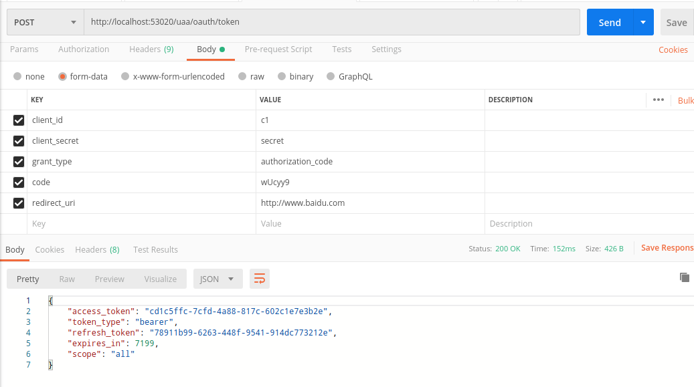
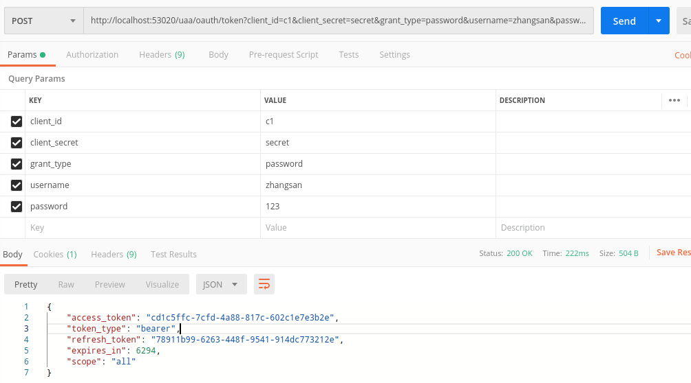
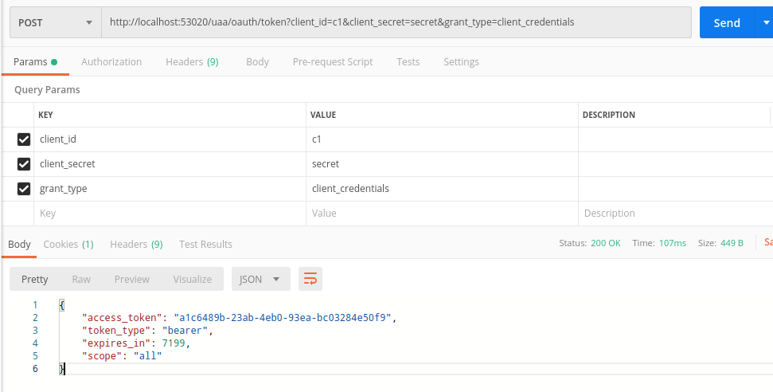
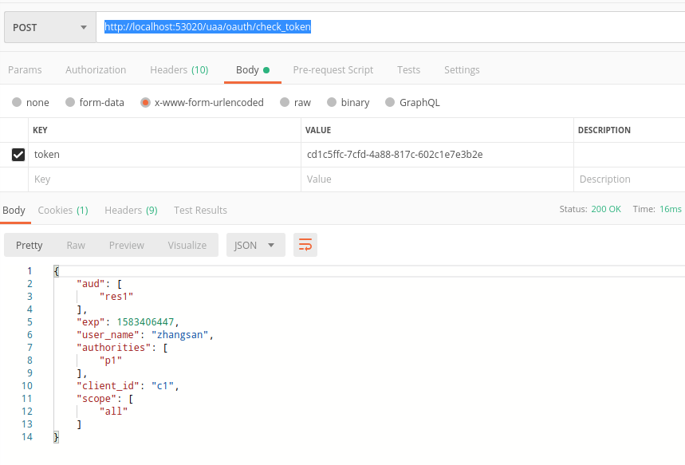
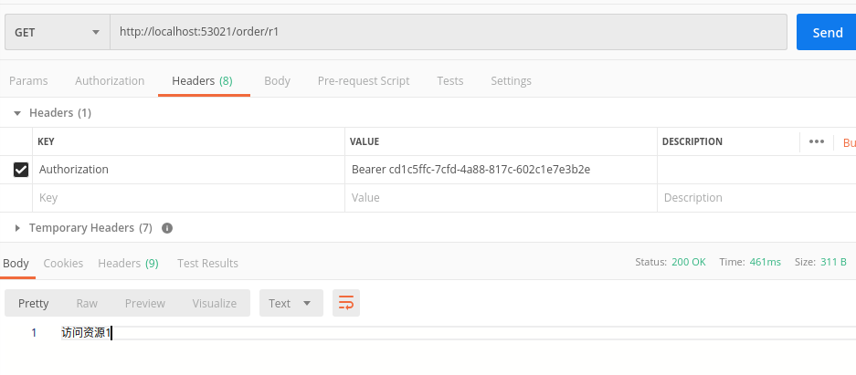

# 项目介绍

本项目使用springcloud集成spring security，实现分布式token，此版本为V1版本，一切功能从简，主要是demo展示，具体类似于生产环境的实践在v2版本中实现。

# 创建授权的Model

Model名称uaa。

首先创建启动类和项目的配置文件。

# 创建order资源服务工程

# 授权服务器配置

##  EnableAuthorizationServer

可以用 @EnableAuthorizationServer 注解并继承AuthorizationServerConfigurerAdapter来配置OAuth2.0 授权
服务器。

## 授权码模式

### 获取授权码

访问：`http://localhost:53020/uaa/oauth/authorize?client_id=c1&response_type=code&scope=all&redirect_uri=http://www.baidu.com`

用户名：`zhangsan`，密码：`123`

登录之后会出现是否授权的页面，选择授权，之后跳转到`https://www.baidu.com/?code=wUcyy9`，`wUcyy9`为验证码，每次都不一样

### 根据授权码获取token

`http://localhost:53020/uaa/oauth/token`

`access_token`是资源令牌，用于访问资源，`refresh_token`是刷新令牌当资源令牌失效时使用次令牌获取一个新的令牌。

## 简化模式

很少用

访问`http://localhost:53020/uaa/oauth/authorize?client_id=c1&response_type=token&scope=all&redirect_uri=http://www.baidu.com`，点击`approve`，之后会将条状到`https://www.baidu.com/#access_token=cd1c5ffc-7cfd-4a88-817c-602c1e7e3b2e&token_type=bearer&expires_in=6618`后面是资源令牌

## 密码模式

url中就包含了账号和密码，可以直接获取token。

访问`http://localhost:53020/uaa/oauth/token?client_id=c1&client_secret=secret&grant_type=password&username=zhangsan&password=123`

## 客户端模式

只需要客户端id和客户端密码即可，但是没有刷新令牌

访问`http://localhost:53020/uaa/oauth/token?client_id=c1&client_secret=secret&grant_type=client_credentials`

# 令牌校验

访问`http://localhost:53020/uaa/oauth/check_token`

# 访问资源服务

访问`http://localhost:53021/order/r1`，需要在请求的Headers中添加token

# 使用JWT

本项目中已经配置好了

接下来按照视频把相应数据添加到数据库中。