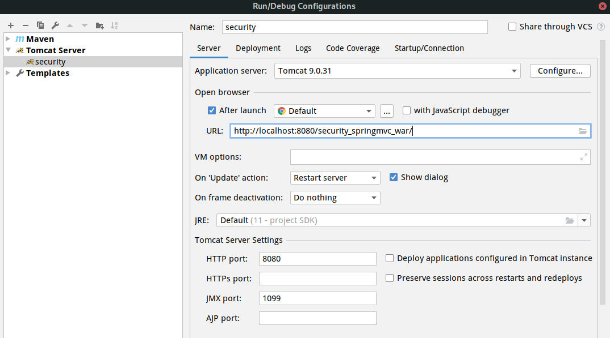

# 项目介绍

使用SpringMVC和Servlet3.0实现session认证，没有使用spring security，但是spring security的大致原理是基于此种模式

# 搭建项目

完成此步骤之后项目，项目的基本框架已经搭建好了，可以进行下一步的具体开发任务。

## 创建容器配置文件

以前使用xml配置，现在优先使用java进行配置，作用一样，此处配置扫描路径，将路径下的类注册成bean，除了controller类，Controller由servlet扫描。

```java
/**
 * 相当于 applicationContext.xml
 * 需要在这里添加包的扫描路径，但是排除Controller的扫描
 */
@Configuration
@ComponentScan(basePackages = "com.security.springmvc",
        excludeFilters = {@ComponentScan.Filter(type = FilterType.ANNOTATION, value = Controller.class)})
public class ApplicationConfig {
    //在此配置除了Controller的其它bean，比如：数据库链接池、事务管理器、业务bean等。
}
```

## 创建servlet配置文件

配置了Controller的扫描路径，以及静态界面的地址。jsp好老了，应该用H5+CSS+JS+thymeleaf来代替。

```java
/**
 * 就相当于springmvc.xml文件
 **/
@Configuration
@EnableWebMvc
@ComponentScan(basePackages = "com.security.springmvc"
        , includeFilters = {@ComponentScan.Filter(type = FilterType.ANNOTATION, value = Controller.class)})
public class WebConfig implements WebMvcConfigurer {

    @Autowired
    SimpleAuthenticationInterceptor simpleAuthenticationInterceptor;

    //视频解析器
    @Bean
    public InternalResourceViewResolver viewResolver() {
        InternalResourceViewResolver viewResolver = new InternalResourceViewResolver();
        viewResolver.setPrefix("/WEB-INF/view/");
        viewResolver.setSuffix(".jsp");
        return viewResolver;
    }
}
```

## 加载配置文件

此处有三个方法，分别用于加载容器配置文件，加载servlet配置文件，url对应的路径

```java
public class SpringApplicationInitializer extends AbstractAnnotationConfigDispatcherServletInitializer {

    //spring容器，相当于加载 applicationContext.xml
    @Override
    protected Class<?>[] getRootConfigClasses() {
        return new Class[]{ApplicationConfig.class};
    }

    //servletContext，相当于加载springmvc.xml
    @Override
    protected Class<?>[] getServletConfigClasses() {
        return new Class[]{WebConfig.class};
    }

    //url-mapping
    @Override
    protected String[] getServletMappings() {
        return new String[]{"/"};
    }
}
```

# 登录并完成用户的账号密码验证

此步骤中就是进行具体的开发步骤了，从数据库查询信息并处理，创建页面和url路径等。

## 创建登录页面

创建登录页面，在`webapp/WEB-INF/view/`下创建`login.jsp`

## 在servlet中添加路径

在`WebConfig`中添加指向`login.jsp`的路径

```java
    // 对于根路径直接指向/WEB-INF/view下的login.jsp
    @Override
    public void addViewControllers(ViewControllerRegistry registry) {
        registry.addViewController("/").setViewName("login");
    }
```

## 启动

使用本地tomcat启动



## 实现用户信息验证

```java
public interface AuthenticationService {
    /**
     * 用户认证
     *
     * @param authenticationRequest 用户认证请求，账号和密码
     * @return 认证成功的用户信息
     */
    UserDto authentication(AuthenticationRequest authenticationRequest);
}
```

在此接口的实现类中进行具体的验证行为，同时还需要两个Model来承载用户信息和session信息。

之后还需要创建一个Controller来调用验证方法

```java
@RestController
public class LoginController {

    @Autowired
    AuthenticationService authenticationService;

    @RequestMapping(value = "/login", produces = "text/plain;charset=utf-8")
    public String login(AuthenticationRequest authenticationRequest, HttpSession session) {
        UserDto userDto = authenticationService.authentication(authenticationRequest);
        //存入session
        session.setAttribute(UserDto.SESSION_USER_KEY, userDto);
        return userDto.getUsername() + "登录成功";
    }
}
```

登录界面上点击登录就可以调用此Controller然后对用户信息进行校验

# 实现其他操作

## 实现相关接口

```java
@GetMapping(value = "/logout", produces = {"text/plain;charset=UTF-8"})
    public String logout(HttpSession session) {
        session.invalidate();
        return "退出成功";
    }

    @GetMapping(value = "/r/r1", produces = {"text/plain;charset=UTF-8"})
    public String r1(HttpSession session) {
        String fullname = null;
        Object object = session.getAttribute(UserDto.SESSION_USER_KEY);
        if (object == null) {
            fullname = "匿名";
        } else {
            UserDto userDto = (UserDto) object;
            fullname = userDto.getFullname();
        }
        return fullname + "访问资源r1";
    }

    @GetMapping(value = "/r/r2", produces = {"text/plain;charset=UTF-8"})
    public String r2(HttpSession session) {
        String fullname = null;
        Object userObj = session.getAttribute(UserDto.SESSION_USER_KEY);
        if (userObj != null) {
            fullname = ((UserDto) userObj).getFullname();
        } else {
            fullname = "匿名";
        }
        return fullname + " 访问资源2";
    }
```

首先登录，然后可以通过浏览器的调试器查看该站点的cookies中是否有相应的SessionID，只有在该浏览器中调用上面的接口，应用就可以根据传过来的sessionid查找用户信息，进行相关操作。

## 权限校验

在登录前对数据进行校验

```java
@Component
public class SimpleAuthenticationInterceptor implements HandlerInterceptor {

    @Override
    public boolean preHandle(HttpServletRequest request, HttpServletResponse response, Object handler) throws Exception {
        //在这个方法中校验用户请求的url是否在用户的权限范围内
        //取出用户身份信息
        Object object = request.getSession().getAttribute(UserDto.SESSION_USER_KEY);
        if (object == null) {
            //没有认证，提示登录
            writeContent(response, "请登录");
        }
        UserDto userDto = (UserDto) object;
        //请求的url
        String requestURI = request.getRequestURI();
        if (userDto.getAuthorities().contains("p1") && requestURI.contains("/r/r1")) {
            return true;
        }
        if (userDto.getAuthorities().contains("p2") && requestURI.contains("/r/r2")) {
            return true;
        }
        writeContent(response, "没有权限，拒绝访问");

        return false;
    }

    //响应信息给客户端
    private void writeContent(HttpServletResponse response, String msg) throws IOException {
        response.setContentType("text/html;charset=utf-8");
        PrintWriter writer = response.getWriter();
        writer.print(msg);
        writer.close();
    }
}
```

在WebConfig中使用拦截器

```Java
@Autowired
    SimpleAuthenticationInterceptor simpleAuthenticationInterceptor;
    
    // 配置拦截器生效
    @Override
    public void addInterceptors(InterceptorRegistry registry) {
        registry.addInterceptor(simpleAuthenticationInterceptor).addPathPatterns("/r/**");
    }
```

