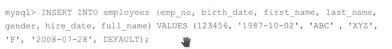
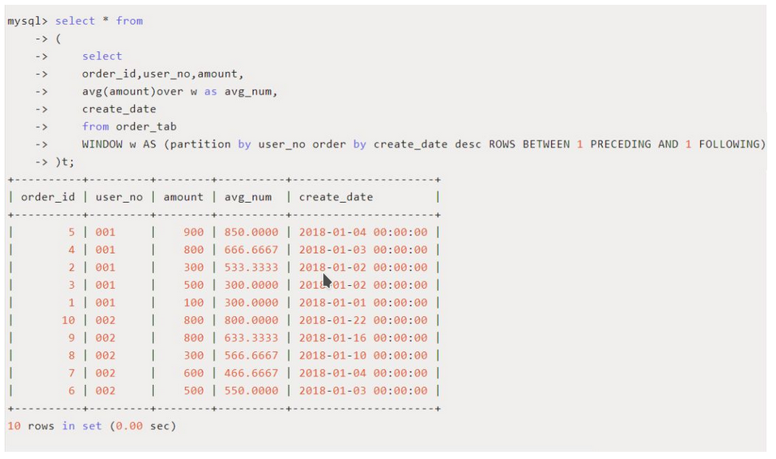

# 安装或升级到MySQL8

## 如何操作

### 启动MySQL8服务器

```bash
#使用服务方式
service mysql start
#包含systemd
systemctl start mysqld
```

# 使用MySQL

## 使用命令行客户端连接到MySQL

```bash
mysql --host=localhost --port=3306 --user=root --password
```

> 使用select的时候可以使用;,\g,\G三种字符作为结尾，;和\g对应的输出水平显示，\G对应的输出垂直显示

## 创建数据库

数据库的相关语句标准可以在另外一个笔记中

`show databases;`查找你有权访问的所欲数据库，`select database()`查找当前连接的数据库

数据库被创建为数据目录中的一个目录。默认数据目录是`/var/lib/mysql`，如果时通过二进制文件安装的，数据目录则是`/usr/loacl/mysql/data`。可以通过`show variables like 'datadir'获取当前的数据目录。`

## 创建表

表中新增了JSON数据类型，其他数据类型在另外一个笔记中有。

### REPLACE、INSERT、ON DUPLICATE KEY UPDATE

如果行已经存在，则REPLACE会简单的删除行并插入新行，如果行不存在，则等同与INSERT。

```mysql
replace into table values(*,*);

#原有的id为2和3被更新为5和6
insert into tbl_001_user  (id, name, password) values (2,'',''),(3,'','') on duplicate key update
tbl_001_user.id=tbl_001_user.id+3;
```

## 对结果排序

查找薪水最高的前5名员工的编号：

```mysql
select * from salaries order by salary DESC limit 5;
#通过列的位置而不是列明排列
select * from salaries order by 2 desc limit 5;
```

## 创建用户

```mysql
create user	if not exists 'company_read_only'@'localhost' identified with mysql_native_password by 'company_pass'
with max_queries_per_hour 500 max_updates_per_hour 100;
```

创建一个company_read_only用户，仅从localhost访问，可以限制对IP范围的访问，例如`10.148.%。%`。通过给出%，用户可以从任何主机访问。密码company_pass。使用mysql_native_password身份验证。用户在一小时内执行的最大查询数为500,最大更新数为100。

当客户端连接到MySQL服务器时，他会经历两个访问控制阶段：

- 连接验证

  > 服务器通过用户名和连接的主机名来识别连接。服务器会调用用户认证插件并验证密码。服务器还会检查用户是否被锁定

- 请求验证

  > 服务器会检查用户是否有足够的权限执行每项操作

# 使用MySQL进阶

## 使用JSON

JSON文档以二进制格式存储，它提供以下功能：

- 对文档元素的快速读取访问
- 当服务器再次读取JSON文档时，不需要重新解析文本获取该值
- 通过键或数组索引直接查找子对象或嵌套值，而不需要读取文档中的所有值

```json
{"id":"1","name":"Hello"}
```

```mysql
#获取该json下的id节点，结果为  "1"
select column_4->'$.id' from tbl_001_user where id=2;
#获取该json下的id节点，结果为  1
select column_4->>'$.id' from tbl_001_user where id=2;
```

### JSON函数

json_pretty()：以优雅的格式显示JSON

#### 查找

可以在where子句中使用`col->>path`运算符来引用json的某一列

```mysql
select emp_no from emp_details where details->>'$.address.pin'="560103";
```

也可以使用json_contains函数查询数据。如果找到了数据返回1,否则返回0

```mysql
select json_contains(details->>'$.address.pin',"560103") from emp_details;
```

查询一个key是否存在，one表示至少应该存在一个键。json_contains_path(details,'all',"$.address.line1","$.address.line1")两个key必须全部都存在。

```mysql
select json_contains_path(details,'one',"$.address.line1") from emp_details;
```

### 修改

可以使用三种不同的函数来修改数据：json_set(),json_insert()和json_replace().

json_set():替换现有值并添加不存在的值

```mysql
update emp_details set details = json_set(details,"$.address.pin","560100","$.nickname","kai") where emp_no=1;
```

json_insert():插入值，但不提换现有值

```mysql
update emp_details set details = json_insert(details,"$.address.pin","560100","$.address.line4","kai") where emp_no=1;
```

这种情况下，pin不会被更新，只会添加一个新的字段address.line4

json_replace():仅替换现有值

```mysql
update emp_details set details = json_replace(details,"$.address.pin","560100","$.address.line5","kai") where emp_no=1;
```

这种情况下line5不会被添加，只有pin会被更新

### 删除

json_remove()

```mysql
update emp_details set details = json_remove(details,"$.address.line5") where emp_no=1;
```

删除json中的line5字段

### 其他函数

json_keys():获取json文档中的所有键

json_length():给出json文档中的元素数

## 公用表表达式（CTE）

公用表表达式是一个命名的临时结果集，仅在单个SQL语句（例如SELECT，INSERT，UPDATE或DELETE)的执行范围内存在。与派生表类似，CTE不作为对象存储，仅在查询执行期间持续。 与派生表不同，CTE可以是自引用(递归CTE)，也可以在同一查询中多次引用。 此外，与派生表相比，CTE提供了更好的可读性和性能。

### 语法：

```mysql
#1.cte_name :CTE表达式的名称。
#2.column_list:列名列表。
#3. query:定义CTE结果集的Select查询语句
#请注意，查询中的列数必须与column_list中的列数相同。 如果省略column_list，CTE将使用定义CTE的查询的列列表,上面的语法只能在 MySQL8.0 以上版本才支持。
WITH cte_name (column_list) AS (
    query
) 
SELECT * FROM cte_name;

#示例
WITH expo_in_id AS (
    SELECT 
        demoId, state
    FROM
        expo_infomation
    WHERE
        region= '北区'
) SELECT 
   demoId
 FROM
    expo_in_id
 WHERE
    state = 'action'
 ORDER BY demoId;
```

### WITH子句用法：

```mysql
#在SELECT，UPDATE和DELETE语句的开头可以使用WITH子句：
 WITH ... SELECT ...
 WITH ... UPDATE ...
 WITH ... DELETE ...
 
#可以在子查询或派生表子查询的开头使用WITH子句：
 SELECT ... WHERE id IN (WITH ... SELECT ...)
 SELECT * FROM (WITH ... SELECT ...) AS derived_table
 
#可以在SELECT语句之前立即使用WITH子句，包括SELECT子句：
 CREATE TABLE ... WITH ... SELECT ...
 CREATE VIEW ... WITH ... SELECT ...
 INSERT ... WITH ... SELECT ...
 REPLACE ... WITH ... SELECT ...
 DECLARE CURSOR ... WITH ... SELECT ...
 EXPLAIN ... WITH ... SELECT ..
```

### cte可以引用其他cte：

```mysql
with d1 as (select ... from ...), d2 as (select ... from d1 ...) select ... from d1,d2 ...
```

### 递归CTE

递归CTE是一种特殊的CTE，其子查询会引用自己的名字。with子句必须以with recursive开头。递归CTE子查询包括两部分：seed查询和recursive查询，由union [ALL]或union distinct分隔。

seed select被执行一次以创建初始数据子集;recursive select被重复执行以返回数据的子集，直到获得完整的结果集。当迭代不会生成任何新行时，递归会停止。

```mysql
with recursive cte as
(select ... from table_name /* seed select*/
union all
select ... from cte, table_name) /* recursive select*/
select .. from cte;

#示例
with recursive cte (col_value) as
(select 1 /* seed query */
union all
 select col_value+1 from cte where col_value < 5) /* recursive query */
select * from cte;
```

## 生成列

生成列的值是根据列定义中包含的表达式计算得出的。生成列包含下面两种类型：

- virtaul生成列：当从表中读取记录时，将计算该列
- stored生成列：当向表中写入新记录时，将计算该列并将其作为常规列存储在表中

virtual比stored更有用，因为一个虚拟的列不占用任何存储空间。

### 添加生成列


在插入的时候不需要查询virtual列的值如果需要插入则需要将其指定为DEFAULT。所有其他值都会引发错误。



如果你需要在已有的表中添加生成列，需要执行alter table。

## 窗口函数

窗口函数可以理解为记录集合，窗口函数也就是在满足某种条件的记录集合上执行的特殊函数。对于每条记录都要在此窗口内执行函数，有的函数随着记录不同，窗口大小都是固定的，这种属于静态窗口;有的函数则相反，不同的记录对应这不同的窗口，这种动态变化的窗口叫滑动窗口。

按照功能划分，可以把MySQL支持的窗口函数分为如下几类：

- 序号函数：row_number()：分区内当前行的编号 / rank()：分区内当前行的等级（有间隔） / dense_rank()分区内当前行的等级（无间隔）
- 分布函数：percent_rank()：百分比排名值 / cume_dist()：累积分布值
- 前后函数：lag()：落后于分区内当前行的那一行的参数值 / lead()：领先于分区内当前行的那一行参数值
- 头尾函数：first_val()：窗口帧中第一行的参数值 / last_val()：窗口帧中最末行的参数值
- 其他函数：nth_value()：窗口帧中的第n行的参数值 / nfile()：分区内当前行的桶的编号

窗口函数的基本用法如下：**函数名 ([expr]) over 子句**

其中over时关键字，用来制定函数执行的窗口范围，如果后面括号中什么都不写，则意味着窗口包含满足where条件的所有行，窗口函数基于所有行进行计算；如果不为空，则支持一下四种语法来设置窗口。

window_name:给窗口指定一个别名，如果SQL中涉及的窗口较多，采用别名可以看起来更清晰易读。

```mysql
select *
from (
         select row_number() over w as row_num,

                order_id,
                user_no,
                amount,
                create_date

         from order_tab
             WINDOW w AS (partition by user_no order by amount desc)
     ) t;
```

- parition:窗口按照哪些字段机型分组，窗口函数在不同的分组上分别执行。上面的例子就按照用户id进行了分组。在每个用户id上，按照order by的顺序分别生成从1开始的顺序编号。
- order by:按照哪些字段进行排序，窗口函数将按照排序后的记录顺序进行编号。可以和parition子句配合使用，也可以单独使用。上面的例子将user_no分组，每个分组按照amount进行排序。
- frame:frame是当前分区的一个子集，子句用来定义子集的规则，通常用来作为滑动窗口使用。比如根据每个订单动态计算包括本订单和按照时间顺序前后两个订单的平均订单金额，则可以设置如下frame子句来创建滑动窗口



从结果可以看出，order_id为5订单属于边界值，没有前一行，因此平均订单金额为(900+800)/2=850；order_id为4的订单前后都有订单，所以平均订单金额为（900+800+300）/3=666.6667，以此类推就可以得到一个基于滑动窗口的动态平均订单值。此例中，窗口函数用到了传统的聚合函数avg()，用来计算动态的平均值。

对于滑动窗口的范围指定，有两种方式，基于行和基于范围，具体区别如下：

- 基于行：通常使用BETWEEN frame_start AND frame_end语法来表示行范围，frame_start和frame_end可以支持如下关键字，来确定不同的动态行记录：

  - CURRENT ROW 边界是当前行，一般和其他范围关键字一起使用

  - UNBOUNDED PRECEDING 边界是分区中的第一行

  - UNBOUNDED FOLLOWING 边界是分区中的最后一行

  - expr PRECEDING 边界是当前行减去expr的值

  - expr FOLLOWING 边界是当前行加上expr的值

    >rows BETWEEN 1 PRECEDING AND 1 FOLLOWING 窗口范围是当前行、前一行、后一行一共三行记录。
    >
    >rows UNBOUNDED FOLLOWING 窗口范围是当前行到分区中的最后一行。
    >
    >rows BETWEEN UNBOUNDED PRECEDING AND UNBOUNDED FOLLOWING 窗口范围是当前分区中所有行，等同于不写。

- 基于范围：和基于行类似，但有些范围不是直接可以用行数来表示的，比如希望窗口范围是一周前的订单开始，截止到当前行，则无法使用rows来直接表示，此时就可以使用范围来表示窗口：INTERVAL 7 DAY PRECEDING。Linux中常见的最近1分钟、5分钟负载是一个典型的应用场景。

# 配置MySQL

## 使用配置文件

默认配置文件时`/etc/my.cnf`或者`/etc/mysql/my.cnf`/。

### 如何操作

配置文件包含由section_name指定的部分。所有与section相关的参数都可以放在section_name下面

```
[mysqld]
<parameter_name> = <value>
[client]
<parameter_name> = <value>
[mysqldump]
<parameter_name> = <value>
[mysqld_safe]
<parameter_name> = <value>
[server]
<parameter_name> = <value>
```

- `[mysql]`：该部分由mysql命令行客户端读取
- `[client]`：该部分由所有连接的客户端读取
- `[mysqld]`：该部分有mysql服务器读取
- `[mysqldump]`：该部分由名为mysqldump的备份工具读取
- `[mysqld_safe]`：该部分有mysqld_safe进程读取（MySQL服务器启动脚本）

## 使用全局变量和会话变量

可以通过连接到MySQL并执行SET命令来设置参数。根据变量的作用域可以将变量分为两种：

- 全局变量：适用于所有新连接
- 会话变量：仅适用于当前变量（会话）

### 如何操作

```mysql
#记录所有执行时间超过1秒的查询
set global long_query_time=1
#使更改在重新启动时保持持久化
set persist long_query_time=1
#只为此会话设置记录时间
set session long_query_time=1
```

## 配置参数

### 数据目录

MySQL服务器管理的数据存储在名为数据目录的目录下。数据目录的每个子目录都是一个数据库目录，并对应服务器管理的数据库。默认情况下，数据目录有三个子目录

- mysql：MySQL系统数据库
- performance_schema：提供用于在运行时检查服务器的内部执行情况的信息
- sys：提供一组对象，帮助更轻松的解释performance_schema信息

要设置数据目录，需要修改datadir并添加到配置文件中

```bash
vi my.cnf
[mysqld]
datadir = /data/mysql
```

你可以将其设置为你要存储数据的任何位置，但应该将数据目录的所有权更改为mysql

### innodb_buffer_pool_size

这是InnoDB最重要的调优参数，它决定InnoDB存储引擎可以使用多少内存空间来缓存内存中的数据和索引。太低会降低MySQL性能，太高浪费内存。MySQL8中的缓存池大小是动态的，这意味着可以改变缓存池的大小而不用重启服务器。

innodb_buffer_pool_size调试指南：

1. 找出数据集的大小。不要将innodb_buffer_pool_size的值设置高于数据集的值。

2. 通常，数据集的大小比可用RAM大得多。对于整个RAM，你可以为操作系统分配一些，为其他进程分配一些，为MySQL的per-thread缓冲区分配一些，为InnoDB之外的MySQL服务器分配一些，其余的可以分配给InnoDB缓冲池。

   | RAM   | 缓冲池大小  |
   | ----- | ----------- |
   | 4GB   | 1GB～2GB    |
   | 8GB   | 4GB～6GB    |
   | 12GB  | 6GB~10GB    |
   | 16GB  | 10GB~12GB   |
   | 32GB  | 24GB~28GB   |
   | 64GB  | 45GB~56GB   |
   | 128GB | 108GB~116GB |
   | 256GB | 220GB~245GB |

### innodb_buffer_pool_instances

可以将InnoDB缓冲池划分为不同的区域，以便在不同线程读取和写入缓存页面时减少争用，从而提高并发性。例如缓冲池大小为64GB，innodb_buffer_pool_instances为32，则缓冲区将被分为32个区域，每个区域的大小为2GB。

### innodb_log_file_size

重做日志空间的大小，用于数据库崩溃时重放已提交的事务。默认值是48MB，可以将其设置为1～2GB，重启服务器生效。

# 二进制日志

二进制日志包含数据库的所有更改记录，包括数据和结构两方面。二进制日志不记录select或show等不修改数据的操作。二进制日志能保证数据库出故障时数据是安全的。只有完整的事件或事务会被记录或回读。

为什么使用二进制日志：

1. **复制**：使用二进制日志，可以把对服务器所做的更改以流式方式传输到另一台服务器上。
2. **时间点恢复**：如果你在星期日00:00进行了备份，而数据库在星期日的08:00出现故障。使用备份可以恢复到周日00:00的状态；而使用二进制日志可以恢复到周日08:00的状态。

## 使用二进制日志

要启用二进制日志，必须设置log_bin和server_id并重新启动服务器。可以在log_bin内提及path和base名称，long_bin设置为`/data/mysql/binlogs/server1`，二进制日志存储在`/data/mysql/binlogs/server1`文件中名为server1.000001、server1.000002等的日志文件中。每当服务器启动或刷新日志时，或者当前日志的大小达到max_binlog_size时，服务器都会在系列中创建一个新文件。每个二进制日志的位置都在server1.index文件中被维护。

## 二进制日志的格式

二进制日志可以写成下面的三种格式：

- statement:记录实际的SQL语句
- row：记录每行所做的更改
- mixed：当需要的时候，MySQL会从statement切换到row。

## 从二进制日志中提取语句

可以使用mysqlbinlog实用程序从二进制日志中提取内容，并将其应用到其他服务器上。

### 显示日志内容

```bash
mysqlbinlog /var/lib/mysql/binlog.000002
```


`# at`后面的数字表示二进制日志文件中事件的起始位置，下一行包含了语句在服务器上被启用的时间戳。

### 根据时间和位置进行抽取

