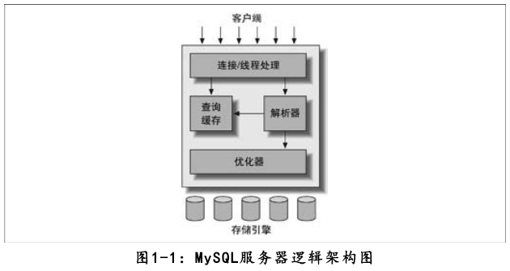
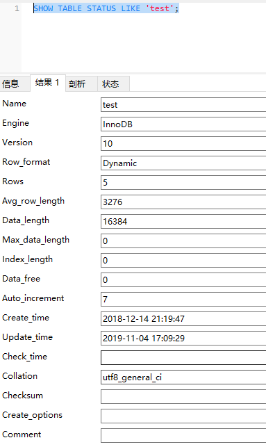

# 1 MySQL架构与历史

## 1.1 MySQL逻辑架构



第二层中包含大多数MySQL的核心服务功能，包括查询解析、分析、优化、缓存以及所有的内置函数。所有跨存储引擎的功能都在这一层实现：存储过程、触发器、视图等。

第三层包含了存储引擎。存储引擎负责MySQL中数据的存储和提取。每个存储引擎都有他的优势和劣势。服务器通过API与存储引擎进行通信。这些接口屏蔽了不同存储引擎之间的差异，使得这些差异对上层的查询过程透明。

对于select语句，在解析查询之前，服务器会先检查查询缓存，如果能够在其中找到对应的查询，服务器就不必再执行查询解析、优化和执行的整个过程，而是直接返回查询缓存中的结果集。

ACID：

1. 原子性（atomicity）：一个事务必须被视为一个不可分割的最小工作单元，整个事务中的所有操作要么全部提交成功，要么全部失败回滚，对于一个事务来说，不可能只执行其中的一部分操作，这就是事务的原子性
2. 一致性（consistency）：数据库总是从一个一致性的状态转换到另外一个一致性的状态。在前面的例子中，一致性确保了，即使在执行第三、四条语句之间时系统崩溃，支票账户中也不会损失200美元，因为事务最终没有提交，所以事务中所做的修改也不会保存到数据库中。
3. 隔离性（isolation）：通常来说，一个事务所做的修改在最终提交以前，对其他事务是不可见的。在前面的例子中，当执行完第三条语句、第四条语句还未开始时，此时有另外一个账户汇总程序开始运行，则其看到的支票账户的余额并没有被减去200美元。
4. 持久性（durability）：一旦事务提交，则其所做的修改就会永久保存到数据库中。此时即使系统崩溃，修改的数据也不会丢失。

隔离级别：

1. READ UNCOMMITTED（未提交读）：在READ UNCOMMITTED级别，该隔离级别允许脏读取，其隔离级别最低。换句话说，如果一个事务正在处理某一数据，并对其进行了更新，但同时尚未完成事务，因此还没有进行事务提交；而于此同时，允许另一个事务也能够访问该数据。举个例子来说，事务A和事务B同时进行，事务A在整个执行阶段，会将某数据项的值从1开始，做一系列加法操作直到变成10之后进行事务提交，此时，事务B能够看到这个数据项在事务A操作过程中的所有中间值（如1变2，2变3等）。这个级别会导致很多问题，从性能上来说，READ UNCOMMITTED不会比其他的级别好太多，但却缺乏其他级别的很多好处，除非真的有非常必要的理由，在实际应用中一般很少使用。
2. READ COMMITTED（提交读）：他和未提交读非常相近，唯一的区别就是提交读只允许获取已经被提交的数据。同样以上面的例子来说，事务A和事务B同时进行，事务A进行与上述相同的操作，此时，事务B无法看到这个数据项在事务A操作过程中的所有中间值，只能看到最终的10。另外，如果说有一个事务C，和事务A进行非常类似的操作，只是事务C是将数据项从10加到20，此时事务B也同样能读取到20，即提交读允许不可重复读取。（**不可重复读问题**：指在一个事务A内，多次读同一个数据，但是事务A没有结束时，另外一个事务B则修改了该数据。那么事务A在 B事务修改数据之后再次读取该数据， A事务读到的数据可能和第一次读到的数据不一样。；**更新丢失问题**：)
3. REPEATABLE READ（可重复读）：保证在事务处理过程中，多次读取同一个数据时，其值都和事务开始时刻是一致的。因此该事务级别禁止了不可重复读和脏读，但是有可能出现幻影数据，幻影数据就是指同样的事务操作，在前后两个时间段内执行对同一个数据项的读取，可能出现不一致的结果。在上面的例子，可重复读隔离级别可以确保事务B在第一次事务操作过程中，始终对数据项读取到1，但是在下一次事务操作中，即使事务B（事务名字虽然相同，但是指的是另一次事务操作）采用同样的查询方式，就可能读到10或20。InnoDB和XtraDB存储引擎通过多版本并发控制（MVCC，Multiversion Concurrency Control）解决了幻读的问题。本章稍后会做进一步的讨论。MySQL的默认事务隔离级别。
4. SERIALIZABLE（可串行化）：SERIALIZABLE是最高的隔离级别。它通过强制事务串行执行，避免了前面说的幻读的问题。简单来说，SERIALIZABLE会在读取的每一行数据上都加锁，所以可能导致大量的超时和锁争用的问题。实际应用中也很少用到这个隔离级别，只有在非常需要确保数据的一致性而且可以接受没有并发的情况下，才考虑采用该级别。

事务日志：事务日志可以帮助提高事务的效率。使用事务日志，存储引擎在修改表的数据时只需要修改其内存拷贝，再把该修改行为记录到持久在硬盘上的事务日志中，而不用每次都将修改的数据本身持久到磁盘。事务日志采用的是追加的方式，因此写日志的操作是磁盘上一小块区域内的顺序I/O，而不像随机I/O需要在磁盘的多个地方移动磁头，所以采用事务日志的方式相对来说要快得多。事务日志持久以后，内存中被修改的数据在后台可以慢慢地刷回到磁盘。目前大多数存储引擎都是这样实现的，我们通常称之为预写式日志（Write-Ahead Logging），修改数据需要写两次磁盘。

**多版本并发控制**

InnoDB的MVCC，是通过在每行记录后面保存两个隐藏的列来实现的。这两个列，一个保存了行的创建时间，一个保存行的过期时间（或删除时间）。当然存储的并不是实际的时间值，而是系统版本号（systemversionnumber）。每开始一个新的事务，系统版本号都会自动递增。事务开始时刻的系统版本号会作为事务的版本号，用来和查询到的每行记录的版本号进行比较。

## 1.5 MySQL的存储引擎

使用SHOW TABLE STATUS LIKE 'test'查看表信息



Name：表名

Engine：表的存储引擎类型

Row_format：行的格式，对于MyISAM表，可选的值为Dynamic、Fixed或者Compressed。Dynamic的行长度是可变的，一般包含可变长度的字段，如VARCHAR或BLOB。Fixed的行长度则是固定的，只包含固定长度的列，如CHAR和INTEGER。Compressed的行则只在压缩表中存在。

Avg_row_length：平均每行包含的字节数

Data_length：表数据的大小

Max_data_length：表数据的最大容量，该值和存储引擎有关

Index_length：索引的大小

Data_free：对于MyISAM表，表示已分配但目前没有使用的空间。这部分空间包括了之前删除的行，以及后续可以被INSERT利用到的空间。

Auto_increment：下一个AUTO_INCREMENT的值。

Create_time：表的创建时间

Update_time：表数据的最后修改时间

Check_time：使用CKECK TABLE命令或者myisamchk工具最后一次检查表的时间。

Collation：表的默认字符集和字符列排序规则。

Checksum：如果启用，保存的是整个表的实时校验和。

Create_options：创建表时指定的其他选项。

Comment：该列包含了一些其他的额外信息。对于MyISAM表，保存的是表在创建时带的注释。对于InnoDB表，则保存的是InnoDB表空间的剩余空间信息。如果是一个视图，则该列包含“VIEW”的文本字样。

# 2 MySQL基准测试

## 2.1 为什么需要基准测试

验证基于系统的一些假设，确认这些假设是否符合实际情况。

重现系统中的某些异常行为，以解决这些异常。

测试系统当前的运行情况。如果不清楚系统当前的性能，就无法确认某些优化的效果如何。也可以利用历史的基准测试结果来分析诊断一些无法预测的问题。

模拟比当前系统更高的负载，以找出系统随着压力增加而可能遇到的扩展性瓶颈。

规划未来的业务增长。基准测试可以评估在项目未来的负载下，需要什么样的硬件，需要多大容量的网络，以及其他相关资源。这有助于降低系统升级和重大变更的风险。

测试应用适应可变环境的能力。例如，通过基准测试，可以发现系统在随机的并发峰值下的性能表现，或者是不同配置的服务器之间的性能表现。基准测试也可以测试系统对不同数据分布的处理能力。

测试不同的硬件、软件和操作系统配置。比如RAID5还是RAID10更适合当前的系统？如果系统从ATA硬盘升级到SAN存储，对于随机写性能有什么帮助？Linux2.4系列的内核会比2.6系列的可扩展性更好吗？升级MySQL的版本能改善性能吗？为当前的数据采用不同的存储引擎会有什么效果？所有这类问题都可以通过专门的基准测试来获得答案。

证明新采购的设备是否配置正确。笔者曾经无数次地通过基准测试来对新系统进行压测，发现了很多错误的配置，以及硬件组件的失效等问题。因此在新系统正式上线到生产环境之前进行基准测试是一个好习惯，永远不要相信主机提供商或者硬件供应商的所谓系统已经安装好，并且能运行多快的说法。如果可能，执行实际的基准测试永远是一个好主意。

## 2.2 基准测试的策略

基准测试有两种主要的策略：一是针对整个系统的整体测试，另外是单独测试MySQL。这两种策略也被称为集成式（full-stack）以及单组件式（single-component）基准测试。

### 2.2.1 测试何种指标

吞吐量：吞吐量指的是单位时间内的事务处理数。

响应时间或者延迟：这个指标用于测试任务所需的整体时间。根据具体的应用，测试的时间单位可能是微秒、毫秒、秒或者分钟。根据不同的时间单位可以计算出平均响应时间、最小响应时间、最大响应时间和所占百分比。最大响应时间通常意义不大，因为测试时间越长，最大响应时间也可能越大。而且其结果通常不可重复，每次测试都可能得到不同的最大响应时间。因此，通常可以使用百分比响应时间（percentile response time）来替代最大响应时间。例如，如果95％的响应时间都是5毫秒，则表示任务在95％的时间段内都可以在5毫秒之内完成。

并发性：并发性是一个非常重要又经常被误解和误用的指标。例如，它经常被表示成多少用户在同一时间浏览一个Web站点，经常使用的指标是有多少个会话。

可扩展性：简单地说，可扩展性指的是，给系统增加一倍的工作，在理想情况下就能获得两倍的结果（即吞吐量增加一倍）。或者说，给系统增加一倍的资源（比如两倍的CPU数），就可以获得两倍的吞吐量。当然，同时性能（响应时间）也必须在可以接受的范围内。大多数系统是无法做到如此理想的线性扩展的。随着压力的变化，吞吐量和性能都可能越来越差。

# 2 SQL基础

## 2.2 SQL使用入门

### 2.2.1 SQL分类

SQL语句主要可以划分为以下3个类别：

- DDL（Data Definition Languages）语句：数据定义语言，这些语句定义了不同的数据段、数据表、列、索引等数据库对象。常用的语句关键字主要包括create、drop、alter等。
- DML（Data Manipulation Language）语句：数据操纵语句，用于添加、删除、更新和查询数据库记录，并检查数据完整性，常用的语句关键字主要包括insert、delete、udpate 和select 等。
- DCL（Data Control Language）语句：数据控制语句，用于控制不同数据段直接的许可和访问级别的语句。这些语句定义了数据库、表、字段、用户的访问权限和安全级别。主要的语句关键字包括grant、revoke 等。

### 2.2.2 DDL语句

#### 1.创建数据库

```
//utf8mb4是utf8的超集，但是占用更多内存，ci不区分大小写，bin区分大小写，general_ci不支持扩展，unicode_ci支持扩展
CREATE DATABASE dbname character set utf8mb4 collate utf8mb4_general_ci;
SHOW DATABASES；// 查看当前所有的数据库
USE dbname;//使用该数据库
```


#### 2.删除数据库

drop database dbname;

#### 3.创建表

CREATE TABLE tablename (column_name_1 column_type_1 constraints，column_name_2 column_type_2 constraints ， ……column_name_n column_type_nconstraints）

因为MySQL 的表名是以目录的形式存在于磁盘上，所以表名的字符可以用任何目录名允许的字符。column_name 是列的名字，column_type 是列的数据类型，contraints 是这个列的约束条件，在后面的章节中会详细介绍。

表创建完毕后，如果需要查看一下表的定义，可以使用如下命令：DESC tablename

也可以使用更详细的查看语句：SHOW CREATE TABLE tablename;

#### 4.删除表

DROP TABLE tablename

#### 5.修改表

修改表类型

ALTER TABLE tablename MODIFY [COLUMN] column_definition [FIRST | AFTER col_name]

增加表字段

ALTER TABLE tablename ADD [COLUMN] column_definition [FIRST | AFTER col_name]

删除表字段

ALTER TABLE tablename DROP [COLUMN] col_name

字段改名

ALTER TABLE tablename CHANGE [COLUMN] old_col_name column_definition
[FIRST|AFTER col_name]

改表名

ALTER TABLE tablename RENAME [TO] new_tablename

### 2.2.3 DML语句

#### 1.插入记录

```sql
INSERT INTO tablename (field1,field2,……fieldn) VALUES(value1,value2,……valuesn);
```


#### 2.更新记录

```sql
UPDATE tablename SET field1=value1，field2.=value2，……fieldn=valuen [WHERE CONDITION]
```

在MySQL 中，update 命令可以同时更新多个表中数据，语法如下：

```sql
UPDATE t1,t2…tn set t1.field1=expr1,tn.fieldn=exprn [WHERE CONDITION]
```


#### 3.删除记录

DELETE FROM tablename [WHERE CONDITION]

在MySQL 中可以一次删除多个表的数据，语法如下：
DELETE t1,t2…tn FROM t1,t2…tn [WHERE CONDITION]

#### 4.查询记录

SELECT * FROM tablename [WHERE CONDITION]

排序和限制

SELECT * FROM tablename [WHERE CONDITION] [ORDER BY field1 [DESC|ASC] ， field2[DESC|ASC]，……fieldn [DESC|ASC]]

分页查询

SELECT ……[LIMIT offset_start,row_count]

聚合

SELECT [field1,field2,……fieldn] fun_name
FROM tablename
[WHERE where_contition]
[GROUP BY field1,field2,……fieldn
[WITH ROLLUP]]
[HAVING where_contition]

fun_name 表示要做的聚合操作，也就是聚合函数，常用的有sum（求和）、count(*)（记录数）、max（最大值）、min（最小值）。

GROUP BY 关键字表示要进行分类聚合的字段，比如要按照部门分类统计员工数量，部门就应该写在group by 后面。

WITH ROLLUP 是可选语法，表明是否对分类聚合后的结果进行再汇总。

HAVING 关键字表示对分类后的结果再进行条件的过滤。

**表连接**

当需要同时显示多个表中的字段时，就可以用表连接来实现这样的功能。

外连接有分为左连接和右连接，具体定义如下。
左连接：包含所有的左边表中的记录甚至是右边表中没有和它匹配的记录
右连接：包含所有的右边表中的记录甚至是左边表中没有和它匹配的记录

**子查询**

某些情况下，当我们查询的时候，需要的条件是另外一个select 语句的结果，这个时候，就要用到子查询。用于子查询的关键字主要包括in、not in、=、!=、exists、not exists 等。

select * from emp where deptno in(select deptno from dept);

### 2.2.4 DCL语句

```sql
创建一个数据库用户z1，具有对sakila 数据库中所有表的SELECT/INSERT 权限：
grant select,insert on sakila.* to 'z1'@'localhost' identified by '123';
由于权限变更，需要将z1 的权限变更，收回INSERT，只能对数据进行SELECT 操作：
revoke insert on sakila.* from 'z1'@'localhost';

# 权限种类有 普通数据的增删改查select，insert，update，delete
# 创建修改删除数据表结构create，alter，drop
# 操作外键权限references
# 操作临时表权限create temporary
# 操作索引权限index
# 操作视图，查看视图源代码权限create view，show view
# 操作存储过程，函数权限create routine，alter routine，execute
grant all on `pear-admin-pro`.* to 'pear'@'%';

# 查看自己的权限
show grants;
#查看其他用户权限
show grants for dba@localhost;
```

## 2.3 帮助的使用

### 2.3.1 按照层次看帮助

```bash
显示所有可供查询的分类
mysql> ? contents
You asked for help about help category: "Contents"
For more information, type 'help <item>', where <item> is one of the following
categories:
   Account Management
   Administration
   Components
   Compound Statements
   Data Definition
   Data Manipulation
   Data Types
   Functions
   Functions and Modifiers for Use with GROUP BY
   Geographic Features
   Help Metadata
   Language Structure
   Plugins
   Storage Engines
   Table Maintenance
   Transactions
   User-Defined Functions
   Utility
```

可以使用“? Data Type”进一步查看感兴趣的分类。

### 2.3.2 快速查阅帮助

用关键字进行快速查询。例如：? show。

# 3 MySQL支持的数据类型

## 3.1 数值类型

MySQL 支持所有标准SQL 中的数值类型，其中包括严格数值类型（INTEGER、SMALLINT、DECIMAL 和NUMERIC），以及近似数值数据类型（FLOAT、REAL 和DOUBLE PRECISION），并在此基础上做了扩展。扩展后增加了TINYINT、MEDIUMINT 和BIGINT 这3 种长度不同的整型，并增加了BIT 类型，用来存放位数据。其中INT 是INTEGER 的同名词，DEC 是DECIMAL 的同名词。

| 整数类型     | 字节 | 最小值                 | 最大值                        |
| ------------ | ---- | ---------------------- | ----------------------------- |
| TINYINT      | 1    | 有符号-128，无符号0    | 有符号 127，无符号 255        |
| SMALLINT     | 2    | 有符号-32768，无符号 0 | 有符号 32767，无符号 65535 |
| MEDIUMINT    | 3    | 有符号-8388608，无符号 0  | 有符号 8388607，无符号 1677215 |
| INT、INTEGER | 4    | 有符号-2147483648，无符号 0 | 有符号 2147483647，无符号 4294967295 |
| BIGINT       | 8    | 有符号-9223372036854775808，无符号 0 | 有符号 9223372036854775807，无符号 18446744073709551615 |

| 浮点数类型 | 字节 | 最小值                   | 最大值                   |
| ---------- | ---- | ------------------------ | ------------------------ |
| FLOAT      | 4    | ±1.175494351E-38         | ±3.402823466E+38         |
| DOUBLE     | 8    | ±2.2250738585072014E-308 | ±1.7976931348623157E+308 |

| 定点数类型             | 字节 | 描述                                                         |
| ---------------------- | ---- | ------------------------------------------------------------ |
| DEC(M,D)，DECIMAL(M,D) | M+2  | 最大取值范围与DOUBLE 相同，给定DECIMAL 的有效取值范围由M 和D决定 |

| 位类型 | 字节 | 最小值 | 最大值  |
| ------ | ---- | ------ | ------- |
| BIT(M) | 1～8 | BIT(1) | BIT(64) |

对于整型数据，MySQL 还支持在类型名称后面的小括号内指定显示宽度，例如int(5)表示当数值宽度小于5 位的时候在数字前面填满宽度，如果不显示指定宽度则默认为int(11)。一般配合zerofill 使用，顾名思义，zerofill 就是用“0”填充的意思，也就是在数字位数不够的空间用字符“0”填满。

## 3.2 日期时间类型

| 日期和时间类型 | 字节 | 最小值              | 最大值              |
| -------------- | ---- | ------------------- | ------------------- |
| DATE           | 4    | 1000-01-01          | 9999-12-31          |
| DATETIME       | 8    | 1000-01-01 00:00:00 | 9999-12-31 23:59:59 |
| TIMESTAMP      | 4    | 19700101080001      | 2038 年的某个时刻   |
| TIME           | 3    | -838:59:59          | 838:59:59           |
| YEAR           | 1    | 1901                | 2155                |

## 3.3 字符串类型

MySQL 包括了CHAR、VARCHAR、BINARY、VARBINARY、BLOB、TEXT、ENUM 和SET 等多种字符串类型。

| 字符串类型     | 字节 | 描述及存储需求                                         |
| -------------- | ---- | ------------------------------------------------------ |
| CHAR（M）      | M    | M 为0～255 之间的整数                                  |
| VARCHAR（M）   |      | M 为0～65535 之间的整数，值的长度+1 个字节             |
| TINYBLOB       |      | 允许长度0～255 字节，值的长度+1 个字节                 |
| BLOB           |      | 允许长度0～65535 字节，值的长度+2 个字节               |
| MEDIUMBLOB     |      | 允许长度0～167772150 字节，值的长度+3 个字节           |
| LONGBLOB       |      | 允许长度 0～4294967295 字节，值的长度+4 个字节         |
| TINYTEXT       |      | 允许长度0～255 字节，值的长度+2 个字节                 |
| TEXT           |      | 允许长度0～65535 字节，值的长度+2 个字节               |
| MEDIUMTEXT     |      | 允许长度0～167772150 字节，值的长度+3 个字节           |
| LONGTEXT       |      | 允许长度 0～4294967295 字节，值的长度+4 个字节         |
| VARBINARY（M） |      | 允许长度0～M 个字节的变长字节字符串，值的长度+1 个字节 |
| BINARY（M）    | M    | 允许长度0～M 个字节的定长字节字符串                    |

# 4 MySQL中的运算符

## 4.1 算术运算符

| 运算符         | 作用           |
| -------------- | -------------- |
| +              | 加法           |
| -              | 减法           |
| *              | 乘法           |
| /,DIV          | 除法，返回商   |
| %,MOD,MOD(a,b) | 除法，返回余数 |

## 4.2 比较运算符

| 运算符         | 作用                       |
| -------------- | -------------------------- |
| =              | 等于                       |
| <>或!=         | 不等于                     |
| <=>            | NULL 安全的等于(NULL-safe) |
| <              | 小于                       |
| <=             | 小于等于                   |
| >              | 大于                       |
| >=             | 大于等于                   |
| BETWEEN        | 存在与指定范围             |
| IN             | 存在于指定集合             |
| IS NULL        | 为NULL                     |
| IS NOT NULL    | 不为NULL                   |
| LIKE           | 通配符匹配                 |
| REGEXP 或RLIKE | 正则表达式匹配             |

**BETWEEN**：select 4 BETWEEN 3 AND 7; 大于等于3，小于等于7。

**IN**：a IN(value1,value2,...)

**LIKE**：a LIKE %123%，当a 中含有字符串“123”时，则返回值为1，否则返回0。

**REGEXP**：str REGEXP str_pat，当str 字符串中含有str_pat相匹配的字符串时，则返回值为1，否则返回0。SELECT 'a' REGEXP '[dfc]','a' REGEXP '[a-z]';

## 4.3 逻辑运算符

| 运算符   | 作用     |
| -------- | -------- |
| NOT 或！ | 逻辑非   |
| AND 或&& | 逻辑与   |
| OR 或    | 逻辑或   |
| XOR      | 逻辑异或 |

“XOR”表示逻辑异或。当任意一个操作数为NULL 时，返回值为NULL。对于非NULL 的操作数，如果两个的逻辑真假值相异，则返回结果1；否则返回0。

## 4.4 位运算符

| 运算符 | 作用             |
| ------ | ---------------- |
| &      | 位与（位AND）    |
| \|     | 位或 （位OR ）   |
| ^      | 位异或（位 XOR） |
| ~      | 位取反           |
| >>     | 位右移           |
| <<     | 位左移           |

## 4.5 运算符的优先级

| 优先级顺序 | 运算符                                             |
| ---------- | -------------------------------------------------- |
| 1          | :=                                                 |
| 2          | \|\|，OR, XOR                                      |
| 3          | &&, AND                                            |
| 4          | NOT                                                |
| 5          | BETWEEN, CASE, WHEN, THEN, ELSE                    |
| 6          | =, <=>, >=, >, <=, <, <>, !=, IS, LIKE, REGEXP, IN |
| 7          | \|                                                 |
| 8          | &                                                  |
| 9          | <<, >>                                             |
| 10         | -, +                                               |
| 11         | *, /, DIV, %, MOD                                  |
| 12         | ^                                                  |
| 13         | - (一元减号), ~ (一元比特反转)                     |
| 14         | !                                                  |

# 5 常用函数

## 5.1 字符串函数

| 函数                  | 功能                                                         |
| --------------------- | ------------------------------------------------------------ |
| CANCAT(S1,S2,…Sn)     | 连接S1,S2,…Sn 为一个字符串                                   |
| INSERT(str,x,y,instr) | 将字符串str 从第x 位置开始，y 个字符长的子串替换为字符串instr |
| LOWER(str)            | 将字符串str 中所有字符变为小写                               |
| UPPER(str)            | 将字符串str 中所有字符变为大写                               |
| LEFT(str ,x)          | 返回字符串str 最左边的x 个字符                               |
| RIGHT(str,x)          | 返回字符串str 最右边的x 个字符                               |
| LPAD(str,n ,pad)      | 用字符串pad 对str 最左边进行填充，直到长度为n 个字符长度     |
| RPAD(str,n,pad)       | 用字符串pad 对str 最右边进行填充，直到长度为n 个字符长度     |
| LTRIM(str)            | 去掉字符串str 左侧的空格                                     |
| RTRIM(str)            | 去掉字符串str 行尾的空格                                     |
| REPEAT(str,x)         | 返回str 重复x 次的结果                                       |
| REPLACE(str,a,b)      | 用字符串b 替换字符串str 中所有出现的字符串a                  |
| STRCMP(s1,s2)         | 比较字符串s1 和s2                                            |
| TRIM(str)             | 去掉字符串行尾和行头的空格                                   |
| SUBSTRING(str,x,y)    | 返回从字符串str x 位置起y 个字符长度的字串                   |

## 5.2 数值函数

| 函数          | 功能                                 |
| ------------- | ------------------------------------ |
| ABS(x)        | 返回x 的绝对值                       |
| CEIL(x)       | 返回大于x 的最大整数值               |
| FLOOR(x)      | 返回小于x 的最大整数值               |
| MOD(x，y)     | 返回x/y 的模                         |
| RAND()        | 返回0 到1 内的随机值                 |
| ROUND(x,y)    | 返回参数x 的四舍五入的有y 位小数的值 |
| TRUNCATE(x,y) | 返回数字x 截断为y 位小数的结果       |

## 5.3 日期和时间函数

| 函数                              | 功能                                         |
| --------------------------------- | -------------------------------------------- |
| CURDATE()                         | 返回当前日期                                 |
| CURTIME()                         | 返回当前时间                                 |
| NOW()                             | 返回当前的日期和时间                         |
| UNIX_TIMESTAMP(date)              | 返回日期date 的UNIX 时间戳                   |
| FROM_UNIXTIME                     | 返回UNIX 时间戳的日期值                      |
| WEEK(date)                        | 返回日期date 为一年中的第几周                |
| YEAR(date)                        | 返回日期date 的年份                          |
| HOUR(time)                        | 返回time 的小时值                            |
| MINUTE(time)                      | 返回time 的分钟值                            |
| MONTHNAME(date)                   | 返回date 的月份名                            |
| DATE_FORMAT(date,fmt)             | 返回按字符串fmt 格式化日期date 值            |
| DATE_ADD(date,INTERVAL expr type) | 返回一个日期或时间值加上一个时间间隔的时间值 |
| DATEDIFF(expr,expr2)              | 返回起始时间expr 和结束时间expr2 之间的天数  |

## 5.4 流程函数

| 函数                                                    | 功能                                              |
| ------------------------------------------------------- | ------------------------------------------------- |
| IF(value,t,f)                                           | 如果value 是真，返回t；否则返回f                  |
| IFNULL(value1,value2)                                   | 如果value1 不为空返回value1，否则返回value2       |
| CASE WHEN [value1]THEN[result1]…ELSE[default]END        | 如果value1 是真，返回result1，否则返回default     |
| CASE [expr] WHEN [value1]THEN[result1]…ELSE[default]END | 如果expr 等于value1，返回result1，否则返回default |

## 5.5 其他常用函数

| 函数           | 功能                                                    |
| -------------- | ------------------------------------------------------- |
| DATABASE()     | 返回当前数据库名                                        |
| VERSION()      | 返回当前数据库版本                                      |
| USER()         | 返回当前登录用户名                                      |
| INET_ATON(IP)  | 返回IP 地址的数字表示。select INET_ATON('192.168.1.1'); |
| INET_NTOA(num) | 返回数字代表的IP 地址。                                 |
| PASSWORD(str)  | 返回字符串str 的加密版本                                |
| MD5()          | 返回字符串str 的MD5 值                                  |

# 7 表类型（存储引擎）的选择

## 7.1 MySQL存储引擎概述

MySQL 5.0 支持的存储引擎包括MyISAM、InnoDB、BDB、MEMORY、MERGE、EXAMPLE、NDB Cluster、ARCHIVE、CSV、BLACKHOLE、FEDERATED 等，其中InnoDB 和BDB 提供事务安全表，其他存储引擎都是非事务安全表。

show engines \G;可以查询当前版本支持的数据库引擎。

## 7.2 各种存储引擎的特性


### 7.2.1 MyISAM

MyISAM 不支持事务、也不支持外键，其优势是访问的速度快，对事务完整性没有要求或者以SELECT、INSERT 为主的应用基本上都可以使用这个引擎来创建表。

每个MyISAM 在磁盘上存储成3 个文件，其文件名都和表名相同，但扩展名分别是：

- .frm（存储表定义）
- .MYD（MYData，存储数据）
- .MYI（MYIndex，存储索引）。

要指定索引文件和数据文件的路径，需要在创建表的时候通过DATA DIRECTORY 和INDEXDIRECTORY 语句指定，也就是说不同MyISAM 表的索引文件和数据文件可以放置到不同的路径下。文件路径需要是绝对路径，并且具有访问权限。

MyISAM 类型的表可能会损坏，原因可能是多种多样的，损坏后的表可能不能访问，会提示需要修复或者访问后返回错误的结果。MyISAM 类型的表提供修复的工具，可以用CHECKTABLE 语句来检查MyISAM 表的健康，并用REPAIR TABLE 语句修复一个损坏的MyISAM 表。表损坏可能导致数据库异常重新启动，需要尽快修复并尽可能地确认损坏的原因。

MyISAM 的表又支持3 种不同的存储格式，分别是：

- 静态（固定长度）表
- 动态表
- 压缩表

### 7.2.2 InnoDB

InnoDB 存储引擎提供了具有提交、回滚和崩溃恢复能力的事务安全。但是对比MyISAM的存储引擎，InnoDB 写的处理效率差一些并且会占用更多的磁盘空间以保留数据和索引。

#### 1.自动增长列

对于InnoDB 表，自动增长列必须是索引。如果是组合索引，也必须是组合索引的第一列，但是对于MyISAM 表，自动增长列可以是组合索引的其他列，这样插入记录后，自动增长列是按照组合索引的前面几列进行排序后递增的。

#### 2.外键约束

MySQL 支持外键的存储引擎只有InnoDB，在创建外键的时候，要求父表必须有对应的索引，子表在创建外键的时候也会自动创建对应的索引。

在创建索引的时候，可以指定在删除、更新父表时，对子表进行的相应操作，包RESTRICT、CASCADE、SET NULL 和NO ACTION。其中RESTRICT 和NO ACTION 相同，是指限制在子表有关联记录的情况下父表不能更新；CASCADE 表示父表在更新或者删除时，更新或者删除子表对应记录；SET NULL 则表示父表在更新或者删除的时候，子表的对应字段被SET NULL。选择后两种方式的时候要谨慎，可能会因为错误的操作导致数据的丢失。

当某个表被其他表创建了外键参照，那么该表的对应索引或者主键禁止被删除。

#### 3.存储方式

InnoDB 存储表和索引有以下两种方式：

- 使用共享表空间存储，这种方式创建的表的表结构保存在.frm 文件中，数据和索引保存在innodb_data_home_dir 和innodb_data_file_path 定义的表空间中，可以是多个文件。
- 使用多表空间存储，这种方式创建的表的表结构仍然保存在.frm 文件中，但是每个表的数据和索引单独保存在.ibd 中。如果是个分区表，则每个分区对应单独的.ibd文件，文件名是“表名+分区名”，可以在创建分区的时候指定每个分区的数据文件的位置，以此来将表的IO 均匀分布在多个磁盘上。

### 7.2.3 MEMORY

MEMORY 存储引擎使用存在内存中的内容来创建表。每个MEMORY 表只实际对应一个磁盘文件，格式是.frm。MEMORY 类型的表访问非常得快，因为它的数据是放在内存中的，并且默认使用HASH 索引，但是一旦服务关闭，表中的数据就会丢失掉。

# 8 选择合适的数据类型

## 8.1 CHAR和VARCHAR

CHAR属于固定长度的字符类型，而VARCHAR 属于可变长度的字符类型。

CHAR的处理速度很快，但是浪费空间。对于那些长度变化不大并且对查询速度有较高要求的数据可以考虑使用CHAR 类型来存储。

MyISAM 存储引擎：建议使用固定长度的数据列代替可变长度的数据列。

MEMORY 存储引擎：目前都使用固定长度的数据行存储，因此无论使用CHAR 或VARCHAR 列都没有关系。两者都是作为CHAR 类型处理。

InnoDB 存储引擎：建议使用VARCHAR 类型。对于InnoDB 数据表，内部的行存储格式没有区分固定长度和可变长度列（所有数据行都使用指向数据列值的头指针），因此在本质上，使用固定长度的CHAR 列不一定比使用可变长度VARCHAR 列性能要好。因而，主要的性能因素是数据行使用的存储总量。由于CHAR 平均占用的空间多于VARCHAR，因此使用VARCHAR 来最小化需要处理的数据行的存储总量和磁盘I/O 是比较好的。

## 8.2 TEXT与BLOB

需要保存大文本的时候才使用。二者之间的主要差别是BLOB 能用来保存二进制数据，比如照片；而TEXT 只能保存字符数据，比如一篇文章或者日记。

BLOB 和TEXT 值会引起一些性能问题，特别是在执行了大量的删除操作时。

删除操作会在数据表中留下很大的“空洞”，以后填入这些“空洞”的记录在插入的性能上会有影响。为了提高性能，建议定期使用OPTIMIZE TABLE 功能对这类表进行碎片整理，避免因为“空洞”导致性能问题。

## 8.3 浮点数与定点数

浮点数一般用于表示含有小数部分的数值。当一个字段被定义为浮点类型后，如果插入数据的精度超过该列定义的实际精度，则插入值会被四舍五入到实际定义的精度值，然后插入，四舍五入的过程不会报错。

定点数不同于浮点数，定点数实际上是以字符串形式存放的，所以定点数可以更加精确的保存数据。如果实际插入的数值精度大于实际定义的精度，则MySQL 会进行警告（默认的SQLMode 下），但是数据按照实际精度四舍五入后插入；如果SQLMode 是在TRADITIONAL（传统模式）下，则系统会直接报错，导致数据无法插入。

## 8.4 日期类型选择

根据实际需要选择能够满足应用的最小存储的日期类型。如果应用只需要记录“年份”，那么用1 个字节来存储的YEAR 类型完全可以满足，而不需要用4 个字节来存储的DATE 类型。这样不仅仅能节约存储，更能够提高表的操作效率。

如果要记录年月日时分秒，并且记录的年份比较久远，那么最好使用DATETIME，而不要使用TIMESTAMP。因为TIMESTAMP 表示的日期范围比DATETIME 要短得多。

如果记录的日期需要让不同时区的用户使用，那么最好使用TIMESTAMP，因为日期类型中只有它能够和实际时区相对应。

# 9 字符集

# 10 索引的设计和使用

## 10.1 索引概述

所有MySQL 列类型都可以被索引，对相关列使用索引是提高SELECT 操作性能的最佳途径。根据存储引擎可以定义每个表的最大索引数和最大索引长度，每种存储引擎（如MyISAM、InnoDB、BDB、MEMORY 等）对每个表至少支持16 个索引，总索引长度至少为256 字节。大多数存储引擎有更高的限制。

MyISAM 和InnoDB 存储引擎的表默认创建的都是BTREE 索引。MySQL 目前还不支持函数索引，但是支持前缀索引，即对索引字段的前N 个字符创建索引。前缀索引的长度跟存储引擎相关，对于MyISAM 存储引擎的表，索引的前缀长度可以达到1000 字节长，而对于InnoDB 存储引擎的表，索引的前缀长度最长是767 字节。请注意前缀的限制应以字节为单位进行测量，而CREATE TABLE 语句中的前缀长度解释为字符数。在为使用多字节字符集的列指定前缀长度时一定要加以考虑。

MySQL 中还支持全文本（FULLTEXT）索引，该索引可以用于全文搜索。

```sql
CREATE [UNIQUE|FULLTEXT|SPATIAL] INDEX index_name
[USING index_type]
ON tbl_name (index_col_name,...)
index_col_name:
col_name [(length)] [ASC | DESC]

// 删除索引
DROP INDEX index_name ON tbl_name
```

## 10.2 设计索引的原则

- 搜索的索引列，不一定是所要选择的列。换句话说，最适合索引的列是出现在WHERE子句中的列，或连接子句中指定的列，而不是出现在SELECT 关键字后的选择列表中的列。
- 使用惟一索引。考虑某列中值的分布。索引的列的基数越大，索引的效果越好。例如，存放出生日期的列具有不同值，很容易区分各行。而用来记录性别的列，只含有“ M”和“F”，则对此列进行索引没有多大用处，因为不管搜索哪个值，都会得出大约一半的行。
- 使用短索引。如果对字符串列进行索引，应该指定一个前缀长度，只要有可能就应该这样做。
- 利用最左前缀。在创建一个n 列的索引时，实际是创建了MySQL 可利用的n 个索引。多列索引可起几个索引的作用，因为可利用索引中最左边的列集来匹配行。这样的列集称为最左前缀。
- 不要过度索引。每个额外的索引都要占用额外的磁盘空间，并降低写操作的性能。在修改表的内容时，索引必须进行更新，有时可能需要重构，因此，索引越多，所花的时间越长。
- 对于InnoDB 存储引擎的表，记录默认会按照一定的顺序保存，如果有明确定义的主键，则按照主键顺序保存。如果没有主键，但是有唯一索引，那么就是按照唯一索引的顺序保存。如果既没有主键又没有唯一索引，那么表中会自动生成一个内部列，按照这个列的顺序保存。按照主键或者内部列进行的访问是最快的，所以InnoDB 表尽量自己指定主键，当表中同时有几个列都是唯一的，都可以作为主键的时候，要选择最常作为访问条件的列作为主键，提高查询的效率。另外，还需要注意，InnoDB 表的普通索引都会保存主键的键值，所以主键要尽可能选择较短的数据类型，可以有效地减少索引的磁盘占用，提高索引的缓存效果。

## 10.3 BTREE和HASH

HASH 索引有一些重要的特征需要在使用的时候特别注意，如下所示。

- 只用于使用=或<=>操作符的等式比较
- 优化器不能使用HASH 索引来加速ORDER BY 操作。
- MySQL 不能确定在两个值之间大约有多少行。如果将一个MyISAM 表改为HASH 索引的MEMORY 表，会影响一些查询的执行效率。
- 只能使用整个关键字来搜索一行

而对于BTREE 索引，当使用>、<、>=、<=、BETWEEN、!=或者<>，或者LIKE 'pattern'（其中'pattern'不以通配符开始）操作符时，都可以使用相关列上的索引。

# 11 视图

## 11.1 什么是视图

视图是一种虚拟存在的表，对于使用视图的用户来说基本上是透明的。视图并不在数据库中实际存在的，**行和列数据来自定时视图的查询中使用的表，并且是在使用视图时动态生成的**。

视图相对于普通的表的优势主要包括以下几项：

- 简单：使用视图的用户完全不需要关心后面对应的表的结构、关联条件和筛选条件，对用户来说已经是过滤好的复合条件的结果集。
- 安全：使用视图的用户只能访问他们被允许查询的结果集，对表的权限管理并不能限制到某个行某个列，但是通过视图就可以简单的实现。
- 数据独立：一旦视图的结构确定了，可以屏蔽表结构变化对用户的影响，源表增加列对视图没有影响；源表修改列名，则可以通过修改视图来解决，不会造成对访问者的影响。

## 11.2 视图操作

视图的操作包括创建或者修改视图、删除视图，以及查看视图定义。

### 11.2.1 创建或者修改视图

创建视图需要有CREATE VIEW 的权限，并且对于查询涉及的列有SELECT 权限。如果使用CREATE OR REPLACE 或者ALTER 修改视图，那么还需要该视图的DROP 权限。创建视图的语法为：

```sql
CREATE [OR REPLACE] [ALGORITHM = {UNDEFINED | MERGE | TEMPTABLE}]
VIEW view_name [(column_list)]
AS select_statement
[WITH [CASCADED | LOCAL] CHECK OPTION]
```

修改视图的语法为：

```sql
ALTER [ALGORITHM = {UNDEFINED | MERGE | TEMPTABLE}]
VIEW view_name [(column_list)]
AS select_statement
[WITH [CASCADED | LOCAL] CHECK OPTION]
```

视图的可更新性和视图中查询的定义有关系，以下类型的视图是不可更新的：

- 包含以下关键字的SQL 语句：聚合函数（SUM、MIN、MAX、COUNT 等）、DISTINCT、GROUPBY、HAVING、UNION 或者UNION ALL。
- 常量视图
- SELECT 中包含子查询
- JOIN
- FROM 一个不能更新的视图
- WHERE 字句的子查询引用了FROM 字句中的表

WITH [CASCADED | LOCAL] CHECK OPTION 决定了是否允许更新数据使记录不再满足视图的条件。LOCAL 是只要满足本视图的条件就可以更新。CASCADED 则是必须满足所有针对该视图的所有视图的条件才可以更新

**修改视图中的数据会同步修改源表中的数据。**

### 11.2.2 删除视图

DROP VIEW [IF EXISTS] view_name [, view_name] ...[RESTRICT | CASCADE]

# 12 存储过程和函数

## 12.1 什么事存储过程和函数

存储过程和函数是事先经过编译并存储在数据库中的一段SQL语句的集合，调用存储过程和函数可以简化应用开发人员的很多工作，减少数据再数据库和应用服务器之间的传输，对于提高数据处理的效率是有好处的。

存储过程和函数的区别在于函数必须有返回值，而存储过程没有，存储过程的参数可以使用IN、OUT、INOUT 类型，而函数的参数只能是IN 类型的。如果有函数从其他类型的数据库迁移到MySQL，那么就可能因此需要将函数改造成存储过程。

## 12.2 存储过程和函数的相关操作

### 12.2.1 创建、修改存储过程或者函数

创建、修改存储过程或者函数的语法：

```sql
CREATE PROCEDURE sp_name ([proc_parameter[,...]])
[characteristic ...] routine_body
CREATE FUNCTION sp_name ([func_parameter[,...]])
RETURNS type
[characteristic ...] routine_body
proc_parameter:
[ IN | OUT | INOUT ] param_name type
func_parameter:
param_name type
type:
Any valid MySQL data type
characteristic:
LANGUAGE SQL
| [NOT] DETERMINISTIC
| { CONTAINS SQL | NO SQL | READS SQL DATA | MODIFIES SQL DATA }
| SQL SECURITY { DEFINER | INVOKER }
| COMMENT 'string'
routine_body:
Valid SQL procedure statement or statements
ALTER {PROCEDURE | FUNCTION} sp_name [characteristic ...]
characteristic:
{ CONTAINS SQL | NO SQL | READS SQL DATA | MODIFIES SQL DATA }
| SQL SECURITY { DEFINER | INVOKER }
| COMMENT 'string'
```

调用过程的语法如下：

```sql
CALL sp_name([parameter[,...]])
```

删除存储过程或者函数

```sql
DROP {PROCEDURE | FUNCTION} [IF EXISTS] sp_name
```

查看存储过程或者函数

```sql
-- 查看存储过程或者函数的状态
SHOW {PROCEDURE | FUNCTION} STATUS [LIKE 'pattern']
-- 查看存储过程或者函数的定义
SHOW CREATE {PROCEDURE | FUNCTION} sp_name
-- 通过查看information_schema. Routines 了解存储过程和函数的信息
select * from routines where ROUTINE_NAME = 'film_in_stock' \G
```

变量的使用:

```sql
-- 定义变量
DECLARE var_name[,...] type [DEFAULT value]
-- 变量赋值
SET var_name = expr [, var_name = expr] ...
```

定义条件和处理：

```sql
-- 条件的定义
DECLARE condition_name CONDITION FOR condition_value
condition_value:
SQLSTATE [VALUE] sqlstate_value
| mysql_error_code
-- 条件的处理
DECLARE handler_type HANDLER FOR condition_value[,...] sp_statement
handler_type:
CONTINUE
| EXIT
| UNDO
condition_value:
SQLSTATE [VALUE] sqlstate_value
| condition_name
| SQLWARNING
| NOT FOUND
| SQLEXCEPTION
| mysql_error_code
```

光标的使用：

```sql
-- 声明光标
DECLARE cursor_name CURSOR FOR select_statement
OPEN cursor_name
FETCH cursor_name INTO var_name [, var_name] ...
CLOSE cursor_name
```

流程控制：可以使用IF、CASE、LOOP、LEAVE、ITERATE、REPEAT 及WHILE 语句进行流程的控制

```sql
-- IF 语句
IF search_condition THEN statement_list
[ELSEIF search_condition THEN statement_list] ...
[ELSE statement_list]
END IF
-- CASE 语句
CASE case_value
WHEN when_value THEN statement_list
[WHEN when_value THEN statement_list] ...
[ELSE statement_list]
END CASE
Or:
CASE
WHEN search_condition THEN statement_list
[WHEN search_condition THEN statement_list] ...
[ELSE statement_list]
END CASE
-- LOOP 语句
[begin_label:] LOOP
statement_list
END LOOP [end_label]
-- LEAVE 语句用来从标注的流程构造中退出，就像Java中的break。
-- ITERATE 语句必须用在循环中，作用是跳过当前循环的剩下的语句，直接进入下一轮循环，Java中的continue
-- REPEAT 语句
[begin_label:] REPEAT
statement_list
UNTIL search_condition
END REPEAT [end_label]
-- WHILE 语句
[begin_label:] WHILE search_condition DO
statement_list
END WHILE [end_label]
```

# 13 触发器

## 13.1 创建触发器

```sql
CREATE TRIGGER trigger_name trigger_time trigger_event
ON tbl_name FOR EACH ROW trigger_stmt
```

trigger_time 是触发器的触发时间，可以是BEFORE 或者AFTER，BEFORE 的含义指在检查约束前触发，而AFTER 是在检查约束后触发。而trigger_event 就是触发器的触发事件，可以是INSERT、UPDATE 或者DELETE。对同一个表相同触发时间的相同触发事件，只能定义一个触发器。

删除触发器：

```sql
DROP TRIGGER [schema_name.]trigger_name
```

# 14 事务控制和锁定语句

## 14.1 LOCK TABLE 和UNLOCK TABLE

LOCK TABLES 可以锁定用于当前线程的表。如果表被其他线程锁定，则当前线程会等待，直到可以获取所有锁定为止。UNLOCK TABLES 可以释放当前线程获得的任何锁定。当前线程执行另一个LOCK TABLES 时，或当与服务器的连接被关闭时，所有由当前线程锁定的表被隐含地解锁，具体语法如下：

```sql
LOCK TABLES
tbl_name [AS alias] {READ [LOCAL] | [LOW_PRIORITY] WRITE}
[, tbl_name [AS alias] {READ [LOCAL] | [LOW_PRIORITY] WRITE}] ...
UNLOCK TABLES
```

## 14.2 事务控制

MySQL 通过SET AUTOCOMMIT、START TRANSACTION、COMMIT 和ROLLBACK 等语句支持本地事务，具体语法如下。

```sql
START TRANSACTION | BEGIN [WORK]
COMMIT [WORK] [AND [NO] CHAIN] [[NO] RELEASE]
ROLLBACK [WORK] [AND [NO] CHAIN] [[NO] RELEASE]
SET AUTOCOMMIT = {0 | 1}
```

- START TRANSACTION 或BEGIN 语句可以开始一项新的事务
- COMMIT 和ROLLBACK 用来提交或者回滚事务。
- CHAIN 和RELEASE 子句分别用来定义在事务提交或者回滚之后的操作，CHAIN 会立即启动一个新事物，并且和刚才的事务具有相同的隔离级别，RELEASE 则会断开和客户端的连接。
- SET AUTOCOMMIT 可以修改当前连接的提交方式，如果设置了SET AUTOCOMMIT=0，
  则设置之后的所有事务都需要通过明确的命令进行提交或者回滚


在同一个事务中，最好不使用不同存储引擎的表，否则ROLLBACK 时需要对非事务类型的表进行特别的处理，因为COMMIT、ROLLBACK 只能对事务类型的表进行提交和回滚。

在事务中可以通过定义SAVEPOINT，指定回滚事务的一个部分，但是不能指定提交事务的一个部分。对于复杂的应用，可以定义多个不同的SAVEPOINT，满足不同的条件时，回滚不同的SAVEPOINT。需要注意的是，如果定义了相同名字的SAVEPOINT，则后面定义的SAVEPOINT 会覆盖之前的定义。对于不再需要使用的SAVEPOINT，可以通过RELEASESAVEPOINT 命令删除SAVEPOINT，删除后的SAVEPOINT，不能再执行ROLLBACK TO SAVEPOINT命令。

## 14.3 分布式事务的使用

### 14.3.1 分布式事务的原理

在MySQL 中，使用分布式事务的应用程序涉及一个或多个资源管理器和一个事务管理器。

- 资源管理器（RM）用于提供通向事务资源的途径。数据库服务器是一种资源管理器。该管理器必须可以提交或回滚由RM 管理的事务。例如，多台MySQL 数据库作为多台资源管理器或者几台Mysql 服务器和几台Oracle 服务器作为资源管理器。
- 事务管理器（TM）用于协调作为一个分布式事务一部分的事务。TM 与管理每个事务的RMs 进行通讯。一个分布式事务中各个单个事务均是分布式事务的“分支事务”。分布式事务和各分支通过一种命名方法进行标识。

要执行一个分布式事务，必须知道这个分布式事务涉及到了哪些资源管理器，并且把每个资源管理器的事务执行到事务可以被提交或回滚时。根据每个资源管理器报告的有关执行情况的内容，这些分支事务必须作为一个原子性操作全部提交或回滚。要管理一个分布式事务，必须要考虑任何组件或连接网络可能会故障。

用于执行分布式事务的过程使用两阶段提交，发生时间在由分布式事务的各个分支需要进行的行动已经被执行之后。

- 在第一阶段，所有的分支被预备好。即它们被TM 告知要准备提交。通常，这意味着用于管理分支的每个RM 会记录对于被稳定保存的分支的行动。分支指示是否它们可以这么做。这些结果被用于第二阶段。
- 在第二阶段，TM 告知RMs 是否要提交或回滚。如果在预备分支时，所有的分支指
  示它们将能够提交，则所有的分支被告知要提交。如果在预备时，有任何分支指示它将不能
  提交，则所有分支被告知回滚。

## 14.4 乐观锁与悲观锁

**悲观锁**： 悲观锁，正如其名，它指的是对数据被外界（包括当前系统的其它事务，以及来自外部系统的事务处理）修改持保守态度，因此，在整个数据处理过程中，将数据处于锁定状态。悲观锁的实现，往往依靠数据库提供的锁机制（也只有数据库层提供的锁机制才能真正保证数据访问的排它性，否则，即使在本系统中实现了加锁机制，也无法保证外部系统不会修改数据）。 

**乐观锁**：CAS（Compare and Swap），在表中最后会加上一列version，每次修改都会把版本号加一，当有两个线程同时修改一行数据，两个线程获取的版本号都是1，第一个线程修改完毕把数据填回数据库，版本号变为2，此时第二个线程填回数据库的时候线程中的版本号为2与数据库中的版本号为2不符合2>2的条件，无法将数据写会数据库。

# 15 SQL中的安全问题

## 15.1 SQL注入简介

SQL Injection 就是利用某些数据库的外部接口将用户数据插入到实际的数据库操作语言（SQL）当中，从而达到入侵数据库乃至操作系统的目的。它的产生主要是由于程序对用户输入的数据没有进行严格的过滤，导致非法数据库查询语句的执行。

## 15.2 应用开发中可以采取的对应措施

### 15.2.1 PrepareStatement+Bind-variable

```Java
String sql = "select * from users u where u.id = ? and u.password = ?";
preparedstatement ps = connection.preparestatement(sql);
ps.setint(1,id);
ps.setstring(2,pwd);
resultset rs = ps.executequery();
```

# 16 SQLMode及相关问题

SQL Mode 定义了MySQL 应支持的SQL 语法、数据校验等，这样可以更容易地在不同的环境中使用MySQL。

## 16.1 MySQL SQL Mode 简介

- 通过设置SQL Mode，可以完成不同严格程度的数据校验，有效地保障数据准确性。
- 通过设置SQL Mode 为ANSI 模式，来保证大多数SQL 符合标准的SQL 语法,这样应用在不同数据库之间进行迁移时，则不需要对业务SQL 进行较大的修改。
- 在不同数据库之间进行数据迁移之前，通过设置SQL Mode 可以使MySQL 上的数据更方便地迁移到目标数据库中。

在MySQL 5.0 上， 查询默认的SQL Mode （ sql_mode 参数） 为： REAL_AS_FLOAT、PIPES_AS_CONCAT、ANSI_QUOTES、GNORE_SPACE 和ANSI。在这种模式下允许插入超过字段长度的值， 只是在插入后， MySQL 会返回一个warning 。通过修改sql_mode 为STRICT_TRANS_TABLES（严格模式）实现了数据的严格校验，使错误数据不能插入表中，从而保证了数据的准确性，具体实现如下。

查看SQL Mode命令：select @@sql_mode;

## 16.2 常用的SQL Mode

| sql_mode            | 描述                                                         |
| ------------------- | ------------------------------------------------------------ |
| ANSI                | 等同于REAL_AS_FLOAT、PIPES_AS_CONCAT、ANSI_QUOTES、IGNORE_SPACE 和ANSI组合模式，这种模式使语法和行为更符合标准的SQL |
| STRICT_TRANS_TABLES | STRICT_TRANS_TABLES 适用于事务表和非事务表，它是严格模式，不允许非法日期，也不允许超过字段长度的值插入字段中，对于插入不正确的值给出错误而不是警告 |
| TRADITIONAL         | TRADITIONAL 模式等同于STRICT_TRANS_TABLES、STRICT_ALL_TABLES、NO_ZERO_IN_DATE、NO_ZERO_DATE、ERROR_FOR_DIVISION_BY_ZERO、TRADITIONAL和NO_AUTO_CREATE_USER 组合模式，所以它也是严格模式，对于插入不正确的值是给出错误而不是警告。可以应用在事务表和非事务表，用在事务表时，只要出现错误就会立即回滚 |

# 17 常用sql技巧和常见问题

## 17.1 正则表达式的使用

| 序列   | 序列说明                      |
| ------ | ----------------------------- |
| ^      | 在字符串的开始处进行匹配      |
| $      | 在字符串的末尾处进行匹配      |
| .      | 匹配任意单个字符，包括换行符  |
| [...]  | 匹配出括号内的任意字符        |
| [^...] | 匹配不出括号内的任意字符      |
| a*     | 匹配零个或多个a（包括空串）   |
| a+     | 匹配1 个或多个a（不包括空串） |
| a?     | 匹配1 个或零个a               |
| a1\|a2 | 匹配a1 或a2                   |
| a(m)   | 匹配m 个a                     |
| a(m,)  | 匹配m 个或更多个a             |
| a(m,n) | 匹配m 到n 个a                 |
| a(,n)  | 匹配0 到n 个a                 |
| (...)  | 将模式元素组成单一元素        |
| `\\`   | 转义符                        |

## 17.3  利用GROUP BY 的WITH ROLLUP 子句做统计

GROUP BY对数据进行统计，而WITH ROLLUP是对group by之后的数据再次进行统计，就像Excel一样。

```MySQL
mysql> select year, country, product, sum(profit) from sales group by year, country, product
with rollup;
+------+---------+---------+-------------+
| year | country | product | sum(profit) |
+------+---------+---------+-------------+
| 2004 | china | tnt1 | 2001 |
| 2004 | china | tnt2 | 2002 |
| 2004 | china | tnt3 | 2003 |
| 2004 | china | | 6006 |
| 2004 | | | 6006 |
| 2005 | china | tnt1 | 4011 |
| 2005 | china | tnt2 | 4013 |
| 2005 | china | tnt3 | 4015 |
| 2005 | china | | 12039 |
| 2005 | | | 12039 |
| 2006 | china | tnt1 | 2010 |
| 2006 | china | tnt2 | 2011 |
| 2006 | china | tnt3 | 2012 |
| 2006 | china | | 6033 |
| 2006 | | | 6033 |
| NULL | | | 24078 |
+------+---------+---------+-------------+
```

## 17.5 数据库名、表名大小写问题

在MySQL 中，数据库对应操作系统下的数据目录。数据库中的每个表至少对应数据库目录中的一个文件（也可能是多个，这取决于存储引擎）。因此，所使用操作系统的大小写敏感性决定了数据库名和表名的大小写敏感性。在大多数UNIX 环境中，由于操作系统对大小写的敏感性导致了数据库名和表名对大小写敏感性，而在Windows 中由于操作系统本身对大小写不敏感，因此在Windows 下MySQL 数据库名和表名对大小写也不敏感。

列、索引、存储子程序和触发器名在任何平台上对大小写不敏感。默认情况下，表别名在UNIX 中对大小写敏感，但在Windows 或Mac OS X 中对大小写不敏感。

# 18 SQL优化

## 18.1 优化SQL语句的一般步骤

### 18.1.1 通过show status命令了解各种SQL的执行频率

显示当前session中所有统计信息：

```sql
mysql> show status like 'Com_%';
+-------------------------------------+-------+
| Variable_name                       | Value |
+-------------------------------------+-------+
| Com_admin_commands                  | 0     |
| Com_assign_to_keycache              | 0     |
| Com_alter_db                        | 0     |
| Com_alter_event                     | 0     |
| Com_alter_function                  | 0     |
| Com_alter_instance                  | 0     |
| Com_alter_procedure                 | 0     |
| Com_alter_resource_group            | 0     |
| Com_alter_server                    | 0     |
| Com_alter_table                     | 0     |
| Com_alter_tablespace                | 0     |
| Com_alter_user                      | 0     |
| Com_alter_user_default_role         | 0     |
| Com_analyze                         | 0     |
| Com_begin                           | 0     |
| Com_binlog                          | 0     |
| Com_call_procedure                  | 0     |
| Com_change_db                       | 1     |
```

Com_xxx 表示每个xxx 语句执行的次数，我们通常比较关心的是以下几个统计参数。

Innodb_rows_read：select 查询返回的行数。
Innodb_rows_inserted：执行INSERT 操作插入的行数。
Innodb_rows_updated：执行UPDATE 操作更新的行数。
Innodb_rows_deleted：执行DELETE 操作删除的行数。

Connections：试图连接MySQL 服务器的次数。
Uptime：服务器工作时间。
Slow_queries：慢查询的次数。

### 18.1.2 定位执行效率较低的SQL语句

可以通过以下两种方式定位执行效率较低的SQL 语句。

- 通过慢查询日志定位那些执行效率较低的SQL 语句，用--log-slow-queries[=file_name]选项启动时，mysqld 写一个包含所有执行时间超过long_query_time 秒的SQL 语句的日志文件。具体可以查看本书第26 章中日志管理的相关部分。
- 慢查询日志在查询结束以后才纪录，所以在应用反映执行效率出现问题的时候查询慢查询日志并不能定位问题，可以使用show processlist 命令查看当前MySQL 在进行的线程，包括线程的状态、是否锁表等，可以实时地查看SQL 的执行情况，同时对一些锁表操作进行优化。(查询结果中Time那一列表示线程处在当前状态的时间，单位是秒)

### 18.1.3 通过EXPLAIN分析低效SQL的执行计划

通过以上步骤查询到效率低的SQL 语句后，可以通过EXPLAIN 或者DESC 命令获取MySQL如何执行SELECT 语句的信息，包括在SELECT 语句执行过程中表如何连接和连接的顺序

```sql
mysql> explain select * from test \G;
*************************** 1. row ***************************
           id: 1
  select_type: SIMPLE
        table: test
   partitions: NULL
         type: ALL
possible_keys: NULL
          key: NULL
      key_len: NULL
          ref: NULL
         rows: 5
     filtered: 100.00
        Extra: NULL
1 row in set, 1 warning (0.00 sec)
```

- select_type：表示SELECT 的类型，常见的取值有SIMPLE（简单表，即不使用表连接或者子查询）、PRIMARY（主查询，即外层的查询）、UNION（UNION 中的第二个或者后面的查询语句）、SUBQUERY（子查询中的第一个SELECT）等。
- table：输出结果集的表
- type：表示表的连接类型，性能由好到差的连接类型为system（表中仅有一行，即常量表）、const（单表中最多有一个匹配行，例如primary key 或者unique index）、eq_ref（对于前面的每一行，在此表中只查询一条记录，简单来说，就是多表连接中使用primary key或者unique index）、re（f 与eq_ref类似，区别在于不是使用primarykey 或者unique index，而是使用普通的索引）、ref_or_null（与ref 类似，区别在于条件中包含对NULL 的查询）、index_merge(索引合并优化)、unique_subquery（in的后面是一个查询主键字段的子查询）、index_subquery（与unique_subquery 类似，区别在于in 的后面是查询非唯一索引字段的子查询）、range（单表中的范围查询）、index（对于前面的每一行，都通过查询索引来得到数据）、all（对于前面的每一行，都通过全表扫描来得到数据）。
- possible_keys：表示查询时，可能使用的索引。
- key：表示实际使用的索引
- key_len：索引字段的长度
- rows：扫描行的数量
- Extra：执行情况的说明和描述

### 18.1.4 确定问题并采取相应的优化措施

经过以上步骤，基本就可以确认问题出现的原因。此时用户可以根据情况采取相应的措施，进行优化提高执行的效率。

## 18.2 索引问题

MySQL 中索引的存储类型目前只有两种（BTREE 和HASH），具体和表的存储引擎相关：MyISAM 和InnoDB 存储引擎都只支持BTREE 索引；MEMORY/HEAP 存储引擎可以支持HASH和BTREE 索引。

**存在索引但不是用索引**

- 如果MySQL 估计使用索引比全表扫描更慢，则不使用索引
- 如果使用MEMORY/HEAP 表并且where 条件中不使用“=”进行索引列，那么不会用到索引。heap 表只有在“=”的条件下才会使用索引。
- 用or 分割开的条件，如果or 前的条件中的列有索引，而后面的列中没有索引，那么涉及到的索引都不会被用到
- 如果不是索引列的第一部分，即where中的条件不是索引中的第一列
- 如果like 是以％开始
- 如果列类型是字符串，那么一定记得在where 条件中把字符常量值用引号引起来，否则的话即便这个列上有索引，MySQL 也不会用到的，因为，MySQL 默认把输入的常量值进行转换以后才进行检索

### 18.2.3 查看索引使用情况

如果索引正在工作，Handler_read_key 的值将很高，这个值代表了一个行被索引值读的次数，很低的值表明增加索引得到的性能改善不高，因为索引并不经常使用

## 18.3 两个简单实用的优化方法

### 18.3.1 定期分析表和检查表

ANALYZE [LOCAL | NO_WRITE_TO_BINLOG] TABLE tbl_name [, tbl_name] ...

```MySQL
mysql> analyze table test;
+-----------+---------+----------+----------+
| Table     | Op      | Msg_type | Msg_text |
+-----------+---------+----------+----------+
| test.test | analyze | status   | OK       |
+-----------+---------+----------+----------+
1 row in set (0.03 sec)

mysql> check table test;
+-----------+-------+----------+----------+
| Table     | Op    | Msg_type | Msg_text |
+-----------+-------+----------+----------+
| test.test | check | status   | OK       |
+-----------+-------+----------+----------+
1 row in set (0.00 sec)
```

### 18.3.2 定期优化表

OPTIMIZE [LOCAL | NO_WRITE_TO_BINLOG] TABLE tbl_name [, tbl_name] ...

```MySQL
mysql> optimize table test;
+-----------+----------+----------+-------------------------------------------------------------------+
| Table     | Op       | Msg_type | Msg_text                                                          |
+-----------+----------+----------+-------------------------------------------------------------------+
| test.test | optimize | note     | Table does not support optimize, doing recreate + analyze instead |
| test.test | optimize | status   | OK                                                                |
+-----------+----------+----------+-------------------------------------------------------------------+
2 rows in set (0.25 sec)
```

需要先修改存储引擎在优化。

## 18.4 常用SQL 的优化

### 18.4.1 大批量插入数据

当用load 命令导入数据的时候，适当的设置可以提高导入的速度。
对于MyISAM 存储引擎的表，可以通过以下方式快速的导入大量的数据。

```MySQL
ALTER TABLE tbl_name DISABLE KEYS;
loading the data
ALTER TABLE tbl_name ENABLE KEYS;
```

DISABLE KEYS 和ENABLE KEYS 用来打开或者关闭MyISAM 表非唯一索引的更新。在导入大量的数据到一个非空的MyISAM 表时，通过设置这两个命令，可以提高导入的效率。对于导入大量数据到一个空的MyISAM 表，默认就是先导入数据然后才创建索引的，所以不用进行设置。

可以有以下几种方式提高InnoDB表的导入效率：

- 因为InnoDB 类型的表是按照主键的顺序保存的，所以将导入的数据按照主键的顺序排列，可以有效地提高导入数据的效率。
- 在导入数据前执行SET UNIQUE_CHECKS=0，关闭唯一性校验，在导入结束后执行SET UNIQUE_CHECKS=1，恢复唯一性校验，可以提高导入的效率。
- 如果应用使用自动提交的方式，建议在导入前执行SET AUTOCOMMIT=0，关闭自动提交，导入结束后再执行SET AUTOCOMMIT=1，打开自动提交，也可以提高导入的效率。

### 18.4.2 优化INSERT 语句

- 如果同时从同一客户插入很多行，尽量使用多个值表的INSERT 语句，这种方式将大大缩减客户端与数据库之间的连接、关闭等消耗，使得效率比分开执行的单个INSERT 语句快(在一些情况中几倍)
- 如果从不同客户插入很多行，能通过使用INSERT DELAYED 语句得到更高的速度。DELAYED 的含义是让INSERT 语句马上执行，其实数据都被放在内存的队列中，并没有真正写入磁盘，这比每条语句分别插入要快的多；LOW_PRIORITY 刚好相反，在所有其他用户对表的读写完后才进行插入；
- 将索引文件和数据文件分在不同的磁盘上存放（利用建表中的选项）
- 如果进行批量插入，可以增加bulk_insert_buffer_size 变量值的方法来提高速度，但是，这只能对MyISAM 表使用；
- 当从一个文本文件装载一个表时，使用LOAD DATA INFILE。这通常比使用很多INSERT 语句快20 倍。

### 18.4.3 优化GROUP BY 语句

GROUP BY 后加上ORDER BY NULL禁止排序。

### 18.4.5 优化嵌套查询

有些情况下，子查询可以被更有效率的连接（JOIN）替代，连接（JOIN）之所以更有效率一些，是因为MySQL 不需要在内存中创建临时表来完成这个逻辑上的需要两个步骤的查询工作。

### 18.4.6 MySQL 如何优化OR 条件

对于含有OR 的查询子句，如果要利用索引，则OR 之间的每个条件列都必须用到索引；如果没有索引，则应该考虑增加索引。

### 18.4.7 使用SQL 提示

#### 1. USE INDEX

在查询语句中表名的后面，添加USE INDEX 来提供希望MySQL 去参考的索引列表，就可以让MySQL 不再考虑其他可用的索引。

```MySQL
mysql> explain select * from sales2 use index (ind_sales2_id) where id = 3\G;
*************************** 1. row ***************************
id: 1
select_type: SIMPLE
table: sales2
type: ref
possible_keys: ind_sales2_id
key: ind_sales2_id
key_len: 5
ref: const
rows: 1
Extra: Using where
1 row in set (0.00 sec).
```

#### 2．IGNORE INDEX

如果用户只是单纯地想让MySQL 忽略一个或者多个索引，则可以使用IGNORE INDEX 作为HINT。

```MySQL
explain select * from sales2 ignore index (ind_sales2_id) where id = 3\G;
```

#### 3．FORCE INDEX

为强制MySQL 使用一个特定的索引，可在查询中使用FORCE INDEX 作为HINT。

```MySQL
mysql> explain select * from sales2 force index (ind_sales2_id) where id > 0
```

# 19 优化数据库对象

## 19.1 优化表的数据类型

在MySQL 中，可以使用函数PROCEDURE ANALYSE()对当前应用的表进行分析，该函数可以对数据表中列的数据类型提出优化建议，用户可以根据应用的实际情况酌情考虑是否实施优化。

## 19.2 通过拆分提高表的访问效率

第一种方法是垂直拆分，即把主码和一些列放到一个表，然后把主码和另外的列放到另一个表中

第二种方法是水平拆分，即根据一列或多列数据的值把数据行放到两个独立的表中

## 19.3 逆规范化

满足范式的表会产生很多关系，对于查询很不利，适当逆规范化可以减少这些关系，加快查询速度。

## 19.4 使用中间表提高统计查询速度

对于数据量较大的表，在其上进行统计查询通常会效率很低，并且还要考虑统计查询是否会对在线的应用产生负面影响。通常在这种情况下，使用中间表可以提高统计查询的效率。

# 21 优化MySQL Server

## 21.1 查看MySQL Server 参数

MySQL 服务启动后，我们可以用SHOW VARIABLES 和SHOW STATUS 命令查看MySQL 的服务器静态参数值和动态运行状态信息。

## 21.2 影响MySQL 性能的重要参数

这些参数分为两部分，前两节介绍的参数“key_buffer_size”和“table_cache”仅仅适用于MyISAM 存储引擎；后面几节介绍的也仅仅适用于InnoDB 存储引擎，这些参数很容易辨认，因为它们都是以“innodb_”开始。

### 21.2.1 key_buffer_size 的设置

从以上定义可以看出，这个参数是用来设置索引块（Index Blocks）缓存的大小，它被所有线程共享，此参数只适用于MyISAM 存储引擎

### 21.2.2 table_cache 的设置

这个参数表示数据库用户打开表的缓存数量。每个连接进来，都会至少打开一个表缓存。因此，table_cache 与max_connections 有关，例如，对于200 个并行运行的连接，应该让表的缓存至少有200×N，这里N 是可以执行的查询的一个联接中表的最大数量。此外，还需要为临时表和文件保留一些额外的文件描述符。

### 21.2.3 innodb_buffer_pool_size 的设置

这个参数定义了InnoDB 存储引擎的表数据和索引数据的最大内存缓冲区大小。和MyISAM 存储引擎不同，MyISAM 的key_buffer_size 只缓存索引键，而innodb_buffer_pool_size却是同时为数据块和索引块做缓存，这个特性和Oracle 是一样的。这个值设得越高，访问表中数据需要的磁盘I/O 就越少。在一个专用的数据库服务器上，可以设置这个参数达机器物理内存大小的80%。尽管如此，还是建议用户不要把它设置得太大，因为对物理内存的竞争可能在操作系统上导致内存调度。

### 21.2.4 innodb_flush_log_at_trx_commit 的设置

这个参数是用来控制缓冲区中的数据写入到日志文件以及日志文件数据刷新到磁盘的操作时机。对这个参数的设置可以对数据库在性能与数据安全之间进行折中。

- 当这个参数是0 的时候，日志缓冲每秒一次地被写到日志文件，并且对日志文件做向磁盘刷新的操作，但是在一个事务提交不做任何操作。
- 当这个参数是1 的时候，在每个事务提交时，日志缓冲被写到日志文件，并且对日志文件做向磁盘刷新的操作。
- 当这个参数是2 的时候，在每个事务提交时，日志缓冲被写到日志文件，但不对日志文件做向磁盘刷新的操作，对日志文件每秒向磁盘做一次刷新操作。

innodb_flush_log_at_trx_commit 参数的默认值是1，也是最安全的设置，即每个事务提交的时候都会从log buffer 写到日志文件，而且会实际刷新磁盘，但是这样性能有一定的损失。

### 21.2.5 innodb_additional_mem_pool_size 的设置

这个参数是InnoDB 存储引擎用来存储数据库结构和其他内部数据结构的内存池的大小，其默认值是1MB。应用程序里的表越多，则需要在这里分配越多的内存。如果InnoDB 用光了这个池内的内存，则InnoDB 开始从操作系统分配内存，并且往MySQL 错误日志写警告信息。没有必要给这个缓冲池分配非常大的空间，在应用相对稳定的情况下，这个缓冲池的大小也相对稳定，系统默认值是1MB。

### 21.2.6 innodb_lock_wait_timeout 的设置

MySQL 可以自动地监测行锁导致的死锁并进行相应的处理，但是对于表锁导致的死锁不能自动的监测，所以该参数主要被用于在出现类似情况的时候等待指定的时间后回滚。系统默认值是50 秒，用户可以根据应用的需要进行调整。

### 21.2.7 innodb_support_xa 的设置

通过该参数设置是否支持分布式事务，默认值是ON 或者1，表示支持分布式事务。如果确认应用中不需要使用分布式事务，则可以关闭这个参数，减少磁盘刷新的次数并获得更好的InnoDB 性能。

### 21.2.8 innodb_log_buffer_size 的设置

从参数名称可以显而易见看出，含义是日志缓存的大小。默认的设置在中等强度写入负载以及较短事务的情况下，一般都可以满足服务器的性能要求。如果存在更新操作峰值或者负载较大，就应该考虑加大它的值了。如果它的值设置太高了，可能会浪费内存，因为它每秒都会刷新一次，因此无需设置超过1 秒所需的内存空间。通常设置为8～16MB 就足够了。越小的系统它的值越小。系统默认值是1MB。

### 21.2.9 innodb_log_file_size 的设置

该参数含义是一个日志组（log group）中每个日志文件的大小。此参数在高写入负载尤其是大数据集的情况下很重要。这个值越大则性能相对越高，但是带来的副作用是，当系统灾难时恢复时间会加大。系统默认值是5MB。

# 27 备份与恢复

## 27.1 备份/恢复策略

**备份**

备份指定的数据库，或者此数据库中某些表。(使用mysqldump8之后导出8之前版本数据的时候需要加上--column-statistics=0)

```bash
mysqldump [--column-statistics=0] -h 192.168.1.19 -P 3306 -uroot -p [options] db_name [table1 table2...] > /var/backup/demo.sql

# 压缩备份
mysqldump [--column-statistics=0] -h 192.168.1.19 -P 3306 -uroot -p [options] db_name [table1 table2...] | gzip > /var/backup/demo.gz
```

备份指定的一个或多个数据库。

```bash
mysqldump [options] --databases DB1 [DB2 DB3...]
```

备份所有数据库。

```bash
mysqldump [options] --all-databases
```

**恢复**

mysqldump的恢复很简单，将备份文件作为输入执行即可：

```shell
mysql -h 192.168.1.19 -P 3306 -uroot -p [dbname] < bakfile

# 导入压缩文件
gunzip -f < /var/backup/demo.gz | mysql -uroot h 192.168.1.19 -P 3306 -p [dbname]
```

### 27.2.3 基于时间点恢复

示例：如果上午10点发生了误操作，恢复如下

```shell
# 将数据恢复到10点之前
mysqlbinlog --stop-date="2005-04-20 9:59:59" /var/log/mysql/bin.123456 | mysql -uroot -p
#跳过故障时间点
mysqlbinlog --start-date="2005-04-20 10:01:00" /var/log/mysql/bin.123456 | mysql -uroot -p
```

### 27.2.4 基于位置恢复

和基于时间点恢复类似，但是更精确

```shell
#将执行的步骤备份到文件中，在文件中找到错误的语句，例如错误语句前后位置号分别是368312和368315
mysqlbinlog --start-date="2005-04-20 9:15:00" --stop-date="2005-04-20 10:05:00" /var/log/mysql/bin.123456 > /tmp/mysql_restore.sql
#恢复数据
mysqlbinlog --stop-position="368312" /var/log/mysql/bin.123456 | mysql -uroot -p
mysqlbinlog --start-position="368315" /var/log/mysql/bin.123456 | mysql -uroot -p
```

# 自我总结

## cardinality

索引相对值，它记录索引中不重复记录的数量，如果这个值很小要评估索引是否由意义。在innodb中，如果表中1/16的数据发生变化或者stat_modified_counter>200 000 000就会重新计算cardinality

## 通过frm快速修改表结构

```mysql
create table tb_enum_test_new like tb_enum_test;

alter table tb_enum_test_new modify e enum('fish','apple','dog','pig') default 'pig';

flush tables with read lock;

mv tb_enum_test.frm tb_enum_test_tmp.frm
mv tb_enum_test_new.frm tb_enum_test.frm
mv tb_enum_test_tmp.frm tb_enum_test_new.frm

unlock tables;
```

