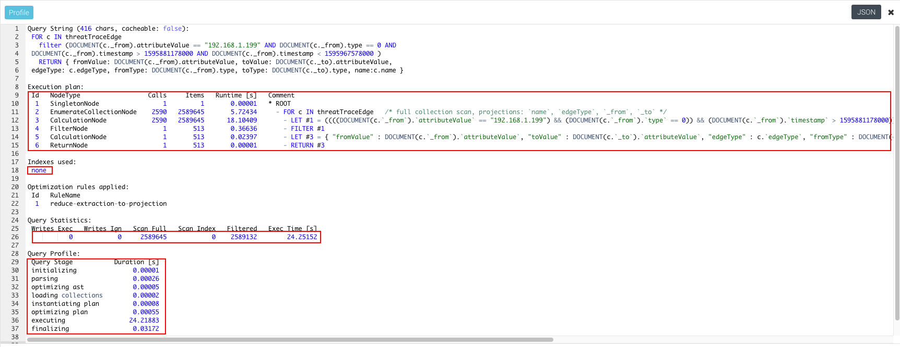

# 分析AQL执行过程

在ArangoDB的界面上两个分析AQL执行过程的功能`Profile`和`Explain`

## Profile

会执行具体的AQL但是不会返回AQL的结果，只会显示AQL每个语句的执行过程以及每个语句执行所花费的时间，也会显示执行AQL的过程中有没有使用到索引，如下图所示：

未使用索引的Profile：



使用了索引的Profile：


### Profile解析

#### Execution plan

表示AQL的具体执行过程，以及执行过程中的相关信息，需要注意的是`Runtime [s]`执行此语句花费的时间，以及`Comment`中显示的是否使用了索引。

例如**未使用索引**中的`Id`为`2`的`Comment`中显示`full collection scan（全盘扫描）`花费了`5.72434`秒；**使用了索引**的`Id`为`8`的`Comment`中显示使用了`persistent index scan（使用了持久索引）`花费时间`0.01688`秒

#### Indexes used

表示执行过程中使用了哪些索引


## Explain

AQL的执行计划，并不会真正的执行对应的AQL，显示的内容与Profile相比少了很多，但是执行Expain花费的时间相比Profile少很多，可以先执行Explain将AQL优化之后再执行Profile可以减少运行所需要的时间。

# 索引

ArangoDB将会为Collection（包括Document和Edge类型的Collection）创建`_id`,`_key`的主索引，为Edge（类型为Edge的Collection）创建`_from`,`_to`的边缘索引。在用户的自定义索引中不可以使用`_id`属性，但是可以使用`_key`,`_rev`,`_from`,`_to`属性。

创建索引有两种方式`foreground`和`background`，其区别是`foreground`方式创建索引的时候Collection中的数据时不可以获取的，`background`方式创建索引的时候Collection中大部分的数据是可获取的。

## Primary Index

每个Collection都有一个使用`_key`创建的`primary index`，此索引是一个`hash index`，在检索`_key`和`_id`这两个属性的时候会用到主索引，由于`primary index`时一个无序的`hash index`因此适用于相等条件的查找，不适合用于范围查找和排序，因为其相对其他索引会花费更多的时间进行扫描对比。

主索引不可以修改和删除。

## Edge Index

每个Edge Collection都会自动创建一个edge index，edge index可以通过`_from`和`_to`属性查找数据，edge index也是基于hash index实现的，因此适用于相等查找，不适用于范围查找和排序。

edge index不可以修改和删除

## Hash Index

hash index在RocksDB引擎中已经不推荐使用，但是仍然允许通过arangosh创建，界面上已经移除，在RocksDB引擎中hash index 与persistent index是相同的。

hash index是无序的，在查询条件为相等查询时其效率很高，但是在范围查询和排序中其效率很低。

可以在一个或多个文档属性上创建哈希索引。仅当搜索条件中存在所有索引属性，并且使用相等（`==`）运算符比较所有属性时，查询才会使用哈希索引。

可以选择将哈希索引声明为唯一，然后不允许将相同的值保存在索引属性中。哈希索引可以选择是稀疏的。不同类型的哈希索引具有以下特征：

- **unique hash index**:集合中的唯一索引所覆盖的属性的值在所有文档必须是不同的。尝试插入具有与现有文档相同的键值的文档将导致唯一约束冲突。索引中允许出现null值，但是只允许出现一次
- **unique, sparse hash index**:集合中的唯一索引所覆盖的属性值在所有文档中必须是不同的，但若索引属性中的某个属性没有设值或为null，则这个文档将不被包含在唯一索引中。
- **non-unique hash index**:集合中的所有文档都会建立索引，即使索引属性中有null值，且允许索引中出现重复的值
- **non-unique, sparse hash index**:集合中所有索引属性都有值的文档才会被建立索引，其他的文档将不会被建立索引

## Persistent Index

在MMFiles存储引擎中不推荐使用持久索引，推荐在RocksDB存储引擎中使用，在RocksDB存储引擎中所有的索引都是持久索引。

持久索引是具有持久性的排序索引。存储或更新文档时，索引条目将写入磁盘。这意味着在重新启动服务器或初始加载索引的集合时，不需要从集合数据中重建索引条目。因此，使用持久索引可以减少集合加载时间。

在对持久索引进行排序时，它可以用于点查找，范围查询和排序操作，但前提是必须在查询中提供所有索引属性，或者指定索引属性的最左前缀。

# 减少内存使用

```
--rocksdb.max-total-wal-size 1024000
--rocksdb.write-buffer-size 2048000
--rocksdb.max-write-buffer-number 2
--rocksdb.total-write-buffer-size 81920000
--rocksdb.dynamic-level-bytes false


--rocksdb.block-cache-size 2560000
--rocksdb.enforce-block-cache-size-limit true

--cache.size 10485760
```

