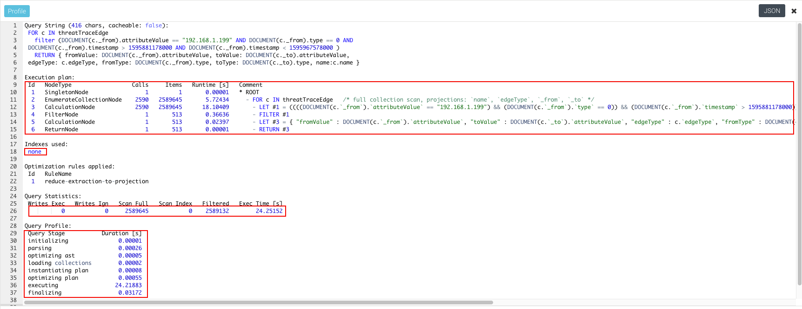
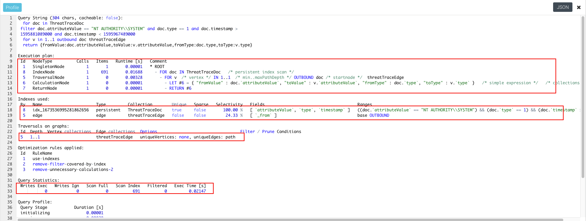
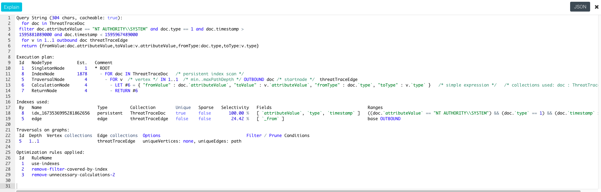

# 分析AQL执行过程

在ArangoDB的界面上两个分析AQL执行过程的功能`Profile`和`Explain`

## Profile

会执行具体的AQL但是不会返回AQL的结果，只会显示AQL每个语句的执行过程以及每个语句执行所花费的时间，也会显示执行AQL的过程中有没有使用到索引，如下图所示：

未使用索引的Profile：

使用了索引的Profile：

### Profile解析

#### Execution plan

表示AQL的具体执行过程，以及执行过程中的相关信息，需要注意的是`Runtime [s]`执行此语句花费的时间，以及`Comment`中显示的是否使用了索引。

例如**未使用索引**中的`Id`为`2`的`Comment`中显示`full collection scan（全盘扫描）`花费了`5.72434`秒；**使用了索引**的`Id`为`8`的`Comment`中显示使用了`persistent index scan（使用了持久索引）`花费时间`0.01688`秒

#### Indexes used

表示执行过程中使用了哪些索引

## Explain

AQL的执行计划，并不会真正的执行对应的AQL，显示的内容与Profile相比少了很多，但是执行Expain花费的时间相比Profile少很多，可以先执行Explain将AQL优化之后再执行Profile可以减少运行所需要的时间。

# 索引

ArangoDB将会为Collection（包括Document和Edge类型的Collection）创建`_id`,`_key`的主索引，为Edge（类型为Edge的Collection）创建`_from`,`_to`的边缘索引。在用户的自定义索引中不可以使用`_id`属性，但是可以使用`_key`,`_rev`,`_from`,`_to`属性。

创建索引有两种方式`foreground`和`background`，其区别是`foreground`方式创建索引的时候Collection中的数据时不可以获取的，`background`方式创建索引的时候Collection中大部分的数据是可获取的。

## Primary Index

每个Collection都有一个使用`_key`创建的`primary index`，此索引是一个`hash index`，在检索`_key`和`_id`这两个属性的时候会用到主索引，但是`hash index`适用于相等条件的查找，对于范围查找