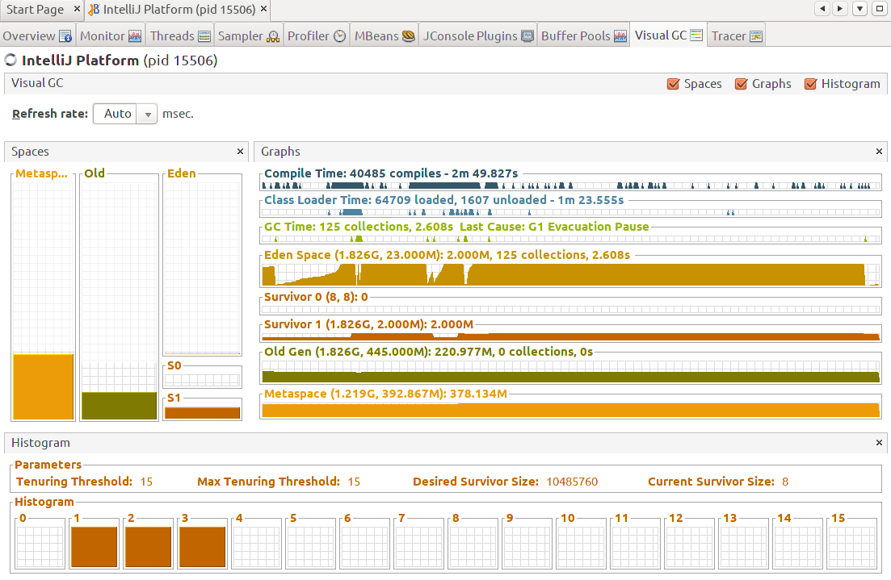

# 介绍

## 第一部分 走近Java

讲解了Java技术的来龙去脉，以及编译自己的OpenJDK对于读者理解Java虚拟机并不是比需的。

## 第二部分 自动内存管理机制

包括2~5章

## 第三部分 虚拟机执行子系统

执行子系统是虚拟机中必不可少的组成部分，了解了虚拟机如何执行程序，才能写出更优秀的代码。包括第6~9章。

# 1 走近Java

## 1.4 Java虚拟机家族

### 1.4.6 Dalvik虚拟机

Dalvik使用寄存器架构而不是Java虚拟机中常见的栈架构。

寄存器架构：

1. 典型的应用是x86的二进制指令集
2. **指令集架构完全依赖硬件，可移植性差**
3. **性能优秀，执行效率高**
4. 花费更少的指令去完成一项操作
5. 在大部分情况下，基于寄存器架构的指令集往往都是以一地址指令、二地址指令和三地址指令为主，而基于栈式架构的指令集却是以零地址指令为主

栈式架构的特点：

1. 设计和实现更简单，适用于资源受限的系统
2. 避开了寄存器的分配难题：使用零地址指令方式分配
3. 指令流中的指令大部分是零地址指令，其执行过程依赖于操作栈。指令集更小，编译器更容易实现
4. **不需要硬件支持，可移植性更好，更好实现跨平台**

#### java栈式架构示例：

```java
public int test() {
    int i = 2;
    int j = 3;
    return i + j;
}
```

字节码（ILOAD将一个局部变量加载到操作栈，ISTORE将一个数值从操作数栈存储到局部变量表）

```
  public test()I
   L0
    LINENUMBER 14 L0
    ICONST_2 // 常量2入栈
    ISTORE 1 // 将常量2存储到局部变量表位置1
   L1
    LINENUMBER 15 L1
    ICONST_3
    ISTORE 2
   L2
    LINENUMBER 16 L2
    ILOAD 1 // 将局部变量表位置1的数加载到操作栈
    ILOAD 2 // 将局部变量表位置2的数加载到操作栈
    IADD // 将操作数栈中的前两个int相加，并将结果压入栈顶
    IRETURN // 返回
   L3
    LOCALVARIABLE this Lcn/yottabyte/siem/Demo; L0 L3 0
    LOCALVARIABLE i I L1 L3 1
    LOCALVARIABLE j I L2 L3 2
    MAXSTACK = 2
    MAXLOCALS = 3
```

#### 基于寄存器的计算流程

```
mov eax,2 // 将eax寄存器的值设为2 
add eax,3 // 将eax寄存器的值加3
```

#### 总结

寄存器速度快效率高，但是依赖硬件；栈式简单，可移植性高。所以Java是已于栈式的。

## 1.6自己编译jdk

### 1.6.1 获取OpenJDK源码

```bash
hg clone https://hg.openjdk.java.net/jdk/jdk12
```

### 1.6.2 构建编译环境

需要安装Bootstrap JDK和Ant以及GCC（Ubuntu 18.04 一般默认安装）

```bash
sudo apt-get install -y build-essential libfreetype6-dev libcups2-dev libx11-dev libxext-dev libxrender-dev libxtst-dev libxt-dev libasound2-dev libffi-dev autoconf
sudo apt-get install openjdk-11-jdk 
```

### 1.6.3 进行编译

OpenJDK编译时会读取很多环境变量，大多数都是默认值，必须设置的只有两个：LANG和ALT_BOOTDIR，前者是设定语言选项，后者是前面提到的Bootstrap JDK

```bash
export LANG=C
export PATH=/usr/lib/jvm/java-11-openjdk-amd64/bin:${PATH}
```

必须取消JAVA_HOME和CLASSPATH两个环境变量，在编译之前必须取消，否则在Makefile脚本中检查到有这两个变量存在，会有警告提示

```bash
unset JAVA_HOME
unset CLASSPATH
```

```bash
#语言选项，这个必须设置，否则编译好后会出现一个HashTable的NPE错 
export LANG= C 
#Bootstrap JDK 的安装路径。必须设置 
export ALT_BOOTDIR=/usr/lib/jvm/java-11-openjdk-amd64 
#允许自动下载依赖 
export ALLOW_DOWNLOADS= true 
#并行编译的线程数，设置为和CPU内核数量一致即可
export HOTSPOT_BUILD_JOBS= 6 
export ALT_PARALLEL_COMPILE_JOBS= 6 
#比较本次build出来的映像与先前版本的差异。这对我们来说没有意义， 
#必须设置为false，否则sanity检查会报缺少先前版本JDK的映像的错误提示。
#如果已经设置dev或者DEV_ONLY= true，这个不显式设置也行 
export SKIP_COMPARE_IMAGES= true 
#使用预编译头文件，不加这个编译会更慢一些 
export USE_PRECOMPILED_HEADER= true 
#要编译的内容 
export BUILD_LANGTOOLS= true 
#export BUILD_JAXP= false 
#export BUILD_JAXWS= false 
#export BUILD_CORBA= false 
export BUILD_HOTSPOT= true 
export BUILD_JDK= true 
#要编译的版本 
#export SKIP_DEBUG_BUILD= false 
#export SKIP_FASTDEBUG_BUILD= true 
#export DEBUG_NAME= debug 
#把它设置为false可以避开javaws和浏览器Java插件之类的部分的build
BUILD_DEPLOY=false 
#把它设置为false就不会build出安装包。因为安装包里有些奇怪的依赖， 
#但即便不build出它也已经能得到完整的JDK映像，所以还是别build它好了 
BUILD_NSTALL= false 
#编译结果所存放的路径 
export ALT_OUTPUTDIR=/home/korov/OpenJDK/openjdk/build
#这两个环境变量必须去掉，不然会有很诡异的事情发生（我没有具体查过这些"诡异 的
#事情"，Makefile脚本检查到有这2个变量就会提示警告） 
unset JAVA_HOME 
unset CLASSPATH make 2 >& 1|tee $ALT_OUTPUTDIR/build.log
```

# 2 Java内存区域与内存溢出异常

## 2.1 概述

从概念上介绍Java虚拟机内存的各个区域，讲解这些区域的作用、服务对象以及其中可能产生的问题。


## 2.2 运行时数据区域


### 2.2.1 程序计数器

这是一块较小的内存空间，可以看作是当前线程所执行的字节码的行号指示器。在虚拟机的概念模型里（仅是概念模型，各种虚拟机有可能会通过一些更高校的方式去实现），字节码解释器工作时就是通过改变这个计数器的值来选取下一条需要执行的字节码指令，分支、循环、跳转、异常处理、线程恢复等基础功能都需要依赖这个计数器来完成。

由于Java虚拟机的多线程是通过线程轮流切换并分配处理器执行时间的方式来实现的，在任何一个确定的时刻，一个处理器（对于多核处理器来说是一个内核）都只会执行一条线程中的指令。因此，为了线程切换后能恢复到正确的执行位置，每条线程都需要有一个独立的程序计数器，各条线程之间计数器互不影响，独立存储，我们称这类内存区域为“**线程私有**”的内存。

如果线程正在执行的是一个Java方法，这个计数器记录的是正在执行的虚拟机字节码指令的地址；如果正在执行的是Native方法，这个计数器值则为空（Undefined）。此内存区域是唯一一个在Java虚拟机规范中没有规定任何OutOfMemoryError情况的区域。

### 2.2.2 Java虚拟机栈

此内存区域也是**线程私有**，**里面存储的只是引用**，他的生命周期与线程相同。虚拟机栈描述的是Java方法执行的内存模型：每个方法在执行的同时都会创建一个栈帧（Stack Frame）用于存储局部变量表、操作数栈、动态链接、方法出口等信息。每个一个方法从调用直到执行完成的过程，就对应这一个栈帧在虚拟机中入栈到出栈的过程。

栈中还存放了局部变量表，此表中存放了编译期可知的各种基本数据类型、对象引用和retrunAddress类型（指向了一条字节码指令的地址）。

其中64位长度的long和double类型的数据会占用2个局部变量空间（Slot），其余的数据类型只占用1个。局部变量表所需的内存空间在编译期间完成分配，当进入一个方法时，这个方法需要在帧中分配多大的局部变量空间是完全确定的，在方法运行期间不会改变局部变量表的大小。

在Java虚拟机规范中，对这个区域规定了两种异常状况：如果线程请求的栈深度大于虚拟机所允许的深度，将抛出StackOverflowError异常；如果虚拟机栈可以动态扩展（当前大部分的Java虚拟机都可动态扩展，只不过Java虚拟机规范中也允许固定长度的虚拟机栈），如果扩展时无法申请到足够的内存，就会抛出OutOfMemoryError异常。

### 2.2.3 本地方法栈

本地方法栈（NativeMethodStack）与虚拟机栈所发挥的作用是非常相似的，它们之间的区别不过是虚拟机栈为虚拟机执行Java方法（也就是字节码）服务，而本地方法栈则为虚拟机使用到的Native方法服务。在虚拟机规范中对本地方法栈中方法使用的语言、使用方式与数据结构并没有强制规定，因此具体的虚拟机可以自由实现它。甚至有的虚拟机（譬如SunHotSpot虚拟机）直接就把本地方法栈和虚拟机栈合二为一。与虚拟机栈一样，本地方法栈区域也会抛出StackOverflowError和OutOfMemoryError异常。

### 2.2.4 Java堆

对于大多数应用来说，Java堆（JavaHeap）是Java虚拟机所管理的**内存中最大的一块**。是真正存储数据的地方。Java堆是被**所有线程共享的一块内存区域**，在**虚拟机启动时创建**。此内存区域的唯一目的就是存放对象实例，几乎所有的对象实例都在这里分配内存。这一点在Java虚拟机规范中的描述是：**所有的对象实例以及数组都要在堆上分配**，但是随着JIT编译器的发展与逃逸分析技术逐渐成熟，栈上分配、标量替换优化技术将会导致一些微妙的变化发生，所有的对象都分配在堆上也渐渐变得不是那么“绝对”了。

Java堆是垃圾收集器管理的主要区域，因此也被称为“GC堆”（Garbage Collected Heap）。

根据Java虚拟机规范的规定，Java堆可以处于物理上不连续的内存空间中，只要逻辑上是连续的即可。在实现时，即可以实现成固定大小的，也可以是扩展的，不过当前主流的虚拟机都是按照可扩展实现的（通过-Xmx和-Xms控制）。如果在堆中没有内存完成实例分配，并且堆也无法再扩展时，将会抛出OutOfMemoryError异常。

### 2.2.5 方法区

方法区（Method Area）与Java堆一样，是各个线程共享的内存区域，它用于存储已被虚拟机加载的类信息、**常量**、静态变量、即时编译器编译后的代码等数据。

Java虚拟机规范对方法区的限制非常宽松，除了和Java堆一样不需要连续的内存和可以选择固定大小或者可扩展外，还可以选择不实现垃圾收集。相对而言，垃圾收集行为在这个区域是比较少出现的，但并非数据进入了方法区就如永久代的名字一样“永久”存在了。这区域的内存回收目标主要是针对常量池的回收和对类型的卸载，一般来说，这个区域的回收“成绩”比较难以令人满意，尤其是类型的卸载，条件相当苛刻，但是这部分区域的回收确实是必要的。在Sun公司的BUG列表中，曾出现过的若干个严重的BUG就是由于低版本的HotSpot虚拟机对此区域未完全回收而导致内存泄漏。根据Java虚拟机规范的规定，当方法区无法满足内存分配需求时，将抛出OutOfMemoryError异常。

### 2.2.6 运行时常量池

运行时常量池是方法区的一部分。Class文件中除了有类的版本、字段、方法、接口等描述信息外，还有一项信息是常量池（Constant Pool Table），用于存放编译期生成的各种字面量和符号引用，这部分内容将在类加载后进入方法区的运行时常量池中存放。

运行时常量池相对于Class文件常量池的另外一个重要特征是具备动态性，Java语言并不要求常量一定只有编译期才能产生，也就是并非预置入Class文件中常量池的内容才能进入方法区运行时常量池，运行期间也可能将新的常量放入池中，这种特性被开发人员利用得比较多的便是String类的intern()方法。

既然运行时常量池是方法区的一部分，自然受到方法区内存的限制，当常量池无法再申请到内存时会抛出OutOfMemoryError异常。

### 2.2.7 直接内存

直接内存并不是虚拟机运行时数据区的一部分，也不是Java虚拟机规范中定义的内存区域。但是这部分内存也被频繁地使用，而且也可能导致OutOfMemoryError异常出现。

在JDK1.4中新加入了NIO（New Input/Output）类，引入了一种基于通道（Channel）与缓冲区（Buffer）的I/O方式，它可以使用Native函数库直接分配堆外内存，然后通过一个存储在Java堆中的DirectByteBuffer对象作为这块内存的引用进行操作。这样能在一些场景中显著提高性能，因为避免了在Java堆和Native堆中来回复制数据。

显然，本机直接内存的分配不会受到Java堆大小的限制，但是，既然是内存，肯定还是会受到本机总内存（包括RAM以及SWAP区或者分页文件）大小以及处理器寻址空间的限制。服务器管理员在配置虚拟机参数时，会根据实际内存设置-Xmx等参数信息，但经常忽略直接内存，使得各个内存区域总和大于物理内存限制（包括物理的和操作系统级的限制），从而导致动态扩展时出现OutOfMemoryError异常。

## 2.3 HotSpot虚拟机对象探秘

了解虚拟机内存中的数据如何创建、如何布局以及如何访问的。以常用的HotSpot虚拟机和Java堆为例。

### 2.3.1 对象的创建

虚拟机遇到一条new指令时，首先将去检查这个指令的参数是否能在常量池中定位到一个类的符号引用，并且检查这个符号引用代表的类是否已被加载、解析和初始化过。如果没有，那必须先执行相应的类加载过程。

在类加载检查通过后，接下来虚拟机将为新生对象分配内存。对象所需内存的大小在类加载完成后便可完全确定，为对象分配空间的任务等同于把一块确定大小的内存从Java堆中划分出来。假设Java堆中内存是绝对规整的，所有用过的内存都放在一边，空闲的内存放在另一边，中间放着一个指针作为分界点的指示器，那所分配内存就仅仅是把那个指针向空闲空间空间那边挪动一段与对象大小相等的距离，这种分配方式称为“指针碰撞”（BumpthePointer）。如果Java堆中的内存并不是规整的，已使用的内存和空闲的内存相互交错，那就没有办法简单地进行指针碰撞了，虚拟机就必须维护一个列表，记录上哪些内存块是可用的，在分配的时候从列表中找到一块足够大的空间划分给对象实例，并更新列表上的记录，这种分配方式称为“空闲列表”（FreeList）。选择哪种分配方式由Java堆是否规整决定，而Java堆是否规整又由所采用的垃圾收集器是否带有压缩整理功能决定。因此，在使用Serial、ParNew等带Compact过程的收集器时，系统采用的分配算法是指针碰撞，而使用CMS这种基于Mark-Sweep算法的收集器时，通常采用空闲列表。

除如何划分可用空间之外，还有另外一个需要考虑的问题是对象创建在虚拟机中是非常频繁的行为，即使是仅仅修改一个指针所指向的位置，在并发情况下也并不是线程安全的，可能出现正在给对象A分配内存，指针还没来得及修改，对象B又同时使用了原来的指针来分配内存的情况。解决这个问题有两种方案，一种是对分配内存空间的动作进行同步处理——实际上虚拟机采用CAS配上失败重试的方式保证更新操作的原子性；另一种是把内存分配的动作按照线程划分在不同的空间之中进行，即每个线程在Java堆中预先分配一小块内存，称为本地线程分配缓冲（ThreadLocalAllocationBuffer,TLAB）。哪个线程要分配内存，就在哪个线程的TLAB上分配，只有TLAB用完并分配新的TLAB时，才需要同步锁定。虚拟机是否使用TLAB，可以通过-XX:+/-UseTLAB参数来设定。

内存分配完成后，虚拟机需要将分配到的内存空间都初始化为零值（不包括对象头），如果使用TLAB，这一工作过程也可以提前至TLAB分配时进行。这一步操作保证了对象的实例字段在Java代码中可以不赋初始值就直接使用，程序能访问到这些字段的数据类型所对应的零值。

接下来，虚拟机要对对象进行必要的设置，例如这个对象是哪个类的实例、如何才能找到类的元数据信息、对象的哈希码、对象的GC分代年龄等信息。这些信息存放在对象的对象头之中。根据虚拟机当前的运行状态的不用，如是否启用偏向锁等，对象头会有不同的设置方式。关于对象头的具体内容，稍后再做详细介绍。

在上面工作都完成之后，从虚拟机的视角来看，一个新的对象已经产生了，但从Java程序的视角来看，对象创建才刚刚开始——＜init＞方法还没有执行，所有的字段都还为零。所以，一般来说（由字节码中是否跟随invokespecial指令所决定），执行new指令之后会接着执行＜init＞方法，把对象按照程序员的意愿进行初始化，这样一个真正可用的对象才算完全产生出来。

### 2.3.2 对象的内存布局

在HotSpot虚拟机中，对象在内存中存储的布局可以分为3块区域：对象头（Header）、实例数据（Instance Data）和对齐填充（Padding）。

**对象头**包括两部分信息，第一部分用于存储对象自身的运行时数据，如哈希码（HashCode）、GC分代年龄、锁状态标志、线程持有的锁、偏向线程ID、偏向时间戳等，这部分数据的长度在32位和64位的虚拟机（未开启压缩指针）中分别为32bit和64bit，官方称它为"MarkWord"。MarkWord被设计成一个非固定的数据结构以便在极小的空间内存储尽量多的信息，它会根据对象的状态复用自己的存储空间。例如，在32位的HotSpot虚拟机中，如果对象处于未被锁定的状态下，那么MarkWord的32bit空间中的25bit用于存储对象哈希码，4bit用于存储对象分代年龄，2bit用于存储锁标志位，1bit固定为0，而在其他状态（轻量级锁定、重量级锁定、GC标记、可偏向）下对象的存储内容见下表。

| 存储内容                             | 标志位 | 状态               |
| ------------------------------------ | ------ | ------------------ |
| 对象哈洗吗、对象分代年龄             | 01     | 未锁定             |
| 指向锁记录的指针                     | 00     | 轻量级锁定         |
| 指向重量级锁的指针                   | 10     | 膨胀（重量级锁定） |
| 空、不需要记录信息                   | 11     | GC标记             |
| 偏向线程ID、偏向时间戳、对象分代年龄 | 01     | 可偏向             |

对象头的另外一部分是类型指针，即对象指向它的类元数据的指针，虚拟机通过这个指针来确定这个对象是哪个类的实例。并不是所有的虚拟机实现都必须在对象数据上保留类型指针，换句话说，查找对象的元数据信息并不一定要经过对象本身。如果对象是一个Java数组，那在对象头中还必须有一块用于记录数组长度的数据，因为虚拟机可以通过普通Java对象的元数据信息确定Java对象的大小，但是从数组的元数据中却无法确定数组的大小。

**实例数据**是对象正真存储的有效信息，也是程序代码中所定义的各种类型的字段内容。无论是从父类继承下来的，还是在子类中定义的，都需要记录起来。这部分的存储顺序会收到虚拟机分配策略参数和字段在Java源码中定义顺序的影响。HotSpot虚拟机默认的分配策略为longs/doubles、ints、shorts/chars、bytes/booleans、oops（OrdinaryObjectPointers），从分配策略中可以看出，相同宽度的字段总是被分配到一起。在满足这个前提条件的情况下，在父类中定义的变量会出现在子类之前。如果CompactFields参数值为true（默认为true），那么子类之中较窄的变量也可能会插入到父类变量的空隙之中。

**对齐填充**并不是必然存在的，也没有特别的含义，它仅仅起着占位符的作用。由于HotSpotVM的自动内存管理系统要求对象起始地址必须是8字节的整数倍，换句话说，就是对象的大小必须是8字节的整数倍。而对象头部分正好是8字节的倍数（1倍或者2倍），因此，当对象实例数据部分没有对齐时，就需要需要通过对齐填充来补全。

### 2.3.3 对象的定位

Java程序需要通过栈上的reference数据来操作堆上的具体对象。目前主流的通过应用定位对象的方式有**使用句柄**和**直接指针**两种。

**句柄访问**：Java堆中将会划分出一块内存来作为句柄池，reference中存储的就是对象的句柄地址，句柄中包含了对象实例数据与类型数据各自的具体地址信息


**直接指针访问**：Java堆对象的布局中就必须考虑如何放置访问类型数据的相关信息，reference中存储的直接就是对象地址


使用直接指针访问方式的最大好处就是速度更快，它节省了一次指针定位的之间开销，极少成多之后也是一项非常客观的执行成本。

## 2.4 实战：OutOfMenmoryError异常

除了程序计数器外，虚拟机内存的其他几个运行时区域都有发生OutOfMemoryError异常的可能。

### 2.4.1 Java堆溢出

Java堆用于存储对象实例，只要不断创建对象，并且保证GC Roots到对象之间有可达路径来避免垃圾回收机制清楚这些对象，那么在对象数量达到最大堆的容量限制后就会产生内存溢出异常。

限制Java堆的大小为20MB，不可扩展（将堆的最小值-Xms参数与最大值-Xmx参数设置为一样即可避免堆自动扩展），通过参数-XX:+HeapDumpOnOutOfMemoryError可以让虚拟机在出现内存溢出异常时Dump出当前的内存堆转储快照以便事后进行分析。

```java
/** *VM Args:-Xms20m-Xmx20m-XX:+HeapDumpOnOutOfMemoryError
*@author zzm */ 
public class HeapOOM{ 
    static class OOMObject{ } 
    public static void main(String[] args){ 
        List <OOMObject> list= new ArrayList<OOMObject>();
        while(true){ 
            list.add(new OOMObject()); 
        } 
    } 
}

// 结果
java.lang.OutOfMemoryError:Java heap space Dumping heap to java_pid3404.hprof…… 
Heap dump file created[ 22045981 bytes in 0. 663 secs]
```

要解决这个区域的异常，一般的手段是先通过内存映像分析工具堆Dump出来的堆转储快照进行分析，重点是确认内存中的对象是否是必要的，也就是要先分清楚到底是出现了内存泄漏还是内存溢出。

如果是内存泄露，可进一步通过工具查看泄露对象到GC Roots的引用链。于是就能找到泄露对象是通过怎样的路径与GC Roots相关联并导致垃圾收集器无法自动回收它们的。掌握了泄露对象的类型信息及GC Roots引用链的信息，就可以比较准确地定位出泄露代码的位置。

如果不存在泄露，换句话说，就是内存中的对象确实都还必须存活着，那就应当检查虚拟机的堆参数（-Xmx与-Xms），与机器物理内存对比看是否还可以调大，从代码上检查是否存在某些对象生命周期过长、持有状态时间过长的情况，尝试减少程序运行期的内存消耗。

### 2.4.2 虚拟机栈和本地方法栈溢出

由于在HotSpot虚拟机中并不区分虚拟机栈和本地方法栈，因此，对于HotSpot来说，虽然-Xoss参数（设置本地方法栈大小）存在，但实际上是无效的，栈容量只由-Xss参数设定。

### 2.4.3 方法区和运行时常量池溢出

由于运行时常量池是方法区的一部分，因此这两个区域的溢出放在一起测试。

### 2.4.4 本机直接内存溢出

DirectMemory容量可通过-XX:MaxDirectMemorySize指定，如果不指定，则默认与Java堆最大值（-Xmx指定）一样。

# 3 垃圾收集器与内存分配策略

程序计数器、虚拟机栈、本地方法栈3个区域随线程而生，随线程而灭。每一个栈帧中分配多少内存基本上是在类结构确定下来时就已知的，因此这几个区域的内存分配和回收都具备确定性，在这几个区域内就不需要过多考虑回收的问题，因为方法结束或者线程结束时，内存自然就跟随者回收了。而Java堆和方法区的内存分配和回收都是动态的，垃圾收集器所关注的是这部分内存。

## 3.1 对象已死吗

垃圾收集器如何确定对象中哪些还“存活”着，哪些已经“死去”。

### 3.1.1 引用计数算法

给对象添加一个引用计数器，每当有一个地方引用它时，计数器值就加1；当引用失效时，计数器值就减1；任何时刻计数器为0的对象就是不可能再被使用的。此方法实现简单，判定效率也很高。但是主流的Java虚拟机中没有选用引用计数算法进行内存管理。主要原因是它很难解决对象之间相互循环引用的问题。

对象objA和objB都有字段instance，赋值令objA.instance=objB及objB.instance=objA，除此之外，这两个对象再无任何引用，实际上这两个对象已经不可能再被访问，但是他们因为互相引用这对象，导致他们的引用计数都不为0，于是引用计数算法无法通知GC收集器回收他们。

### 3.1.2 可达性分析算法

这个算法的基本思路就是通过一系列的称为"GCRoots"的对象作为起始点，从这些节点开始向下搜索，搜索所走过的路径称为引用链（ReferenceChain），当一个对象到GCRoots没有任何引用链相连（用图论的话来说，就是从GCRoots到这个对象不可达）时，则证明此对象是不可用的。如图3-1所示，对象object5、object6、object7虽然互相有关联，但是它们到GCRoots是不可达的，所以它们将会被判定为是可回收的对象。


在Java语言中，可作为GC Roots的对象包括下面几种：

- 虚拟机栈（栈帧中的本地变量表）中引用的对象。
- 方法区中类静态属性引用的对象
- 方法区中常量引用的对象
- 本地方法栈中JNI（即一般说的Native方法）引用的对象。
- java虚拟机内部的引用，如基本数据类型对应的Class对象，一些常驻的异常对象（如NullPointException）等，还有系统类加载器。
- 所有被同步锁持有的对象
- 反映java虚拟机内部情况的JMXBean、JVMTI中注册的回调、本地代码缓存等。

除了这些固定的GC Roots集合以外，根据用户所选的垃圾收集器以及当前回收的内存区域不同，还可以有其他对象”临时性“的加入，共同构成GC Roots集合。

在jdk1.2之后，Java堆引用的概念进行了扩充，将引用分为强引用（Strong Reference）、软引用（Soft Reference）、弱引用（Weak Reference）、虚引用（Phantom Reference）4种，这4种引用强度依次逐渐减弱。

**强引用**类似于“Object obj=new Object()”这类引用，只要强引用还存在，垃圾收集器永远不会回收掉被引用的对象。

**软引用**是用来描述一些有用但并非必需的对象。对于软引用关联着的对象，在系统将要发生内存溢出异常之前，将会把这些对象列进回收范围之中进行第二次回收。如果这次回收还没有足够的内存，才会抛出内存溢出异常。

**弱引用**也是用来描述非必需对象的，被弱引用关联的对象只能生存到下一次垃圾收集发生之前。当垃圾收集器工作时，无论当前内存是否足够，都会回收掉只被弱引用关联的对象。

**虚引用**也称为幽灵引用或者幻引用，一个对象是否有虚引用的存在，完全不会对其生存时间构成影响，也无法通过虚引用来取得一个对象实例。为一个对象设置虚引用关联的唯一目的就是能在这个对象被收集器回收时收到一个系统通知。

### 3.1.3 生存还是死亡

在可达性分析算法中不可达的对象也并非是“非死不可”，这时候他们暂时处于**缓行**阶段，要正真宣告一个对象死亡，至少要经历两次标记过程：如果对象在进行可达性分析后发现没有与GC Roots相连接的引用链，那它将会被第一次标记并且进行一次筛选，筛选的条件是此对象是否有必要执行finalize()方法。当对象没有覆盖finalize()方法，或者finalize()方法已经被虚拟机调用过，虚拟机将这两种情况都视为“没有必要执行”。

如果这个对象被判定为有必要执行finalize()方法，那么这个对象将会放置在一个叫做F-Queue的队列之中，并在稍后由一个由虚拟机自动建立的、低优先级的Finalizer线程去执行它。这里所谓的“执行”是指虚拟机会触发这个方法，但并不承诺会等待它运行结束，这样做的原因是，如果一个对象在finalize()方法中执行缓慢，或者发生了死循环（更极端的情况），将很可能会导致F-Queue队列中其他对象永久处于等待，甚至导致整个内存回收系统崩溃。finalize()方法是对象逃脱死亡命运的最后一次机会，稍后GC将对F-Queue中的对象进行第二次小规模的标记，如果对象要在finalize()中成功拯救自己——只要重新与引用链上的任何一个对象建立关联即可，譬如把自己（this关键字）赋值给某个类变量或者对象的成员变量，那在第二次标记时它将被移除出“即将回收”的集合；如果对象这时候还没有逃脱，那基本上它就真的被回收了。

```Java
public class FinalizeEscapeGC {
    public static FinalizeEscapeGC SAVE_HOOK = null;

    public void isAlive() {
        System.out.println(" yes, i am still alive:)");
    }

    public void finalize() throws Throwable {
        super.finalize();
        System.out.println("finalize mehtod executed!");
        SAVE_HOOK = this;
    }

    public static void main(String[] args) throws InterruptedException {
        SAVE_HOOK = new FinalizeEscapeGC();
        // 对象第一次成功拯救自己
        SAVE_HOOK=null;
        System.gc();
        // 因为finalize方法优先级很低，所以暂停0.5秒以等待它
        Thread.sleep(500);
        if(SAVE_HOOK!=null){
            SAVE_HOOK.isAlive();
        }else {
            System.out.println("no, i am dead:(");
        }
        /**
         * 下面这段代码与上面完全相同，但是自救失败了
         *  原因：因为第一次筛选的时候已经执行过finalize方法，所以直接被回收没有放到F-Queue中
         */
        SAVE_HOOK=null;
        System.gc();
        // 因为finalize方法优先级很低，所以暂停0.5秒以等待它
        Thread.sleep(500);
        if(SAVE_HOOK!=null){
            SAVE_HOOK.isAlive();
        }else {
            System.out.println("no, i am dead:(");
        }
    }
}
```

不建议使用finalize方法，可以使用try-finally方法可以做的更好、更及时。建议大家完全可以忘掉Java中这个方法。

### 3.1.4 回收方法区

方法区（HosSpot虚拟机中的永久代）垃圾收集主要回收两部分内容：废弃常量和无用的类。回收废弃常量与回收Java堆中的对象非常类似。以常量池中字面量的回收为例，假如一个字符串"abc"已经进入了常量池中，但是当前系统没有任何一个String对象是叫做"abc"的，换句话说，就是没有任何String对象引用常量池中的"abc"常量，也没有其他地方引用了这个字面量，如果这时发生内存回收，而且必要的话，这个"abc"常量就会被系统清理出常量池。常量池中的其他类（接口）、方法、字段的符号引用也与此类似。

判断一个类是否是“无用的类”：该类所有的实例都已经被回收，也就是Java堆中不存在该类的任何实例；加载该类的ClassLoader已经被回收；该类对应的java.lang.Class对象没有在任何地方被引用，无法在任何地方通过反射访问该类的方法。

虚拟机对**可以**满足上述3个条件的无用类进行回收，是否对类进行回收，HotSpot虚拟机提供了-Xnoclassgc参数进行控制，还可以使用-verbose:class以及-XX:+TraceClassLoading、-XX:+TraceClassUnLoading查看类加载和卸载信息，其中-verbose:class和-XX:+TraceClassLoading可以在Product版的虚拟机中使用，-XX:+TraceClassUnLoading参数需要FastDebug版的虚拟机支持。

在大量使用反射、动态代理、CGLib等ByteCode框架、动态生成JSP以及OSGi这类频繁自定义ClassLoader的场景都需要虚拟机具备类卸载的功能，以保证永久代不会溢出。

## 3.2垃圾收集算法

这里仅介绍几种算法的思想及发展过程

### 3.2.1 标记-清除算法

算法分为**标记**和**清除**两个阶段：首先标记出所有需要回收的对象，在标记完成后统一回收所有被标记的的对象。不足之处有两个：一个是效率问题，标记和清除两个过程的效率都不高；另一个问题是空间问题：标记清除之后会产生大量不连续的内存碎片，空间碎片太多可能导致以后在程序运行过程中需要分配较大对象时，无法找到足够的连续内存而不得不提前触发另一次垃圾收集动作。

### 3.2.2 复制算法

将可用内存按容量划分为大小相等的两块，每次只使用其中的一块。当这一块的内存用完了，就将还存活着的对象复制到另外一块上面，然后再把已使用过的内存空间一次清理掉。这样使得每次都是对整个半区进行内存回收，内存分配时也就不用考虑内存碎片等复杂情况，只要移动对顶指针，按顺序分配内存即可，实现简单，运行高效。缺点：一半的内存不可用代价太高。

现在的商业虚拟机都采用这种收集算法来回收新生代，但将内存非为一块较大的Eden空间和两块较小的Survivor空间，每次使用Eden和其中一块Survivor，当回收时，将Eden和Survivor中还存活这的对象一次性地复制到另外一块Survivor空间上，最后清理掉Eden和刚才用过的Survivor空间。HotSpot虚拟机默认Eden和Survivor的大小比例是8:1。也就是每次新生代中可用内存空间为整个新生代容量的90%（80%+10%），只有10%的内存会被浪费。若每次回收多于10%需要依赖其他内存进行分配担保。

### 3.2.3 标记-整理算法

复制收集算法在对象存活率较高时就要进行较多的复制操作，效率将会变低。更关键的是，如果不想浪费50%的空间，就需要有额外的空间进行分配担保，以应对被使用的内存中所有对象都100%存活的极端情况，所以在老年代一般不能直接选用这种算法。

**标记-整理**算法的标记过程仍然与**标记-清除**算法一样，但并不是直接对可回收对象进行清理，而是让所有存活的对象都向一端移动，然后直接清理掉边界以外的内存。

### 3.2.4 分代收集算法

当前商业虚拟机的垃圾收集都采用分代收集算法。根据对象存活周期的不同将内存划分为几块。一般是把Java堆分为新生代和老年代，这样就可以根据各个年代的特点采用最适当的收集算法。在新生代中，每次垃圾收集时都发现有大批对象死去，只有少量存活，那就选用复制算法，只需要付出少量存活对象的复制成本就可以完成收集。而老年代中因为对象存活率高、没有额外空间对他进行分配担保，就必须使用标记-清理或者标记-整理算法来进行回收。

## 3.3 HotSpot的算法实现

### 3.3.1 枚举根结点

从可达性分析中从GC Roots结点找引用链这个操作为例，可作为GCRoots的节点主要在全局性的引用（例如常量或类静态属性）与执行上下文（例如栈帧中的本地变量表）中，现在很多应用仅仅方法区就有数百兆，如果要逐个检查这里面的引用，那么必然会消耗很多时间。

**迄今为止，所有收集器在根节点枚举这一步时都是必须暂停用户线程的。**因此此时需要”Stop The World“。但是可达性分析算法耗时最长的查找引用链过程已经可以做到与用户线程一起并发了。

跟节点的枚举必须在一个能确保一致性的快照中进行——这里“一致性”的意思是指在整个分析期间整个执行系统看起来就像被冻结在某个时间点上，不可以出现分析过程中对象引用关系还在不断变化的情况，该点不满足的话分析结果准确性就无法得到保证。

由于目前的主流Java虚拟机使用的都是准确式GC（这个概念在第1章介绍ExactVM对ClassicVM的改进时讲过），所以当用户线程停顿下来后，并不需要一个不漏地检查完所有执行上下文和全局的引用位置，虚拟机应当是有办法直接得知哪些地方存放着对象引用。在HotSpot的实现中，是使用一组称为OopMap的数据结构来达到这个目的的，在类加载完成的时候，HotSpot就把对象内什么偏移量上是什么类型的数据计算出来，在即时编译过程中，也会在特定的位置记录下栈和寄存器中哪些位置是引用。这样，GC在扫描时就可以直接得知这些信息了，并不需要一个不漏的从方法区等GC Roots开始查找。

### 3.3.2 安全点

HotSpot没有为每条指令都声称OopMap，只是在特定的位置，这些位置称为**安全点**，即程序执行时并非在所有地方都能停顿下来开始GC，只有在到达安全点时才能能暂停。安全点的选定基本上是以程序“是否具有让程序长时间执行的特征”为标准进行选定的--因为每条指令执行的时间都非常短暂。“长时间执行”的最明显特征就是指令序列复用，例如方法调用、循环跳转、异常跳转等都属于指令序列复用，所以具有这些功能的指令才会产生Safepoint。

对于Safepoint，另一个需要考虑的问题是如何在GC发生时让所有线程（这里不包括执行JNI调用的线程）都“跑”到最近的安全点上再停顿下来。这里有两种方案可供选择：抢先式中断（PreemptiveSuspension）和主动式中断（VoluntarySuspension），其中抢先式中断不需要线程的执行代码主动去配合，在GC发生时，首先把所有线程全部中断，如果发现有线程中断的地方不在安全点上，就恢复线程，让它“跑”到安全点上。现在几乎没有虚拟机实现采用抢先式中断来暂停线程从而响应GC事件。

而主动式中断的思想是当GC需要中断线程的时候，不直接对线程操作，仅仅简单地设置一个标志，各个线程执行时主动去轮询这个标志，发现中断标志为真时就自己中断挂起。轮询标志的地方和安全点是重合的，另外再加上创建对象和其他需要在Java堆上分配内存的地方，这是为了检查是否即将要发生垃圾收集，避免没有足够内存分配新对象。

### 3.3.3 安全区域

Safepoint机制保证了程序执行时，在不太长的时间内就会遇到可进入GC的Safepoint。

安全区域是指在一段代码片段之中，引用关系不会发生变化。在这个区域中的任意地方开始GC都是安全的。

在线程执行到SafeRegion中的代码时，首先标识自己已经进入了SafeRegion，那样，当在这段时间里JVM要发起GC时，就不用管标识自己为SafeRegion状态的线程了。在线程要离开SafeRegion时，它要检查系统是否已经完成了根节点枚举（或者垃圾收集过程中其他需要暂停用户线程的阶段），如果完成了，那线程就继续执行，否则它就必须等待直到收到可以安全离开SafeRegion的信号为止。

### 3.3.4 记忆集与卡表

为了解决对象跨代引用所带来的问题，垃圾收集器在新生代中建立了名为记忆集（Remember Set）的数据结构，避免把整个老年代加入到GC Roots扫描范围。

记忆集是一种用于记录从非收集区域指向收集区域的指针集合的抽象数据结构。如果不考虑效率和成本的话，最简单的实现可以用非收集区域中所有含跨代引用的对象数组来实现这个数据结构。

这种记录全部含跨代引用对象的实现方案，无论是空间占用还是维护成本都相当高昂。而在垃圾收集的场景中，收集器只需要通过记忆集判断出某一块非收集区域是否存在指向收集区域的指针就可以了，并不需要了解这些跨代指针的全部细节。在实现记忆集的时候可以选择更为粗犷的记录粒度来节省记忆集的存储和维护成本，例如：

1. 字长精度：每个记录精确到一个机器字长，该字包含跨代指针
2. 对象精度：每个记录精确到一个对象，该对象里有字段含有跨代指针
3. 卡精度：每个记录精确到一块内存区域，该区域内有对象含有跨代指针

其中，第三种“卡精度”所指的是用一种称为“卡表”（CardTable）的方式去实现记忆集[1]，这也是目前最常用的一种记忆集实现形式，一些资料中甚至直接把它和记忆集混为一谈。前面定义中提到记忆集其实是一种“抽象”的数据结构，抽象的意思是只定义了记忆集的行为意图，并没有定义其行为的具体实现。卡表就是记忆集的一种具体实现，它定义了记忆集的记录精度、与堆内存的映射关系等。关于卡表与记忆集的关系，读者不妨按照Java语言中HashMap与Map的关系来类比理解。


## 3.4 垃圾收集器

jdk1.7 Update14之后HotSpot虚拟机将G1收集器作为默认收集器。


上图展示了用于不同分代的收集器，如果两个收集器之间存在连线，就说明他们可以搭配使用。虚拟机所处的区域表示它时属于新生代收集器还是老年代收集器。

### 3.4.1 Serial收集器

Serial收集器是最基本、发展历史最悠久的收集器，曾经是虚拟机新生代收集器的唯一选择。这个收集器是一个单线程的收集器。但它的“单线程”的意义并不仅仅说明它只会使用一个CPU或一条收集线程去完成垃圾收集工作，更重要的是在它进行垃圾收集时，必须暂停其他所有的工作线程，直到它收集结束。

它依然是虚拟机运行在Client模式下的默认新生代收集器。它也有着优于其他收集器的地方：简单而高效（与其他收集器的单线程比），对于限定单个CPU的环境来说，Serial收集器由于没有线程交互的开销，专心做垃圾收集自然可以获得最高的单线程收集效率。

### 3.4.2 ParNew收集器

ParNew收集器其实就是Serial收集器的多线程版本。除了使用多条线程进行垃圾收集之外，其余行为包括Serial收集器可用的所有控制参数（例如：-XX:SurvivorRatio、-XX:PretenureSizeThreshold、-XX:HandlePromotionFailure等）、收集算法、StopTheWorld、对象分配规则、回收策略等都与Serial收集器完全一样，在实现上，这两种收集器也共用了相当多的代码。却是许多运行在Server模式下的虚拟机中首选的新生代收集器，其中有一个与性能无关但很重要的原因是，除了Serial收集器外，目前只有它能与CMS收集器配合工作。

并行（Parallel）：指多条垃圾收集线程并行工作，但此时用户线程仍然处于等待状态。

并发（Concurrent）：指用户线程与垃圾收集线程同时执行（但不一定是并行的，可能会交替执行），用户程序在继续运行，而垃圾收集程序运行于另一个CPU上。

### 3.4.3 Parallel Scavenge收集器

Parallel Scavenge收集器是一个新生代收集器，使用复制算法，又是并行的多线程收集器。

特点是它的关注点与其他收集器不同，CMS等收集器的关注点是尽可能地缩短垃圾收集时用户线程的停顿时间，而Parallel Scavenge收集器的目标则是达到一个可控制的吞吐量。所谓吞吐量就是CPU用于运行用户代码的时间与CPU总消耗时间的比值，即吞吐量=运行用户代码时间/（运行用户代码时间+垃圾收集时间），虚拟机总共运行了100分钟，其中垃圾收集花掉1分钟，那吞吐量就是99%。

Parallel Scavenge收集器提供了两个参数用于精确控制吞吐量，分别是控制最大垃圾收集停顿时间的-XX:MaxGCPauseMillis参数以及直接设置吞吐量大小的-XX:GCTimeRatio参数。

### 3.4.4 Serial Old收集器

Serial Old是Serial收集器的老年代版本，它同样是一个单线程收集器，是用**标记-整理**算法。这个收集器的主要意义也是在于给Client模式下的虚拟机使用。如果在Server模式下，那么它主要还有两大用途：一种用途是在JDK1.5以及之前的版本中与Parallel Scavenge收集器搭配使用，另一种用途就是作为CMS收集器的后备预案，在并发收集发生Concurrent Mode Failure时使用。

### 3.4.5 Parallel Old 收集 器

Parallel Old 收集 器是Parallel Scavenge收集器的老年代版本，使用多线程和标记-整理算法。

### 3.4.6 CMS收集器

CMS（Concurrent Mark Sweep）收集器是一种以获取最短回收停顿时间为目标的收集器。目前很大一部分的Java应用集中在互联网站或者B/S系统的服务端上，这类应用尤其重视服务的响应速度，希望系统停顿时间最短，以给用户带来较好的体验。CMS收集器就非常符合这类应用的需求。

此收集器基于标记-清除算法实现，其实现过程分为4个步骤：

- 初始标记（CMS initial mark）
- 并发标记（CMS concurrent mark）
- 重新标记（CMS remark）
- 并发清除（CMS concurrent sweep）

其中，初始标记和重新标记这两个步骤仍然需要“Stopt The World”。初始标记仅仅只是标记一下GC Roots能直接关联到的对象，速度很快，并发标记阶段就是进行GC RootsTracing的过程，而重新标记阶段则是为了修正并发标记期间因用户程序继续运作而导致标记长生变动的那一部分对象的标记记录，这个阶段的停顿时间一般会比初始标记阶段稍长一些，但远比并发标记的时间短。

由于整个过程中耗时最长的并发标记和并发清除过程收集器线程都可以与用户线程一起工作，所以，从总体上来说，CMS收集器的内存回收过程是与用户线程一起并发执行的。


优点：**并发收集**、**低停顿**

缺点：**对CPU资源非常敏感**。**无法处理浮动垃圾**。由于CMS并发清理阶段用户线程还在运行着，伴随程序运行自然就还会有新的垃圾不断产生，这一部分垃圾出现在标记过程之后，CMS无法在当次收集中处理掉它们，只好留待下一次GC时再清理掉。这一部分垃圾就称为“浮动垃圾”。收集结束后会有大量**空间碎片**产生。

### 3.4.7 G1收集器

G1是一款面向服务端应用的垃圾收集器。与其他GC收集器相比，G1具备如下特点：

- 并行与并发：G1能充分利用多CPU、多核环境下的硬件优势，使用多个CPU（CPU或者CPU核心）来缩短Stop-The-World停顿的时间，部分其他收集器原本需要停顿Java线程执行的GC动作，G1收集器仍然可以通过并发的方式让Java程序继续执行。
- 分代收集
- 空间整合：G1从整体看是基于“标记-整理”算法实现的收集器，从局部（两个Region之间）上来看是基于“复制”算法实现的。
- 可预测的停顿：这是G1相对于CMS的另一大优势，降低停顿时间是G1和CMS共同的关注点，但G1除了追求低停顿外，还能建立可预测的停顿时间模型，能让使用者明确指定在一个长度为M毫秒的时间片段内，消耗在垃圾收集上的时间不得超过N毫秒，这几乎已经是实时Java（RTSJ）的垃圾收集器的特征了。

G1收集器之所以能建立可预测的停顿时间模型，是因为它可以有计划地避免在整个Java堆中进行全区域的垃圾收集。G1跟踪各个Region里面的垃圾堆积的价值大小（回收所获得的空间大小以及回收所需时间的经验值），在后台维护一个优先列表，每次根据允许的收集时间，优先回收价值最大的Region（这也就是Garbage-First名称的来由）。这种使用Region划分内存空间以及有优先级的区域回收方式，保证了G1收集器在有限的时间内可以获取尽可能高的收集效率。

G1收集器的运作大致可划分为以下几个步骤：

- 初始标记（Initial Marking）
- 并发标记（Concurrent Marking）
- 最终标记（Final Marking）
- 筛选回收（Live Data Counting and Evacuation）

初始标记阶段仅仅只是标记一下GCRoots能直接关联到的对象，并且修改TAMS（NextTopatMarkStart）的值，让下一阶段用户程序并发运行时，能在正确可用的Region中创建新对象，这阶段需要停顿线程，但耗时很短。并发标记阶段是从GCRoot开始对堆中对象进行可达性分析，找出存活的对象，这阶段耗时较长，但可与用户程序并发执行。而最终标记阶段则是为了

修正在并发标记期间因用户程序继续运作而导致标记产生变动的那一部分标记记录，虚拟机将这段时间对象变化记录在线程Remembered Set Logs里面，最终标记阶段需要把Remembered Set Logs的数据合并到Remembered Set中，这阶段需要停顿线程，但是可并行执行。最后在筛选回收阶段首先对各个Region的回收价值和成本进行排序，根据用户所期望的GC停顿时间来制定回收计划，从Sun公司透露出来的信息来看，这个阶段其实也可以做到与用户程序一起并发执行，但是因为只回收一部分Region，时间是用户可控制的，而且停顿用户线程将大幅提高收集效率。


#### 分区

G1采用了分区(Region)的思路，将整个堆空间分成若干个大小相等的内存区域，每次分配对象空间将逐段地使用内存。因此，在堆的使用上，G1并不要求对象的存储一定是物理上连续的，只要逻辑上连续即可；每个分区也不会确定地为某个代服务，可以按需在年轻代和老年代之间切换。启动时可以通过参数-XX:G1HeapRegionSize=n可指定分区大小(1MB~32MB，且必须是2的幂)，默认将整堆划分为2048个分区。

#### 卡片

在每个分区内部又被分成了若干个大小为512 Byte卡片(Card)，标识堆内存最小可用粒度所有分区的卡片将会记录在全局卡片表(Global Card Table)中，分配的对象会占用物理上连续的若干个卡片，当查找对分区内对象的引用时便可通过记录卡片来查找该引用对象(见RSet)。每次对内存的回收，都是对指定分区的卡片进行处理。

#### 堆

G1同样可以通过-Xms/-Xmx来指定堆空间大小。当发生年轻代收集或混合收集时，通过计算GC与应用的耗费时间比，自动调整堆空间大小。如果GC频率太高，则通过增加堆尺寸，来减少GC频率，相应地GC占用的时间也随之降低；目标参数-XX:GCTimeRatio即为GC与应用的耗费时间比，G1默认为9，而CMS默认为99，因为CMS的设计原则是耗费在GC上的时间尽可能的少。另外，当空间不足，如对象空间分配或转移失败时，G1会首先尝试增加堆空间，如果扩容失败，则发起担保的Full GC。Full GC后，堆尺寸计算结果也会调整堆空间。

#### 分代

分代垃圾收集可以将关注点集中在最近被分配的对象上，而无需整堆扫描，避免长命对象的拷贝，同时独立收集有助于降低响应时间。虽然分区使得内存分配不再要求紧凑的内存空间，但G1依然使用了分代的思想。与其他垃圾收集器类似，G1将内存在逻辑上划分为年轻代和老年代，其中年轻代又划分为Eden空间和Survivor空间。但年轻代空间并不是固定不变的，当现有年轻代分区占满时，JVM会分配新的空闲分区加入到年轻代空间。

整个年轻代内存会在初始空间-XX:G1NewSizePercent(默认整堆5%)与最大空间-XX:G1MaxNewSizePercent(默认60%)之间动态变化，且由参数目标暂停时间-XX:MaxGCPauseMillis(默认200ms)、需要扩缩容的大小以及分区的已记忆集合(RSet)计算得到。当然，G1依然可以设置固定的年轻代大小(参数-XX:NewRatio、-Xmn)，但同时暂停目标将失去意义。

#### 本地分配缓冲

值得注意的是，由于分区的思想，每个线程均可以"认领"某个分区用于线程本地的内存分配，而不需要顾及分区是否连续。因此，每个应用线程和GC线程都会独立的使用分区，进而减少同步时间，提升GC效率，这个分区称为本地分配缓冲区(Lab)。

其中，应用线程可以独占一个本地缓冲区(TLAB)来创建的对象，而大部分都会落入Eden区域(巨型对象或分配失败除外)，因此TLAB的分区属于Eden空间；而每次垃圾收集时，每个GC线程同样可以独占一个本地缓冲区(GCLAB)用来转移对象，每次回收会将对象复制到Suvivor空间或老年代空间；对于从Eden/Survivor空间晋升(Promotion)到Survivor/老年代空间的对象，同样有GC独占的本地缓冲区进行操作，该部分称为晋升本地缓冲区(PLAB)。

#### 分区模型

G1对内存的使用以分区(Region)为单位，而对对象的分配则以卡片(Card)为单位。

### ZGC

ZGC是一款基于**Region内存布局**的，（暂时）不设分代的，使用了读屏障、染色指针和内存多重映射等技术来实现可以并发的**标记-整理**算法的，以低延迟为首要目标的一款垃圾收集器。

#### 内存布局

ZGC的Region具有动态性--动态创建和销毁，以及动态的区域容量大小。在x64硬件平台下，ZGC的Region有大、中、小三类容量：

1. 小型Region：容量固定为2MB，用于放置256KB的小对象
2. 中型Region：容量固定为32MB，用于放置大于等于256KB但小于4MB的对象
3. 大型Region：容量不固定，可以动态变化，但必须为2MB的整数倍，用于放置4MB或以上的大对象。每个大型Region中只会存放一个大对象。大型Region在ZGC的实现中是不会被重分配，因为复制一个大对象的代价非常高昂。

#### 染色指针


1. 染色指针可以使得一旦某个Region的存活对象被移走之后，这个Region立即就能够被释放和冲用掉，而不必等待整个堆中所有指向该Region的引用都被修正后才能清理。
2. 染色指针可以大幅减少在垃圾收集过程中内存屏障的使用数量，设置内存屏障，尤其是写屏障的目的通常是为了记录对象引用的变动情况，如果将这些信息直接维护在指针中，可以省去一些专门的记录操作。实际上，到目前位置ZGC都并未使用任何写屏障，只使用了读屏障（一部分是染色指针的功劳，一部分是ZGC现在还不支持分代收集，天然就没有跨代引用的问题）。
3. 染色指针可以作为一种可扩展的存储结构用来记录更多与对象标记、重定位过程相关的数据，以便日后进一步提高性能。

**Finalizable**：表示是否只能通过finalize()方法才能被访问到，其他途径不行；**Remapped**：表示是否进入了重分配集（即被移动过）；**Marked1、Marked0**：表示对象的三色标记状态； 

#### 多重映射

Linux/x86-64平台上的ZGC使用了多重映射（Multi-Mapping）将多个不同的虚拟内存地址映射到同一个物理内存地址上，这是一种多对一的映射，意味着ZGC在虚拟机内存中看到的地址空间要比实际的堆内存容量来的更大。把染色指针中的标志位看作是地址的分段符，那只要将这些不同的地址段都映射到同一个物理内存空间，经过多重映射转换后，就可以使用染色指针正常进行寻址了


当应用程序创建对象时，首先在堆空间申请一个虚拟地址，ZGC会为该对象在Marked0，Markd1和Remapped三个视图空间分别申请一个虚拟地址，且这三个虚拟地址对应同一个物理地址。并且这三个空间在同一时间点有且仅有一个空间有效。

#### ZGC工作过程

ZGC的运作过程大致可以划分为四个阶段，全部的四个阶段都是可以并发执行的，仅有两个阶段中间会存在短暂的停顿的小阶段

- 初始标记：从根集合出发，找出根集合直接引用的活跃对象，并入栈，该步需要STW
- 并发标记（Concurrent Mark）：根据初始标记找到的对象，做并发标记的对象，使用深度优先遍历对象的成员变量进行标记。并发标记是遍历对象图做可达性分析的阶段，前后也要经过类似于G1、Shenandoah的初始标记、最终标记的短暂停顿，ZGC的标记是在指针上而不是在对象上进行的，标记阶段会更新染色指针中的Marked0、Marked1标志位。
- 再标记和非强根并行标记，在并发标记结束后尝试终结标记动作，理论上并发标记结束后所有待标记的对象全部完成，但因为GC工作线程和应用线程是并发运行，所以可能存在GC工作线程执行结束标记时，应用程序又有新的引用关系变化导致漏标记，所以这一步先判断是否真的结束了对象的标记，如果没有结束就还会启动并行标记，所以这一步需要STW，该步中还会对非强根进行并行标记。
- 并发预备重分配（Concurrent Prepare for Relocate）：这个阶段需要根据特定的查询条件统计得出本次收集过程中要清理哪些Region，将这些Region组成重分配集（Relocation Set）。ZGC划分Region的目的并非为了像G1那样做收益优先的增量回收。相反，ZGC的重分配集只是决定了里面的存活对象会被重新复制到其他的Region中，里面的Region会被释放，而并不能说回收行为就只是针对这个集合里面的Region进行，因为标记过程是针对全堆的。JDK 12的ZGC中类卸载以及弱引用的处理也是在这个阶段中完成的。
- 并发重分配（Concurrent Relocate）：重分配时ZGC执行过程的核心阶段，这个过程要把重分配集中存活对象复制到新的Region上，并为重分配集中的每个Region维护一个转发表（Forward Table），记录从旧对象到新对象的转向关系。得益于染色指针的支持，ZGC收集器能仅从引用上旧明确得知一个对象是否处于重分配集之中，如果用户线程此时并发访问了位于重分配集中的对象，这次访问会被预置的内存屏障截获，然后立即根据Region上的转发表记录将访问转发到新复制的对象上，并同时修正该引用值，使其直接指向新对象，ZGC将这种行为称为指针的**自愈**（Self-Healing）能力。这样做的好处时只有第一次访问旧对象必须付出固定开销，也就是只慢一次，对比Shenandoah的Brooks转发指针，那是每次对象访问都必须付出的固定开销，简单的说就是每次都慢，因此ZGC对用户线程的运行时负载要比Shenandoah来得更低一些。还有另外一个直接的好处是由于染色指针的存在，一旦重分配集中某个Region的存活对象都复制完毕后，这个Region就可以立即释放用于新对象的分配（但是转发表还得留着不能释放掉），哪怕堆中还有很多指向这个对象的未更新指针也没有关系，这些旧指针一旦被使用，他们是可以自愈的。
- 并发重映射（Concurrent Remap）：重映射所做的就是修正整个堆中指向重分配集中旧对象的所有引用，但是ZGC的并发重映射并不是一个必须要迫切完成的任务，因为有自愈能力。重映射清理这些旧引用的主要目的是为了不变慢（还有清理结束后可以释放转发表这样的附带收益）。因此ZGC很巧妙的把并发重映射阶段要做的工作合并到了下一次垃圾收集循环中的并发标记阶段里去完成，反正他们都要遍历所有对象，这样就节省了一次遍历对象图的开销，一旦所有指针都被修正后，原来记录新旧对象关系的转发表就可以释放掉了。


#### ZGC并发处理算法

##### 初始化阶段

在 ZGC 初始化之后，此时地址视图为 Remapped，程序正常运行，在内存中分配对象，满足一定条件后（具体参见第 3 章中关于垃圾回收的触发时机）垃圾回收启动，此时进入标记阶段。

##### 标记阶段

第一次进入标记阶段时视图为 M0，在标记阶段，应用程序和标记线程并发执行，那么对象的访问可能来自标记线程和应用程序线程。

・标记线程：标记线程访问对象就是对对象进行标记。它从根集合开始标记对象，在标记前先判断对象的地址视图是 Remapped 还是 M0：

・如果发现对象的地址视图是 M0，说明对象是在进入标记阶段之后新分配的对象或者对象已经完成了标记，也就是说对象是活跃的，无须处理。

・如果发现对象的地址视图是 Remapped，说明对象是前一阶段分配的，而且通过根集合可达，所以把对象的地址视图从 Remapped 调整为 M0。

・应用程序线程，在正常运行用户代码时访问对象，所做的工作有：

・应用程序线程如果创建新的对象，则对象的地址视图为 M0。

・如果应用程序线程访问对象并且对象的地址视图是 Remapped，说明对象是前一阶段分配的，按照 SATB 的算法，只要把该对象的视图从 Remapped 调整为 M0 就能防止对象漏标。注意，只标记应用线程访问到的对象还不够，实际上还需要把对象的成员变量所引用的对象都进行标记，可以通过递归的方式完成标记。

・如果应用程序线程访问对象并且对象的地址视图是 M0，说明对象是在进入标记阶段之后新分配的对象或者对象已经完成了标记，无须额外处理，直接访问。

注意

这里的应用程序线程访问对象的访问操作主要指读操作。对于写操作来说，会对写操作的右值对象（等号操作符右边的对象）进行标记，所以也是读操作。

所以，在标记阶段结束之后，对象的地址视图要么是 M0，要么是 Remapped。如果对象的地址视图是 M0，说明对象在标记阶段被标记或者是新创建的，是活跃的；如果对象的地址视图是 Remapped，说明对象在标记阶段既不能通过根集合访问到，也没有应用程序线程访问它，所以是不活跃的，即对象所使用的内存可以被回收。

当标记阶段结束后，ZGC 使用对象活跃信息表（使用结构 ZLiveMap 存储，关于 ZLiveMap 的详细介绍请参考 5.1.2 节）记录所有活跃对象的地址，活跃对象的地址视图都是 M0。

##### 并发转移阶段

标记结束后就进入转移阶段，此时地址视图再次被设置为 Remapped。转移阶段会把活跃对象转移到新的内存中，并回收对象转移前的内存空间。在转移阶段，应用程序和标记线程并发执行，那么对象的访问可能来自转移线程和应用程序线程。

・转移线程：转移线程仅仅根据标记阶段标记的活跃对象进行转移，所以只需要针对对象活跃信息表中记录的对象进行转移。当转移线程访问对象时：

・如果对象在对象活跃信息表中并且对象的地址视图为 M0，则转移对象，转移以后对象的地址视图从 M0 调整为 Remapped。

・如果对象在对象活跃信息表中并且对象的地址视图为 Remapped，说明对象已经被转移，无须处理。

・应用程序线程，在正常运行用户代码时访问对象，所做的工作有：

・应用程序线程如果创建新的对象，则对象的地址视图为 Remapped。

・如果应用程序线程访问对象并且对象不在对象活跃信息表中，则说明对象是新创建的或者对象无须转移，无须额外处理。

・如果应用程序线程访问对象并且对象在对象活跃信息表中，且对象的地址视图为 Remapped，说明对象已经被转移，无须额外处理。

・如果应用程序线程访问对象并且对象在对象活跃信息表中，且对象的地址视图为 M0，说明对象是标记阶段标记的活跃对象，所以需要转移对象，在对象转移以后，对象的地址视图从 M0 调整为 Remapped；注意，只把应用线程读到的对象进行转移还不够，实际上还需要把对象的成员变量所引用的对象都进行转移，但是 ZGC 对这一实现做了优化，由转移线程完成对象成员变量的转移。

至此，ZGC 的一个垃圾回收周期中，并发标记和并发转移就结束了。我们提到在标记阶段存在两个地址视图 M0 和 M1，上面的算法过程显示只用到了一个地址视图，为什么设计成两个？简单地说是为了区别前一次标记和当前标记。

第一次垃圾回收时地址视图为 M0，假设标记了两个对象 ObjA 和 ObjB ，说明 ObjA 和 ObjB 都是活跃的，它们的地址视图都是 M0。在转移阶段，ZGC 是按照页面进行部分内存垃圾回收的，也就是说当对象所在的页面需要回收时，页面里面的对象需要被转移，如果页面不需要转移，页面里面的对象也就不需要转移。假设 ObjA 所在的页面被回收，所以 ObjA 被转移，ObjB 所在的页面在这一次垃圾回收中不会被回收，所以 ObjB 不会被转移。ObjA 被转移后，它的地址视图从 M0 调整为 Remapped，ObjB 不会被转移，ObjB 的地址视图仍然为 M0。那么下一次垃圾回收标记阶段开始的时候，存在两种地址视图的对象，地址视图为 Remapped 的对象，说明该对象在并发转移阶段被转移或者被访问过；地址视图为 M0 的对象，说明该对象在前一次垃圾回收的标记阶段已经被标记。如果本次垃圾回收标记阶段仍然使用 M0 这个地址视图，那么就不能区分出对象是活跃的，还是上一次垃圾回收标记过的。所以新标记阶段使用了另外一个地址视图 M1，则标记结束后所有活跃对象的地址视图都为 M1。对象的地址视图不同，表示对象的状态也不同，此时这 3 个地址视图代表的含义是：

・M1：本次垃圾回收中识别的活跃对象。

・M0：前一次垃圾回收的标记阶段被标记过的活跃对象，对象在转移阶段未被转移，但是在本次垃圾回收中被识别为不活跃对象。

・Remapped：前一次垃圾回收的转移阶段发生转移的对象或者是被应用程序线程访问的对象，但是在本次垃圾回收中被识别为不活跃对象。


G1GC枚举GC Roots的时候需要根据记忆集去堆中找到相关的引用，而枚举GC Roots是STW的，所以STW会随着堆变大而变大，但是ZGC是全堆扫描，所以枚举GC Roots的时候不会随着堆变大而变大。

ZGC只有三个STW阶段： **初始标记，再标记，初始转移**。其中，初始标记和初始转移分别都只需要扫描所有GC Roots，其处理时间和GC Roots的数量成正比，一般情况耗时非常短；再标记阶段STW时间很短，最多1ms，超过1ms则再次进入并发标记阶段。即，ZGC几乎所有暂停都只依赖于GC Roots集合大小，停顿时间不会随着堆的大小或者活跃对象的大小而增加。与ZGC对比，G1的转移阶段完全STW的，且停顿时间随存活对象的大小增加而增加。

### 3.4.8 理解GC日志

虚拟机设计者为了方便用户阅读，将各个收集器的日志都维持一定的共性，例如以下两段典型的GC日志：

```
33. 125:[ GC[ DefNew: 3324K- ＞ 152K（ 3712K）， 0. 0025925 secs] 3324K- ＞ 152K（ 11904K）， 0. 0031680 secs] 100. 667:[ Full GC[ Tenured: 0 K- ＞ 210K（ 10240K）， 0. 0149142secs] 4603K- ＞ 210K（ 19456K），[ Perm: 2999K- ＞ 2999K（ 21248K）]， 0. 0150007 secs][ Times: user= 0. 01 sys= 0. 00， real= 0. 02 secs]
```

最前面的数字“33.125：”和“100.667：”代表了GC发生的时间，这个数字的含义是从Java虚拟机启动以来经过的秒数。GC日志开头的"[GC"和"[FullGC"说明了这次垃圾收集的停顿类型，而不是用来区分新生代GC还是老年代GC的。如果有"Full"，说明这次GC是发生了Stop-The-World的，例如下面这段新生代收集器ParNew的日志也会出现"[FullGC"（这一般是因为出现了分配担保失败之类的问题，所以才导致STW）。如果是调用System.gc()方法所触发的收集，那么在这里将显示"[FullGC（System）"。

接下来的"[DefNew"、"[Tenured"、"[Perm"表示GC发生的区域，这里显示的区域名称与使用的GC收集器是密切相关的，例如上面样例所使用的Serial收集器中的新生代名为"DefaultNewGeneration"，所以显示的是"[DefNew"。如果是ParNew收集器，新生代名称就会变为"[ParNew"，意为"ParallelNewGeneration"。如果采用ParallelScavenge收集器，那它配套的新生代称为"PSYoungGen"，老年代和永久代同理，名称也是由收集器决定的。

后面方括号内部的"3324K-＞152K（3712K）"含义是“GC前该内存区域已使用容量-＞GC后该内存区域已使用容量（该内存区域总容量）”。而在方括号之外的"3324K-＞152K（11904K）"表示“GC前Java堆已使用容量-＞GC后Java堆已使用容量（Java堆总容量）”。

再往后，"0.0025925secs"表示该内存区域GC所占用的时间，单位是秒。有的收集器会给出更具体的时间数据，如"[Times:user=0.01sys=0.00，real=0.02secs]"，这里面的user、sys和real与Linux的time命令所输出的时间含义一致，分别代表用户态消耗的CPU时间、内核态消耗的CPU事件和操作从开始到结束所经过的墙钟时间（WallClockTime）。CPU时间与墙钟时间的区别是，墙钟时间包括各种非运算的等待耗时，例如等待磁盘I/O、等待线程阻塞，而CPU时间不包括这些耗时，但当系统有多CPU或者多核的话，多线程操作会叠加这些CPU时间，所以读者看到user或sys时间超过real时间是完全正常的。

## 3.5 内存分配与回收策略

对象的内存分配，往大方向讲，就是在堆上分配，对象的内存分配，往大方向讲，就是在堆上分配，对象主要分配在新生代的Eden区上，如果启动了本地线程分配缓冲，将按线程优先在TLAB上分配。少数情况下也可能会直接分配在老年代中，分配的规则并不是百分之百固定的，其细节取决于当前使用的是哪一种垃圾收集器组合，还有虚拟机中与内存相关的参数的设置。

### 3.5.1 对象优先在Eden分配

大多数情况下，对象在新生代Eden区中分配。当Eden区没有足够空间进行分配时，虚拟机将发起一次Minor GC。

Minor GC（新生代GC）：指发生在新生代的垃圾收集动作，因为Java对象大多具备朝生夕灭的特性，所以Minor GC非常频繁，一般回收速度也比较快。

Major GC/Full GC（老年代GC）：指发生在老年代的GC，出现了Major GC，经常会伴随至少一次的Minor GC。Major GC的速度一般会比Minor GC慢10倍以上。

### 3.5.2 大对象直接进入老年代

经常出现大对象容易导致内存还有不少空间时就提前出发垃圾收集以获取足够的连续空间来安置他们。虚拟机提供了一个-XX:PretenureSizeThreshold参数，令大于这个设置值得对象直接在老年代分配。这样做的目的是避免在Eden区及两个Survivor区之间发生大量的内存复制。

### 3.5.3 长期存活的对象将进入老年代

虚拟机给每个对象定义了一个对象年龄（Age）计数器。如果对象在Eden出生并经过第一次MinorGC后仍然存活，并且能被Survivor容纳的话，将被移动到Survivor空间中，并且对象年龄设为1。对象在Survivor区中每“熬过”一次MinorGC，年龄就增加1岁，当它的年龄增加到一定程度（默认为15岁），就将会被晋升到老年代中。对象晋升老年代的年龄阈值，可以通过参数-XX:MaxTenuringThreshold设置。

### 3.5.4 动态对象年龄判断

如果在Survivor空间中相同年龄所有对象大小的总和大于Survivor空间的一半，年龄大于或等于该年龄的对象就可以直接进入老年代，无须等到MaxTenuringThreshold中要求的年龄。

### 3.5.5 空间分配担保

在发生Minor GC之前，虚拟机会先检查老奶奶带最大可用的连续空间是否大于新生代所有对象总空间，如果这个条件成立，那么Minor GC可以确保是安全的。如果不成立，则虚拟机会查看HandlePromotionFailure设置值是否允许担保失败。如果允许，那么会继续检查老年代最大可用的连续空间是否大于历次晋升到老年代对象的平均大小，如果大于，将尝试着进行一次MinorGC，尽管这次MinorGC是有风险的；如果小于，或者HandlePromotionFailure设置不允许冒险，那这时也要改为进行一次FullGC。

## 3.6 HotSpot的算法细节实现


# 4 虚拟机性能监控与故障处理工具

## 4.1 jdk的命令行工具

这些工具位于jdk目录的bin目录下。

| 名称   | 主要作用                                                     |
| ------ | ------------------------------------------------------------ |
| jps    | JVM Process Status Tool，显示指定系统内所有的HotSpot虚拟机进程 |
| jstat  | JVM Statistics Monitoring Tool，用于手机HotSpot虚拟机各方面的运行数据 |
| jinfo  | Configuration Info for Java，显示虚拟机配置信息              |
| jmap   | Memory Map for Java，生成虚拟机的内存转储快照（heapdump文件） |
| jhat   | JVM Heap Dump Browser，用于分析heapdump文件，它会建立一个HTTP/HTML服务器，让用户可以在浏览器上查看分析结果 |
| jstack | Stack Trace for Java，显示虚拟机的线程快照                   |

### 常用的搭配

使用`jps`查看当前正在运行的jvm，然后使用`jstack`查看某个jvm的调用栈信息。

### 4.1.1 jps：虚拟机进程状况工具

可以列出正在运行的虚拟机进程，并显示虚拟机执行主类名称以及这些进程的本地虚拟机唯一ID（Local Virtual Machine Identifier，LVMID）。

```bash
#格式
jps[options][hostid]
#实例 显示所有虚拟机进程
jps-lv
```

| 选项 | 作用                                               |
| ---- | -------------------------------------------------- |
| -q   | 只输出LVMID，省略主类的名称                        |
| -m   | 输出虚拟机进程启动时传递给主类main()函数的参数     |
| -l   | 输出主类的全名，如果进程执行的是jar包，输出jar路径 |
| -v   | 输出虚拟机进程启动时JVM参数                        |

### 4.1.2 jstat：虚拟机统计信息监视工具

用于监视虚拟机各种运行状态信息的命令行工具。它可以显示本地或远程虚拟机进程中的类状态、内存、垃圾收集、JIT编译等运行数据。

```bash
#格式 interval和count代表查询间隔和次数，如果省略这两个参数说明只查询一次
jstat[option vmid[interval[s|ms][count]]]
#lvmid与vmid，如果是本地虚拟机进程，vmid与lvmid是一致的，如果时远程虚拟机，那么vmid格式应当是
[protocol:][//]lvmid[@hostname[:port]/servername]
#参数interval和count代表查询间隔和次数，如果省略这两个参数，说明只查询一次。假设需要每250毫秒查询一次进程2764垃圾收集状况，一共查询20次，那命令应当是：
jstat -gc 2764 250 20
```

选项option代表着用户希望查询的虚拟机信息，主要分为三类：类装载、垃圾收集、运行期编译状况

#### 类加载统计：

　

- **Loaded:**加载class的数量
- **Bytes：**所占用空间大小
- **Unloaded：**未加载数量
- **Bytes:**未加载占用空间
- **Time：**时间

####  编译统计

　

- **Compiled：**编译数量。
- **Failed：**失败数量
- **Invalid：**不可用数量
- **Time：**时间
- **FailedType：**失败类型
- **FailedMethod：**失败的方法

####  垃圾回收统计

　

- **S0C：**第一个幸存区的大小
- **S1C：**第二个幸存区的大小
- **S0U：**第一个幸存区的使用大小
- **S1U：**第二个幸存区的使用大小
- **EC：**伊甸园区的大小
- **EU：**伊甸园区的使用大小
- **OC：**老年代大小
- **OU：**老年代使用大小
- **MC：**方法区大小
- **MU：**方法区使用大小
- **CCSC:**压缩类空间大小
- **CCSU:**压缩类空间使用大小
- **YGC：**年轻代垃圾回收次数
- **YGCT：**年轻代垃圾回收消耗时间
- **FGC：**老年代垃圾回收次数
- **FGCT：**老年代垃圾回收消耗时间
- **GCT：**垃圾回收消耗总时间

####  堆内存统计

　 

- **NGCMN：**新生代最小容量
- **NGCMX：**新生代最大容量
- **NGC：**当前新生代容量
- **S0C：**第一个幸存区大小
- **S1C：**第二个幸存区的大小
- **EC：**伊甸园区的大小
- **OGCMN：**老年代最小容量
- **OGCMX：**老年代最大容量
- **OGC：**当前老年代大小
- **OC:**当前老年代大小
- **MCMN:**最小元数据容量
- **MCMX：**最大元数据容量
- **MC：**当前元数据空间大小
- **CCSMN：**最小压缩类空间大小
- **CCSMX：**最大压缩类空间大小
- **CCSC：**当前压缩类空间大小
- **YGC：**年轻代gc次数
- **FGC：**老年代GC次数

####  新生代垃圾回收统计

　

- **S0C：**第一个幸存区大小
- **S1C：**第二个幸存区的大小
- **S0U：**第一个幸存区的使用大小
- **S1U：**第二个幸存区的使用大小
- **TT:**对象在新生代存活的次数
- **MTT:**对象在新生代存活的最大次数
- **DSS:**期望的幸存区大小
- **EC：**伊甸园区的大小
- **EU：**伊甸园区的使用大小
- **YGC：**年轻代垃圾回收次数
- **YGCT：**年轻代垃圾回收消耗时间

####  新生代内存统计

　

- **NGCMN：**新生代最小容量
- **NGCMX：**新生代最大容量
- **NGC：**当前新生代容量
- **S0CMX：**最大幸存1区大小
- **S0C：**当前幸存1区大小
- **S1CMX：**最大幸存2区大小
- **S1C：**当前幸存2区大小
- **ECMX：**最大伊甸园区大小
- **EC：**当前伊甸园区大小
- **YGC：**年轻代垃圾回收次数
- **FGC：**老年代回收次数

####  老年代垃圾回收统计

　

- **MC：**方法区大小
- **MU：**方法区使用大小
- **CCSC:**压缩类空间大小
- **CCSU:**压缩类空间使用大小
- **OC：**老年代大小
- **OU：**老年代使用大小
- **YGC：**年轻代垃圾回收次数
- **FGC：**老年代垃圾回收次数
- **FGCT：**老年代垃圾回收消耗时间
- **GCT：**垃圾回收消耗总时间

####  老年代内存统计

　

- **OGCMN：**老年代最小容量
- **OGCMX：**老年代最大容量
- **OGC：**当前老年代大小
- **OC：**老年代大小
- **YGC：**年轻代垃圾回收次数
- **FGC：**老年代垃圾回收次数
- **FGCT：**老年代垃圾回收消耗时间
- **GCT：**垃圾回收消耗总时间

####  元数据空间统计

　

- **MCMN:** 最小元数据容量
- **MCMX：**最大元数据容量
- **MC：**当前元数据空间大小
- **CCSMN：**最小压缩类空间大小
- **CCSMX：**最大压缩类空间大小
- **CCSC：**当前压缩类空间大小
- **YGC：**年轻代垃圾回收次数
- **FGC：**老年代垃圾回收次数
- **FGCT：**老年代垃圾回收消耗时间
- **GCT：**垃圾回收消耗总时间

####  总结垃圾回收统计

　

- **S0：**幸存1区当前使用比例
- **S1：**幸存2区当前使用比例
- **E：**伊甸园区使用比例
- **O：**老年代使用比例
- **M：**元数据区使用比例
- **CCS：**压缩使用比例
- **YGC：**年轻代垃圾回收次数
- **FGC：**老年代垃圾回收次数
- **FGCT：**老年代垃圾回收消耗时间
- **GCT：**垃圾回收消耗总时间

####  JVM编译方法统计

　

- **Compiled：**最近编译方法的数量
- **Size：**最近编译方法的字节码数量
- **Type：**最近编译方法的编译类型。
- **Method：**方法名标识。

### 4.1.3 jinfo：Java配置信息工具

命令格式：`jinfo [option] pid`

```bash
#执行 样 例： 查询 CMSInitiatingOccupancyFraction 参数 值。
jinfo -flag CMSInitiatingOccupancyFraction 1444
```

### 4.1.4 jmap：Java内存映像工具

此命令用于生成堆转储快照（一般称为dump文件）。它还可以查询finalize执行队列、Java堆和永久代的详细信息，如空间使用率、当前用的是那种收集器等。

命令格式：`jmap [option] vmid`

option选项：

- **heap：** 显示Java堆详细信息
- **histo[:live]：** 显示堆中对象的统计信息
- **clstats：**打印类加载器信息
- **finalizerinfo：** 显示在F-Queue队列等待Finalizer线程执行finalizer方法的对象
- **dump:：**生成堆转储快照
- **F：** 当-dump没有响应时，使用-dump或者-histo参数. 在这个模式下,live子参数无效.
- **help：**打印帮助信息
- **J：**指定传递给运行jmap的JVM的参数

```bash
jmap -dump:live,format=b,file=`pwd`/dump.hprof 10566
```

### 4.1.5 jhat

与jmap搭配使用，用来分析生成的dump文件

### 4.1.6 jstack：Java堆栈跟踪工具

用于生成虚拟机当前时刻的线程快照。线程快照就是当前虚拟机内每一条线程正在执行的方法堆栈的集合，生成线程快照的主要目的是定位线程出现长时间停顿的原因，如线程间死锁、死循环、请求外部资源导致的长时间等待等都是导致线程长时间停顿的常见原因。线程出现停顿的时候通过jstack来查看各个线程的调用堆栈，就可以知道没有响应的线程到底在后台做些什么事情，或者等待着什么资源。

命令格式:`jstack [option] vmid`

- -F：当正常输出的请求不被响应时，强制输出线程堆栈
- -l：除堆栈外，显示关于锁的附加信息
- -m：如果调用到本地方法的话，可以显示C/C++的堆栈


### 4.1.3 HSDIS：JIT生成代码反编汇

## 4.2 jdk可视化工具

### 4.2.1 JConsole：Java监视与管理控制台

### 4.2.2 VisualVM：多合一故障处理工具

官方发布的功能最强大的运行检视和故障处理程序。

功能：

- 显示虚拟机进程以及进程的配置、环境信息（jps、jinfo）
- 检视应用程序的CPU、GC、堆、方法区以及线程的信息（jstat、jstack）
- dump以及分析堆转储快照（jmap、jhat）
- 方法级的程序运行性能分析，找出被调用最多、运行时间最长的方法。
- 离线程序快照：收集程序的运行时配置、线程dump、内存dump等信息建立一个快照

# 5 调优案例分析与实战

# 6 类文件结构

Java虚拟机只绑定class文件


## 6.1 Class类文件的结构

任何一个Class文件都对应着唯一一个类或接口的定义信息，但反过来说，类或接口并不一定都得定义在文件里。

Class文件是一组以8韦字节为基础单位的二进制流，各个数据项目严格按照顺序紧凑的排列在Class文件之中，中间没有添加任何分隔符，这使得整个Class文件中存储的内容几乎全部是程序运行的必要数据，没有空隙存在。当遇到需要占用8位字节以上空间的数据项时，则会按照高位在前的方式分割成若干个8位字节进行存储。

根据Java虚拟机规范的规定，Class文件格式采用一种类似于C语言结构体的伪结构来存储数据，这种伪结构中只有两种数据类型：无符号数和表，后面的解析都要以这两种数据类型为基础，所以这里要先介绍这两个概念。
无符号数属于基本的数据类型，以u1、u2、u4、u8来分别代表1个字节、2个字节、4个字节和8个字节的无符号数，无符号数可以用来描述数字、索引引用、数量值或者按照UTF-8编码构成字符串值。
表是由多个无符号数或者其他表作为数据项构成的复合数据类型，所有表都习惯性地以"_info"结尾。表用于描述有层次关系的复合结构的数据，整个Class文件本质上就是一张表，它由表6-1所示的数据项构成。

| 类型           | 名称                | 数量                  |
| -------------- | ------------------- | --------------------- |
| u4             | magic               | 1                     |
| u2             | minor_version       | 1                     |
| u2             | major_version       | 1                     |
| u2             | constant_pool_count | 1                     |
| cp_info        | constant_pool       | constant_pool_count-1 |
| u2             | access_flags        | 1                     |
| u2             | this_class          | 1                     |
| u2             | super_class         | 1                     |
| u2             | interfaces_count    | 1                     |
| u2             | interfaces          | interfaces_count      |
| u2             | fields_count        | 1                     |
| field_info     | fields              | fields_count          |
| u2             | methods_count       | 1                     |
| method_info    | methods             | methods_count         |
| u2             | attributes_count    | 1                     |
| attribute_info | attributes          | attributes_count      |

无论是无符号数还是表，当需要描述同一类型但数量不定的多个数据时，经常会使用一个前置的容量计数器加若干个连续的数据项的形式，这时称这一系列连续的某一类型的数据为某一类型的集合。

### 6.1.1 魔数与Class文件的版本

每个Class文件的头4个字节称为魔数（Magic Number），唯一作用是确定这个文件是否为一个能被虚拟机接受的Class文件。魔数是用来进行文件身份识别的，就像文件的后缀名。

紧接着魔数的4个字节存储的是Class文件的版本号：第5和第6个字节是次版本号，第7和第8个字节是主版本号。Java的版本号是从45开始的，jdk1.1之后每个jdk大版本发布主版本号向上加1（jdk1.0~1.1使用了45.0~45.3的版本号），高版本的jdk能向下兼容以前版本的Class文件，但不能运行以后版本的Class文件，即使文件格式并未发生任何变化，虚拟机也必须拒绝执行超过其版本号的Class文件。

### 6.1.2 常量池

紧接着主次版本号之后的是常量池入口，常量池可以理解为Class文件之中的资源仓库，它是Class文件结构中与其他项目关联最多的数据类型，也是占用Class文件空间最大的数据项目之一，同时它还是在Class文件中第一个出现的表类型数据项目。

由于常量池中常量的数量是不固定的，所以在常量池的入口需要放置一项u2类型的数据，代表常量池容量计数值（constant_pool_count）。与Java中语言习惯不一样的是，这个容量计数是从1而不是0开始的，如图6-3所示，常量池容量（偏移地址：0x00000008）为十六进制数0x0016，即十进制的22，这就代表常量池中有21项常量，索引值范围为1~21。在Class文件格式规范制定之时，设计者将第0项常量空出来是有特殊考虑的，这样做的目的在于满足后面某些指向常量池的索引值的数据在特定情况下需要表达“不引用任何一个常量池项目”的含义，这种情况就可以把索引值置为0来表示。Class文件结构中只有常量池的容量计数是从1开始，对于其他集合类型，包括接口索引集合、字段表集合、方法表集合等的容量计数都与一般习惯相同，是从0开始的。

常量池中主要存放两大类常量：字面量（Literal）和符号引用（SymbolicReferences）。字面量比较接近于Java语言层面的常量概念，如文本字符串、声明为final的常量值等。而符号引用则属于编译原理方面的概念，包括了下面三类常量：

- 类和接口的全限定名（Fully Qualified Name）
- 字段的名称和描述（Descriptor）
- 方法的名称和描述符

Java代码在进行Javac编译的时候，并不像C和C++那样有“连接”这一步骤，而是在虚拟机加载Class文件的时候进行动态连接。也就是说，在Class文件中不会保存各个方法、字段的最终内存布局信息，因此这些字段、方法的符号引用不经过运行期转换的话无法得到真正的内存入口地址，也就无法直接被虚拟机使用。当虚拟机运行时，需要从常量池获得对应的符号引用，再在类创建时或运行时解析、翻译到具体的内存地址之中。

### 6.1.3 访问标志

在常量池结束之后，紧接着的两个字节代表访问标志（access_flags），这个标志用于识别一些类或者接口层次的访问信息，包括：这个Class是类还是接口；是否定义为public类型；是否定义为abstract类型；如果是类的话，是否被声明为final等。

### 6.1.4 类索引、父类索引与接口索引集合

类索引（this_class）和父类索引（super_class）都是一个u2类型的数据，而接口索引集合（interfaces）是一组u2类型的数据的集合，Class文件中由这三项数据来确定这个类的继承关系。类索引用于确定这个类的全限定名，父类索引用于确定这个类的父类的全限定名。由于Java语言不允许多重继承，所以父类索引只有一个，除了java.lang.Object之外，所有的Java类都有父类，因此除了java.lang.Object外，所有Java类的父类索引都不为0。接口索引集合就用来描述这个类实现了哪些接口，这些被实现的接口将按implements语句（如果这个类本身是一个接口，则应当是extends语句）后的接口顺序从左到右排列在接口索引集合中。

### 6.1.5 字段表集合

字段表（field_info）用于描述接口或者类中声明的变量。字段（field）包括类级变量以及实例级变量，但不包括在方法内部声明的局部变量。

### 6.1.6 方法表集合

方法表的结构如同字段表一样，依次包括了访问标志（access_flags）、名称索引（name_index）、描述符索引（descriptor_index）、属性表集合（attributes）几项，

### 6.1.7 属性表集合

属性表（attribute_info）在前面的讲解之中已经出现过数次，在Class文件、字段表、方法表都可以携带自己的属性表集合，以用于描述某些场景专有的信息。

与Class文件中其他的数据项目要求严格的顺序、长度和内容不同，属性表集合的限制稍微宽松了一些，不再要求各个属性表具有严格顺序，并且只要不与已有属性名重复，任何人实现的编译器都可以向属性表中写入自己定义的属性信息，Java虚拟机运行时会忽略掉它不认识的属性。为了能正确解析Class文件，《Java虚拟机规范（第2版）》中预定义了9项虚拟机实现应当能识别的属性，而在最新的《Java虚拟机规范（JavaSE7）》版中，预定义属性已经增加到21项。

## 6.2 字节码指令简介

Java虚拟机的指令由一个字节长度的、代表着某种特定操作含义的数字（称为操作码，Opcode）以及跟随其后的零至多个代表此操作所需参数（称为操作数，Operands）而构成。由于Java虚拟机采用面向操作数栈而不是寄存器的架构（这两种架构的区别和影响将在第8章中探讨），所以大多数的指令都不包含操作数，只有一个操作码。

# 7 虚拟机类加载机制

## 7.1 概述

虚拟机如何加载这些Class文件，Class文件中的信息进入到虚拟机后会发生什么变化

虚拟机把描述类的数据从Class文件加载到内存，并对数据进行校验、转换解析和初始化，最终形成可以被虚拟机直接使用的Java类型，这就是虚拟机的类加载机制。

在Java语言里面，类型的加载、连接和初始化过程都是在程序运行期间完成的，这种策略虽然会令类加载时稍微增加一些性能开销，但是会为Java应用程序提供高度的灵活性，Java里天生可以动态扩展的语言特性就是依赖运行期动态加载和动态连接这个特点实现的。例如，如果编写一个面向接口的应用程序，可以等到运行时再指定其实际的实现类；用户可以通过Java预定义的和自定义类加载器，让一个本地的应用程序可以在运行时从网络或其他地方加载一个二进制流作为程序代码的一部分，这种组装应用程序的方式目前已广泛应用于Java程序之中。从最基础的Applet、JSP到相对复杂的OSGi技术，都使用了Java语言运行期类加载的特性。

## 7.2 类加载机制

类从被加载到虚拟机内存中开始，到卸载出内存为止，它的整个生命周期包括：加载（Loading）、验证（Verification）、准备（Preparation）、解析（Resolution）、初始化（Initialization）、使用（Using）和卸载（Unloading）7个阶段。其中验证、准备、解析3个部分统称为连接（Linking）

加载、验证、准备、初始化和卸载这5个阶段的顺序是确定的，类的加载过程必须按照这种顺序按部就班地开始，而解析阶段则不一定：它在某些情况下可以在初始化阶段之后再开始，这是为了支持Java语言的运行时绑定（也称为动态绑定或晚期绑定）。注意，这里笔者写的是按部就班地“开始”，而不是按部就班地“进行”或“完成”，强调这点是因为这些阶段通常都是互相交叉地混合式进行的，通常会在一个阶段执行的过程中调用、激活另外一个阶段。

**有且只有**以下5种情况必须立即对类进行初始化：

1. 遇到new、getstatic、putstatic或invokestatic这4条字节码指令时，如果类没有进行过初始化，则需要先出发其初始化。
2. 使用java.lang.reflect包的方法对类进行反射调用的时候，如果类没有进行过初始化，则需要先触发其初始化。
3. 当初始化一个类的时候，如果发现其父类还没有进行过初始化，则需要先触发其父类的初始化。
4. 当虚拟机启动时，用户需要指定一个要执行的主类（包含main()方法的那个类），虚拟机会先初始化这个主类。
5. 当使用JDK1.7的动态语言支持时，如果一个java.lang.invoke.MethodHandle实例最后的解析结果REF_getStatic、REF_putStatic、REF_invokeStatic的方法句柄，并且这个方法句柄所对应的类没有进行过初始化，则需要先触发其初始化。

## 7.3 类加载的过程

讨论加载、验证、准备、解析和初始化这5个阶段所执行的具体动作。

### 7.3.1 加载

在加载阶段，虚拟机需要完成以下3件事情：

1. 通过一个类的全限定名来获取定义此类的二进制字节流
2. 将这个字节流所代表的静态存储结构转化为方法区的运行时数据结构
3. 在内存中生成一个代表这个类的java.lang.Class对象，作为方法区这个类的各种数据的访问入口。

对于获取类的二进制字节流，虚拟机规范并没有具体要求，可以从zip包中获取，可以从网络中获取，也可以在运行时计算生成。

### 7.3.2 验证

验证是链接阶段的第一步，这一阶段的目的是为了确保Class文件的字节流中包含的信息符合当前虚拟机的要求，并且不会危害虚拟机自身的安全。

验证阶段是非常重要的，这个阶段是否严谨，直接决定了Java虚拟机是否能承受恶意代码的攻击，从执行性能的角度上讲，验证阶段的工作量在虚拟机的类加载子系统中又占了相当大的一部分。Java虚拟机规范中列举了一些Class文件格式中的静态和结构化约束，如果验证到输入的字节流不符合Class文件格式的约束，虚拟机就应该抛出一个java.lang.VerifyError异常或其子类异常。

验证的整体上大致分为4个阶段的检验动作：文件格式验证、元数据验证、字节码验证、符号引用验证。

1.文件格式验证：验证字节流是否符合Class文件格式的规范，并且能被当前版本的虚拟机处理。其主要目的是保证输入的字节流能正确地解析并存储与方法区之内，个是上符合描述一个Java类型信息的要求。这阶段的验证主要是基于二进制字节流进行的，只有通过了这个阶段的验证后，字节流才会进入内存的方法区中进行存储，所以后面的3个验证阶段全部是基于方法区的存储结构进行的，不会再直接操作字节流。

2.元数据验证：对字节码描述的信息进行语义分析，以保证其描述的信息符合Java语言规范的要求。

3.字节码验证：此验证是整个验证过程中最复杂的一个阶段，主要目的是通过数据流和控制流分析，确定程序语义是合法的、符合逻辑的。在第二阶段对元数据信息中的数据类型做完校验后，这个阶段将对类的方法体进行校验分析，保证被校验类的方法在运行时不会做出危害虚拟机安全的事件。

4.符号引用验证：最后一个阶段的校验发生在虚拟机将符号引用转化为直接引用的时候，这个转化动作将在连接的第三阶段——解析阶段中发生。符号引用验证可以看做是对类自身以外（常量池中的各种符号引用）的信息进行匹配性校验

### 7.3.3 准备

准备阶段是正式为类变来那个分配内存并设置类变量初始值的阶段，这些变量所使用的内存都将在方法区中进行分配。这个阶段中有两个容易产生混淆的概念需要强调一下，首先，这时候进行内存分配的仅包括类变量（被static修饰的变量），而不包括实例变量，实例变量将会在对象实例化时随着对象一起分配在Java堆中。其次，这里所说的初始值“通常情况”下是数据类型的零值，“特殊情况”是如果类字段的字段属性表中存在ConstantValue属性，那在准备阶段变量value就会被初始化为ConstantValue属性所指定的值。

```java
// 通常情况，赋值为零值0
public static int value=123;
// 特殊情况
public static final int value=123;
```

### 7.3.4 解析

解析阶段是虚拟机将常量池内的符号引用替换为直接引用的过程。

符号引用：符号引用以一组符号来描述所引用的目标，符号可以是任何形式的字面量，只要使用时能无歧义地定位到目标即可。

直接引用：直接引用可以是直接指向目标的指针、相对偏移量或是一个能间接定位到目标的句柄。如果有了直接引用，那引用的目标必定已经在内存中存在了。

虚拟机规范之中并未规定解析阶段发生的具体时间，只要求了在执行anewarray、checkcast、getfield、getstatic、instanceof、invokedynamic、invokeinterface、invokespecial、invokestatic、invokevirtual、ldc、ldc_w、multianewarray、new、putfield和putstatic这16个用于操作符号引用的字节码指令之前，先对它们所使用的符号引用进行解析。所以虚拟机实现可以根据需要来判断到底是在类被加载器加载时就对常量池中的符号引用进行解析，还是等到一个符号引用将要被使用前才去解析它。

### 7.3.5 初始化

类初始化阶段是类加载过程的最后一步，此阶段才真正开始执行类中定义的Java程序代码。

在初始化阶段，将根据程序员通过程序制定的主观计划去初始化类变量和其他资源，或者可以从另外一个角度来表达：初始化阶段是执行类构造器\<clinit>()方法的过程。

\<clinit>()方法是有编译器自动收集类中的所有类变量的复制动作和静态语句块(static{}块)中的语句合并产生的，编译器收集的顺序是由语句在源文件中出现的顺序决定的，静态语句块中只能访问到定义在静态语句块之前的变量，定义在它之后的变来你个，在前面的静态语句块可以赋值，但是不能访问。

＜clinit＞()方法与类的构造函数（或者说实例构造器＜init＞()方法）不同，它不需要显式地调用父类构造器，虚拟机会保证在子类的＜clinit＞()方法执行之前，父类的＜clinit＞()方法已经执行完毕。因此在虚拟机中第一个被执行的＜clinit＞()方法的类肯定是java.lang.Object。

## 7.4 类加载器

虚拟机设计团队把类加载阶段中的“通过一个类的全限定名来获取描述此类的二进制字节流”这个动作放到Java虚拟机外部去实现，以便让应用程序自己决定如何去获取所需要的类。实现这个动作的代码模块称为“类加载器”。

### 7.4.1 类与类加载器

对于任意一个类，都需要由加载它的类加载器和这个类本身一同确立其在Java虚拟机中的唯一性，每一个类加载器，都拥有一个独立的类名称空间。通俗表达：比较两个类是否“相等”，只有在这两个类是由同一个类加载器加载的前提下才有意义，否则，即使这两个类来源于同一个Class文件，被同一个虚拟机加载，只要加载它们的类加载器不同，那这两个类就必定不相等。

类加载器：“通过一个类的全限定名来获取描述此类的二进制字节流”这个动作放到Java虚拟机外部去实现，以便让应用程序自己决定如何去获取所需要的类，这个动作的代码模块称为“类加载器”。

### 7.4.2 双亲委派模型

从Java虚拟机的角度来讲，只存在两种不同的类加载器：一种是启动类加载器（Bootstrap ClassLoader），这个类加载器使用C++语言实现，是虚拟机自身的一部分；另一种就是所有其他的类加载器，这些类加载器都由Java语言实现，独立于虚拟机外部，并且全部继承自抽象类java.lang.ClassLoader。


如图所示的类加载器之间的这种层次关系，称为类加载器的双亲委派模型。双亲委派模型要求除了顶层的启动类加载器外，其余的类加载器都应当有自己的父类加载器。这里类加载器之间的父子关系一般不会以继承的关系实现，而是使用组合关系来复用父加载器的代码。

双亲委派机制工作过程：

1. 类加载器收到类加载的请求
2. 把这个请求委托给父加载器去完成，一直向上委托，直到启动类加载器
3. 启动类加载器检查能不能加载（使用findClass()方法），能就加载（结束）；否则，抛出异常，通知子加载器进行加载
4. 重复步骤三

原因：

1. 安全，常用的类必须使用顶层的类加载器加载，防止加载别人的恶意jar造成程序崩溃
2. 防止冲突，可以保证类是由相同的类加载其加载的。

不遵守双亲委派模型的类加载器：

> 例如jdbc，jdbc是java的核心类，其类加载器是BootstrapClassLoader，但是真正的jdbc的jar包放在classpath中，无法使用BootstrapClassLoader加载，只能使用thread context class loader作为第三方类加载器来加载jdbc的核心类

# 8 虚拟机字节码执行引擎

## 8.1 概述

执行引擎是Java虚拟机最核心的组成部分之一。“虚拟机”是一个相对于“物理机”的概念，这两种机器都有代码执行能力，其区别是物理机的执行引擎是直接建立在处理器、硬件、指令集和操作系统层面上的，而虚拟机的执行引擎则是由自己实现的，因此可以自行制定指令集与执行引擎的结构体系，并且能够执行那些不被硬件直接支持的指令集格式。

在不同的虚拟机中执行引擎有不同的实现，但是具有统一外观（Facade一种设计模式），其统一外观为：输入的是字节码文件，处理过程是字节码解析的等效过程，输出的是执行结果。

## 8.2 运行时栈帧结构

栈帧（Stack Frame）是用于支持虚拟机进行方法调用和方法执行的数据结构，它是虚拟机运行时数据区中的虚拟机栈（Virtual MachineS tack）的栈元素。栈帧存储了方法的局部变量表、操作数栈、动态连接和方法返回地址等信息。每一个方法从调用开始至执行完成的过程，都对应着一个栈帧在虚拟机栈里面从入栈到出栈的过程。

每一个栈帧都包括了局部变量表、操作数栈、动态连接、方法返回地址和一些额外的附加信息。在编译程序代码的时候，栈帧中需要多大的局部变量表，多深的操作数栈都已经完全确定了，并且写入到方法表的Code属性之中，因此一个栈帧需要分配多少内存，不会受到程序运行期变量数据的影响，而仅仅取决于具体的虚拟机实现。

一个线程中的方法调用链可能会很长，很多方法都同时处于执行状态。对于执行引擎来说，在活动线程中，只有位于栈顶的栈帧才是有效的，称为当前栈帧（Current Stack Frame），与这个栈帧相关联的方法称为当前方法（Current Method）。执行引擎运行的所有字节码指令都只针对当前栈帧进行操作。


### 8.2.1 局部变量表

局部变量表是一组变量值存储空间，用于存放方法参数和方法内存定义的局部变量。在Java程序编译为Class文件时，就在方法的Code属性的max_locals数据项中确定了该方法所需要分配的局部变量表的最大容量。

局部变量表的容量以变量槽（Variable Slot，下称Slot）为最小单位，每个Slot都应该能存放一个boolean、byte、char、short、int、float、reference或returnAddress类型的数据，这8中数据类型，都可以使用32位或更小的物理内存来存放。

### 8.2.2 操作数栈

操作数栈（Operand Stack）也常称为操作栈，它是一个后入先出（Last In First Out,LIFO）栈。同局部变量表一样，操作数栈的最大深度也在编译的时候写入到Code属性的max_stacks数据项中。操作数栈的每一个元素可以是任意的Java数据类型，包括long和double。32位数据类型所占的栈容量为1，64位数据类型所占的栈容量为2。在方法执行的任何时候，操作数栈的深度都不会超过在max_stacks数据项中设定的最大值。

当一个方法刚刚开始执行的时候，这个方法的操作数栈是空的，在方法的执行过程中，会有各种字节码指令往操作数栈中写入和提取内容，也就是出栈\\入栈操作。操作数栈中元素的数据类型必须与字节码指令的序列言哥匹配，在编译程序代码的时候，编译器要严格保证这一点，在类校验阶段的数据流分析中还要再次验证这一点。

此外，在概念模型中，两个栈帧作为虚拟机栈的元素，是完全相互独立的。但在大多数虚拟机的实现里都会做一些优化处理，另两个栈帧出现一部分重叠。让下面栈帧的部分操作数栈与上面栈帧的部分局部变量表重叠在一起，这样在进行方法调用时候就可以共用一部分数据，无须进行额外的参数复制传递。


### 8.2.3 动态连接

每个栈帧都包含一个指向运行时常量池[1]中该栈帧所属方法的引用，持有这个引用是为了支持方法调用过程中的动态连接（DynamicLinking）。通过第6章的讲解，我们知道Class文件的常量池中存有大量的符号引用，字节码中的方法调用指令就以常量池中指向方法的符号引用作为参数。这些符号引用一部分会在类加载阶段或者第一次使用的时候就转化为直接引用，这种转化称为静态解析。另外一部分将在每一次运行期间转化为直接引用，这部分称为动态连接。

### 8.2.4 方法返回地址

当一个方法开始执行后，只有两种方式可以退出这个方法。第一种是执行引擎遇到任意一个方法返回的字节码指令，这时候可能会有返回值传递给上层的方法调用者（调用当前方法的方法称为调用者），是否有返回值和返回值得类型将根据遇到何种方法返回值指令来决定，这种退出方法的方式称为正常完成出口。

另外一种退出方式是，在方法执行过程中遇到了异常，并且这个异常没有在方法体内得到处理，只要在本方法的异常列表中没有搜索到匹配的异常处理器，就会导致方法退出，这种退出方法称为异常完成出口。一个方法使用异常完成出口的方式退出，是不会给它的上层调用者产生任何返回值。

无论采用何种退出方式，在方法退出之后，都需要返回到方法被调用的位置，程序才能继续执行，方法返回时可能需要在栈帧中保存一些信息，用来帮助恢复它的上层方法的执行状态。一般来说，方法正常退出时，调用者的PC计数器的值可以作为返回地址，栈帧中很可能会保存这个计数器值。而方法异常退出时，返回地址是要通过异常处理器表来确定的，栈帧中一般不会保存这部分信息。方法退出的过程实际上就等同于把当前栈帧出栈，因此退出时可能执行的操作有：恢复上层方法的局部变量表和操作数栈，把返回值（如果有的话）压入调用者栈帧的操作数栈中，调整PC计数器的值以指向方法调用指令后面的一条指令等。

### 8.2.5 附加信息

虚拟机规范允许具体的虚拟机实现增加一些规范里没有描述的信息到栈帧之中，例如与调试相关的信息，这部分信息完全取决于具体的虚拟机实现，这里不再详述。在实际开发中，一般会把动态连接、方法返回地址与其他附加信息全部归为一类，称为栈帧信息。

## 8.3 方法调用

方法调用阶段唯一的任务就是确定被调用方法的版本（即调用哪一个方法），暂时还不涉及方法内部的具体运行过程。Class文件的编译过程中不包含传统编译中的连接步骤，一切方法调用在Class文件里面存储的都只是符号引用，而不是方法在实际运行时内存布局中的入口地址（相当于之前说的直接引用）。这个特性给Java带来了更强大的动态扩展能力，但也使得Java方法调用过程变得相对复杂起来，需要在类加载期间，甚至到运行期间才能确定目标方法的直接引用。

### 8.3.1 解析

所有方法调用中的目标方法在Class文件里面都是一个常量池中的符号引用，在类加载的解析阶段，会将其中的一部分符号引用转化为直接引用，这种解析能成立的前提是：方法在程序真正运行之前就有一个可确定的调用版本，并且这个方法的调用版本在运行期是不可改变的。换句话说，调用目标在程序代码写好、编译器进行编译时就必须确定下来。这类方法的调用称为解析（Resolution）。

在Java语言中符合“编译期可知，运行期不可变”这个要求的方法，主要包括静态方法和私有方法两大类，前者与类型直接关联，后者在外部不可被访问，这两种方法各自的特点决定了它们都不可能通过继承或别的方式重写其他版本，因此它们都适合在类加载阶段进行解析。

与之相对性的是，在Java虚拟机里面提供了5条方法调用字节码指令，分别如下：

1. invokestatic:调用静态方法
2. invokespecial:调用实例构造器\<init>方法、私有方法和父类方法
3. invokevirtual:调用所有的虚方法
4. invokeinterface:调用接口方法，会在运行时再确定一个实现此接口的对象
5. invokedynamic:现在运行时动态解析出调用点限定符所引用的方法，然后再执行该方法，在此之前的4条调用指令，分派逻辑是固化在Java虚拟机内部的，而invokedynamic指令的分派罗技是由用户所设定的引导方法决定的。

只要能被invokestatic和invokespecial指令调用的方法，都可以在解析阶段中确定唯一的调用版本，符合这个条件的有静态方法、私有方法、实例构造器、父类方法4类，它们在类加载的时候就会把符号引用解析为该方法的直接引用。这些方法可以称为非虚方法，与之相反，其他方法称为虚方法（除去final方法，后文会提到）。

Java中的非虚方法除了使用invokestatic、invokespecial调用的方法之外还有一种，就是被final修饰的方法。虽然final方法是使用invokevirtual指令来调用的，但是由于它无法被覆盖，没有其他版本，所以也无须对方法接收者进行多态选择，又或者说多态选择的结果肯定是唯一的。在Java语言规范中明确说明了final方法是一种非虚方法。

### 8.3.2 分派

解析调用一定是个静态的过程，在编译期间就完全确定，在类装载的解析阶段就会把涉及的符号引用全部转变为可确定的直接引用，不会延迟到运行期再去完成。而分派（Dispatch）调用则可能是静态的也可能是动态的，根据分派依据的宗量数[1]可分为单分派和多分派。这两类分派方式的两两组合就构成了静态单分派、静态多分派、动态单分派、动态多分派4种分派组合情况。

1.静态分派

```java
public class StaticDispatch {
    static abstract class Human{}
    static class Man extends Human{}
    static class Woman extends Human{}
    public void sayHello(Human guy){
        System.out.println("hello, guy!");
    }
    public void sayHello(Man guy){
        System.out.println("hello, gentleman!");
    }
    public void sayHello(Woman guy){
        System.out.println("hello, lady!");
    }

    public static void main(String[] args) {
        Human man=new Man();
        Human woman=new Woman();
        StaticDispatch staticDispatch=new StaticDispatch();
        staticDispatch.sayHello(man);
        staticDispatch.sayHello(woman);
    }
}
// 输出结果
hello, guy!
hello, guy!
```

上面代码中的Human成为变量的静态类型，或者叫做外观类型，后面的Man则称为变量的实际类型，静态类型和实际类型在程序中都可以发生一些变化，区别是静态类型的变化仅仅在使用时发生，变量本身的静态类型不会被改变，并且最终的静态类型实在编译期可知的，而实际类型变化的结果在运行期才可确定，编译器在编译程序的时候并不知道一个对象的实际类型是什么。因此上面的代码中在编译期就确定了使用哪一个重载版本就是Human中的方法。

所有依赖静态类型来定位方法执行版本的分派动作称为静态分派。静态分派的典型应用就是方法重载。静态分派发生在编译阶段，因此确定静态分派的动作实际上不是由虚拟机来执行的。另外，编译器虽然能确定出方法的重载版本，但在很多情况下这个重载版本并不是**唯一的**，往往只能确定一个**更加合适的**版本。

此外，解析与分派这两者之间的关系并不是二选一的排他关系，它们是在不同层次上去筛选、确定目标方法的过程。例如，前面说过，静态方法会在类加载期就进行解析，而静态方法显然也是可以拥有重载版本的，选择重载版本的过程就是通过静态分派完成的。

2.动态分派

动态分派和多态性的另外一个重要体现--重写有这很密切的关联。

```java
public class DynamicDispatch {
    static abstract class Human{
        protected abstract void sayHello();
    }
    static class Man extends Human{
        @Override
        protected void sayHello() {
            System.out.println("man say hello!");
        }
    }
    static class Woman extends Human{
        @Override
        protected void sayHello() {
            System.out.println("woman say hello!");
        }
    }

    public static void main(String[] args) {
        Human man=new Man();
        Human woman=new Woman();
        man.sayHello();
        woman.sayHello();
        man=new Woman();
        man.sayHello();
    }
}
// 输出
man say hello!
woman say hello!
woman say hello!
```

此段代码中通过实际类型来执行相应的方法。

```java
// 使用javap -c <full class name>对代码进行反汇编
public class com.korov.springboot.staticdispatch.DynamicDispatch {
  public com.korov.springboot.staticdispatch.DynamicDispatch();
    Code:
       0: aload_0
       1: invokespecial #1                  // Method java/lang/Object."<init>":()V
       4: return

  public static void main(java.lang.String[]);
    Code:
       0: new           #2                  // class com/korov/springboot/staticdispatch/DynamicDispatch$Man
       3: dup
       4: invokespecial #3                  // Method com/korov/springboot/staticdispatch/DynamicDispatch$Man."<init>":()V
       7: astore_1
       8: new           #4                  // class com/korov/springboot/staticdispatch/DynamicDispatch$Woman
      11: dup
      12: invokespecial #5                  // Method com/korov/springboot/staticdispatch/DynamicDispatch$Woman."<init>":()V
      15: astore_2
      16: aload_1
      17: invokevirtual #6                  // Method com/korov/springboot/staticdispatch/DynamicDispatch$Human.sayHello:()V
      20: aload_2
      21: invokevirtual #6                  // Method com/korov/springboot/staticdispatch/DynamicDispatch$Human.sayHello:()V
      24: new           #4                  // class com/korov/springboot/staticdispatch/DynamicDispatch$Woman
      27: dup
      28: invokespecial #5                  // Method com/korov/springboot/staticdispatch/DynamicDispatch$Woman."<init>":()V
      31: astore_1
      32: aload_1
      33: invokevirtual #6                  // Method com/korov/springboot/staticdispatch/DynamicDispatch$Human.sayHello:()V
      36: return
}
```

0~15行的字节码是准备动作，作用是建立man和woman的内存空间、调用Man和Woman类型的实例构造器，将这两个实例的引用存放在第1、2个局部变量表Slot之中，这个动作也对应了代码中的两个new。

接下来的16~21句是关键部分，16、20两句分别把刚刚创建的两个对象的引用压到栈顶，这两个对象是将要执行的sayHello()方法的所有者，称为接收者（Receiver）；17和21句是方法调用指令，这两条调用指令单从字节码角度来看，无论是指令（都是invokevirtual）还是参数（都是常量池中第22项的常量，注释显示了这个常量是Human.sayHello()的符号引用）完全一样的，但是这两句指令最终执行的目标方法并不相同。原因就需要从invokevirtual指令的多态查找过程开始说起，invokevirtual指令的运行时解析过程大致分为以下几个步骤：

1. 找到操作数栈顶的第一个元素所指向的对象的实际类型，记作C。
2. 如果在类型C中找到与常量中的描述符和简单名称都相符的方法，则进行访问权限校验，如果通过则返回这个方法的直接引用，查找过程结束；如果不通过，则返回java.lang.IllegalAccessError异常。
3. 否则，按照继承关系从下往上依次对C的各个父类进行第2步的搜索和验证过程。
4. 如果始终没有找到合适的方法，则抛出java.lang.AbstractMethodError异常。

由于invokevirtual指令执行的第一步就是在运行期确定接收者的实际类型，所以两次调用中的invokevirtual指令把常量池中的类方法符号引用解析到了不同的直接引用上，这个过程就是Java语言中方法重写的本质。我们把这种在运行期根据实际类型确定方法执行版本的分派过程称为动态分派。

3.单分排与多分派

方法的接收者与方法的参数统称为方法的宗量。根据分派基于多少种宗量，可以将分派划分为单分派和多分派。单分派是根据一个宗量对目标方法进行选择，多分派则是根据多于一个宗量对目标方法进行选择。

```java
public class Dispatch {
    static class QQ{}
    static class Baidu {}
    public static class Father{
        public void hardChoice(QQ arg){
            System.out.println("father choose QQ!");
        }
        public void hardChoice(Baidu arg){
            System.out.println("father choose Baidu!");
        }
    }
    public static class Son extends Father{
        public void hardChoice(QQ arg){
            System.out.println("son choose QQ!");
        }
        public void hardChoice(Baidu arg){
            System.out.println("son choose Baidu!");
        }
    }

    public static void main(String[] args) {
        Father father=new Father();
        Father son=new Son();
        father.hardChoice(new Baidu());
        son.hardChoice(new QQ());
    }
}
// 输出
father choose Baidu!
son choose QQ!
```

编译阶段编译器的选择过程，也就是静态分派的过程。这时选择目标方法的依据有两点：一是静态类型是Father还是Son，二是方法参数是QQ还是Baidu。这次选择的最终产物是产生了两条invokevirtual指令，两条指令的参数分别为常量池中指向Father.hardChoice(Baidu)及Father.hardChoice(QQ)方法的符号引用。因为是根据两个宗量进行选择，所以Java语言的静态分派属于多分派类型。

再看看运行阶段虚拟机的选择，也就是动态分派的过程。在执行"son.hardChoice(new QQ())"这句代码时，更准确的说是执行这句代码对应的invokervirtual指令时，由于编译期已经决定目标方法的签名必须为hardChoice(QQ)，虚拟机此时不会关系传递过来的参数QQ到底是腾讯QQ还是奇瑞QQ，因为这时参数的静态类型、实际类型都对方法的选择不会构成任何影响，唯一可以影响虚拟机选择的因素只有此方法的接受者的实际类型是Father还是Son。因为只有一个宗量作为选择依据，所以Java语言的动态分派属于单分派类型。

总结：今天（直至还未发布的Java1.8）的Java语言是一个静态多分派、动态单分派的语言。

4.虚拟机动态分派的实现

前面介绍了分派的过程，此部分介绍虚拟机如何实现动态分派。

由于动态分派是非常频繁的动作，而且动态分派的方法版本选择过程需要运行时在类的方法元数据中搜索合适的目标方法，因此在虚拟机的实际实现中基于性能的考虑，大部分实现都不会真正地进行如此频繁的搜索。最常用的稳定优化手段就是为类在方法区中建立一个虚方法表（Virtual Method Table，与此对应的，在invokeinterface执行时也会用到接口方法表--Interface Method Table，简称itable），使用虚方法表索引来代替元数据查找一提高性能。


虚方法表中存放着各个方法的实际入口地址。如果某个方法在子类中没有被重写，那子类的虚方法表里面的地址入口和父类相同方法的地址入口是一致的，如果子类中重写了这个方法，子类方法表中的地址将会替换为指向子类实现版本的入口地址。

为了程序实现上的方便，具有相同签名的方法，在父类、子类的虚方法表中都应当具有一样的索引序号，这样当类型变换时，仅需要变更查找的方法表，就可以从不同的虚方法表中按索引转换出所需的入口地址。

方法表一般在类加载的连接阶段进行初始化，准备了类的变量初始值后，虚拟机会把该类的方法表也初始化完毕。

除了稳定优化手段，虚拟机还会使用内联缓存和基于类型继承关系分析技术的守护内联两种非稳定的激进优化手段来获得更高的性能。

### 8.3.3 动态类型语言支持

动态类型语言的类型检查的主体过程是在运行期而不是编译期。相对的在编译期就进行类型检查过程的语言就是最常用的静态类型语言。

通过增加invokedynamic指令来实现动态语言的支持，在运行时才确定使用哪一个版本的方法。

#### 1.java.lang.incoke包

jdk1.7新加入了java.lang.incoke包，这个包主要目的是在之前单纯依靠符号引用来确定调用的目标方法这种方式以外，提供一种新的动态确定目标方法的机制，称为MethodHandle。

```java
public class MethodHandleTest {
    static class ClassA {
        public void println(String s) {
            System.out.println("ClassA:" + s);
        }
    }

    public static void main(String[] args) throws Throwable {
        // 运行的时候确定使用自己定义的println方法还是系统定义的方法
        Object object = System.currentTimeMillis() % 2 == 0 ? System.out : new ClassA();
        // 无论obj最终是哪个实现类，下面这句都能正确调用到println方法
        getPrintlnMH(object).invokeExact("icyfenix");
    }

    private static MethodHandle getPrintlnMH(Object reveiver) throws
            Throwable {
        // MethodType：代表“方法类型”，包含了方法的返回值（methodType()的第一个参数和具体的参数methodType()的第二个及以后的参数
        MethodType mt = MethodType.methodType(void.class, String.class);
        /**
         * lookup()方法来自于MethodHandleslookup，这句的作用是在指定类中查找符合给定的
         * 方法名称、方法类型，并且符合调用权限的方法句柄
         * 因为这里调用的是一个虚方法，按照Java语言的规则，方法第一个参数是隐式的，代表该方法的接收者，
         * 也即是this指向的对象，这个参数以前是放在参数列表中进行传递的，而现在提供了bindTo()方法来完成则这件事情
         */
        return MethodHandles.lookup().findVirtual(reveiver.getClass(), "println", mt).bindTo(reveiver);
    }
}
```

仅站在Java语言的角度来看，MethodHandle的使用方法和效果与Reflection有众多相似之处，不过，他们还是有以下这些区别：

- 从本质上讲，Reflection和MethodHandle机制都是在模拟方法调用，但Reflection是在模拟Java代码层次的方法调用，而MethodHandle是在模拟字节码层次的方法调用。在MethodHandles.lookup中的3个方法——findStatic()、findVirtual()、findSpecial()正是为了对应于invokestatic、invokevirtual＆invokeinterface和invokespecial这几条字节码指令的执行权限校验行为。
- Reflection中的java.lang.reflect.Method对象远比MethodHandle机制中的java.lang.invoke.MethodHandle对象所包含的信息多。前者是方法在Java一端的全面映像，包含了方法的签名、描述符以及方法属性表中各种属性的Java端表示方式，还包含执行权限等的运行期信息。而后者仅仅包含与执行该方法相关的信息。用通俗的话来讲，Reflection是重量级，而MethodHandle是轻量级。
- Reflection API的设计目标是只为Java语言服务的，而MethodHandle则设计成可服务于所有Java虚拟机之上的语言。

# 12 Java内存模型与线程

## 12.1 概述

计算机的运行速度与它的存储和通信子系统速度的差距太大，大量的时间都花费在磁盘I/O、网络通信或者数据库访问上。可以通过让计算机同时处理几项任务来压榨计算机的运算能力。

对于并发应用场景，衡量一个服务性能的高低好坏，每秒事务处理数（Transactions Per Second,TPS）是最重要的指标之一，它代表着一秒内服务端平均能响应的请求总数，而TPS值与程序的并发能力有着非常密切的关系。

## 12.2 Java内存模型

### 12.2.1 主内存与工作内存

Java内存模型的主要目标是定义程序中各个变量的访问规则，即在虚拟机中将变量存储到内存和从内存中去除变来那个这样的底层细节。此处的变量与Java编程中所说的变量是有所区别，它包括了实例字段、静态字段和构成数组对象的元素，但不包括局部变量与方法参数，因为后者是线程私有的，不会被共享。

Java内存模型规定了所有的变量都存储在主内存中。每条线程还有自己的工作内存，线程的工作内存中保存了被该线程使用到的变量的主内存副本拷贝，线程对变量的所有操作都必须在工作内存中进行，而不能直接读写主内存中的变量，不同的线程之间也无法直接访问对方工作内存中的变来那个，线程间变量值的传递均需要通过主内存来完成。

### 12.2.2 内存间交互操作

关于主内存与工作内存之间具体的交互协议，即一个变量如何从主内存拷贝到工作内存、如何从工作内存同步回主内存之类的实现细节，Java内存模型中定义了以下8种操作来完成，虚拟机实现时必须保证下面提及的每一种操作都是原子的、不可再分的（对于double和long类型的变量来说，load、store、read和write操作在某些平台上允许有例外）

1. lock（锁定）：作用于主内存的变量，它把一个变量标识为一条线程独占的状态
2. unlock（解锁）：作用于主内存的变量，它把一个处于锁定状态的变量释放出来，释放后的变量才可以被其他线程锁定
3. read（读取）：作用于主内存的变量，它把一个变量的值从主内存传输到线程的工作内存中，以便随后的load动作使用
4. load（载入）：作用于工作内存的变量，他把read操作从主内存中得到的变量值放入工作内存的变量副本中。
5. use（使用）：作用于工作内存的变量，它把工作内存中的一个变量的值传递给执行引擎，每当虚拟机遇到一个需要使用到变量的值得字节码指令时将会执行这个操作。
6. assign（赋值）：作用于工作内存的变量，它把一个从执行引擎接收到的值赋给工作内存的变量，每当虚拟机遇到一个给变量赋值的字节码指令时执行这个操作。
7. store（存储）：作用于工作内存的变量，它把工作内存中一个变量的值传送到主内存中，以便随后的write操作使用
8. write（写入）：作用于主内存的变量，它把store操作从工作内存中得到的变量的值放入主内存的变量中。

Java内存模型规定了执行上述8种基本操作时必须满足如下规则：

必须安顺行的执行read和load、store和write操作。

不允许read和load、store和write操作之一单独出现，即不允许一个变量从主内存读取了但工作内存不接收，或者从工作内存发起回写了但主内存不接收的情况出现。

不允许一个线程丢弃他的最近的assign操作，即变量在工作内存中改变了之后必须把该变化同步回主内存。

不允许一个线程无原因的把数据从线程的工作内存同步回主内存中。

一个新的变量只能在主内存中诞生，不允许在工作内存中直接是用一个未被初始化的变量。

一个变量在同一个时刻只允许一条线程对其进行lock操作，但lock操作可以被同一条线程重复执行多次，多次执行lock后，只有执行相同次数的unlock操作，变量才会被解锁。

如果对一个变量执行lock操作，那将会清空工作内存中此变量的值，在执行引擎使用这个变量前，需要重新执行load或assign操作初始化变量的值。

如果一个变量事先没有被lock操作锁定，那就不允许对他执行unlock操作，也不允许去unlock一个被其他线程锁定的变量。

对一个变量执行unlock操作之前，必须先把此变量同步回主内存中。

### 12.2.3 对于volatile型变量的特殊规则

当一个变量定义为volatile之后，它将具备两种特性，第一是保证此变量对所有线程的可见性，这里的可见性是指当一条线程修改了这个变量的值，新值对于其他线程来说是可以立即得知的。而普通变量需要通过主内存传递值来保证可见性。第二是禁止指令重排序优化，指令重排序是指CPU采用了允许将多条指令不按程序规定的顺序分开发送给各相应电路单元处理。

Java内存模型中对volatile变量定义的特殊规则。假定T表示一个线程，V和W分别表示两个volatile型变量，那么在进行read、load、use、assign、store和write操作时需要满足如下规则：

1. 只有当线程T对变量V执行的前一个动作是load的时候，线程T才能对变量V执行use动作；并且，只有当线程T对变量V执行的后一个动作是use的时候，线程T才能对变量V执行load动作。线程T对变量V的use动作可以认为是和线程T对变量V的load、read动作相关联，必须连续一起出现（这条规则要求在工作内存中，每次使用V前都必须先从主内存刷新最新的值，用于保证能看见其他线程对变量V所做的修改后的值）。
2. 只有当线程T对变量V执行的前一个动作是assign的时候，线程T才能对变量V执行store动作；并且，只有当线程T对变量V执行的后一个动作是store的时候，线程T才能对变量V执行assign动作。线程T对变量V的assign动作可以认为是和线程T对变量V的store、write动作相关联，必须连续一起出现（这条规则要求在工作内存中，每次修改V后都必须立刻同步回主内存中，用于保证其他线程可以看到自己对变量V所做的修改）。
3. 假定动作A是线程T对变量V实施的use或assign动作，假定动作F是和动作A相关联的load或store动作，假定动作P是和动作F相应的对变量V的read或write动作；类似的，假定动作B是线程T对变量W实施的use或assign动作，假定动作G是和动作B相关联的load或store动作，假定动作Q是和动作G相应的对变量W的read或write动作。如果A先于B，那么P先于Q（这条规则要求volatile修饰的变量不会被指令重排序优化，保证代码的执行顺序与程序的顺序相同）。

### 12.2.5 原子性、可见性与有序性

**原子性**（Atomicity）：由Java内存模型来直接保证的原子性变量操作包括read、load、assign、use、store和write，我们大致可以认为基本数据类型的访问读写是具备原子性的（例外就是long和double的非原子性协定，读者只要知道这件事情就可以了，无须太过在意这些几乎不会发生的例外情况）。

如果应用场景需要一个更大范围的原子性保证（经常会遇到），Java内存模型还提供了lock和unlock操作来满足这种需求，尽管虚拟机未把lock和unlock操作直接开放给用户使用，但是却提供了更高层次的字节码指令monitorenter和monitorexit来隐式地使用这两个操作，这两个字节码指令反映到Java代码中就是同步块——synchronized关键字，因此在synchronized块之间的操作也具备原子性。

**可见性**（Visibility）：可见性是指当一个线程修改了共享变量的值，其他线程能够立即得知这个修改。上文在讲解volatile变量的时候我们已详细讨论过这一点。Java内存模型是通过在变量修改后将新值同步回主内存，在变量读取前从主内存刷新变量值这种依赖主内存作为传递媒介的方式来实现可见性的，无论是普通变量还是volatile变量都是如此，普通变量与volatile变量的区别是，volatile的特殊规则保证了新值能立即同步到主内存，以及每次使用前立即从主内存刷新。因此，可以说volatile保证了多线程操作时变量的可见性，而普通变量则不能保证这一点。

除了volatile之外，Java还有两个关键字能实现可见性，即synchronized和final。同步块的可见性是由“对一个变量执行unlock操作之前，必须先把此变量同步回主内存中（执行store、write操作）”这条规则获得的，而final关键字的可见性是指：被final修饰的字段在构造器中一旦初始化完成，并且构造器没有把"this"的引用传递出去（this引用逃逸是一件很危险的事情，其他线程有可能通过这个引用访问到“初始化了一半”的对象），那在其他线程中就能看见final字段的值。

**有序性**（Ordering）：Java内存模型的有序性在前面讲解volatile时也详细地讨论过了，Java程序中天然的有序性可以总结为一句话：如果在本线程内观察，所有的操作都是有序的；如果在一个线程中观察另一个线程，所有的操作都是无序的。前半句是指“线程内表现为串行的语义”（Within-ThreadAs-If-SerialSemantics），后半句是指“指令重排序”现象和“工作内存与主内存同步延迟”现象。

Java语言提供了volatile和synchronized两个关键字来保证线程之间操作的有序性，volatile关键字本身就包含了禁止指令重排序的语义，而synchronized则是由“一个变量在同一个时刻只允许一条线程对其进行lock操作”这条规则获得的，这条规则决定了持有同一个锁的两个同步块只能串行地进入。

### 12.2.5 先行发生原则

先行发生是Java内存模型中定义的两项操作之间的偏序关系，如果说操作A先行发生于操作B，其实就是说在发生操作B之前，操作A产生的影响能被操作B观察到，“影响”包括修改了内存中共享变量的值、发送了消息、调用了方法等。

下面是Java内存模型下一些“天然的”先行发生关系：

1. 程序次序规则（Program Order Rule）：在一个线程内，按照程序代码顺序，书写在前面的操作先行发生于书写在后面的操作。准确地说，应该是控制流顺序而不是程序代码顺序，因为要考虑分支、循环等结构。
2. 管程锁定规则（Monitor Lock Rule）：一个unlock操作先行发生于后面对同一个锁的lock操作。这里必须强调的是同一个锁，而“后面”是指时间上的先后顺序。
3. volatile变量规则（Volatile Variable Rule）：对一个volatile变量的写操作先行发生于后面对这个变量的读操作，这里的“后面”同样是指时间上的先后顺序。
4. 线程启动规则（Thread Start Rule）：Thread对象的start()方法先行发生于此线程的每一个动作。
5. 线程终止规则（Thread Termination Rule）：线程中的所有操作都先行发生于对此线程的终止检测，我们可以通过Thread.join()方法结束、Thread.isAlive()的返回值等手段检测到线程已经终止执行。
6. 线程中断规则（Thread Interruption Rule）：对线程interrupt()方法的调用先行发生于被中断线程的代码检测到中断事件的发生，可以通过Thread.interrupted()方法检测到是否有中断发生。
7. 对象终结规则（Finalizer Rule）：一个对象的初始化完成（构造函数执行结束）先行发生于它的finalize()方法的开始。
8. 传递性（Transitivity）：如果操作A先行发生于操作B，操作B先行发生于操作C，那就可以得出操作A先行发生于操作C的结论。

总结：时间先后顺序与先行发生原则之间基本没有太大的关系，所以我们衡量并发安全问题的时候不要受到时间顺序的干扰，一切必须以先行发生原则为准。

## 12.3 Java与线程

### 12.3.1 线程的实现

线程是比进程更轻量级的调度执行单位，主流的操作系统都提供了线程实现，Java语言则提供了在不同硬件和操作系统平台下对线程操作的统一处理，每个已经执行start()且还未结束的java.lang.Thread类的实例就代表了一个线程。

实现线程主要有3中方式：使用内核线程实现、使用用户线程实现和使用用户线程加轻量级进程混合实现。

**1.使用内核线程实现**

内核线程（Kernel-Level Thread,KLT）就是直接由操作系统内核支持的线程，这种线程由内核来完成线程切换，内核通过操纵调度器对线程进行调度，并负责将线程的任务映射到各个处理器上。每个内核线程可以视为内核的一个分身，这样操作信息就有能力同时处理多件事情，支持多线程的内核就叫做多线程内核。

由于内核线程的支持，每个轻量级进程都成为一个独立的调度单元，即使有一个轻量级进程在系统调用中阻塞了，也不会影响整个进程继续工作，但是轻量级进程具有它的局限性：首先，由于是基于内核线程实现的，所以各种线程操作，如创建、析构及同步，都需要进行系统调用。而系统调用的代价相对较高，需要在用户态（UserMode）和内核态（KernelMode）中来回切换。其次，每个轻量级进程都需要有一个内核线程的支持，因此轻量级进程要消耗一定的内核资源（如内核线程的栈空间），因此一个系统支持轻量级进程的数量是有限的。

**2.使用用户线程实现**

从广义上来讲，一个线程只要不是内核线程，就可以认为是用户线程（UserThread,UT），因此，从这个定义上来讲，轻量级进程也属于用户线程，但轻量级进程的实现始终是建立在内核之上的，许多操作都要进行系统调用，效率会受到限制。而狭义上的用户线程指的是完全建立在用户空间的线程库上，系统内核不能感知线程存在的实现。用户线程的建立、同步、销毁和调度完全在用户态中完成，不需要内核的帮助。如果程序实现得当，这种线程不需要切换到内核态，因此操作可以是非常快速且低消耗的，也可以支持规模更大的线程数量，部分高性能数据库中的多线程就是由用户线程实现的。这种进程与用户线程之间1:N的关系称为一对多的线程模型。

使用用户线程的优势在于不需要系统内核支援，劣势也在于没有系统内核的支援，所有的线程操作都需要用户程序自己处理。线程的创建、切换和调度都是需要考虑的问题，而且由于操作系统只把处理器资源分配到进程，那诸如“阻塞如何处理”、“多处理器系统中如何将线程映射到其他处理器上”这类问题解决起来将会异常困难，甚至不可能完成。因而使用用户线程实现的程序一般都比较复杂。现在使用用户线程的程序越来越少了。

**3 使用用户线程加轻量级进程混合实现**

线程除了依赖内核线程实现和完全由用户程序自己实现之外，还有一种将内核线程与用户线程一起使用的实现方式。在这种混合实现下，既存在用户线程，也存在轻量级进程。用户线程还是完全建立在用户空间中，因此用户线程的创建、切换、析构等操作依然廉价，并且可以支持大规模的用户线程并发。而操作系统提供支持的轻量级进程则作为用户线程和内核线程之间的桥梁，这样可以使用内核提供的线程调度功能及处理器映射，并且用户线程的系统调用要通过轻量级线程来完成，大大降低了整个进程被完全阻塞的风险。在这种混合模式中，用户线程与轻量级进程的数量比是不定的，即为N:M的关系，如图12-5所示，这种就是多对多的线程模型。

**4 Java线程的实现**

在目前的JDK版本中，操作系统支持怎样的线程模型，在很大程度上决定了Java虚拟机的线程是怎样映射的，这点在不同的平台上没有办法达成一致，虚拟机规范中也并未限定Java线程需要使用哪种线程模型来实现。线程模型只对线程的并发规模和操作成本产生影响，对Java程序的编码和运行过程来说，这些差异都是透明的。

### 12.3.2 Java线程调度

线程调度是指系统为线程分配处理器使用权的过程，主要调度方式有两种，分别是协同式线程调度（Cooperative Threads-Scheduling）和抢占式线程调度（Preemptive Threads-Scheduling）。

如果使用协同式调度的多线程系统，线程的执行时间由线程本身来控制，线程把自己的工作执行完了之后，要主动通知系统切换到另外一个线程上。协同式多线程的最大好处是实现简单，而且由于线程要把自己的事情干完后才会进行线程切换，切换操作对线程自己是可知的，所以没有什么线程同步的问题。Lua语言中的“协同例程”就是这类实现。它的坏处也很明显：线程执行时间不可控制，甚至如果一个线程编写有问题，一直不告知系统进行线程切换，那么程序就会一直阻塞在那里。

如果使用抢占式调度的多线程系统，那么每个线程将由系统来分配执行时间，线程的切换不由线程本身来决定（在Java中，Thread.yield()可以让出执行时间，但是要获取执行时间的话，线程本身是没有什么办法的）。在这种实现线程调度的方式下，线程的执行时间是系统可控的，也不会有一个线程导致整个进程阻塞的问题，Java使用的线程调度方式就是抢占式调度。

### 12.3.3 状态转换

Java语言定义了5中线程状态，在任意一个时间点，一个线程只能有且只有其中的一种状态：

新建（New）：创建后尚未启动的线程处于这种状态

运行（Runable）：Runable包括了操作系统线程状态中的Running和Ready，也就是处于此状态的线程有可能正在执行，也有可能正在等待着CPU为它分配执行时间。

无限期等待（Waiting）：处于这种状态的线程不会被分配CPU执行时间，它们要等待被其他线程显式得唤醒。以下方法会让线程陷入无限期的等待状态：

- 没有设置Timeout参数的Object.wait()方法。
- 没有设置Timeout参数的Thread.join()方法。
- LockSupport.park()方法。

限期等待（Timed Waiting）：处于这种状态的线程也不会被分配CPU执行时间，不过无须等待被其他线程显式地唤醒，在一定时间之后它们会由系统自动唤醒。以下方法会让线程进入限期等待状态：

- Thread.sleep()方法。
- 设置了Timeout参数的Object.wait()方法。
- 设置了Timeout参数的Thread.join()方法。
- LockSupport.parkNanos()方法。
- LockSupport.parkUntil()方法。

阻塞（Blocked）：线程被阻塞了，“阻塞状态”与“等待状态”的区别是：“阻塞状态”在等待着获取到一个排他锁，这个事件将在另外一个线程放弃这个锁的时候发生；而“等待状态”则是在等待一段时间，或者唤醒动作的发生。在程序等待进入同步区域的时候，线程将进入这种状态。

结束（Terminated）：已终止线程的线程状态，线程已经结束执行。


# 13 常用的GC参数

## 13.1 与串行回收器相关的参数

- -XX:+UseSerialGC:在新生代和老年代中使用串行器
- -XX:SurvivorRatio:设置eden区大小和survivior区大小的比例
- -XX:PretenureSizeThreshold:设置大对象直接进入老年代的阈值,当对象的大小超过这个值时,将直接在老年代分配
- -XX:MaxTenuringThreshold:设置对象进入老年代的年龄的最大值.每一次Minor GC后,对象的年龄加1,任何大于这个年龄的对象,一定会进入老年代

## 13.2 与并行GC相关的参数 

-XX:+UseParNewGC:在新生代使用并行收集器
-XX:+UseParallelOldGC:老年代使用并行回收收集器
-XX:ParallelGCThreads:设置用于垃圾回收的线程数.通常情况下可以和CPU的数量相等,但在CPU数量较多的情况下,设置相对较小的数值也是合理的
-XX:MaxGCPauseMillis:设置最大垃圾收集停顿时间.它的值是一个大于0的整数,收集器在工作时,会调整Java堆大小或其他参数,尽可能把停顿时间控制在MaxGCPauseMillis以内
-XX:GCTimeRatio:设置吞吐量大小,它的值是一个0~100的整数,假设GCTimeRatio的值为N,那么系统将花费不超过1/(1+n)的时间用于垃圾收集
-XX:UseAdaptiveSizePolicy:打开自适应GC策略,在这种模式下,新生代的大小,eden和survivior的比例,晋升老年代的对象年龄等参数都会自动调整,以达到在堆大小,吞吐量和停顿时间之间的平衡点

## 13.3 与CMS回收器相关的参数

-XX:+UseConcMarkSweepGC:在新生代使用并行收集器,在老年代使用CMS+串行收集器
-XX:ParallelCMSThreads:设定CMS的线程数量
-XX:CMSInitiatingOccupancyFraction:设置CMS收集器在老年代空间被使用多少后触发,默认为68%
-XX:+UseCMSCompactAtFullCollection:设置CMS收集器在完成垃圾收集后是否要进行一次内存碎片的整理
-XX:CMSFullGCsBeforeCompaction:设定进行多少次CMS垃圾回收后,进行一次内存压缩
-XX:+CMSClassUnloadingEnabled:允许对类元数据区进行回收
-XX:CMSInitiatingPermOccupancyFraction:当永久区占有率达到这一百分比时,启动CMS回收(前提是-XX:+CMSClassUnloadingEnabled激活了)
-XX:UseCMSInitiatingOccupancyOnly:表示只在到达阈值的时候才进行CMS回收
-XX:+CMSIncrementalMode:使用增量模式,比较适合单CPU.增量模式在JDK8中标记为废弃,并且在9中将彻底移除

## 13.4 与G1回收器相关的参数

-XX:+UseG1GC:使用G1回收器 
 -XX:MaxGCPauseMillis:设置最大垃圾收集停顿时间 
 -XX:GCPauseIntervalMillis:设置停顿间隔时间

## 13.5 TLAB相关

-XX:+UseTLAB:开启TLAB分配 
 -XX:+PrintTLAB:打印TLAB相关分配信息 
 -XX:TLABSize:设置TLAB大小 
 -XX:+ResizeTLAB:自动调整TLAB大小

## 13.6 其他参数

-XX:+DisableExplicitGC:禁用显示GC 
 -XX:+ExplicitGCInvokesConcurrent:使用并发方式处理显示GC

| 参数名称                                  | 含义                                                       | 默认值               | 备注                                                         |
| ----------------------------------------- | ---------------------------------------------------------- | -------------------- | ------------------------------------------------------------ |
| -Xms                                      | 初始堆大小                                                 | 物理内存的1/64(<1GB) | 默认（MinHeapFreeRatio参数可以调整）空余堆内存小于40%时，JVM就会增大堆直到-Xmx的最大限制 |
| -Xmx                                      | 最大堆大小                                                 | 物理内存的1/4(<1GB)  | 默认（MaxHeapFreeRatio参数可以调整）空余堆内存大于70%时，JVM就会减少堆直到-Xms的最小限制 |
| -XX:NewSize                               | 设置年轻代大小（for 1.3/1.4）                              |                      |                                                              |
| -XX:MaxNewSize                            | 年轻代最大值（for 1.3/1.4）                                |                      |                                                              |
| -XX:PermSize                              | 设置持久代（perm gen）初始值                               | 物理内存的1/64       |                                                              |
| -XX:MaxPermSize                           | 持久代最大值                                               | 物理内存的1/4        |                                                              |
| -Xss                                      | 每个线程的堆栈大小                                         |                      | JDK5.0以后每个线程堆栈大小为1M，以前每个线程堆栈大小为256K，更具应用的线程所需内存大小进行调整。在相同物理内存下，减小这个值能生成更多的线程。但是操作系统对一个进程内的线程数还是有限制的，不能无限生成，一般在3000~5000左右。一般小的应用，如果栈不是很深，应该是128K够用的，大的应用建议使用256K。***这个选项对性能影响比较大，需要严格测试。*** |
| -XX:ThreadStackSize                       | 每个线程的堆栈大小                                         |                      | 一般设置-Xss就可以了                                         |
| -XX:NewRatio                              | 年轻代（包括Eden和Survivor区）与年老代的比值               |                      | -XX:NewRatio=4表示年轻代与老年代所占比值为1:4。年轻代占整个堆栈的1/5，Xms=Xmx并且设置了Xmn的情况下，该参数不需要进行设置 |
| -XX:SurvivorRatio                         | Eden区与Survivor区的大小比值                               |                      | 设置为8，则两个Survivor区与一个Eden区的比值为2:8，           |
| -XX:LargePageSizeInBytes                  | 内存页的大小不可设置过大，会影响Perm的大小                 |                      | =128m                                                        |
| -XX:+UseFastAccessorMethods               | 原始类型的快速优化                                         |                      |                                                              |
| -XX:+DisableExplicitGC                    | 关闭System.gc()                                            |                      | 这个参数需要严格的测试                                       |
| -XX:MaxTenuringThreshold                  | 垃圾最大年龄                                               |                      | 如果设置为0的话，则年轻代对象不经过Survivor区，直接进入老年代。对于老年代比较多的应用，可以提高效率。该参数只有在串行GC时才有效 |
| -XX:+AggressiveOpts                       | 加快编译                                                   |                      |                                                              |
| -XX:+UseBiasedLocking                     | 锁机制的性能改善                                           |                      |                                                              |
| -Xnoclassgc                               | 禁用垃圾回收                                               |                      |                                                              |
| -XX:SoftRefLRUPolicyMSPerMB               | 每兆堆空闲空间中SoftReference存活时间                      | 1s                   |                                                              |
| -XX:PretenureSizeThreshold                | 对象超过多大是直接在旧生代分配                             | 0                    | 单位字节新生代采用Parallel Scavenge GC时无效。另一种直接在旧生代分配的情况是大的数组对象，且数组中无外部引用对象 |
| -XX:TLABWasteTargetPercent                | TLAB占Eden区的百分比                                       | 1%                   |                                                              |
| -XX:+CollectGenOFirst                     | FullGC时是否先YGC                                          | FALSE                |                                                              |
| -XX:+UseParallelGC                        | Full GC采用Parallel MSC                                    |                      | 使用并行垃圾收集器。此配置仅对年轻代有效。而老年代仍旧使用串行收集器 |
| -XX:+UseParNewGC                          | 设置年轻代为并行收集器                                     |                      | 可与CMS收集同时使用                                          |
| -XX:ParallelGCThreads                     | 并行收集器的线程数                                         |                      | 此值最好配置与处理器数目相等，同样适用于CMS                  |
| -XX:+UseParallelOldGC                     | 老年代垃圾收集器方式为并行收集器                           |                      | Java6 出现的参数选项                                         |
| -XX:MaxGCPauseMillis                      | 每次年轻代垃圾回收的最长时间（最大暂停时间）               |                      | 如果无法满足此时间，JVM会自动调整年轻代大小，以满足此值      |
| -XX:UseAdaptiveSizePolicy                 | 自动选择年轻代区大小和相应的Survivor区比例                 |                      | 设置此选项后，并行收集器会自动选择年轻代区大小和相应的Survivor区比例，以达到目标系统规定的最低相应时间或者手机频率等，此值建议使用并行收集器时一直打开 |
| -XX:GCTimeRatio                           | 设置垃圾回收时间占程序运行时间的百分比                     |                      | 公式为1/(1+n)                                                |
| -XX:+ScavengeBeforeFullGC                 | Full GC前调用YGC                                           | TRUE                 |                                                              |
| -XX:+UseConcMarkSweepGC                   | 使用CMS内存收集                                            |                      | 测试中配置这个以后，-XX:NewRatio的配置就会失效               |
| -XX:+AggressiveHeap                       |                                                            |                      | 试图使用大量的物理内存，长时间大内存使用的优化，能检查计算资源（内存，处理器数量），至少需要256MB内存，大量的CPU/内存 |
| -XX:CMSFullGCsBeforeCompaction            | 多少次后进行内存压缩                                       |                      | 由于并发收集器不对内存空间进行压缩整理，所以运行一段时间以后会产生碎片，设置此值进行碎片整理 |
| -XX:+CMSParallelRemarkEnable              | 降低标记停顿                                               |                      |                                                              |
| -XX:+UseCMSCompactAtFullCollection        | 在Full GC的时候，对老年代进行压缩                          |                      | CMS是不会移动内存的，因此，这个非常容易产生碎片导致内存不够用，因此，内存的压缩这个时候就会被启用。可能会影响性能，但是可以消除碎片 |
| -XX:+UseCMSInitiatingOccupancyOnly        | 使用手动定义初始化定义开始CMS手机                          |                      | 禁止HostSpot自行触发CMS GC                                   |
| -XX:CMSInitiatingOccupancyFraction=70     | 使用cms作为垃圾回收器，使用70%后开始CMS收集                | 92                   |                                                              |
| -XX:CMSInitiatingPermOccupancyFraction=70 | 设置Perm GEN使用到达多少比率时触发                         | 92                   |                                                              |
| -XX:CMSIncrementalMode                    | 设置为增量模式                                             |                      | 使用单CPU情况                                                |
| -XX:+CMSClassUnloadingEnable              |                                                            |                      |                                                              |
| -XX:+PrintGC                              |                                                            |                      |                                                              |
| -XX:+PrintGCDetails                       |                                                            |                      |                                                              |
| -XX:+PrintGCTimeStamps                    |                                                            |                      |                                                              |
| -XX:+PrintGC:PrintGCTimeStamps            |                                                            |                      |                                                              |
| -XX:+PrintGCApplicationStoppedTime        | 打印垃圾回收期间程序暂停的时间                             |                      |                                                              |
| -XX:+PrintGCApplicationConcurrentTime     | 打印每次垃圾回收前，程序未中断的执行时间，可与上面会和使用 |                      |                                                              |
| -XX:+PrintHeapAtGC                        | 打印GC前后的详细堆栈信息                                   |                      |                                                              |
| -Xloggc:filename                          | 把相关日志信息记录到文件以便分析                           |                      |                                                              |
| -XX:+PrintClassHistogram                  |                                                            |                      |                                                              |
| -XX:+PrintTLAB                            | 查看TLAB空间的使用情况                                     |                      |                                                              |
| -XX:+PrintTenuringDistribution            | 查看每次minor GC后新的存活周期的阀值                       |                      |                                                              |

# 自我总结

## visual VM远程连接

### jstatd方式

不可以检测CPU情况，但是不需要修改其他应用的jvm参数就可以监控机器上所有的jvm情况

#### 创建安全策略文件jstatd.all.policy

```
grant codebase "file:/usr/lib/jvm/java-8-openjdk-amd64/lib/tools.jar" {
    permission java.security.AllPermission;
};
```

#### 执行文件

```bash
jstatd -J-Djava.security.policy=/home/korov/Desktop/temp/jstatd.all.policy -J-Djava.rmi.server.hostname=192.168.1.102 -J-Djava.rmi.server.logCalls=true -p 1099
```

可以使用visual VM远程连接了

### tomcat启动JMX监控

JMX可以监控CPU信息，但是不能监控GC信息，在tomcat的bin目录下，创建setenv.sh

```sh
#!/bin/sh
JAVA_OPTS="$JAVA_OPTS -Xmx1024m -Djava.rmi.server.hostname=192.168.1.102 -Dcom.sun.management.jmxremote -Dcom.sun.management.jmxremote.port=9998 -Dcom.sun.management.jmxremote.authenticate=false -Dcom.sun.management.jmxremote.ssl=false"
```

```
-Djava.rmi.server.hostname=192.168.19.114 ---------------- 192.168.19.114为tomcat所在机器的ip地址。
-Dcom.sun.management.jmxremote ----------------- 开启jmx，jdk1.5之前还要手动开启，现在已经默认开启了，所以可以省略

-Dcom.sun.management.jmxremote.port=9998 -------------------jmx的端口
-Dcom.sun.management.jmxremote.authenticate=false ---------------- 不开启验证

-Dcom.sun.management.jmxremote.ssl=false ----------------------不开启ssl通信
```

其他应用只需要在启动的时候加上上面的那些启动参数就可以了

## visualGC使用



### Space

Space：分别代表元数据空间（jdk8之后用元数据空间代替永久代，元数据空间使用本地内存），Old老年代，Eden，S0和S1都属于新生代。

### Graphs

Compile Time：编译时间表示虚拟机的 JIT 编译器编译热点代码的耗时。

Class Loader Time：表示 class 的 load 和 unload 时间

GC Time：**125 collections** 表示自监视以来一共经历了 22 次GC, 包括 Minor GC 和 Full GC；**2.608s** 表示 gc 共花费了 2.608s；**Last Cause**: G1 Evacuation Pause 表示上次发生 gc 的原因。

Eden Space：1.826G表示Eden最大可分配空间；23.000M表示当前分配空间；2.000M表示当前占用空间；125 collections， 2.608s表示当前新生代发生 GC 的次数为 125 次, 共占用时间 2.608s

Survivor 0 and Survivor 1：S0 和 S1 肯定有一个是空闲的，这样才能方便执行 minor GC 的操作，但是两者的最大分配空间是相同的。并且在 minor GC 时，会发生 S0 和S1 之间的切换。Survivor 1 (1.826G, 445.000M) :220.977M 表示 S1 最大分配空间 1.826G, 当前分配空间2.000M, 已占用空间 2.000M。之所以和Eden相同是应为G1垃圾收集器只有逻辑上的分代，实际上共用内存。

Old Gen：分别表示最大可分配空间1.826G；当前分配空间445.000M, 已占用空间 220.977M。发生了0次垃圾收集，垃圾收集共耗时0s。

Meta space：最大可分配空间1.219G；当前分配392.867M，当前使用378.134M。

### Histogram

survivor区域参数跟年龄柱状图

Tenuring Threshold：表示新生代年龄大于当前值则进入老年代

Max Tenuring Threshold：表示新生代最大年龄值

> Tenuring Threshold与Max Tenuring Threshold区别：Max Tenuring Threshold是一个最大限定，所有的新生代年龄都不能超过当前值，而Tenuring Threshold是个动态计算出来的临时值，一般情况与Max Tenuring Threshold相等，如果在Suivivor空间中，相同年龄所有对象大小的总和大于Survivor空间的一半，则年龄大于或者等于该年龄的对象就都可以直接进入老年代(如果计算出来年龄段是5，则Tenuring Threshold=5，age>=5的Suivivor对象都符合要求)，它才是新生代是否进入老年代判断的依据。

Desired Survivor Size：Survivor空间大小验证阙值(默认是survivor空间的一半)，用于Tenuring Threshold判断对象是否提前进入老年代

Current Survivor Size：当前survivor空间大小

histogram柱状图：表示年龄段对象的存储柱状图

## jvm常用命令积累

```bash
// 查看相关参数信息
jinfo -flag MetaspaceSize 3140
```

## jvm干货

### MetaspaceSize

MetaspaceSize为出发FullGC的阈值，默认约为21M，如做了配置，最小阈值为自定义配置大小。空间使用达到阈值，触发FullGC，同时对该值扩大。当然如果元空间实际使用小于阈值，在GC的时候也会对该值缩小。
 MaxMetaspaceSize为元空间的最大值，如果设置太小，可能会导致频繁FullGC，甚至OOM。

### GC

清理Eden区和Survivor区叫**Minor GC**；清理Old区叫**Major GC**；清理整个堆空间—包括年轻代和老年代叫**Full GC**。

### 新JVM参数配置指南

```conf
// 设置元数据空间和堆空间
-XX:MetaspaceSize=128M -XX:MaxMetaspaceSize=256M -Xms256m -Xmx256m
```

官方指导的内存大小：Java堆大小设置，Xms 和 Xmx设置为老年代存活对象的3-4倍，即FullGC之后的老年代内存占用的3-4倍，年轻代Xmn的设置为老年代存活对象的1-1.5倍。老年代的内存大小设置为老年代存活对象的2-3倍。

以上数据可以通过系统运行一段事件后查看系统的各个指标再进行配置。

## G1调优

### G1 GC相关参数

G1 GC是垃圾收集优先的垃圾收集器，同时有着”可预期的暂停时间“，垃圾收集过程是分代的，但堆空间是基于分区进行分配。所以整体的空间利用率，时间效率都有更大的提升。G1的YoungGC和MixedGC以及并发标记阶段都有很多机制可以控制触发时机，一般情况是不建议过度更改官方建议参数。但默认参数不一定适用于所有应用，调优前需要有明确的目标，或者问题处理思路。

以下先整理下G1垃圾收集器可以调整的重要参数：

-XX:+UseG1GC：启用 G1 (Garbage First) 垃圾收集器
-XX:MaxGCPauseMillis：设置允许的最大GC停顿时间(GC pause time)，这只是一个期望值，实际可能会超出，可以和年轻代大小调整一起并用来实现。默认是200ms。
-XX:G1HeapRegionSize：每个分区的大小，默认值是会根据整个堆区的大小计算出来，范围是1M~32M，取值是2的幂，计算的倾向是尽量有2048个分区数。比如如果是2G的heap，那region=1M。16Gheap,region=8M。
-XX:MaxTenuringThreshold=n：晋升到老年代的“年龄”阀值，默认值为 15。
-XX:InitiatingHeapOccupancyPercent：一般会简写IHOP,默认是45%,这个占比跟并发周期的启动相关，当空间占比达到这个值时，会启动并发周期。如果经常出现FullGC，可以调低该值，尽早的回收可以减少FullGC的触发，但如果过低，则并发阶段会更加频繁，降低应用的吞吐。
-XX:G1NewSizePercent：年轻代最小的堆空间占比，默认是5%。
-XX:G1MaxNewSizePercent：年轻代最大的堆空间占比，默认是60%。
-XX:ConcGCThreads：并发执行的线程数，默认值接近整个应用线程数的1/4。
-XX:G1HeapWastePercent:允许的浪费堆空间的占比，默认是5%。如果并发标记可回收的空间小于5%,则不会触发MixedGC。
-XX:G1MixedGCCountTarget:一次全局并发标记之后，后续最多执行的MixedGC次数。 默认值是8.

### 年轻代调优

因为G1 GC是启发式算法，会动态调整年轻代的空间大小。目标也就是为了达到接近预期的暂停时间。年轻代调优中比较重要的就是对暂停时间的处理。一般都是根据MaxGCPauseMillis以及年轻代占比G1NewSizePercent、G1MaxNewSizePercent，结合应用的特点和GC数据进行接近期望pause time的调整。

### 并发标记和MixGC 调优

**InitiatingHeapOccupancyPercent**就是触发并发标记的一个决定阀值。当Java堆空间占用到45%便开启并发周期。并发标记的初始标记阶段伴随着一次YoungGC的暂停。

IHOP如果阀值设置过高，可能会遇到转移失败的风险，比如对象进行转移时空间不足。如果阀值设置过低，就会使标记周期运行过于频繁，并且有可能混合收集期回收不到空间。
IHOP值如果设置合理，但是在并发周期时间过长时，可以尝试增加并发线程数，调高**ConcGCThreads**。

### 引用处理

G1 GC对于虚引用、弱引用、软引用的处理会比一般对象多一些收集任务。如果在引用处理占用了很长时间，需要更进一步排查。在并发标记的Remark阶段会记录引用的处理，日志信息如下：

```
[GC remark 2018-05-26T19:50:57.386-0800: 78.610: [Finalize Marking, 0.0002675 secs] 2018-05-26T19:50:57.386-0800: 78.611: [GC ref-proc, 0.0001091 secs] 2018-05-26T19:50:57.386-0800: 78.611: [Unloading, 0.0204521 secs], 0.0212793 secs]
```

可以通过`-XX:+PrintReferenceGC`打印更详细的引用计数信息:

```
[SoftReference, 0 refs, 0.0000482 secs]2018-06-03T20:52:03.887-0800: 18.033: [WeakReference, 116 refs, 0.0000321 secs]2018-06-03T20:52:03.887-0800: 18.033: [FinalReference, 1073 refs, 0.0009571 secs]2018-06-03T20:52:03.888-0800: 18.034: [PhantomReference, 0 refs, 1 refs, 0.0000211 secs]2018-06-03T20:52:03.888-0800: 18.034: [JNI Weak Reference, 0.0000192 secs], 0.0084976 secs]
```

一般在**Ref Proc**时间超过GC暂停时间的10%时就要关注。Ref Proc的信息打印在每次垃圾收集的**Other**信息模块

```
 [Other: 0.6 ms]
      [Choose CSet: 0.0 ms]
      [Ref Proc: 0.4 ms]
      [Ref Enq: 0.0 ms]
      [Redirty Cards: 0.1 ms]
      [Humongous Register: 0.0 ms]
      [Humongous Reclaim: 0.0 ms]
      [Free CSet: 0.0 ms]
```

如果SoftReference过多，会有频繁的老年代收集。-XX:SoftRefLRUPolicyMSPerMB参数，可以指定每兆堆空闲空间的软引用的存活时间，默认值是1000，也就是1秒。可以调低这个参数来触发更早的回收软引用。如果调高的话会有更多的存活数据，可能在GC后堆占用空间比会增加。
对于软引用，还是建议尽量少用，会增加存活数据量，增加GC的处理时间。

## 打印GC的参数

### jdk8

```properties
#打印GC信息
-XX:+PrintGC

#打印GC的详细信息
-XX:+PrintGCDetails

#GC时，打印进程启动到现在经历的时间
-XX:+PrintGCDateStamps
-XX:+PrintGCApplicationStoppedTime
-XX:+PrintHeapAtGC
-XX:+UseGCLogFileRotation
-XX:+NumberOfGCLogFiles=10000
-XX:+GCLogFileSize=10M
-Xloggc:/home/korov/Desktop/install/jetbrains/gclog/gc_%t.log
-XX:+HeapDumpOnOutOfMemoryError
-XX:HeapDumpPath:/home/korov/Desktop/install/jetbrains/dump
```

### jdk11

```properties
-Xlog:gc*
-Xlog:gc+heap=debug
-Xlog:safepoint
# 此配置的gc日志会输出到文件，上面的只会输出到标准输出
-Xlog:safepoint=info:/home/korov/work/install/jetbrains/gclog/safepoint.log::filecount=100,filesize=204800000
-Xlog:gc*=info:/home/korov/work/install/jetbrains/gclog/gc.log::filecount=100,filesize=2048000

Xlog:gc+region=trace
Xlog:gc+liveness=trace
Xlog:gc+marking=trace
Xlog:gc+remset*=trace
```

## 远程调试

在启动jvm的时候加上`-agentlib:jdwp=transport=dt_socket,server=y,suspend=y,address=*:5005`参数，然后在本地的ide上连接远程主机以及端口连接jvm进行调试。

上面的是jdk9以上的，jdk5-8使用`-agentlib:jdwp=transport=dt_socket,server=y,suspend=y,address=5005`。

## dump文件

dump文件中对象有Shallow Heap和Retained Heap，Shallow Heap表明对象自己所占有的空间，Retained Heap表示释放之后可以释放的所有内存包括自己的内存和引用占用的内存。

## 火焰图

使用`async-profiler`

```shell
# 10是监控时长 3537是java的pid 500采集间隔时间默认10000000 (10ms)，svg中会有samples数量成衣此间隔就是那个方法耗费的时间
#绿色是java栈帧，黄色和红色是native栈帧
./profiler.sh -d 10 -i 500us -f 111.svg 3537
```

## JFR使用

通过`jsp`找到对应程序的`PID`

```bash
[rizhiyi@192-168-1-19 rizhiyi]$ jps
351877 FrontendServer
450339 Main
317553 SiemApplication
105702 jar
327059 Elasticsearch
319139 Jps
250090 Application
181595 StandaloneSessionClusterEntrypoint
181951 TaskManagerRunner
```

这里面我们想要监控的是`SiemApplication`这个程序

通过命令启动`jfr`

```bash
# 采集一个小时的数据，数据保存时间2天，jfr文件最大2GB，保存的文件名称为siem.jfr，在程序退出的时候将jfr数据dump出来
jcmd 317553 JFR.start name=jfr-dump maxage=2d maxsize=2g duration=2h filename=jfr-dump.jfr dumponexit=true
# 查看采集的状态
jcmd 317553 JFR.check
# 将采集的数据立即dump出来，给一个新的名字
jcmd 317553 JFR.dump filename=jfr-dump-1.jfr
# 停止采集，必须指定name
jcmd 317553 JFR.stop name=jfr-dump
```

常用配置：

| 配置key          | 默认值                                                       | 说明                                                         |
| ---------------- | ------------------------------------------------------------ | ------------------------------------------------------------ |
| delay            | 0                                                            | 延迟多久后启动 JFR 记录，支持带单位配置， 例如 delay=60s（秒）， delay=20m（分钟）， delay=1h（小时）， delay=1d（天），不带单位就是秒， 0就是没有延迟直接开始记录。一般为了避免框架初始化等影响，我们会延迟 1 分钟开始记录（例如Spring cloud应用，可以看下日志中应用启动耗时，来决定下这个时间）。 |
| disk             | true                                                         | 是否写入磁盘，这个就是上文提到的， global buffer 满了之后，是直接丢弃还是写入磁盘文件。 |
| dumponexit       | false                                                        | 程序退出时，是否要dump出 .jfr文件                            |
| duration         | 0                                                            | JFR 记录持续时间，同样支持单位配置，不带单位就是秒，0代表不限制持续时间，一直记录。duration=60s（秒）， duration=20m（分钟）， duration=1h（小时）， duration=1d（天），不带单位就是秒 |
| filename         | 启动目录/hotspot-pid-26732-id-1-2020_03_12_10_07_22.jfr，pid 后面就是 pid， id 后面是第几个 JFR 记录，可以启动多个 JFR 记录。最后就是时间。 | dump的输出文件                                               |
| name             | 无                                                           | 记录名称，由于可以启动多个 JFR 记录，这个名称用于区分，否则只能看到一个记录 id，不好区分。 |
| maxage           | 0                                                            | 这个参数只有在 disk 为 true 的情况下才有效。最大文件记录保存时间，就是 global buffer 满了需要刷入本地临时目录下保存，这些文件最多保留多久的。也可以通过单位配置，没有单位就是秒，默认是0，就是不限制 |
| maxsize          | 250MB                                                        | 这个参数只有在 disk 为 true 的情况下才有效。最大文件大小，支持单位配置， 不带单位是字节，m或者M代表MB，g或者G代表GB。设置为0代表不限制大小**。虽然官网说默认就是0，但是实际用的时候，不设置会有提示**： No limit specified, using maxsize=250MB as default. 注意，这个配置不能小于后面将会提到的 maxchunksize 这个参数。 |
| path-to-gc-roots | false                                                        | 是否记录GC根节点到活动对象的路径，一般不打开这个，首先这个在我个人定位问题的时候，很难用到，只要你的编程习惯好。还有就是打开这个，性能损耗比较大，会导致FullGC一般是在怀疑有内存泄漏的时候热启动这种采集，并且通过产生对象堆栈无法定位的时候，动态打开即可。一般通过产生这个对象的堆栈就能定位，如果定位不到，怀疑有其他引用，例如 ThreadLocal 没有释放这样的，可以在 dump 的时候采集 gc roots |
| settings         | 默认是 default.jfc，这个位于 `$JAVA_HOME/lib/jfr/default.jfc` | 采集 Event 的详细配置，采集的每个 Event 都有自己的详细配置。另一个 JDK 自带的配置是 profile.jfc，位于 `$JAVA_HOME/lib/jfr/profile.jfc`。这个配置文件里面的配置是怎么回事，我们后面会涉及。 |

##  开启JMX远程监控

```
-XX:+FlightRecorder -Dcom.sun.management.jmxremote.port=30000 -Dcom.sun.management.jmxremote -Dcom.sun.management.jmxremote.authenticate=false -Dcom.sun.management.jmxremote.ssl=false
```

然后使用JMC或者其他工具连接，端口是上面的30000

## building the JDK with docker

```bash
docker run -d -it --privileged -p 10022:22 --name cent korov/cent:1.8 /usr/sbin/init
docker exec -it --user root cent zsh
cd ~
# 国内源 git clone https://gitee.com/mirrors/openjdk.git
git clone https://git.openjdk.java.net/jdk
cd openjdk
# 校验环境
bash configure

# 安装前置依赖
yum install autoconf -y
# 安装boot jdk
sdk install java 17-open
yum groupinstall "Development Tools" -y
yum install libXtst-devel libXt-devel libXrender-devel libXrandr-devel libXi-devel -y
yum install cups-devel -y
yum install alsa-lib-devel -y

# build jdk
make images
# 校验
./build/*/images/jdk/bin/java -version
```

远程编译

```bash
yum install passwd openssh-server -y
# 设置密码
passwd root
# 启动ssh
systemctl start sshd
```

然后通过vscode的remote方案就可以远程开发