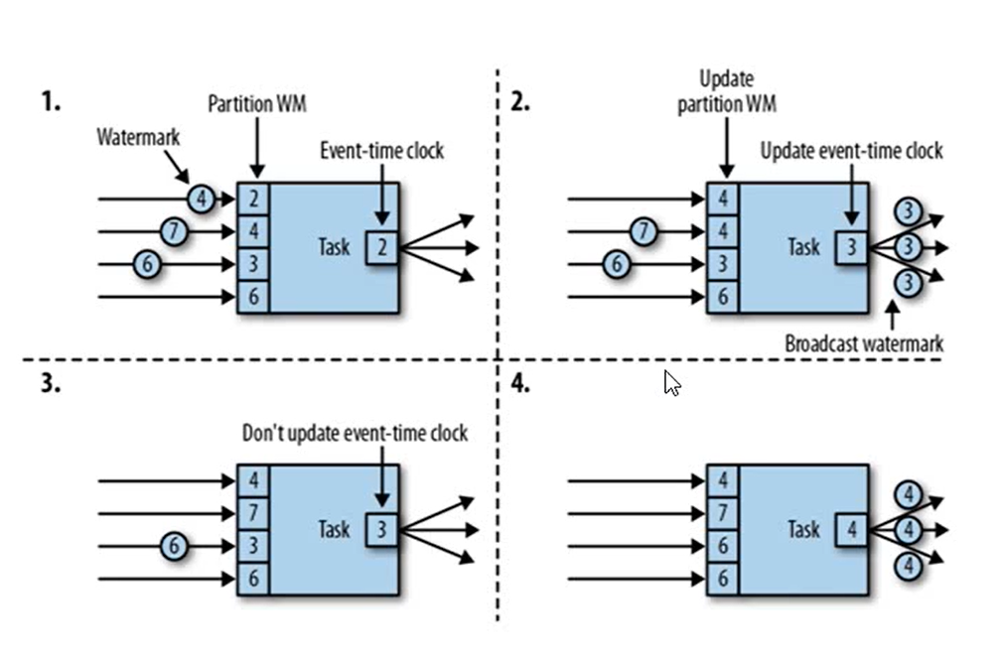

# 基础

## Dataflow

Dataflow程序描述了数据如何在不同操作之间流动。Dataflow程序通常为有向图。图中顶点称为算子，表示计算；边表示数据依赖关系。

### 数据交换策略

- 转发策略（forward strategy）：在发送端和接收端任务之间一对一的进行数据传输。如果两端任务运行在同一物理机器上（通常由任务调度器决定），该交换策略可以避免网络通信
- 广播策略（broadcast strategy）：把每隔数据项发往下游算子的全部并行任务。该策略会把数据复制多份并且涉及网络通信，因此代价十分昂贵
- 基于键值的策略（key-based strategy）：根据某一键值属性对数据分区，保证键值相同的数据会交由同一任务处理。
- 随即策略（random strategy）：会将数据均匀分配至算子的所有任务，以实现计算任务的负载均衡

# Flink编程模型

## Flink编程接口

Flink根据数据集类型的不同将核心数据接口分为两大类，一类是支持批计算的接口DateSet API，另外一类是支持流计算的接口DataStream API。同时Flink将数据处理接口抽象成四层，由上向下分别为SQL API、Table API、DateStream/DataSet API以及Stateful Stream Processing API，用户可以根据需要选择任意一层抽象接口来开发Flink应用。

SQL API完成对批计算和流计算的处理，当前正在完善中，SQL语言学习成本低，能够让数据分析人员和开发人员更快速上手。

Table API将内存中的DataStream和DateSet数据集在原有的基础之上增加Schema信息，将数据类型统一抽象成表结构，然后通过Table API提供的接口处理对应的数据集。SQL API可以直接查询Table API中注册表中的数据表。Table API构建在DataStream和DataSet之上的同时，提供了大量面向领域语言的接口编程，例如GroupByKey、Join等操作符。除此之外，Table API在转换为DataStream和DataSet的数据处理过程中，也应用了大量的优化规则对处理逻辑进行了优化。同时Table API中的Table可以和DataStream及DataSet之间进行相互转换。

DataStream API和DataSet API主要面向具有开发经验的用户，用户可以使用DataStream API处理无界数据流，使用DataSet API处理批量数据。DataStream API和DataSet API同时提供了各种数据处理接口，例如map、filter、oins、aggregations、window等方法，同时没有接口都支持了Java、Scala和Python等多种开发语言的SDK。

Stateful Stream API是Flink中处理Stateful Stream最底层的接口，用户可以使用Stateful Stream Process接口操作状态、时间等底层数据。使用Stream Process API接口开发应用的灵活性非常强，可以实现复杂的流式计算逻辑，但是相对用户使用成本也比较高，一般企业在使用Flink进行二次开发或深度封装的时候会用到这层接口。

## Flink程序结构

整个Flink程序一共分为5步，分别为：设定Flink执行环境、创建和加载数据集、对数据集指定转换操作逻辑、指定计算结果输出位置、调用execute方法出发程序执行。

### 初始化数据

ExecutionEnvironment提供不同的数据接入接口完成数据的初始化，将外部数据转换成`DataStream<T>`或`DataSet<T>`数据集。Flink中提供了多种从外部读取数据的连接器，包括批量和实时的数据连接器，能够将Flink系统和其他第三方系统连接，直接获取外部数据。

### 执行转换操作

数据从外部系统读取并转换成DataStream或DataSet数据集后，下一步就将数据集进行各种转换操作。Flink中的Transformation操作都是通过不同的Operator来实现的，每个Operator内部通过实现Function接口完成数据处理逻辑的定义。在DataStream API和DataSet API提供了大量的转换算子，例如map、flatMap、filter、keyBy等，用户只需要定义每种算子执行的函数逻辑，然后应用在数据转换操作Operator接口中即可。

### 分区key指定

在DataStream数据经过不同的算子转换过程中，某些算子需要根据指定的key进行转换，常见的有join、coGroup、groupBy类算子，需要先将DataStream或DataSet数据集转换成对应的KeyedStream和GroupedDataSet，主要目的是将相同key值的数据路由到相同的Pipeline中，然后进行下一步的计算操作。在Flink中这种操作并不是真正意义上将数据集转换成Key-Value结构，而是一种虚拟Key，目的仅仅是帮助后面的基于Key的算子使用，分区Key可以通过两种方式指定。

#### 根据字段位置指定

在DataStream API中通过`keyBy()`方法将DataStream数据集根据指定的key转换成重新分区的KeyedStream

```scala
val dataStream:DataStream[(String,Int)]=env.fromElements(("a",1),("c",2))
//根据第一个字段重新分区，然后对第二个字段进行求和运算
Val result=dataStream.keyBy(0).sum(1)
```

在DataSet API中，如果对数据根据某一条件聚合数据，对数据进行聚合时候，也需要对数据进行重新分区。如以下代码所示，使用DataSet API对数据集根据第一个字段作为GroupBy的key，然后对第二个字段进行求和运算。

```scala
val dataSet=env.fromElements(("hello",1),("flink",3))
//根据第一个字段进行数据重分区
val groupedDataSet:GroupedDataSet[(String,Int)]=dataSet.groupBy(0)
//求取相同key值下第二个字段的最大值
groupedDataSet.max(1)
```

#### 根据字段名称指定

KeyBy和GroupBy的key除了能够通过字段位置来指定之外，也可以根据字段的名称来指定。使用字段名需要DataStream中的数据结构类型必须是Tuple类或者POJOs类。

```scala
val personDataSet=env.fromElements(newPersion("Alex",18),newPersion("Peter",43))
//指定name字段名称来确定groupby字段
personDataSet.groupBy("name").max(1)

//如果程序中使用Tuple数据类型，通常情况下字段名称从1开始计算，字段位置索引从0开始计算
val personDataStream=env.fromElements(("Alex",18),("Peter",43))
//通过名称指定第一个字段名称
personDataStream.keyBy("_1")
//通过位置指定第一个字段
personDataStream.keyBy(0)
```

如果在Flink中使用嵌套的负载数据结构，可以通过字段名称指定key，

```scala
class CompelexClass(var nested:NestedClass,var tag:String){
  defthis(){this(null,"")}
}
class NestedClass(var id:Int,
                  tuple:(Long,Long,String)){
  defthis(){this(0,(0,0,""))}
}
```

通过调用nested获取整个NestedClass对象里所有的字段，调用tag获取CompelexClass中tag字段，调用nested.id获取NestedClass中的id字段，调用nested.tuple._1获取NestedClass中的tuple元祖的第一个字段。由此可以看出，Flink能够支持在复杂数据结构中灵活的获取字段信息，这也是非key-value的数据结构所具有的优势。

#### 通过key选择器指定

定义KeySelector，然后复写getKey方法，从Person对象中获取name为指定key

```scala
case class Person(name:String,age:Int)
val person=env.fromElements(Person("hello",1),Person("flink",4))
//定义KeySelector,实现getKey方法从caseclass中获取Key
val keyed:KeyedStream[WC]=person.keyBy(new KeySelector[Person,String](){
  override def getKey(person:Person):String=person.word
})
```

### 输出结果

数据集经过转换操作之后，形成最终的结果数据集，在DataStream和DataSet接口中定义了基本的数据输出方法，`writeAsText()`输出到文件，`print()`输出到控制台，同时Flink中定义了大量的Connector，方便用户和外部系统交互，用户可以直接通过调用`addSink()`添加输出系统定义的DataSink类算子，这样就能将数据输出到外部系统。

### 程序触发

所有的计算逻辑全部操作定义好之后，需要调用ExecutionEnvironment的`execution()`方法来触发应用程序的执行，其中`execution()`方法返回的结果类型为JobExecutionResult，里面包含了程序执行的时间和累加器等指标。需要注意的是，execute方法调用会因为应用的类型有所不同，DataStream流式应用需要显性地指定execute方法运行程序，如果不调用则Flink流式程序不会执行，但对于DataSet API输出算子中已经包含对execute方法的调用，则不需要显性调用execute方法，否则会出现程序异常。

## Flink数据类型

### 数据类型支持

Flink支持非常完善的数据类型，数据类型的描述信息都是由TypeInformation定义，比较常用的TypeInformation有BasicTypeInfo、TupleTypeInfo、CaseClassTypeInfo、PojoTypeInfo类等。TypeInformation主要作用好似为了在Flink系统内有效的对数据结构类型进行管理，能够在分布式计算过程中对数据的类型进行管理和推断。同时基于对数据的类型信息管理，Flink内部对数据存储也进行了相应的性能优化。Flink能够支持任意的Java或Scala数据类型，另外使用TypeInformation管理数据类型信息，能够在数据处理之前将数据类型推断出来，而不是真正在出发计算后才识别出来，这样能够及时有效地避免用户在使用Flink编写应用的过程中的数据类型问题。

#### 原生数据类型

Flink通过实现BasicTypeInfo数据类型，能够支持任意Java原生基本类型（装箱）或String类型，例如Integer、String、Double等，如以下代码所示，通过从给定的元素集中创建DataStream数据集。

```scala
//创建Int类型的数据集
val intStream:DataStream[Int]=env.fromElements(3,1,2,1,5)
//创建String类型的数据集
val dataStream:DataStream[String]=env.fromElements("hello","flink")
```

Flink实现另外一种TypeInfomation是BasicArrayTypeInfo，对应的是Java基本类型数组（装箱）或String对象的数组，如下代码通过使用Array数组和List集合创建DataStream数据集。

```scala
//通过从数组中创建数据集
val dataStream:DataStream[Int]=env.fromCollection(Array(3,1,2,1,5))
//通过List集合创建数据集
val dataStream:DataStream[Int]=env.fromCollection(List(3,1,2,1,5))
```

#### Java Tuples类型

通过定义TupleTypeInfo来描述Tuple类型数据，Flink在Java接口中定义了元祖类（Tuple）供用户使用。Flink Tuples是固定长度固定类型的Java Tuple实现，不支持空值存储。目前支持任意的Flink Java Tuple类型字段数量上限为25，如果字段数量超过上限，可以童工继承Tuple类的方式进行拓展。

```scala
//通过实例化Tuple2创建具有两个元素的数据集
val tupleStream2:DataStream[Tuple2[String,Int]]=env.fromElements(newTuple2("a",1),newTuple2("c",2))
```

#### Scala Case Class类型

Flink通过实现CaseClassTypeInfo支持任意的Scala Case Class，包括Scala Tuples类型，支持的字段数量上限为22，支持通过字段名称和位置索引获取指标，不支持存储空值。如下代码实例所示，定义WordCount Case Class数据类型，然后通过fromElements方法创建input数据集，调用keyBy()方法对数据集根据word字段重新分区。

```scala
//定义WordCountCaseClass数据结构
case class WordCount(word:String,count:Int)
//通过fromElements方法创建数据集
val input=env.fromElements(WordCount("hello",1),WordCount("world",2))
val keyStream1=input.keyBy("word")//根据word字段为分区字段，
val keyStream2=input.keyBy(0)//也可以通过指定position分区
```

通过使用Scala Tuple创建DataStream数据集，其他的使用方式和Case Class相似。需要注意的是，如果根据名称获取字段，可以使用Tuple中的默认字段名称

```scala
//通过scalaTuple创建具有两个元素的数据集
val tupleStream:DataStream[Tuple2[String,Int]]=env.fromElements(("a",1),("c",2))
//使用默认字段名称获取字段，其中_1表示tuple这种第一个字段
tupleStream.keyBy("_1")
```

#### POJOs类型

POJOs类可以完成复杂数据结构的定义，Flink通过实现PojoTypeInfo来描述任意的POJOs，包括Java和Scala类。在Flink中使用POJOs类可以通过字段名称来获取字段，如果在Flink中使用POJOs数据类型，需要遵循以下要求：

·POJOs类必须是Public修饰且必须独立定义，不能是内部类；

·POJOs类中必须含有默认空构造器；

·POJOs类中所有的Fields必须是Public或者具有Public修饰的getter和setter方法；

·POJOs类中的字段类型必须是Flink支持的。

```java
//定义JavaPerson类，具有public修饰符
public class Person{
//字段具有public修饰符
public String name;
public int age;
//具有默认空构造器
public Person(){
}
public Person(Stringname,intage){
  this.name=name;this.age=age;
}
}

val persionStream=env.fromElements(newPerson("Peter",14),newPerson("Linda",25))
  //通过Person.name来指定Keyby字段
  persionStream.keyBy("name")
  //ScalaPOJOs数据结构定义如下，使用方式与JavaPOJOs相同。
  class Person(varname:String,varage:Int){
    //默认空构造器
    defthis(){this(null,1)}
  }
```

#### Flink Value类型

Value数据类型实现了org.apache.flink.types.Value，其中包括read()和write()两个方法完成序列化和反序列化操作，相对于通用的序列化工具会有着比较高效的性能。目前Flink提供了內建的Value类型有IntValue、DoubleValue以及StringValue等，用户可以结合原生数据类型和Value类型使用。

#### 特殊数据类型

在Flink中也支持一些比较特殊的数据数据类型，例如Scala中的List、Map、Either、Option、Try数据类型，以及Java中Either数据类型，还有Hadoop的Writable数据类型。如下代码所示，创建Map和List类型数据集。这种数据类型使用场景不是特别广泛，主要原因是数据中的操作相对不像POJOs类那样方便和透明，用户无法根据字段位置或者名称获取字段信息，同时要借助TypesHint帮助Flink推断数据类型信息，关于TyepsHmt介绍可以参考下一小节。

# DataStream API的介绍与使用

## DataStream编程模型

DataStream API主要可以分为三个部分，DataSource模块、Transformation模块以及DataSink模块，DataSource模块主要定义了数据接入功能，主要是将各种外部数据接入至Flink系统中，并将接入数据转换成对应的DataStream数据集。在Transformation模块定义了对DataSource数据集的各种转换操作，例如进行map、filter、windows等操作。最后，将结果数据通过DataSink模块写出到外部存储介质中，例如将数据输出到文件或Kafka消息中间件等。

### DataSource

程序的数据源输入，可以通过StreamExecutionEnvironment.addSource(sourceFunction)为程序添加一个数据源。

Flink针对DataStream提供了大量的已经实现的DataSource接口，比如下面4种：

1. 基于文件：`readTextFile(path)`
2. 基于Socket：`socketTextStream()`
3. 基于集合：`fromCollection(Collection)`
4. 自定义输入：`addSource`可以实现读取第三方数据源的数据

Flink提供了一部分常用第三方数据源的connector，也可以自己定义第三方数据源，有两种方式实现：

- 通过实现`SourceFunction`接口来自定义无并行度的数据源
- 通过实现`ParallelSourceFunction`接口或这继承`RichParallelSourceFunction`来自定义有并行度的数据源

### Transformation

具体的操作，它对一个或多个输入数据源进行计算处理，比如Map、FlatMap和Filter等

Flink针对DataStream提供了大量的已经实现的算子：

- Map：输入一个元素，然后返回一个元素，中间可以进行清洗转换等操作
- FlatMap：输入一个元素，可以返回零个、一个或者多个元素
- Filter：过滤函数，对传入的数据进行判断，符合条件的数据会被留下
- KeyBy：根据指定的Key进行分组，Key相同的数据会进入同一个分区。
- Reduce：对数据进行聚合操作，结合当前元素和上一次Reduce返回的值进行聚合操作，然后返回一个新的值
- Aggregations：sum(),min(),max()等
- Union：合并多个流，新的流包含所有流中的数据，但是Union有一个限制，就是所有合并的流的类型必须是一致的
- Connect：和Union类似，但是只能连接两个流，两个流的数据类型可以不同，会对两个流中的数据应用不同的处理方法
- coMap和coFlatMap：在ConnectedStream中需要使用这种函数，类似于Map和FlatMap
- Split：根据规则把一个数据流切分为多个流
- Select：和Split配合使用，选择切分后的流

另外，Flink针对DataStream提供了一些数据分区规则，具体如下：

- Random partitioning：随机分区：`DataStream.shuffle()`

- Rebalancing：对数据集进行再平衡、重分区和消除数据倾斜：`DataStream.rebalance()`

- Rescaling：重新调节：`DataStream.rescale()`

  >如果上游有2个并发，而下游操作有4个并发，那么上游的一个并发结果分配给下游的2个并发操作。另一方面，下游2个并发操作而上游有4个并发操作，那么上游的其中2个操作的结果分配了给下游的一个并发操作。
  >
  >Rescaling与Rebalancing的区别为Rebalancing会产生全量分区，而Rescaling不会。

- Custom partitioning：自定义分区

  > 自定义分区实现Partitioner接口的方法如下：`DataStream.partitionCustom(partitioner, "someKey")`或者`DataStream.partitionCustom(partitioner, 0)`

### Sink

程序的输出，它可以把Transformation处理之后的数据输出到指定存储介质中

Flink针对DataStream提供了大量的已经实现的数据目的地，具体如下：

- writeAsText()：将元素以字符串形式逐行写入，这些字符串通过调用每个元素的toString()方法来获取

- print()/printToErr()：打印每个元素的toString()方法的值到标准输出或者标准错误输出流中

- 自定义输出：addSink()可以实现把数据输出到第三方存储介质中

  > 自定义Sink有两种实现方式：
  >
  > - 实现SinkFunction接口
  > - 继承RichSinkFunction类

## 时间概念与Watermark

Flink根据时间产生的位子不同，将时间区分为三种时间概念，分别为事件生成时间（Event Time）、事件接入时间（Ingestion Time）和事件处理时间（Processing Time）。数据从终端产生，或者从系统中产生的过程中生成的时间为事件生成时间，当数据经过消息中间件传入到Flink系统中，在DataSource中接入的时候会产生事件接入时间，当数据在Flink系统中通过各个算子实例执行转换操作的过程中，算子实例所在系统的时间为数据处理时间。用户能够根据需要选择时间类型作为对流式数据的依据，这种情况极大地增强了对事件数据处理的灵活性和准确性。

### 时间概念指定

在Flink中默认情况下使用的是Process Time时间概念，如果用户选择使用Event Time或者Ingestion Time概念，则需要在创建的StreamExectionEnvironment中调用setStream-TimeCharacteristic()方法设定系统的时间概念，如下代码使用TimeCharacteristic.EventTime作为系统的时间概念，这样对当前的StreamExecutionEnvironment会全局生效。对应的，如果使用IngestionTime概念，则通过传入TimeCharacteristic.IngestionTime参数指定。

```scala
val env=StreamExecutionEnvironment.getExecutionEnvironment()
//在系统中指定EventTime概念
env.setStreamTimeCharacteristic(TimeCharacteristic.EventTime);
```

### EventTime和Watermark

通常情况下，由于网络或系统等外部因素影响，事件数据往往不能及时传输至Flink系统中，导致数据乱序到达或者延迟到达等问题，因此，需要有一种机制能够控制数据处理的过程和进度，比如基于事件时间的Window创建后，具体该如何确定属于该Window的数据元素已经全部到达。如果确定全部到达，就可以对Window的所有数据做窗口计算操作（如汇总、分组等），如果数据没有全部到达，则继续等待该窗口中的数据全部到达才开始处理。这种情况下就需要用到水位线（WaterMarks）机制，它能够衡量数据处理进度（表达数据到达的完整性），保证事件数据（全部）到达Flink系统，或者在乱序及延迟到达时，也能够像预期一样计算出正确并且连续的结果。Flink会将用读取进入系统的最新事件时间减去固定的时间间隔作为Watermark，该时间间隔为用户外部配置的支持最大延迟到达的时间长度，也就是说理论上认为不会有事件超过该间隔到达，否则就认为是迟到事件或异常事件。

简单来讲，当事件接入到Flink系统时，会在SourcesOperator中根据当前最新事件时间产生Watermarks时间戳，记为X，进入到Flink系统中的数据事件时间，记为Y，如果Y<X，这条时间为Y的数据不会出发相应的逻辑计算，同时Window的EndTime大于Watermark，则触发窗口计算结果并输出。从另一个角度讲，如果想触发对Window内的数据元素的计算，就必须保证对所有进入到窗口的数据元素满足其事件时间Y>=X，否则窗口会继续等待Watermark大于窗口结束时间的条件满足。可以看出当有了Watermarks机制后，对基于事件时间的流数据处理会变得特别灵活，可以有效地处理乱序事件的问题，保证数据在流式统计中的结果的正确性。

#### 指定Timestamps与生成Watermarks

如果使用Event Time时间概念处理流式数据，除了在StreamExecationEvironment中指定TimeCharacteristic外，还需要在Flink程序中指定Event Time时间戳在数据中的字段信息，在Flink程序运行过程中会通过指定字段抽取出对应的事件时间，该过程叫做Timestamps Assigning。简单来讲，就是告诉系统需要用那个字段作为事件时间的数据来源。另外Timestamps指定完毕后，下面就需要制定创建相应的Watermarks，需要用户定义根据Timestamps计算出Watermarks的生成策略。

目前Flink支持两种方式指定Timestamps和生成Watermarks，一种方式在DataStream Source算子接口的Source Function中定义，另外一种方式是通过自定义Timestamps Assigner和Watermarks Generator生成。

#### 水位线计算

```
watermark = 进入Flink窗口的额最大的事件时间（maxEventTime） - 指定的延迟时间
```

当watermark时间戳大于等于窗口结束时间时，意味着窗口结束，需要触发窗口计算（此时认为所有数据都已经到了）。

#### Watermark设定方案

用户自定义的时间戳分配函数通常都会尽可能地靠近数据源算子，因为在经过其他算子处理后，记录顺序和他们的时间戳会变得难以推断。这也是为什么不建议在流式应用中途覆盖已有时间戳和水位线。

##### 定点水位线（Punctuated Watermark）

通过数据流中某些特殊标记事件来触发新水位线的生成。这种方式下窗口的触发与时间无关，而是决定于何时收到标记事件。通过`AssignerWithPunctuatedWatermarks`设置

在实际生产中TPS很高的的场景下会产生大量的watermark在一定程度上对下游算子造成压力，所以只有在实时性要求非常高的场景下才会使用这个

##### 定期水位线（Periodic Watermark）

周期性的（允许一定时间间隔或者到达一定的记录条数）产生一个Watermark。水位线提升的时间间隔是由用户设置的，在两次水位线提升期间内会有一部分数据流入，用户可以根据这部分数据来计算出新的水位线。`AssignerWithPeriodicWatermarks`。在实际的生产中Periodic的方式必须结合时间和积累条数两个维度继续周期性产生Watermark，否则在极端情况下会有很大的延时。举个例子，最简单的水位线算法就是取目前为止最大的事件时间，然而这种方式比较暴力，对乱序事件的容忍程度比较低，容易出现大量迟到事件。

#### 水位线传播

任务内部的时间服务（time service）会维护一些计时器（timer），他们依靠接收到水位线来激活。这些计时器是由任务在时间服务内注册，并在将来的某个时间点执行计算。例如：窗口算子会为每个活动窗口注册一个计时器，他们会在事件时间超过窗口的结束时间清理窗口状态。



1. **对于上游中的每个并行子任务，每个并行度中的watermark都会以广播的形式发送给下游的所有并行度。注意watermark作为一种特殊的记录，是没有key的，只能广播给下游所有子任务。**
2. 下游接收到上游所有子任务发送过来的watermark后，选择最小的作为本并行任务的watermark，并将其广播给下游。

### 迟到事件

虽说水位线表明着早于它的事件不应该再出现，但是上如上文所讲，接收到水位线以前的的消息是不可避免的，这就是所谓的迟到事件。实际上迟到事件是乱序事件的特例，和一般乱序事件不同的是它们的乱序程度超出了水位线的预计，导致窗口在它们到达之前已经关闭。

迟到事件出现时窗口已经关闭并产出了计算结果，因此处理的方法有3种：

- 重新激活已经关闭的窗口并重新计算以修正结果。
- 将迟到事件收集起来另外处理。
- 将迟到事件视为错误消息并丢弃。

Flink 默认的处理方式是第3种直接丢弃，其他两种方式分别使用`Side Output`和`Allowed Lateness`。

`Side Output`机制可以将迟到事件单独放入一个数据流分支，这会作为 window 计算结果的副产品，以便用户获取并对其进行特殊处理。

`Allowed Lateness`机制允许用户设置一个允许的最大迟到时长。Flink 会在窗口关闭后一直保存窗口的状态直至超过允许迟到时长，这期间的迟到事件不会被丢弃，而是默认会触发窗口重新计算。因为保存窗口状态需要额外内存，并且如果窗口计算使用了 `ProcessWindowFunction` API 还可能使得每个迟到事件触发一次窗口的全量计算，代价比较大，所以允许迟到时长不宜设得太长，迟到事件也不宜过多，否则应该考虑降低水位线提高的速度或者调整算法。


## Windows窗口计算

通过按照固定时间或长度将数据流切分成不同的窗口，然后对数据进行相应的聚合运算，从而得到一定时间范围内的统计结果。

Flink DataStream API将窗口抽象成独立的Operator，且在Flink DataStream API中已经内建了大多数窗口算子。如下代码展示了如何定义KeyedWindows算子，在每个窗口算子中包含了Windows Assigner、Windows Trigger（窗口触发器）、Evictor（数据剔除器）、Lateness（时延设定）、Output Tag（输出标签）以及Windows Funciton等组成部分，其中Windows Assigner和Windows Funciton是所有窗口算子必须指定的属性，其余的属性都是根据实际情况选择指定。

```scala
stream. keyBy(...) // 是 Keyed 类型 数据 集
.window(...) //指定 窗口 分配器 类型 
[.trigger(...)] //指定 触发器 类型（ 可选） 
[.evictor(...)] //指定 evictor 或者 不 指定（ 可选） 
[.allowedLateness(...)] //指定 是否 延迟 处理 数据（ 可选） [.sideOutputLateData(...)] //指定 Output Lag（ 可选）
.reduce/ aggregate/ fold/ apply() //指定 窗口 计算 函数 
[.getSideOutput(...)] //根据 Tag 输出 数据（ 可选）
```

- Windows Assigner：指定窗口的类型，定义如何将数据流分配到一个或多个窗口
- Windows Trigger：指定窗口触发的时机，定义窗口满足什么样的条件触发计算
- Evictor：用于数据剔除
- Lateness：标记是否处理迟到数据
- Output Tag：标记输出标签，然后在通过getSideOutput将窗口中的数据根据标签输出
- Windows Funciton：定义窗口上数据处理的罗技，例如对数据进行sum操作

### Windows Assigner

#### Keyed和Non-Keyed窗口

在运用窗口计算时，Flink根据上游数据集是否为KeyedStream类型（将数据集按照Key分区），对应的Windows Assigner也会有所不同。上游数据集如果是KeyedStream类型，则调用DataStream API的window()方法指定Windows Assigner，数据会根据Key在不同的Task实例中并行分别计算，最后得出针对每个Key统计的结果。如果是Non-Keyed类型，则调用WindowsAll()方法来指定Windows Assigner，所有的数据都会在窗口算子中路由到一个Task中计算，并得到全局统计结果。

#### Windows Assigner

Flink支持两种类型的窗口，一种是基于时间的窗口，窗口基于起始时间戳（闭区间）和终止时间戳（开区间）来决定窗口的大小，数据根据时间戳被分配到不同的窗口中完成计算。Flink使用TimeWindow类来获取窗口的起始时间和终止时间，以及该窗口允许进入的最新时间戳信息等元数据。另一种是基于数量的窗口，根据固定的数量定义窗口的大小，例如每5000条数据形成一个窗口，窗口中接入的数据依赖于数据接入到算子中的顺序，如果数据出现乱序情况，将导致窗口的计算结果不确定。

在Flink流式计算中，通过Windows Assigner将接入数据分配到不同的窗口，根据Windows Assigner数据分配方式的不同将Windows分为4大类，分别是**滚动窗口**(Tumbling Windows)、**滑动窗口**（Sliding Windows）、**会话窗口**（Session Windows）和**全局窗口**（Global Windows）。并且这些Windows Assigner已经在Flink中实现，用户调用DataStream API的windows或windowsAll方法来指定Windows Assigner即可。

##### 滚动窗口

滚动窗口是根据固定时间或大小进行切分，且窗口和窗口之间的元素互不重叠。重叠。这种类型的窗口的最大特点是比较简单，但可能会导致某些有前后关系的数据计算结果不正确，而对于按照固定大小和周期统计某一指标的这种类型的窗口计算就比较适合，同时实现起来也比较方便。

DataStream API中提供了基于Event Time和Process Time两种时间类型的Tumbling窗口，对应的Assigner分别为TumblingEventTimeWindows和TumblingProcessTimeWindows。调用DataStream API的Window方法来指定相应的Assigner，并使用每种Assigner的of()方法来定义窗口的大小，其中时间单位可以是Time.milliseconds(x)、Time.seconds(x)或Time.minutes(x)，也可以是不同时间单位的组合。

默认窗口时间的时区是UTC-0，因此UTC-0以外的其他地区均需要通过设定时间偏移量调整时区，在国内需要指定Time.hours（-8）的偏移量。

##### 滑动窗口

滑动窗口也是一种比较常见的窗口类型，其特点是在滚动窗口基础之上增加了窗口滑动时间（Slide Time），且允许窗口数据发生重叠。如图4-12所示，当Windows size固定之后，窗口并不像滚动窗口按照Windows Size向前移动，而是根据设定的Slide Time向前滑动。窗口之间的数据重叠大小根据Windows size和Slide time决定，当Slide time小于Windows size便会发生窗口重叠，Slide size大于Windows size就会出现窗口不连续，数据可能不能在任何一个窗口内计算，Slide size和Windows size相等时，Sliding Windows其实就是Tumbling Windows。滑动窗口能够帮助用户根据设定的统计频率计算指定窗口大小的统计指标，例如每隔30s统计最近10min内活跃用户数等。

DataStream API针对Sliding Windows也提供了不同时间类型的Assigner，其中包括基于Event Time的SlidingEventTimeWindows和基于Process Time的SlidingProcessingTime-Windows。

##### 会话窗口

会话窗口（Session Windows）主要是将某段时间内活跃度较高的数据聚合成一个窗口进行计算，窗口的触发的条件是Session Gap，是指在规定的时间内如果没有数据活跃接入，则认为窗口结束，然后触发窗口计算结果。需要注意的是如果数据一直不间断地进入窗口，也会导致窗口始终不触发的情况。与滑动窗口、滚动窗口不同的是，Session Windows不需要有固定windows size和slide time，只需要定义session gap，来规定不活跃数据的时间上限即可。

DataStream API中可以创建基于Event Time和Process Time的Session Windows，对应的Assigner分别为EventTimeSessionWindows和ProcessTimeSessionWindows，在创建Session Windows的过程中，除了调用withGap方法输入固定的Session Gap，Flink也能支持动态的调整Session Gap。如代码清单4-12所示，只需要实现SessionWindowTimeGapExtractor接口，并复写extract方法，完成动态Session Gap的抽取，然后将创建好的Session Gap抽取器传入ProcessingTimeSessionWindows.withDynamicGap()方法中即可。

##### 全局窗口

全局窗口（Global Windows）将所有相同的key的数据分配到单个窗口中计算结果，窗口没有起始和结束时间，窗口需要借助于Triger来触发计算，如果不对Global Windows指定Triger，窗口是不会触发计算的。因此，使用Global Windows需要非常慎重，用户需要非常明确自己在整个窗口中统计出的结果是什么，并指定对应的触发器，同时还需要有指定相应的数据清理机制，否则数据将一直留在内存中。

#### Windows Function

定义窗口内数据的计算逻辑。Flink中提供了四种类型的Windows Function，分别为ReduceFunction、AggregateFunction、FoldFunction以及ProcessWindowFunction。

四种类型的Window Fucntion按照计算原理的不同可以分为两大类，一类是增量聚合函数，对应有ReduceFunction、AggregateFunction和FoldFunction；另一类是全量窗口函数，对应有ProcessWindowFunction。增量聚合函数计算性能较高，占用存储空间少，主要因为基于中间状态的计算结果，窗口中只维护中间结果状态值，不需要缓存原始数据。而全量窗口函数使用的代价相对较高，性能比较弱，主要因为此时算子需要对所有属于该窗口的接入数据进行缓存，然后等到窗口触发的时候，对所有的原始数据进行汇总计算。如果接入数据量比较大或窗口时间比较长，就比较有可能导致计算性能的下降。

##### ReduceFunction

ReduceFunction定义了对输入的两个相同类型的数据元素按照指定的计算方法进行聚合的逻辑，然后输出类型相同的一个结果元素。创建好Window Assigner之后通过在reduce()方法中指定ReduceFunciton逻辑，可以使用Scala lambada表达式定义计算逻辑。

```scala
val inputStream: DataStream[( Int, Long)] = ...; 
val reduceWindowStream = inputStream .keyBy(_._ 0) 
//指定 窗口 类型 
.window( SlidingEventTimeWindows. of( Time. hours( 1), Time. minutes( 10))) 
//指定 聚合 函数 逻辑， 将 根据 ID 将 第二个 字段 求和 
.reduce { (v1, v2) => (v1._ 1, v1._ 2 + v2._ 2) }
```

除了可以直接使用表达式的方式对ReduceFunction逻辑进行定义，也可以创建Class实现ReduceFunction接口来定义聚合逻辑，

```scala
val reduceWindowStream = inputStream .keyBy(_._ 1) 
//指定 窗口 类型 
.window( SlidingEventTimeWindows. of( Time. hours( 1), Time. minutes( 10))) 
//定义 ReduceFunction 实现 类 定义 聚合 函数 逻辑， 将 根据 ID 将 第二个 字段 求和 
.reduce( new ReduceFunction[( Int, Long)] { override def reduce( t1: (Int, Long), t2: (Int, Long)): (Int, Long) = { (t1._ 1, t1._ 2 + t2._ 2) }})
```

##### AggregateFunction

和ReduceFunction相似，AggregateFunction也是基于中间状态计算结果的增量计算函数，但AggregateFunction在窗口计算上更加通用。AggregateFunction接口相对ReduceFunction更加灵活，实现复杂度也相对较高。AggregateFunction接口中定义了三个需要复写的方法，其中add()定义数据的添加逻辑，getResult定义了根据accumulator计算结果的逻辑，merge方法定义合并accumulator的逻辑。

```scala
//定义 求取 平均值 的 AggregateFunction 
class MyAverageAggregate extends AggregateFunction[( String, Long), (Long, Long), Double] { 
    //定义 createAccumulator 为 两个 参数 的 元祖 
    override def createAccumulator() = (0L, 0L) 
    //定义 输入 数据 累加 到 accumulator 的 逻辑 
    override def add( input: (String, Long), acc: (Long, Long)) = (acc._ 1 + input._ 2, acc._ 2 + 1L) 
    //根据 累加器 得出 结果 
    override def getResult( acc: (Long, Long)) = acc._ 1 / acc._ 2 
    //定义 累加器 合并 的 逻辑 
    override def merge( acc1: (Long, Long), acc2: (Long, Long)) = (acc1._ 1 + acc2._ 1, acc1._ 2 + acc2._ 2) } 
//在 DataStream API 使用 定义 好的 AggregateFunction 
val inputStream: DataStream[( String, Long)] = ... 
val aggregateWindowStream = inputStream .keyBy(_._ 1) 
//指定 窗口 类型 
.window( SlidingEventTimeWindows. of( Time. hours( 1), Time. minutes( 10))) 
//指定 聚合 函数 逻辑， 将 根据 ID 将 第二个 字段 求 平均值 
.aggregate( new MyAverageAggregate)
```

##### FoldFunction

FoldFunction定义了如何将窗口中的输入元素与外部的元素合并的逻辑，如代码清单4-17所示将“flink”字符串添加到inputStream数据集中所有元素第二个字段上，并将结果输出到下游DataStream中。

```scala
val inputStream: DataStream[( String, Long)] = ...; 
val foldWindowStream = inputStream .keyBy(_._ 1) 
//指定 窗口 类型 
.window( SlidingEventTimeWindows. of( Time. hours( 1), Time. minutes( 10))) 
//指定 聚合 函数 逻辑， 将 flink 字符串 和 每个 元祖 中 第二个 字段 相连 并 输出 
.fold(" flink") { (acc, v) => acc + v._ 2 }
```

##### ProcessWindowFunction

ProcessWindowsFunction能够更加灵活地支持基于窗口全部数据元素的结果计算，例如统计窗口数据元素中某一字段的中位数和众数。在Flink中ProcessWindowsFunction抽象类定义如代码清单4-18所示，在类中的Context抽象类完整地定义了Window的元数据以及可以操作Window的状态数据，包括GlobalState以及WindowState。

```scala
public abstract class ProcessWindowFunction< IN, OUT, KEY, W extends Window> extends AbstractRichFunction { 
    //评估 窗口 并且 定义 窗口 输出 的 元素 
    void process( KEY key, Context ctx, Iterable< IN> vals, Collector< OUT> out) throws Exception; 
    //定义 清除 每个 窗口 计算 结束 后 中间 状态 的 逻辑 
    public void clear( Context ctx) throws Exception {} 
    //定义 包含 窗口 元 数据 的 上下文 
    public abstract class Context implements Serializable { 
        //返回 窗口 的 元 数据 
        public abstract W window(); 
        //返回 窗口 当前 的 处理 时间 
        public abstract long currentProcessingTime(); 
        //返回 窗口 当前 的 event- time 的 Watermark 
        public abstract long currentWatermark(); 
        //返回 每个 窗口 的 中间 状态 
        public abstract KeyedStateStore windowState(); 
        //返回 每个 Key 对应 的 中间 状态 
        public abstract KeyedStateStore globalState(); 
        //根据 OutputTag 输出 数据 
        public abstract < X> void output( OutputTag< X> outputTag, X value); } }
```

##### IncrementalAggregation和ProcessWindowsFunction整合

##### ProcessWindowFunction状态操作

除了能够通过RichFunction操作keyedState之外，ProcessWindowFunction也可以操作基于窗口之上的状态数据，这类状态被称为PerwindowState。

### Trigger窗口触发器

数据接入窗口后，窗口是否触发WindowFunciton计算，取决于窗口是否满足触发条件，每种类型的窗口都有对应的窗口触发机制，保障每一次接入窗口的数据都能够按照规定的触发逻辑进行统计计算。Flink在内部定义了窗口触发器来控制窗口的触发机制，分别有EventTimeTrigger、ProcessTimeTrigger以及CountTrigger等。每种触发器都对应于不同的WindowAssigner，例如EventTime类型的Windows对应的触发器是EventTimeTrigger，其基本原理是判断当前的Watermark是否超过窗口的EndTime，如果超过则触发对窗口内数据的计算，反之不触发计算。

- EventTimeTrigger：通过对比Watermark和窗口EndTime确定是否触发窗口，如果Watermark的时间大于WindowsEndTime则触发计算，否则窗口继续等待；
- ProcessTimeTrigger：通过对比ProcessTime和窗口EndTime确定是否触发窗口，如果窗口ProcessTime大于WindowsEndTime则触发计算，否则窗口继续等待；
- ContinuousEventTimeTrigger：根据间隔时间周期性触发窗口或者Window的结束时间小于当前EventTime触发窗口计算；
- ContinuousProcessingTimeTrigger：根据间隔时间周期性触发窗口或者Window的结束时间小于当前ProcessTime触发窗口计算；
- CountTrigger：根据接入数据量是否超过设定的阈值确定是否触发窗口计算；
- DeltaTrigger：根据接入数据计算出来的Delta指标是否超过指定的Threshold，判断是否触发窗口计算；
- PurgingTrigger：可以将任意触发器作为参数转换为Purge类型触发器，计算完成后数据将被清理。

如果已有的Trigger无法满足实际需求，用户也可以继承并实现抽象类Trigger自定义触发器，FlinkTrigger接口中共有如下方法需要复写，然后在DataStream API中调用trigger方法传入自定义Trigger

- OnElement()：针对每一个接入窗口的数据元素进行触发操作；
- OnEventTime()：根据接入窗口的EventTime进行触发操作；
- OnProcessTime()：根据接入窗口的ProcessTime进行触发操作；
- OnMerge()：对多个窗口进行Merge操作，同时进行状态的合并；
- Clear()：执行窗口及状态数据的清除方法。

在自定义触发器时，判断窗口触发方法返回的结果有如下类型，分别是CONTINUE、FIRE、PURGE、FIRE_AND_PURGE。其中CONTINUE代表当前不触发计算，继续等待；FIRE代表触发计算，但是数据继续保留；PURGE代表窗口内部数据清除，但不触发计算；FIRE_AND_PURGE代表触发计算，并清除对应的数据；用户在指定触发逻辑满足时可以通过将以上状态返回给Flink，由Flink在窗口计算过程中，根据返回的状态选择是否触发对当前窗口的数据进行计算。

### Evictors数据剔除器

Evictors是Flink窗口机制中一个可选的组件，其主要作用是对进入WindowFuction前后的数据进行剔除处理，Flink内部实现CountEvictor、DeltaEvictor、TimeEvitor三种Evictors。在Flink中Evictors通过调用DataStreamAPI中evictor()方法使用，且默认的Evictors都是在WindowsFunction计算之前对数据进行剔除处理。

- CountEvictor：保持在窗口中具有固定数量的记录，将超过指定大小的数据在窗口计算前剔除；
- DeltaEvictor：通过定义DeltaFunction和指定threshold，并计算Windows中的元素与最新元素之间的Delta大小，如果超过threshold则将当前数据元素剔除；
- TimeEvictor：通过指定时间间隔，将当前窗口中最新元素的时间减去Interval，然后将小于该结果的数据全部剔除，其本质是将具有最新时间的数据选择出来，删除过时的数据。

和Trigger一样，用户也可以通过实现Evictor接口完成自定义Evictor，如代码清单422所示，Evictor接口需要复写的方法有两个：evictBefore()方法定义数据在进入WindowsFunction计算之前执行剔除操作的逻辑，evictAfter()方法定义数据在WindowsFunction计算之后执行剔除操作的逻辑。其中方法参数中elements是代表在当前窗口中所有的数据元素。

```scala
publicinterfaceEvictor<T,WextendsWindow>extendsSerializable{
  //定义WindowFunciton触发之前的数据剔除逻辑
 voidevictBefore(Iterable<TimestampedValue<T>>elements,intsize,Wwindow,EvictorContextevictorContext);
  //定义WindowFunciton触发之后的数据剔除逻辑
 voidevictAfter(Iterable<TimestampedValue<T>>elements,intsize,Wwindow,EvictorContextevictorContext);
  //定义上下文对象
 interfaceEvictorContext{longgetCurrentProcessingTime();MetricGroupgetMetricGroup();longgetCurrentWatermark();}}
```

### 延迟数据处理

延时非常严重时，即使通过Watermark机制也无法等到数据全部进入窗口再进行处理。Flink中默认会将这些迟到的数据做丢弃处理，但是有些时候用户希望即使数据延迟到达的情况下，也能够正常按照流程处理并输出结果，此时就需要使用Allowed Lateness机制来对迟到的数据进行额外的处理。

DataStreamAPI中提供了allowedLateness方法来指定是否对迟到数据进行处理，在该方法中传入Time类型的时间间隔大小(t)，其代表允许延时的最大时间，Flink窗口计算过程中会将Window的Endtime加上该时间，作为窗口最后被释放的结束时间（P），当接入的数据中EventTime未超过该时间（P），但Watermak已经超过Window的EndTime时直接触发窗口计算。相反，如果事件时间超过了最大延时时间（P），则只能对数据进行丢弃处理。

通常情况下用户虽然希望对迟到的数据进行窗口计算，但并不想将结果混入正常的计算流程中，例如用户大屏数据展示系统，即使正常的窗口中没有将迟到的数据进行统计，但为了保证页面数据显示的连续性，后来接入到系统中迟到数据所统计出来的结果不希望显示在屏幕上，而是将延时数据和结果存储到数据库中，便于后期对延时数据进行分析。对于这种情况需要借助SideOutput来处理，通过使用sideOutputLateData（OutputTag）来标记迟到数据计算的结果，然后使用getSideOutput（lateOutputTag）从窗口结果中获取lateOutputTag标签对应的数据，之后转成独立的DataStream数据集进行处理，如下代码所示，创建latedata的OutputTag，再通过该标签从窗口结果中将迟到数据筛选出来。

# DataSet API的使用

## DataSource

对于DataSet批处理而言，较频繁的操作时读取HDFS中的文件数据，因此这里主要介绍两个DataSource组件

- 基于集合：`fromCollection(Collection)`
- 基于文件：`readTextFile(path)`基于HDFS中的数据进行计算分析

## Transformation

Flink针对DataSet提供了大量的已经实现的算子：

- Map：输入一个元素，然后返回一个元素，中间可以进行清洗转换等操作
- FlatMap：输入一个元素，可以返回零、一个或者多个元素
- MapPartition：类似Map，一次处理一个分区的数据（如果在进行Map处理的时候需要获取第三方资源连接，建议使用MapPartition）
- Filter：过滤函数，对传入的数据进行判断，符合条件的数据会被留下
- Reduce：对数据进行聚合操作，结合当前元素和上一次Reduce返回的值进行聚合操作，然后返回一个新的值
- Aggregations：sum、max、min等
- Distinct：返回一个数据集中去重之后的元素
- Join：内连接
- OuterJoin：外连接
- Cross：获取两个数据集的笛卡尔积
- Union：返回两个数据集的总和，数据类型需要一致
- First-n：获取集合中的前N个元素
- Sort Partition：在本地对数据集的所有分区进行排序，通过sortPartition()的链接调用来完成对多个字段的排序

Flink针对DataSet提供了一些数据分区的规则具体如下：

- Rebalance：对数据集进行再平衡、重分区以及消除数据倾斜操作
- Hash-Partition：根据指定Key的散列值对数据集进行分区
- Range-Partition：根据指定的Key对数据集进行范围分区
- Custom Partitioning：自定义分区规则，自定义分区需要实现Partitioner接口

## Sink

Flink针对DataSet提供了大量的已经实现的Sink

- writeAsText()：将元素以字符串形式逐行写入，这些字符串通过调用每个元素的toString()方法来获取
- writeAsCsv()：将元组以逗号分隔写入文件中，行及字段之间的分隔时可配置的，每个字段的值来自对象的tiString()方法
- print()：打印每个元素的toString()方法的值到标准输出或者标准错误输出流中

# 疑问

## 分区的作用是什么

# 自我总结

## 停止启动job

停止一个job并保存savepoint

```bash
# 展示所有正在运行中的job
root@a9468e7b85ae:/opt/flink# flink list
Waiting for response...
------------------ Running/Restarting Jobs -------------------
01.10.2021 17:19:32 : 81b5059971b0caa43110a2839c52f2b3 : kafka-count (RUNNING)
--------------------------------------------------------------
No scheduled jobs.

# 方式一：停止指定job并将savepoint保存到state.savepoints.dir指定的位置
flink stop -d -p 81b5059971b0caa43110a2839c52f2b3
# 方式二：停止指定job并将savepoint保存到指定位置
flink stop -d -p file:///opt/flink/savepoints 81b5059971b0caa43110a2839c52f2b3
```

```bash
# 从指定的savepoint恢复需要指定到具体的savepoint
flink run -d -s file:///opt/flink/savepoints/savepoint-81b505-e4febc0f9768 jar_name.jar <arguments>

flink run -d -s <savepointPath> --classpath <url> --class <classname> <arguments>
```

savepoint中的信息

```
# Savepoint 目标目录
/savepoint/

# Savepoint 目录
/savepoint/savepoint-:shortjobid-:savepointid/

# Savepoint 文件包含 Checkpoint元数据
/savepoint/savepoint-:shortjobid-:savepointid/_metadata

# Savepoint 状态
/savepoint/savepoint-:shortjobid-:savepointid/...
```

