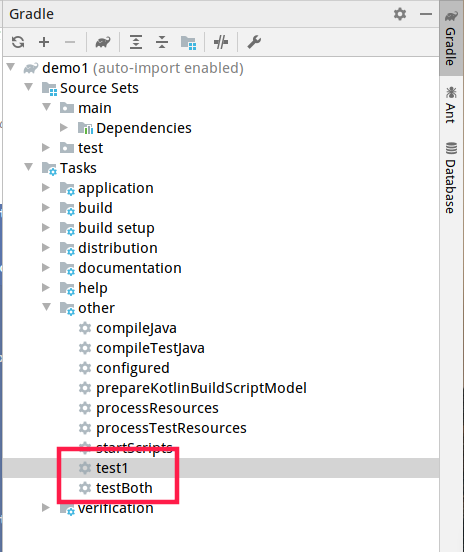

# gradle

在命令行输入一个gradle命令之后，gradle会去查找一个Daemon进程（Gradle Daemon），gradle会启动一个小的jvm进程，找到Daemon之后将正真的工作交给Daemon去执行，这样下次执行的时候会加快执行的速度。

# wrapper

是一个包装器，用`gradle wrapper`创建，其目录结构如下：

```bash
$ tree .
.
├── gradle
│   └── wrapper
│       ├── gradle-wrapper.jar
│       └── gradle-wrapper.properties
├── gradlew
└── gradlew.bat

2 directories, 4 files
```

将这几个文件复制到相应的gradle项目中，下次运行此项目就会使用此wrapper版本的gradle，配置gradle命令`./gradlew wrapper`

# groovy

groovy是java的超集，groovy的MOP（元对象协议）默认一切均反射，动态调用，可以静态编译。

## groovy语法糖

List使用`[]`实现，Map使用`[:]`，String可以想脚本语言一样内嵌`"$val"`。可以使用def定义弱类型。

groovy会默认自动生成geeter/setter方法，没有真正的private，Class创建的语法糖，通过方法名动态调用，方法调用的拦截器，方法调用失败的策略。

## groovy中的闭包

闭包是一段代码，类似于java中的lambda表达式，在gradle中，我们主要把闭包当参数来使用。

```groovy
// 定义一个闭包
def b1 ={
    println("Hello 闭包")
}
// 定义一个方式，使用闭包作为参数
def method1(Closure closure) {
    closure()
}
// 调用该方法
method1(b1)

// 定义一个闭包带参数
def b2 ={
    v ->
    println("Hello $v")
}
// 定义一个方式，使用闭包作为参数
def method2(Closure closure) {
    closure("带参数的闭包")
}
// 调用该方法
method2(b2)
```

# gradle的核心概念

## project

一个build.gradle文件对应一个project，一个build.gradle其本质是一个可执行的脚本，这个脚本会在jvm中的一个project中运行。类似于maven中的pom.xml。

## build.gradle

项目的构建脚本，其实质是一个以project对象为delegate的代码片段。

## task

构建脚本中定义的最小的工作单元，任务之间可以依赖，可以动态创建。

```groovy
task taskDemo {
    doLast {
        println "Hello Task!"
    }
}
```

执行task：`./gradlew :taskDemo`，其中`:`表示执行根目录下脚本中的taskDemo任务，若是在子模块中的taskDemo任务需要执行`./gradlew :subModule:taskDemo`类似与maven中的`-f`参数。

task解析

```groovy
task("taskDemo", {
    doLast({
        println("Hello Task!")
    })
})
```

task传一个string和闭包作为参数，闭包中有一个doLast闭包执行具体任务。

### 示例

执行命令，以及task依赖

```groovy
task startContainer {
    doLast {
        println("docker run -d mysql".execute())
    }
}

task taskDemo1 {
    doLast {
        println "Hello Task!"
    }
}

task taskDemo2 {
    // taskDemo1首先会在这个task找这个参数，找不到的话就会在整个project中找
    dependsOn(taskDemo1)
    doLast {
        println "Hello Task!"
    }
}
```

task代码复用

```groovy
task taskDemo(type:MyPrint) {
    value = "taskDemo"
}

task taskDemo1(type:MyPrint) {
    value = "taskDemo1"
}

class MyPrint extends DefaultTask{
    String value;

    @TaskAction
    void run(){
       println(value)
    }
}
```


## build.gradle示例

```groovy
println 1
task taskDemo {
    println 2
    doLast {
        println 3
        println "Hello Task!"
    }
}
```

执行结果：

```
$ ./gradlew :taskDemo
> Configure project :
1
2

> Task :taskDemo
3
Hello Task!
```

执行的时候从上到下执行build.gradle中的脚本，但是doLast不会在配置阶段只是，因为他属于taskDemo任务，只有执行taskDemo这个任务时doLast才会执行。

## afterEvaluate

```groovy
println 1
task taskDemo {
    println 2
    doLast {
        println 3
    }
}

afterEvaluate {
    println taskDemo1.name
}

task taskDemo1 {
    println 4
    doLast {
        println 5
    }
}
```

afterEvaluate表示当执行完build.gradle之后再回来执行其中的内容，执行build.gradle的时候会将afterEvaluate保存起来并创建一个钩子，在执行完build.gradle之后调用这个钩子。

afterEvaluate的主要作用在不同task中传递数据。如果没有afterEvaluate，在taskDemo中直接传递数据个taskDemo1是不会成功的，因为此时taskDemo1还没有创建，会出现null。

# gradle的生命周期

## 构建阶段

Gradle构建过程有三个阶段：

1. 初始化（Initialization）

   >Gradle可以构建一个和多个项目。在初始化阶段，Gradle会确定哪些项目参与构建（扫描settings.gradle文件），并且为这些项目创建一个Project实例。

2. 配置（Configuration）

   >在这个阶段，会配置project对象。将执行构建的所有项目的构建脚本。也就是说，会执行每个项目的build.gradle文件。

3. 执行（Execution）

   >Gradle确定要在执行期间创建和配置的任务子集。子集由传递给gradle命令和当前目录的任务名称参数确定。 Gradle然后执行每个选定的任务。

## Settings文件

settings文件由Gradle通过命名约定确定。该文件默认明为`settings.gradle`

`settings.gradle`是在初始化阶段执行。构建多个项目时，必须在根目录中有`settings.gradle`文件。因为在这个文件中定义了哪些项目参加构建。在构建Android项目时，我们会在根目录找到`settings.gradle`文件。除了定义包含的项目之外，您可能还需要将库添加到构建脚本类路径中。

### 实例

settings.gradle：

```groovy
println 'This is executed during the initialization phase.'
```

build.gradle：

```groovy
println 'This is executed during the configuration phase.'

task configured {
    println 'This is also executed during the configuration phase.'
}

task("test1") {
    doLast {
        println 'This is executed during the execution phase.'
    }
}

task("testBoth") {
    doFirst {
        println 'This is executed first during the execution phase.'
    }
    doLast {
        println 'This is executed last during the execution phase.'
    }
    println 'This is executed during the configuration phase as well.'
}
```



运行结果（可以明显看出分三个阶段执行）：

```bash
$ ./gradlew test1 testBoth
This is executed during the initialization phase.

> Configure project :
This is executed during the configuration phase.
This is also executed during the configuration phase.
This is executed during the configuration phase as well.

> Task :test1
This is executed during the execution phase.

> Task :testBoth
This is executed first during the execution phase.
This is executed last during the execution phase.

BUILD SUCCESSFUL in 928ms
2 actionable tasks: 2 executed
```

## 响应构建脚本中的生命周期

随着构建在其生命周期中的进展，我们的构建脚本可以接收通知。这些通知通常采用两种形式：我们可以实现特定的监听器接口，也可以在触发通知时提供执行闭包。下面的例子使用闭包。

### 项目评估（project evaluation）

您可以在评估项目之前和之后立即收到通知。

将测试任务添加到具有特定属性集的每个项目

```groovy
allprojects {
    afterEvaluate { project ->
        if (project.hasTests) {
            println "Adding test task to $project"
            project.task('test2') {
                doLast {
                    println "Running tests for $project"
                }
            }
        }
    }
}

allprojects {  

    ext.hasTests = true
}
```

输出结果

```bash
$ gradle -q test2
Adding test task to root project 'gradle lifecycle'
Running tests for root project 'gradle lifecycle'
```

# 插件编写

## 抽取重复代码

### 抽象到文件

将一段代码逻辑抽取出来放到某个地方，所有项目都可以用：将插件放到一个脚本中例如`demo1.gradle`，然后在`build.gradle`中使用`apply from: 'demo1.gradle'`，也可以使用http从网络上获取。

### 抽象到类

在build.gradle中写下这段代码：创建了10个task

```groovy
class HelloPlugin implements Plugin<Project> {
    @Override
    void apply(Project project) {
        (0..<10).each { i ->
            project.task('task' + i) {
                def myI = i
                doLast {
                    println("this is task ${myI}")
                }
            }
        }
    }
}

apply plugin: HelloPlugin
```

执行：task7

```bash
$ ./gradlew task7                            

> Task :task7
this is task 7

Deprecated Gradle features were used in this build, making it incompatible with Gradle 7.0.
Use '--warning-mode all' to show the individual deprecation warnings.
See https://docs.gradle.org/6.2.2/userguide/command_line_interface.html#sec:command_line_warnings

BUILD SUCCESSFUL in 1s
1 actionable task: 1 executed
```

如果在build.gradle中想要使用maven或者自己写的插件需要为添加相关依赖，gradle.build的依赖和源代码的依赖是分开的

```groovy
buildscript {
    repositories {
        mavenCentral()
    }

    dependencies {
        classpath 'org.codehaus.groovy:groovy-all:2.3.11'
    }
}
```

### 使用buildSrc

在项目根目录创建`buildSrc`文件加，里面有`src/main/java`，刷新gradle之后gradle会自动识别该文件夹，在里面写一个插件类，这里的插件可以进行测试，也可以发布到中央仓库，这里的文件与本地的项目已经没有什么关系，只是本地项目需要依赖这个插件做一些事情。

```java
import org.gradle.api.Plugin;
import org.gradle.api.Project;

public class MyPlugin implements Plugin<Project> {
    @Override
    public void apply(Project target) {
        for (int i = 0; i < 10; i++) {
            target.task("task" + i);
        }
    }
}
```

在build.gradle中使用该插件

```groovy
apply plugin: MyPlugin
```

运行：

```bash
$ ./gradlew task7
> Task :buildSrc:compileJava UP-TO-DATE
> Task :buildSrc:compileGroovy NO-SOURCE
> Task :buildSrc:processResources NO-SOURCE
> Task :buildSrc:classes UP-TO-DATE
> Task :buildSrc:jar UP-TO-DATE
> Task :buildSrc:assemble UP-TO-DATE
> Task :buildSrc:compileTestJava NO-SOURCE
> Task :buildSrc:compileTestGroovy NO-SOURCE
> Task :buildSrc:processTestResources NO-SOURCE
> Task :buildSrc:testClasses UP-TO-DATE
> Task :buildSrc:test NO-SOURCE
> Task :buildSrc:check UP-TO-DATE
> Task :buildSrc:build UP-TO-DATE
> Task :task7 UP-TO-DATE

BUILD SUCCESSFUL in 1s
```

# 增量构建

每次执行任务前都会检查相关的文件是否改变，如果没有改变则这个任务会被忽略掉。

是否增量更新在相应的任务中定义好了怎么判断是否增量，只有自己写的代码需要自己定义增量判断条件。

使用注解声明增量构建，

使用运行时API动态声明增量构建

# 依赖管理

依赖冲突的解决原则：新版本优先。

`gradle [module]:dependencies`查看项目的依赖管理。

Java Library plugin - configurations used to declare dependencies*

| Configuration name   | Role                                     | Consumable? | Resolvable? | Description                                                  |
| :------------------- | :--------------------------------------- | :---------- | :---------- | :----------------------------------------------------------- |
| `api`                | Declaring API dependencies               | no          | no          | This is where you should declare dependencies which are transitively exported to consumers, for compile. |
| `implementation`     | Declaring implementation dependencies    | no          | no          | This is where you should declare dependencies which are purely internal and not meant to be exposed to consumers. |
| `compileOnly`        | Declaring compile only dependencies      | no          | no          | This is where you should declare dependencies which are only required at compile time, but should not leak into the runtime. This typically includes dependencies which are shaded when found at runtime. |
| `runtimeOnly`        | Declaring runtime dependencies           | no          | no          | This is where you should declare dependencies which are only required at runtime, and not at compile time. |
| `testImplementation` | Test dependencies                        | no          | no          | This is where you should declare dependencies which are used to compile tests. |
| `testCompileOnly`    | Declaring test compile only dependencies | no          | no          | This is where you should declare dependencies which are only required at test compile time, but should not leak into the runtime. This typically includes dependencies which are shaded when found at runtime. |
| `testRuntimeOnly`    | Declaring test runtime dependencies      | no          | no          | This is where you should declare dependencies which are only required at test runtime, and not at test compile time. |

*Java Library plugin — configurations used by consumers*

| Configuration name | Role                               | Consumable? | Resolvable? | Description                                                  |
| :----------------- | :--------------------------------- | :---------- | :---------- | :----------------------------------------------------------- |
| `apiElements`      | For compiling against this library | yes         | no          | This configuration is meant to be used by consumers, to retrieve all the elements necessary to compile against this library. Unlike the `default` configuration, this doesn’t leak implementation or runtime dependencies. |
| `runtimeElements`  | For executing this library         | yes         | no          | This configuration is meant to be used by consumers, to retrieve all the elements necessary to run against this library. |

*Java Library plugin - configurations used by the library itself*

| Configuration name   | Role                                    | Consumable? | Resolvable? | Description                                                  |
| :------------------- | :-------------------------------------- | :---------- | :---------- | :----------------------------------------------------------- |
| compileClasspath     | For compiling this library              | no          | yes         | This configuration contains the compile classpath of this library, and is therefore used when invoking the java compiler to compile it. |
| runtimeClasspath     | For executing this library              | no          | yes         | This configuration contains the runtime classpath of this library |
| testCompileClasspath | For compiling the tests of this library | no          | yes         | This configuration contains the test compile classpath of this library. |
| testRuntimeClasspath | For executing tests of this library     | no          | yes         | This configuration contains the test runtime classpath of this library |

# 自定义Gradle构建

## 参数

可以在项目的根目录中创建gradle.properties存储项目公用的参数，也可以在`.gradle`中创建gradle.properties则为当前用户的所有项目共享的参数

```groovy
task taskDemo {
    doLast {
        // 使用 -P 传递参数
        println "print $key1"
        // 使用 -D 传递参数
        println System.getProperty("key2")
        // 从 gradle.properties 中获取参数
        println "print $propertiesKey"
    }
}
```

执行结果

```bash
gradlew :taskDemo -Pkey1=wwwww -Dkey2=ffffff

> Task :taskDemo
print wwwww
ffffff
print value1

BUILD SUCCESSFUL in 1s
1 actionable task: 1 executed
```

对于gradle.properties所有的命令行参数都可以放到此脚本中，下次运行的使用就不需要在命令行中声明此参数

```groovy
// --consle-plain
org.gradle.console=plain
```


## init脚本

可以在当前项目的根路径下创建一个脚本`init-demo.gradle`，像build.gradle一样写内容，启动方式

```bash
gradlew --init-script init-demo.gradle
```

可以在`.gradle`文件夹下创建一个`init.gradle`脚本，这样在当前用户的每个项目执行时都会先使用这个接本在执行任务，可以进行仓库的替换。

## 使用第三方库

 需要为脚本声明单独的依赖包

```groovy
buildscript {
    repositories {
        mavenCentral()
        jcenter()
    }
    dependencies {
        
    }
}
```


# 多项目构建

对于多项目的工程来说可以使用`gradle projects`来查看项目中的所有模块。

## settings文件

settings文件声明了所需的配置来实例化项目的层次结构。

实例：

```groovy
rootProject.name = 'rolemanager'
include 'gateway'
```

## 配置子项目

以下几点是真实多项目构建的共同需求：

- 根项目和所有子项目应该使用相同的group和version属性值
- 所有子项目都是java项目，并且都需要java插件来保证正常运行，所以只需要对子项目应用插件，而不是根项目
- web子项目是唯一需要声明外部依赖的项目，这个项目类型来自于其他子项目，它产生一个war包，并且使用jetty插件运行应用程序
- 在子项目之间建模依赖关系

### 多项目中的构建

`gradle build`将会构建所有的项目，`gralde :module:build`将会构建制定module模块。`gralde build -a`所有文件重新编译，`gralde build --no-rebuild`只会重新获取文件，不会编译代码。

通常`build`只编译依赖项目的代码，组装成jar文件，并且使其作为其他项目的依赖。为了运行测试，可以执行`buildNeeded`。项目的任何改变都可能对依赖于它的其他项目产生副作用，可以使用`buildDependents`，通过构建和测试依赖的项目来验证代码变化所产生的影响。

# 自我总结

## 创建一个新的项目

```bash
gradle init
```

## 升级已有项目的gradle wrapper

```bash
./gradlew wrapper --gradle-version=6.5.1 --distribution-type=bin
```

## Gradle全局配置`init.gradle`

类似与maven的`settings.xml`

加载顺序：

1. `~/.gradle/init.gradle`文件
2. `~/.gradle/init.d/`目录下的以`.gradle`结尾的文件
3. `~/$GRADLE_HOME/init.d/`目录下的以`.gradle`结尾的文件
4. `$GRADLE_USER_HOME/init.gradle`文件
5. `$GRADLE_USER_HOME/init.d`目录下的以`.gradle`结尾的文件

```groovy
import java.util.concurrent.TimeUnit
allprojects { Project project ->
    buildscript {
        repositories {
            maven {
                url "http://maven.aliyun.com/nexus/content/groups/public/"
            }
            jcenter()
            mavenCentral()
            mavenLocal()
        }
    }
    repositories {
        maven {
            //本地私服仓库地址
            url "http://maven.aliyun.com/nexus/content/groups/public/"
        }
        jcenter()
        mavenCentral()
        mavenLocal()
    }
    configurations.all {
        resolutionStrategy {
            // cache dynamic versions for 10 minutes
            cacheDynamicVersionsFor 10 * 60, TimeUnit.SECONDS
            // don't cache changing modules at all
            cacheChangingModulesFor 0, TimeUnit.SECONDS
        }
    }
}
```

## 跳过测试

```bash
./gradlew build -x test
```

## 发布到maven本地仓库

```groovy
plugins {
    id 'distribution'
    id 'maven-publish'
}

// 将源文件后缀为java的文件打包
task sourcesJar(type: Jar) {
    archiveBaseName = archivesBaseName
    archiveClassifier = 'sources'
    from sourceSets.main.allSource
}

// 将注释信息打包
task javadocJar(type: Jar, dependsOn: javadoc) {
    archiveBaseName = archivesBaseName
    archiveClassifier = 'javadoc'
    from javadoc.destinationDir
}

// 绑定在build的assemble任务上
artifacts {
    archives sourcesJar
    archives javadocJar
}

// 会将build中的libs中的jar包（包括源文件包和注释包）打包到distribution文件下
distributions {
    main {
        distributionBaseName = archivesBaseName
        contents {
            from { libsDir }
        }
    }
}

// 会将build中的distribution压缩包上传到本地maven仓库
publishing {
    publications {
        myDistribution(MavenPublication) {
            artifact distZip
        }
    }
}
```

## gradle全局代理

在`$HOME/.gradle/gradle.properties`加上这句话

```properties
# http和https代理设置
# systemProp.http.proxyHost=127.0.0.1
# systemProp.http.proxyPort=8889
# systemProp.http.proxyUser=userid
# systemProp.http.proxyPassword=password
# systemProp.http.nonProxyHosts=*.nonproxyrepos.com|localhost

# systemProp.https.proxyHost=127.0.0.1
# systemProp.https.proxyPort=8889
# systemProp.https.proxyUser=userid
# systemProp.https.proxyPassword=password
# systemProp.http.nonProxyHosts=*.nonproxyrepos.com|localhost

# scoks代理设置
systemProp.socks.proxyHost=127.0.0.1 
systemProp.socks.proxyPort=1089
```

命令行

```bash
./gradlew build -DsocksProxyHost=yourHost -DsocksProxyPort=yourHostPort
```

## 依赖分析

```bash
./gradlew -q common:dependencies
```

## gradle debug

```bash
./gradlew build -x test -d -Dorg.gradle.debug=true -Dorg.gradle.daemon=false
```

