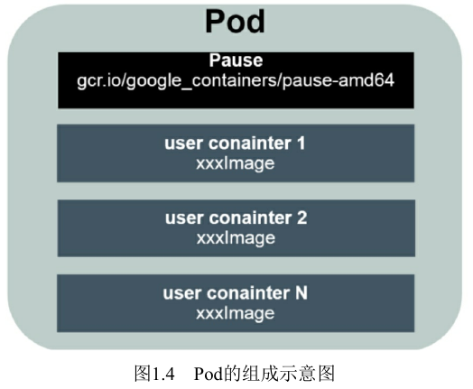
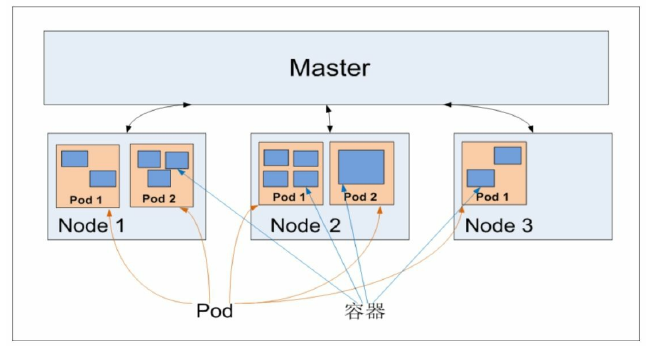

= Kubernetes权威指南 =
Korov9 <korov9@163.com>
v1.0 2021-02-24
:toc: right

== Kubernetes的基本概念和术语 ==

Kubernetes中的大部分概念如Node,Pod,Replication Controller,Service等都可以被看作一种资源对象，几乎所有资源对象都可以通过Kubernetes提供的kubectl工具执行增删改查等操作并将其保存在etcd中持久化存储。从这个角度来看，Kubernetes其实是一个高度自动化的资源控制系统，他通过跟踪对比etcd库里保存的“资源期望状态”与当前环境中的“实际资源状态”的差异来实现自动控制和自动纠错的高级功能。

Kubernetes平台采用了**核心+外围扩展**的设计思路，在保持平台核心稳定的同时具备持续演进升级的优势。Kubernetes大部分常见的核心资源对象都归属于 `v1` 这个核心 `API` ，比如 `Node,Pod,Service,Endpoints,Namespace,RC,PersistenVolumn` 等。在 `1.9` 版本之后引入了 `apps/v1` 这个正式的扩展 `API` 组。

=== Master ===

Kubernetes里的Master指的是集群控制节点，在每个Kubernetes集群里都需要有一个Master来负责整个集群的管理和控制，基本上Kubernetes的所有控制命令都发给它，它负责具体的执行过程。Master通常会占据一个独立的服务器（高可用部署建议用3台服务器）。

在Master上运行这以下关键进程：

. `Kubernetes API Server(kube-apiserver)`:提供了HTTP Rest接口的关键服务进程，是Kubernetes里所有资源的增删改查等操作的唯一入口，也是集群控制的入口进程。
. `Kubernetes Controller Manager(kube-controller-manager)`:Kubernetes里所有资源对象的自动化控制中心，可以将其理解为资源对象的大总管
. `Kubernetes Scheduler(kube-scheduler)`:负责资源调度（Pod调度）的进程

另外，在Master上通常还需要部署etcd服务，因为Kubernetes里的所有资源对象的数据都被保存在etcd中。

=== Node ===

除了Master，Kubernetes集群中的其他机器被称为Node。Node可以是一台物理机，也可以是一台虚拟机。Node是Kubernetes集群中的工作负载节点，每个Node都会被Master分配一些工作负载（Docker容器），当某个Node宕机时，其上的工作负载会被Master自动转移到其他节点上。

每个Node上都运行着以下关键程序

. kubelet:负责Pod对应的容器的创建、启停等任务，同时与Master密切协作，实现集群管理的基本功能
. kube-proxy:实现Kubernetes Service的通信与负载均衡机制的重要组件
. Docker Engine(docker):Docker引擎，负责本机的容器的创建和管理工作。

Node可已在运行期间动态增加到Kubernetes集群中，前提是这个节点上已经正确安装，配置和启动了上述关键进程，在默认情况下kublet会向Master注册自己，这也是Kubernetes推荐的Node管理方式。一旦Node被纳入集群管理范围，kubelet进程就会定时向Master回报自身的情报，例如操作系统，docker版本，机器的cpu和内存情况，以及当前有哪些pod在运行等，这样Master就可以获知每个node的资源使用情况，并实现高效均衡的资源调度策略。

=== Pod ===

每个pod都有一个特殊的被称为根容器的**Pause**容器。**Pause**容器对应的镜像属于kubernetes平台的一部分，除了pause容器，每个pod还包含一个或多个紧密相关的用户业务容器。

pause容器作为pod的根容器，它的状态代表整个容器组的状态，pod中的多个业务容器共享pause容器的ip，共享pause容器挂接的volume，可以简化密切关联的业务容器之间的通信问题，也很好的解决了他们之间的文件共享问题。

kubernetes为每个pod都分配了唯一的ip地址（pod ip），一个pod中的多个容器共享pod ip，一个pod里的容器可以与另外主机上的pod容器直接通信。

pod有两种类型，普通的pod及静态pod。静态pod并没有被存放在kubernetes的etcd存储里，而是被存放在某个具体的node上的一个具体的文件中，并且只在此node上启动，运行。普通的pod一旦被创建，就会被放入etcd中存储，随后会被kubernetes master调度到某个具体的node上并进行绑定，随后该pod被对应的node上的kubelet进程实例化成一组相关的docker容器并启动。默认情况下，pod中的某个容器停止时，kubernetes会自动检测到这个问题并且重新启动这个pod，如果pod所在的node宕机，就会将这个node上的所有pod重新调度到其他节点上。

[source:YAML]
----
# 核心api v1
apiVersion: v1
# 这是一个pod的定义
kind: Pod
metadata:
  name: myweb
  labels:
    name: myweb
# pod里所包含的容器组的定义在spec中声明
spec:
  containers:
  - name: myweb
    image: kubeguide/tomcat-app:v1
    # 资源配额限定
    resources:
      requests:
        memory: "64Mi"
        cpu: "250m"
      limits:
        memory: "64Mi"
        cpu: "250m"
    ports:
    - containerPort: 8080
    env:
    - name: MYSQL_SERVICE_HOST
      value: 'mysql'
    - name: MYSQL_SERVICE_PORT
      value: '3306'
----

NOTE: requests表示该资源的最小申请量，系统必须满足要求，limits表示该资源最大允许使用的量，不能被突破，当容器试图使用超过这个量的资源时，可能会被kubernetes杀掉重启。cpu是相对值，通常一个容器的cpu配额被定义成100-300m，即0.1-0.3个cpu。memory就是内存的字节数。

=== Event ===

Event是一个事件的记录，记录了事件的最早产生时间，最后重现时间，重复次数，发起者，类型，以及导致此事件的原因等众多信息。Event通常会被关联到某个具体的资源对象上，是排故障的重要参考信息， `kubectl describe pod ...` 来查看具体pod的event信息

=== Label ===

一个label是一个key=value的键值对，key和value都由用户自己指定。label可以被附加到各种资源对象上，例如node，pod，service，rc等，一个资源对象可以定义任意数量的label，同一个label可以被添加到任意数量的资源对象上，label通常在资源对象定义时确定，也可以在对象创建后动态添加删除。

我们可以通过label selector（标签选择器）查询和筛选拥有某些label的资源对象。

=== rplication controller ===

简称RC，它定义了一个期望的场景，即声明某种pod的副本数量在任意时刻都符合某个预期值，其定义包括如下几个部分：

. pod期待的副本数量
. 用于筛选目标pod的lable selector
. 当pod的副本数量小于预期数量的时候，用于创建新pod的pod模板

[source,YAML]
----
aptVersion: v1
kind: ReplicationController
metadata:
  name: frontend
spec:
  replicas: 1
  selector:
    tier: frontend
  template:
    metadata:
      labels:
        app: app-demo
        tier: frontend
    spec:
      containers:
      - name: tomcat-demo
        image: tomcat
        imagePullPolicy: IfNotPresent
        env:
        - name: GET_HOSTS_FROM
          value: dns
        ports:
        - containerPort: 80
----

当我们定义了一个RC并将其提交到kubernetes集群中后，master上的controller manager组件就得到通知，定期巡检系统中当前存活的目标pod，并确保目标pod实例的数量刚好等于rc的期望值，如果有过多的pod副本在运行，系统就会停掉一些pod，否则系统会再自动创建一些pod。

kubernetes 1.2中将rplication controller更新为replica set，RS支持集合的label selector。

=== Deployment ===

Deployment内部使用Replica Set来实现目的，无论从Deployment的作用与目的，YAML定义，还是从它的具体命令操作来看，我们都可以把它看作RC的一次升级。

[source,YAML]
----
aptVersion: apps/v1
kind: Deployment
metadata:
  name: frontend
spec:
  replicas: 1
  selector:
    matchLabels:
      tier: frontend
    matchExpressions:
      - {key: tier, operator: In, vlaues:[frontend]}
  template:
    metadata:
      labels:
        app: app-demo
        tier: frontend
    spec:
      containers:
      - name: tomcat-demo
        image: tomcat
        imagePullPolicy: IfNotPresent
        ports:
        - containerPort: 80
----

