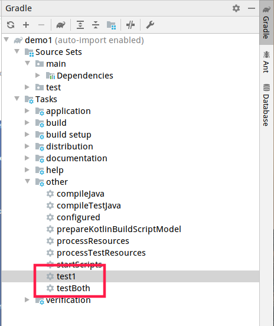

# wrapper

是一个包装器，用`gradle wrapper`创建，其目录结构如下：

```bash
$ tree .
.
├── gradle
│   └── wrapper
│       ├── gradle-wrapper.jar
│       └── gradle-wrapper.properties
├── gradlew
└── gradlew.bat

2 directories, 4 files
```

将这几个文件复制到相应的gradle项目中，下次运行此项目就会使用此wrapper版本的gradle，配置gradle命令`./gradlew wrapper`

# groovy中的闭包

闭包是一段代码，类似于java中的lambda表达式，在gradle中，我们主要把闭包当参数来使用。

```groovy
// 定义一个闭包
def b1 ={
    println("Hello 闭包")
}
// 定义一个方式，使用闭包作为参数
def method1(Closure closure) {
    closure()
}
// 调用该方法
method1(b1)

// 定义一个闭包带参数
def b2 ={
    v ->
    println("Hello $v")
}
// 定义一个方式，使用闭包作为参数
def method2(Closure closure) {
    closure("带参数的闭包")
}
// 调用该方法
method2(b2)
```

# gradle的生命周期

## 构建阶段

Gradle构建过程有三个阶段：

1. 初始化（Initialization）

   >Gradle可以构建一个和多个项目。在初始化阶段，Gradle会确定哪些项目参与构建，并且为这些项目创建一个Project实例。

2. 配置（Configuration）

   >在这个阶段，会配置project对象。将执行构建的所有项目的构建脚本。也就是说，会执行每个项目的build.gradle文件。

3. 执行（Execution）

   >Gradle确定要在执行期间创建和配置的任务子集。子集由传递给gradle命令和当前目录的任务名称参数确定。 Gradle然后执行每个选定的任务。

## Settings文件

settings文件由Gradle通过命名约定确定。该文件默认明为`settings.gradle`

`settings.gradle`是在初始化阶段执行。构建多个项目时，必须在根目录中有`settings.gradle`文件。因为在这个文件中定义了哪些项目参加构建。在构建Android项目时，我们会在根目录找到`settings.gradle`文件。除了定义包含的项目之外，您可能还需要将库添加到构建脚本类路径中。

### 实例

settings.gradle：

```groovy
println 'This is executed during the initialization phase.'
```

build.gradle：

```groovy
println 'This is executed during the configuration phase.'

task configured {
    println 'This is also executed during the configuration phase.'
}

task("test1") {
    doLast {
        println 'This is executed during the execution phase.'
    }
}

task("testBoth") {
    doFirst {
        println 'This is executed first during the execution phase.'
    }
    doLast {
        println 'This is executed last during the execution phase.'
    }
    println 'This is executed during the configuration phase as well.'
}
```



运行结果（可以明显看出分三个阶段执行）：

```bash
$ ./gradlew test1 testBoth
This is executed during the initialization phase.

> Configure project :
This is executed during the configuration phase.
This is also executed during the configuration phase.
This is executed during the configuration phase as well.

> Task :test1
This is executed during the execution phase.

> Task :testBoth
This is executed first during the execution phase.
This is executed last during the execution phase.

BUILD SUCCESSFUL in 928ms
2 actionable tasks: 2 executed
```

## 响应构建脚本中的生命周期

随着构建在其生命周期中的进展，我们的构建脚本可以接收通知。这些通知通常采用两种形式：我们可以实现特定的监听器接口，也可以在触发通知时提供执行闭包。下面的例子使用闭包。

### 项目评估（project evaluation）

您可以在评估项目之前和之后立即收到通知。

将测试任务添加到具有特定属性集的每个项目

```groovy
allprojects {
    afterEvaluate { project ->
        if (project.hasTests) {
            println "Adding test task to $project"
            project.task('test2') {
                doLast {
                    println "Running tests for $project"
                }
            }
        }
    }
}

allprojects {  

    ext.hasTests = true
}
```

输出结果

```bash
$ gradle -q test2
Adding test task to root project 'gradle lifecycle'
Running tests for root project 'gradle lifecycle'
```


# 插件编写

将一段代码逻辑抽取出来放到某个地方，所有项目都可以用

在build.gradle中写下这段代码：创建了10个task

```groovy
class HelloPlugin implements Plugin<Project> {
    @Override
    void apply(Project project) {
        (0..<10).each { i ->
            project.task('task' + i) {
                def myI = i
                doLast {
                    println("this is task ${myI}")
                }
            }
        }
    }
}

apply plugin: HelloPlugin
```

执行：task7

```bash
$ ./gradlew task7                            

> Task :task7
this is task 7

Deprecated Gradle features were used in this build, making it incompatible with Gradle 7.0.
Use '--warning-mode all' to show the individual deprecation warnings.
See https://docs.gradle.org/6.2.2/userguide/command_line_interface.html#sec:command_line_warnings

BUILD SUCCESSFUL in 1s
1 actionable task: 1 executed
```

如果在build.gradle中想要使用maven或者自己写的插件需要为添加相关依赖，gradle.build的依赖和源代码的依赖是分开的

```groovy
buildscript {
    repositories {
        mavenCentral()
    }

    dependencies {
        classpath 'org.codehaus.groovy:groovy-all:2.3.11'
    }
}
```

### 使用buildSrc

在项目根目录创建`buildSrc`文件加，里面有`src/main/java`，刷新gradle之后gradle会自动识别该文件夹，在里面写一个插件类

```java
import org.gradle.api.Plugin;
import org.gradle.api.Project;

public class MyPlugin implements Plugin<Project> {
    @Override
    public void apply(Project target) {
        for (int i = 0; i < 10; i++) {
            target.task("task" + i);
        }
    }
}
```

在build.gradle中使用该插件

```groovy
apply plugin: MyPlugin
```

运行：

```bash
$ ./gradlew task7
> Task :buildSrc:compileJava UP-TO-DATE
> Task :buildSrc:compileGroovy NO-SOURCE
> Task :buildSrc:processResources NO-SOURCE
> Task :buildSrc:classes UP-TO-DATE
> Task :buildSrc:jar UP-TO-DATE
> Task :buildSrc:assemble UP-TO-DATE
> Task :buildSrc:compileTestJava NO-SOURCE
> Task :buildSrc:compileTestGroovy NO-SOURCE
> Task :buildSrc:processTestResources NO-SOURCE
> Task :buildSrc:testClasses UP-TO-DATE
> Task :buildSrc:test NO-SOURCE
> Task :buildSrc:check UP-TO-DATE
> Task :buildSrc:build UP-TO-DATE
> Task :task7 UP-TO-DATE

BUILD SUCCESSFUL in 1s
```

# 依赖管理


# 多项目构建

对于多项目的工程来说可以使用`gradle projects`来查看项目中的所有模块。

## settings文件

settings文件声明了所需的配置来实例化项目的层次结构。

实例：

```groovy
rootProject.name = 'rolemanager'
include 'gateway'
```

## 配置子项目

以下几点是真实多项目构建的共同需求：

- 根项目和所有子项目应该使用相同的group和version属性值
- 所有子项目都是java项目，并且都需要java插件来保证正常运行，所以只需要对子项目应用插件，而不是根项目
- web子项目是唯一需要声明外部依赖的项目，这个项目类型来自于其他子项目，它产生一个war包，并且使用jetty插件运行应用程序
- 在子项目之间建模依赖关系

### 多项目中的构建

`gradle build`将会构建所有的项目，`gralde :module:build`将会构建制定module模块。`gralde build -a`所有文件重新编译，`gralde build --no-rebuild`只会重新获取文件，不会编译代码。

通常`build`只编译依赖项目的代码，组装成jar文件，并且使其作为其他项目的依赖。为了运行测试，可以执行`buildNeeded`。项目的任何改变都可能对依赖于它的其他项目产生副作用，可以使用`buildDependents`，通过构建和测试依赖的项目来验证代码变化所产生的影响。

# 自我总结

## 创建一个新的项目

```bash
gradle init
```

## 升级已有项目的gradle wrapper

```bash
./gradlew wrapper --gradle-version=6.2.2 --distribution-type=bin
```

## Gradle全局配置`init.gradle`

类似与maven的`settings.xml`

加载顺序：

1. `~/.gradle/init.gradle`文件
2. `~/.gradle/init.d/`目录下的以`.gradle`结尾的文件
3. `~/$GRADLE_HOME/init.d/`目录下的以`.gradle`结尾的文件
4. `$GRADLE_USER_HOME/init.gradle`文件
5. `$GRADLE_USER_HOME/init.d`目录下的以`.gradle`结尾的文件

```groovy
import java.util.concurrent.TimeUnit
allprojects { Project project ->
    buildscript {
        repositories {
            maven {
                url "http://maven.aliyun.com/nexus/content/groups/public/"
            }
            jcenter()
            mavenCentral()
            mavenLocal()
        }
    }
    repositories {
        maven {
            //本地私服仓库地址
            url "http://maven.aliyun.com/nexus/content/groups/public/"
        }
        jcenter()
        mavenCentral()
        mavenLocal()
    }
    configurations.all {
        resolutionStrategy {
            // cache dynamic versions for 10 minutes
            cacheDynamicVersionsFor 10 * 60, TimeUnit.SECONDS
            // don't cache changing modules at all
            cacheChangingModulesFor 0, TimeUnit.SECONDS
        }
    }
}
```

