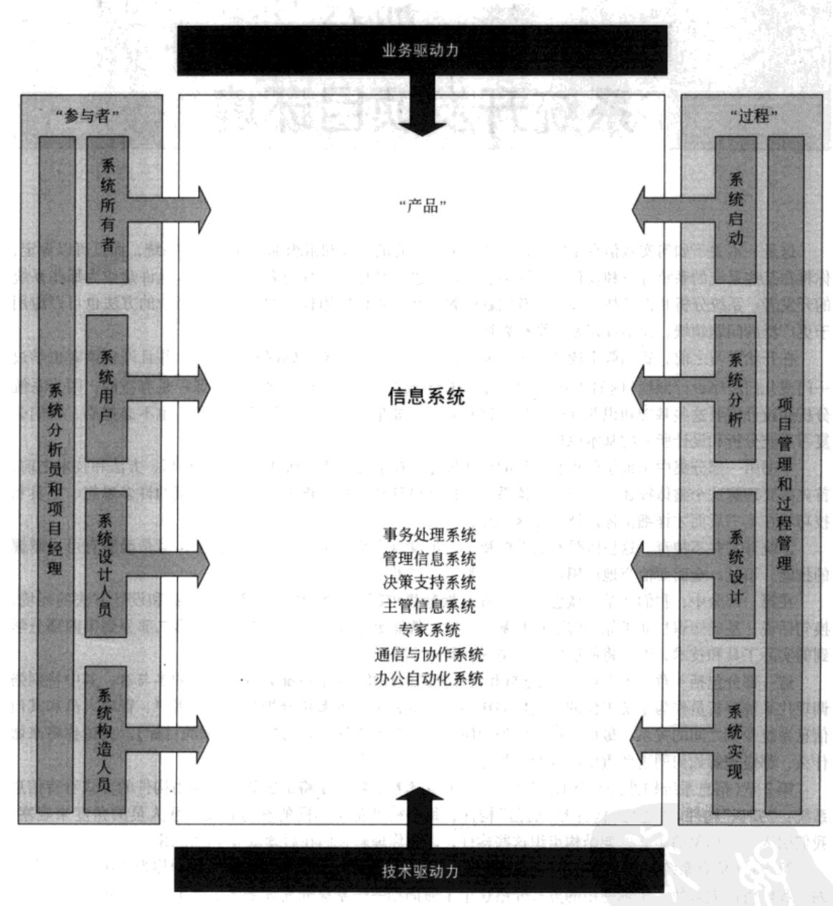

# 一 系统开发项目环境

按照功能对信息系统进行分类：

- 事务处理系统：处理企业事务，例如订单、计时卡片、支付和预订。
- 管理信息系统：使用事务数据产生管理者管理企业所需的信息。
- 决策支持系统：辅助各种决策人员从可选项中选出决策。
- 主管信息系统：专门按照主管的特殊信息需求进行剪裁，他们为企业制定规划，并根据规划评估效益。
- 专家系统：捕捉并加工专家或决策者的知识，然后模拟那些专家的思想
- 通信和协作系统：提高人们之间的通信和协作水平，无论他们在企业内部，还是在企业外部。
- 办公自动化系统：辅助雇员生成和共享那些支持日常办公活动的文档

除了正规的系统分析和设计技能外，系统分析员还必须拥有其他一些技能、知识和品德，包括：

- 有效的信息技术知识：分析员必须了解现有的和正在出现的信息技术。
- 计算机编程经验和专长：大多数系统分析员需要精通几门高级程序设计语言
- 一般商业知识：系统分析员应该能够同业务专家沟通，了解问题和需求。相关课程包括：财务会计学、管理会计学或成本会计学、金融学、市场营销、商业法、生产管理或运作管理、质量管理、经济学和商业法
- 通用的解决问题的技能：系统分析员必须能够找出一个大的业务问题，首先把它分解成小的问题，分析问题的每个方面，然后再组装出一个改善的系统问题来解决问题。
- 良好的与人沟通的能力：包括口头沟通以及书面沟通。沟通技能将成为你职业成功或失败的一个最大的决定因素。商务写作和技术写作、商务发言和技术讨论、交谈、聆听。
- 良好的处理人际关系的能力：系统分析员需要同项目中所有人交互，所以需要很强的人际关系处理能力，例如：团队合作、说服、管理变化和冲突以及领导艺术。
- 灵活性和适应能力：
- 人格与道德规范

## 一个简单的系统开发过程

1. 系统启动：
   1. 确定问题（也包括规划问题方案）
2. 系统分析：
   1. 分析和理解问题
   2. 确定方案需求和预期
3. 系统设计：
   1. 确定代替方案，选择最佳方案
   2. 设计所选方案
4. 系统实现：
   1. 实现所选方案
   2. 评估结果（如果问题没有得到解决，回到系统启动和系统分析）

