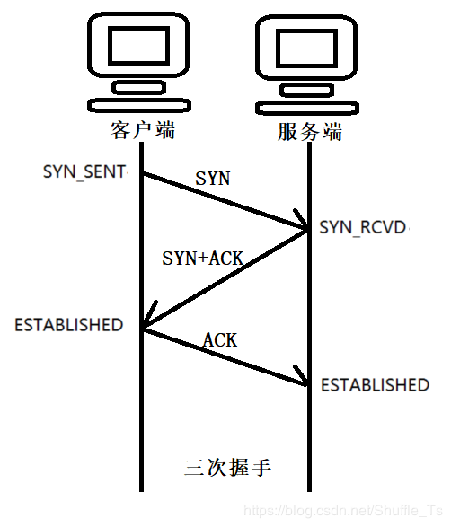
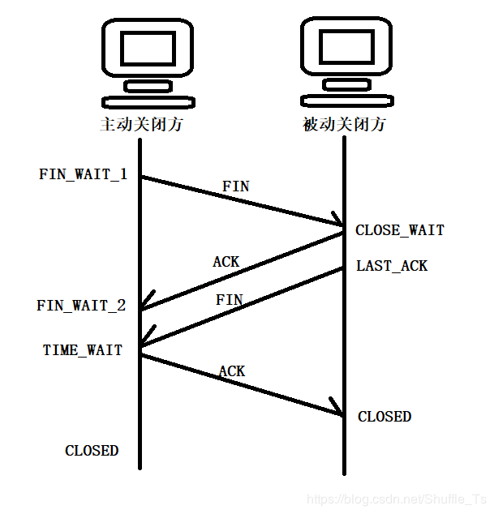
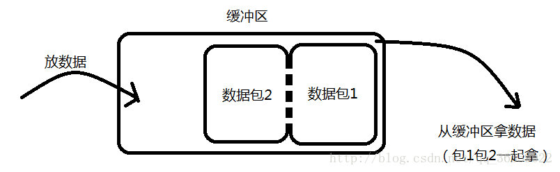
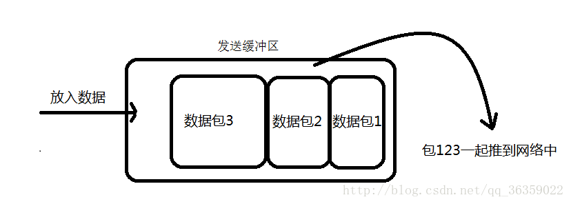
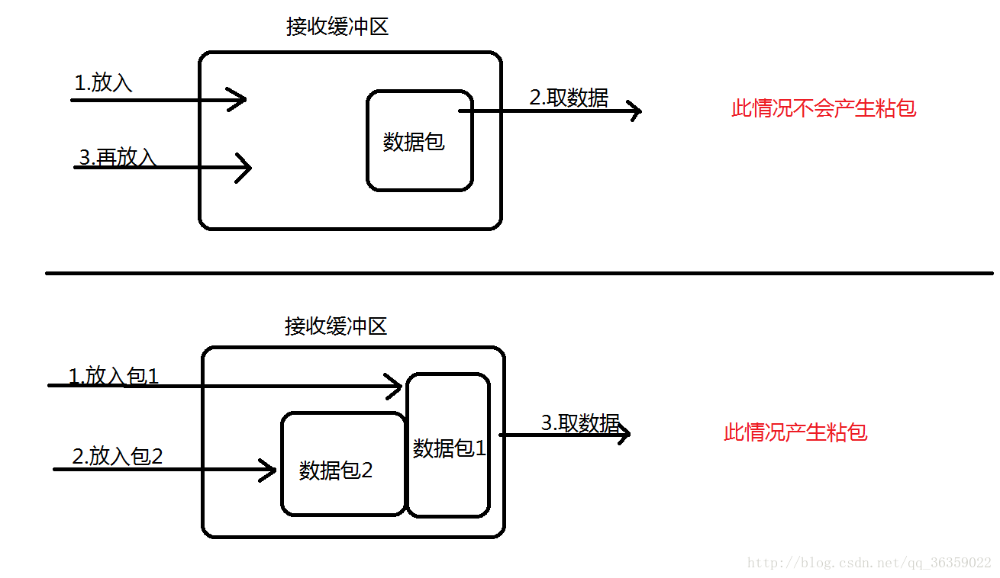
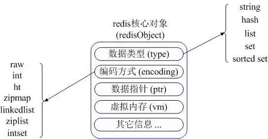
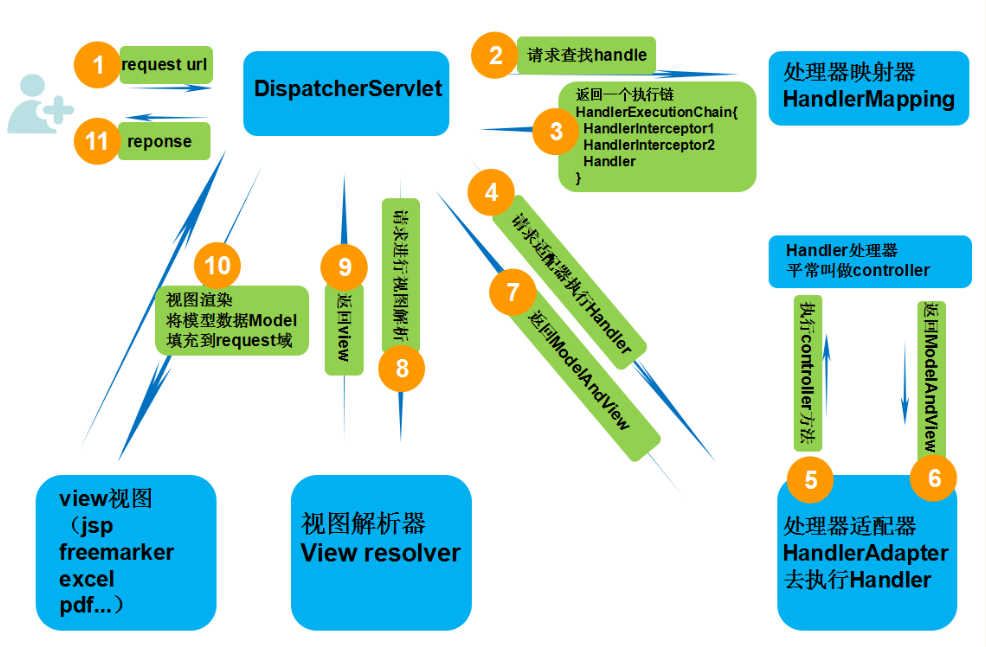

# 自我介绍

## 介绍自己

各位面试官好，我叫朱磊，毕业于广西大学信息管理与信息系统专业，2018年7月至2019年11月就职于中软国际，职能是作为SmartNDP WEB项目中链路模块的主要负责人，主要职责是保证链路模块整体功能的正常迭代，以及链路整个模块的框架的可维护性。技术方面熟悉java，mysql，spring，redis，git，maven。

简历：剩下的就是工作经历以及项目经验了。工作经历这块就不细说了。重要的是项目经验。项目描述这块，个人建议，第一点，你要告诉别人，你的这个项目是做什么，为什么人群服务，怎么使用。不要过多的说明用了什么技术，用这些技术怎么开发项目。这点大致提下就可，毕竟篇幅有限，使用技术这块和面试官相谈即可。第二点，项目负责开发的模块以及技术，这点需要让别人知道你在这个项目做了什么，用到了那些技术。第三点，项目业绩，这点看个人，如果不知道怎么写，可以写个人在项目学到了什么，或者碰到了那些问题，是如何解决的


## 自己的项目经验

# Java

## HashCode的作用

hashcode是根据对象内容生成的一串编码，这串编码的可以辅助判断对象是否相等。

## Java基类Object类

所有类的父类，其中方法有equal，hashcode，toString ,clone，wait和notify，notifyAll。

## java中四种修饰符的限制范围

public：本类，本包，不同包子类，不同包非子类

protected：本类，本包，不同包子类

default：本类，本包

private：本类

## final和static关键字的作用

final修饰类中的属性或变量，该属性或变量必须在构造函数执行完毕之前完成初始化。final修饰的变量的值不可以改变。final修饰的方法可以被继承不可以被重写。final修饰的类不可以被继承。

static修饰的方法可以不通过本类的对象即可调用，static修饰的变量为全局变量，所有的类共享该变量。只有内部类才可以用static修饰。

## java 中操作字符串都有哪些类？它们之间有什么区别？

- String : final修饰，String类的方法都是返回new String。即对String对象的任何改变都不影响到原对象，对字符串的修改操作都会生成新的对象。
- StringBuffer : 对字符串的操作的方法都加了synchronized，保证线程安全。
- StringBuilder : 不保证线程安全，在方法体内需要进行字符串的修改操作，可以new StringBuilder对象，调用StringBuilder对象的append、replace、delete等方法修改字符串。

## 抽象类和普通类有那些区别？

- 抽象类不能被实例化
- 抽象类可以没有抽象方法，有抽象方法的类必须被声明为抽象类，抽象方法只需要声明，无需实现
- 抽象类的子类必须实现抽象类中的抽象方法，否则这个子类也是抽象类
- 抽象方法不能被声明为静态，不能用private，static和final修饰

## 抽象类和接口的区别

1. 抽象类和接口都不能被实例化
2. 抽象类被继承，接口被实现，单继承多实现
3. 接口只能声明方法，而抽象类中可以声明方法也可以实现方法
4. 抽象类中的抽象方法必须由子类全部实现，否则这个子类也是抽象类。接口中的方法必须由实现类全部实现，否则这个类就是一个抽象类
5. 接口里的方法只能声明，不能有具体的实现，这说明接口是设计的结果，抽象类时重构的结果

jdk8的借口中可以有实现

## java 中 IO 流分为几种

字节流和字符流，分别由四个抽象类来表示。字节流的输入输入：InputStream，OutputStream。字符流的输入输出：Reader，Writer。

读取文本的时候使用字符流，可以直接读取，用字节流的话还需要转换。其他文件的读取使用字节流。

## BIO、NIO、AIO 有什么区别？

BIO：Block IO同步阻塞式IO，并发处理能力低。线程发起IO请求，不管内核是否准备好IO操作，从发起请求，线程一直阻塞，直到操作完成

NIO：Non IO同步非阻塞IO，客户端和服务端通过Channel（通道）通讯，实现了多路复用。线程发起IO请求，立即返回；内核在做好IO操作的准备后，通过调用注册的回调函数通知线程做IO操作，线程开始阻塞，直到操作完成。

AIO：Asynchronous IO异步非阻塞IO。线程发起IO请求，立即返回；内存做好IO操作的准备之后，做IO操作，直到操作完成或者失败，通过调用注册的回调函数通知线程做的IO操作完成或失败。

- BIO是一个连接一个线程。
- NIO是一个请求一个线程。
- AIO是一个有效请求一个线程。

## java容器有哪些

Collection和Map两个

|Collection
 |　　├List
 |　　│-├LinkedList
 |　　│-├ArrayList
 |　　│-└Vector
 |　　│　└Stack
 |　　├Set
 |　　│├HashSet
 |　　│├TreeSet
 |　　│└LinkedSet
 |
 |Map
 　├Hashtable
 　├HashMap
 　└WeakHashMap

**同步容器**：Vector，Stack，HashTable，Collections.synchronized方法生成

**并发容器**：

- ConcurrentHashMap：线程安全的HashMap实现
- CopyOnWriteArrayList：线程安全且在读操作时无锁的ArrayList
- CopyOnWriteArraySet：基于CopyOnWriteArrayList，不添加重复元素
- ArrayBlockingQueue：基于数组，先进先出，线程安全，可实现制定时间的阻塞读写，并且数量可以限制
- LinkedBlockingQueue：基于链表实现，读写各用一把锁，在高并发读写操作都多的情况下性能优于ArrayBlockingQueue。

## HashMap和HashTable，ConcurrentHashMap有什么区别

**线程安全性不同**：Hashtable是线程安全的，HashMap不是线程安全的

**继承的父类不同**：HashMap继承AbstractMap类，Hashtable继承Dictionary类，但是他们都实现了Map、Cloneable和Serializable接口。

**对外提供的接口不同**：Hashtable比HashMap多提供了elments()和contains()两个方法，elments() 方法继承自Hashtable的父类Dictionnary。elements() 方法用于返回此Hashtable中的value的枚举。contains()方法判断该Hashtable是否包含传入的value。它的作用与containsValue()一致。事实上，contansValue() 就只是调用了一下contains() 方法。

**对null key和null value的支持不同**：Hashtable既不支持Null key也不支持Null value。HashMap可以有一个null key，多个null value。

**遍历方式不同**：Hashtable、HashMap都使用了 Iterator。而由于历史原因，Hashtable还使用了Enumeration的方式 。

**初始容量和每次扩充大小不同**：Hashtable默认的初始大小是11,之后每次扩充容量变为原来的2n+1，。HashMap默认初始大小为16,每次扩充容量变为原来的2倍。创建时，如果给定了容量初始值，那么Hashtable会直接使用你给定的大小，而HashMap会将其扩充为2的幂次方大小。

**计算hash值的方法不同**：Hashtable直接使用对象的hashCode，HashMap会重新根据hashcode计算hash值。

存储结构中ConcurrentHashMap比HashMap多出了一个类Segment，而Segment是一个可重入锁。
ConcurrentHashMap是使用了锁分段技术来保证线程安全的。
锁分段技术：首先将数据分成一段一段的存储，然后给每一段数据配一把锁，当一个线程占用锁访问其中一个段数据的时候，其他段的数据也能被其他线程访问。
ConcurrentHashMap提供了与Hashtable和SynchronizedMap不同的锁机制。Hashtable中采用的锁机制是一次锁住整个hash表，从而在同一时刻只能由一个线程对其进行操作；而ConcurrentHashMap中则是一次锁住一个桶。
ConcurrentHashMap默认将hash表分为16个桶，诸如get、put、remove等常用操作只锁住当前需要用到的桶。这样，原来只能一个线程进入，现在却能同时有16个写线程执行，并发性能的提升是显而易见的。

## HashMap的实现

HashMap是基于拉链法实现的一个散列表，内部由数组、链表和红黑树实现。

 

HashMap的工作原理：

1. 数组的初始容量为16，而容量是以2的次方扩充的，一是为了提高性能使用足够大的数组，二是为了能使用位运算代替取模预算(据说提升了5~8倍)
2. 数组是否需要扩充是通过负载因子判断的，如果当前元素个数为数组容量的0.75时，就会扩充数组。这个0.75就是默认的负载因子，可由构造传入。我们也可以设置大于1的负载因子，这样数组就不会扩充，牺牲性能，节省内存。
3. 为了解决碰撞，数组中的元素是单向链表类型。当链表长度到达一个阈值时（7或8），会将链表转换成红黑树提高性能。而当链表长度缩小到另一个阈值时（6），又会将红黑树转换回单向链表提高性能，这里是一个平衡点。
4. 对于第三点补充说明，检查链表长度转换成红黑树之前，还会先检测当前数组数组是否到达一个阈值（64），如果没有到达这个容量，会放弃转换，先去扩充数组。所以上面也说了链表长度的阈值是7或8，因为会有一次放弃转换的操作。

**数组的索引bucket**：HashMap采用hash算法来决定集合中元素的存储位置，每当系统初始化HashMap时，会创建一个为`capacity`的数组，这个数组里面可以存储元素的位置被成为`桶(bucket)`, 每个`bucket`都有其指定索引。可以根据该索引快速访问存储的元素。

### 存在有序的HashMap吗？

TreeMap和LinkedHashMap。TreeMap默认是按照key值升序排序的，用红黑树作为实现的，可以使用比较器改变排序。LinkedHashMap是按照put的顺序排序的。

### 你有更好的实现有序Map的方法吗？

B+树

### 我们能否让HashMap同步

Map m = Collections.synchronizeMap(hashMap);

### 你知道HashMap的put()方法和get()方法的工作原理吗

put：

1. 检查数组是否为空，执行resize()扩充
2. 通过hash值计算数组索引，获取该索引位的首节点
3. 如果首节点为null`（没发生碰撞）`，直接添加节点到该索引位`(bucket)`
4. 如果首节点不为null`（发生碰撞）`，那么有3种情况：① key和首节点的key相同，覆盖old value`（保证key的唯一性）`；否则执行②或③；② 如果首节点是红黑树节点（TreeNode），将键值对添加到红黑树。③ 如果首节点是链表，将键值对添加到链表。添加之后会判断链表长度是否到达。TREEIFY_THRESHOLD - 1这个阈值，“尝试”将链表转换成红黑树。
5. 最后判断当前元素个数是否大于threshold，扩充数组

get：

1. 检查数组是否为null 和 索引位首节点`(bucket的第一个节点)`是否为null
2. 如果索引节点的hash==key的hash 或者 key和索引节点的k相同则直接返回`(bucket的第一个节点)`
3. 如果是红黑色则到红黑树查找
4. 如果有冲突，则通过key.equals(k)查找
5. 都没找到就返回null

### 当两个对象的hashcode相同会发生什么

两个对象的hashCode相同所以它们的bucket位置相同，会发生hash碰撞。HashMap使用链表存储对象，这个Entry会存储在链表中，存储时会检查链表中是否包含key `(key != null && key.equals(k)`，或将键值对添加到链表尾部。如果链表长度大于或等于8，链表转换红黑树

### 如果两个键的hashcode相同，如何获取对象值

两个对象的hashCode相同所以它们的bucket位置相同，找到bucket位置之后，会调用keys.equals()方法去找到链表中正确的节点 `(key != null && key.equals(k)`

### 影响HashMap性能的因素

负载因子，哈希值。

### HashMap为什么只允许一个key为null

如果key为null，会放在第一个bucket位置，而且是在链表最前面。

## HashMap在高并发下如果没有处理线程安全会有怎样的安全隐患，具体表现是什么

1.多线程put时可能会导致get无限循环，具体表现为CPU使用率100%；原因：在向HashMap  put元素时，会检查HashMap的容量是否足够，如果不足，则会新建一个比原来容量大两倍的Hash表，然后把数组从老的Hash表中迁移到新的Hash表中，迁移的过程就是一个rehash()的过程，多个线程同时操作就有可能会形成循环链表，所以在使用get()时，就会出现Infinite Loop的情况。

2.多线程put时可能导致元素丢失

## 如何实现数组和 List 之间的转换

1. 遍历数组然后add进list
2. 使用Arrays.asList
3. Collections.addAll()
4. 使用Stream中的Collector收集器

## ArrayList和Vector区别

两个都实现了List接口，继承了AbstractList类。Vector是线程安全的。都使用数组实现。vector的扩充为2n，ArrayList扩充为原来的1.5n。

## Queue中的方法

**offer()和add()的区别**：add()和offer()都是向队列中添加一个元素。但是如果想在一个满的队列中加入一个新元素，调用 add() 方法就会抛出一个 unchecked 异常，而调用 offer() 方法会返回 false。

**peek()和element()的区别**：peek()和element()都将在**不移除**的情况下返回队头，但是peek()方法在队列为空时返回null，调用element()方法会抛出NoSuchElementException异常。

**poll()和remove()的区别**：poll()和remove()都将**移除**并且返回对头，但是在poll()在队列为空时返回null，而remove()会抛出NoSuchElementException异常。

## Java 中 LinkedHashMap 和 PriorityQueue 的区别是什么？

PriorityQueue 保证最高或者最低优先级的的元素总是在队列头部，但是 LinkedHashMap 维持的顺序是元素插入的顺序。当遍历一个 PriorityQueue 时，没有任何顺序保证，但是 LinkedHashMap 课保证遍历顺序是元素插入的顺序。

## Iterator有什么特点

1. Iterator遍历集合元素的过程中不允许线程对集合元素进行修改，否则会抛出ConcurrentModificationEception的异常。
2. Iterator遍历集合元素的过程中可以通过remove方法来移除集合中的元素。
3. Iterator必须依附某个Collection对象而存在，Iterator本身不具有装载数据对象的功能。
4. Iterator.remove方法删除的是上一次Iterator.next()方法返回的对象。调用remove时必须先调用next
5. 强调以下next（）方法，该方法通过游标指向的形式返回Iterator下一个元素。

## Iterator 和 ListIterator 有什么区别

1. ListIterator有add()方法，可以向list中添加对象
2. ListIterator和Iterator都有hasNext()和next()方法，可以实现顺序向后遍历，但是ListIterator有hasPrevious()和previous()方法，可以实现逆向（顺序向前）遍历。
3. ListIterator可以定位当前的索引位置，nextIndex()和previousIndex()可以实现。Iterator没有此功能。
4. ListIterator可以通过set方法实现对象的修改，Iterator不可以

## 我们能自己写一个容器类，然后使用 for-each 循环码？

可以，你可以写一个自己的容器类。如果你想使用 Java 中增强的循环来遍历，你只需要实现 Iterable 接口。如果你实现 Collection 接口，默认就具有该属性。

## 怎么确保一个集合不能被修改

```java
Collections.unmodifiableList(List);
Collections.unmodifiableMap(List);
Collections.unmodifiableSet(List);
```

## 什么是反射

是指程序在运行状态中，对于任意一个类，都可以知道这个类的所有属性和方法；对于任意一个对象，都能够调用他的任意方法和属性。
其原理是通过类的全限定名加载class文件，然后通过class文件创建一个完整的对象。

## 什么是 java 序列化？集中序列化方案？什么情况下需要序列化？

序列化：将Java对象转换成字节流。反序列化：将字节流转换成Java对象的过程。

序列化方式：

- 实现Serializable接口(隐式序列化)
- 实现Externalizable接口。(显式序列化)：Externalizable接口继承自Serializable, 我们在实现该接口时，必须实现writeExternal()和readExternal()方法，而且只能通过手动进行序列化，并且两个方法是自动调用的，因此，这个序列化过程是可控的，可以自己选择哪些部分序列化
- 实现Serializable接口+添加writeObject()和readObject()方法。(显+隐序列化)：如果想将方式一和方式二的优点都用到的话，可以采用方式三， 先实现Serializable接口，并且添加writeObject()和readObject()方法。注意这里是添加，不是重写或者覆盖。但是添加的这两个方法必须有相应的格式。
  - 方法必须要被private修饰  
  - 第一行调用默认的defaultRead/WriteObject(); ----->隐式序列化非static和transient
  - 调用read/writeObject()将获得的值赋给相应的值  --->显式序列化

当Java对象需要在网络上传输或者持久化存储到文件中时，就需要使用序列化

注意：

1. 某个类可以被序列化，则其子类也可以被序列化
2. 声明为 static 和 transient 的成员变量，不能被序列化。static 成员变量是描述类级别的属性，transient 表示临时数据
3. 反序列化读取序列化对象的顺序要保持一致

## 动态代理的两种方式，以及区别

**JDK动态代理**：利用反射机制生成一个实现代理接口的匿名类，在调用具体方法前调用InvokeHandler来处理。
**CGlib动态代理**：利用ASM（开源的Java字节码编辑库，操作字节码）开源包，将代理对象类的class文件加载进来，通过修改其字节码生成子类来处理。

**区别**：JDK代理只能对实现接口的类生成代理；CGlib是针对类实现代理，对指定的类生成一个子类，并覆盖其中的方法，这种通过继承类的实现方式，不能代理final修饰的类。

## 什么是动态代理？动态代理是如何实现的？动态代理有哪些应用？

动态代理：当想要给实现了某个接口的类中的方法，加一些额外的处理。比如说加日志，加事务等。可以给这个类创建一个代理，故名思议就是创建一个新的类，这个类不仅包含原来类方法的功能，而且还在原来的基础上添加了额外处理的新类。这个代理类并不是定义好的，是动态生成的。具有解耦意义，灵活，扩展性强。
动态代理实现：首先必须定义一个接口，还要有一个InvocationHandler(将实现接口的类的对象传递给它)处理类。再有一个工具类Proxy(习惯性将其称为代理类，因为调用他的newInstance()可以产生代理对象,其实他只是一个产生代理对象的工具类）。利用到InvocationHandler，拼接代理类源码，将其编译生成代理类的二进制码，利用加载器加载，并将其实例化产生代理对象，最后返回。
动态代理的应用：Spring的AOP，加事务，加权限，加日志。

## 如何实现克隆

实现Cloneable接口，并重写object类中的clone方法可以实现浅克隆。
实现Serializable，通过对象的序列化和反序列化实现正真的深克隆。

## 自定义注解的实现

首先我们了解一下自定义注解的标准示例，注解类使用 @interface 关键字修饰，且在注解类上方声明注解相关信息，包含以下四种信息

@Documented – 注解是否将包含在JavaDoc中

@Retention – 什么时候使用该注解

@Target – 注解用于什么地方

@Inherited – 是否允许子类继承该注解

 

 1.）@Retention – 定义该注解的生命周期
  ●   RetentionPolicy.SOURCE : 在编译阶段丢弃。这些注解在编译结束之后就不再有任何意义，所以它们不会写入字节码。@Override, @SuppressWarnings都属于这类注解。
  ●   RetentionPolicy.CLASS : 在类加载的时候丢弃。在字节码文件的处理中有用。注解默认使用这种方式
  ●   RetentionPolicy.RUNTIME : 始终不会丢弃，运行期也保留该注解，因此可以使用反射机制读取该注解的信息。我们自定义的注解通常使用这种方式。

  2.）Target – 表示该注解用于什么地方。默认值为任何元素，表示该注解用于什么地方。可用的ElementType 参数包括
  ● ElementType.CONSTRUCTOR: 用于描述构造器
  ● ElementType.FIELD: 成员变量、对象、属性（包括enum实例）
  ● ElementType.LOCAL_VARIABLE: 用于描述局部变量
  ● ElementType.METHOD: 用于描述方法
  ● ElementType.PACKAGE: 用于描述包
  ● ElementType.PARAMETER: 用于描述参数
  ● ElementType.TYPE: 用于描述类、接口(包括注解类型) 或enum声明

 3.)@Documented – 一个简单的Annotations 标记注解，表示是否将注解信息添加在java 文档中。

 4.)@Inherited – 定义该注释和子类的关系
     @Inherited 元注解是一个标记注解，@Inherited 阐述了某个被标注的类型是被继承的。如果一个使用了@Inherited 修饰的annotation 类型被用于一个class，则这个annotation 将被用于该class 的子类。

## java8新特性

### 1.lambda表达式

是一个可传递的代码块，可以在以后执行一次或多次。对于函数式接口，就可以提供一个lambda表达式。java.util.function包下提供了很多的函数式接口，我常用的是Function和Predicate两个接口。

lambda可以访问外部变量，该变量可以不是final的但是必须是实际final变量。

### 2.函数式接口

对于只有一个抽象方法的接口。这种接口称为函数式接口。被声明 `@FunctionalInterface` 注解的接口应该满足函数式接口的定义。如果某个接口只有一个抽象方法，但我们并没有给该接口声明 `@FunctionalInterface` 注解，那么编译器依旧会将该接口看作是函数式接口。

### 3.stream api

流遵循了做什么而非怎么做。

流与集合之间的差异：

- 流并不存储其元素。这些元素可能存储在底层的集合中，或者是按需生成的。
- 流的操作不会修改其源数据。例如，filter方法不会从新的流中移除元素，而是会生成一个新的流，其中不包含被过滤掉的元素
- 流的操作是尽可能的惰性执行的。

流中常用的方法：

- filter：讲符合条件的数据过滤出来形成一个新的流
- map`<R> Stream<R> map(Function<? super T, ? extends R> mapper)`：产生一个流，它包含将mapper应用于当前流中所有元素产生的结果（多个流产生的结果还是多个流）
- flatMap`<R> Stream<R> flatMap(Function<? super T, ? extends Stream<? extends R>> mapper);`：产生一个流，通过将mapper应用于当前流中所有元素所产生 的结果链接到一起而获得的。（可以将多个流拼接成一个流）
- limit：产生一个流，其中包含当前流的前n个元素
- skip：产生一个流，跳过当前流的前n个元素
- concat：产生一个流，将流a和流b连接起来
- distinct：产生一个流，包含当前流中所有不同的元素
- sorted：产生一个流，对当前流排序之后产生的流
- peek`Stream<T> peek(Consumer<? super T> action)`：产生一个流，它与当前流中的元素相同，在获取其中每个元素时，会将其传递给action处理，但是没有返回值

### 4.接口

接口中可以定义 默认方法 default-method和静态方法 static-method的实现。

如果接口声明了 default 方法，并且某类实现了该接口，那么 default 方法将会被继承。如果有一个类继承了两个不同接口的同名 default 方法，jvm 编译器是无法识别到底该使用哪个方法的，必须重写 default 方法或指定要继承接口的 default 方法。

### 5.方法引用

把类的静态方法或者实例的静态方法和实例方法整合成lambda表达式传递出去

- `object::instanceMethod`
- `Class::staticMethod`
- `Class::instanceMethod`

在前 2 种情况中，方法引用等价于提供方法参数的 lambda 表达式。前面已经提到，System.out::println 等价于 x -> System.out.println(x。) 类似地，Math::pow 等价于（x，y) ->Math.pow(x, y。)
对于第 3 种情况， 第 1 个参数会成为方法的目标。例如，String::compareToIgnoreCase 等同于 (x, y) -> x.compareToIgnoreCase(y) 

### 6.重复注解，并且拓宽了注解的应用场景

在定义的注解上方加入`@Repeatable`就可以重复使用该注解。jdk8之后注解几乎可以使用在任何元素上：局部变量、接口类型、超类和接口实现类。

### 7.增加了工具类

date、time类

## 什么是不可变对象（immutable object）？Java 中怎么创建一个不可变对象？

不可变对象指对象一旦被创建，状态就不能再改变。任何修改都会创建一个新的对象，如 String、Integer及其它包装类。

创建不可变对象：

- 将类声明为final
- 将所有成员声明为私有，并且不提供setter方法
- 将所有可变的成员声明为final
- 通过构造器初始化所有成员
- 在getter方法中，不要直接返回对象本身，返回深拷贝的克隆对象

## 我们能创建一个包含可变对象的不可变对象吗？

是的，我们是可以创建一个包含可变对象的不可变对象的，你只需要谨慎一点，不要共享可变对象的引用就可以了，如果需要变化时，就返回原对象的一个拷贝。最常见的例子就是对象中包含一个日期对象的引用。

## byte

### 怎么将 byte 转换为 String？

可以使用 String 接收 byte[] 参数的构造器来进行转换，需要注意的点是要使用的正确的编码，否则会使用平台默认编码，这个编码可能跟原来的编码相同，也可能不同

### 我们能将 int 强制转换为 byte 类型的变量吗？如果该值大于 byte 类型的范围，将会出现什么现象？

是的，我们可以做强制转换，但是 Java 中 int 是 32 位的，而 byte 是 8 位的，所以，如果强制转化是，int 类型的高 24 位将会被丢弃，byte 类型的范围是从 -128 到 128。

## 存在两个类，B 继承 A，C 继承 B，我们能将 B 转换为 C 么？

不可以，运行时会抛出ClassCastException

## 哪个类包含 clone 方法？是 Cloneable 还是 Object？

java.lang.Cloneable 是一个标示性接口，不包含任何方法，clone 方法在 object 类中定义。并且需要知道 clone() 方法是一个本地方法，这意味着它是由 c 或 c++ 或 其他本地语言实现的。

## 我能在不进行强制转换的情况下将一个 double 值赋值给 long 类型的变量吗

不行，你不能在没有强制类型转换的前提下将一个 double 值赋值给 long 类型的变量，因为 double 类型的范围比 long 类型更广，所以必须要进行强制转换。

## 我们能在 Switch 中使用 String 吗？

从 Java 7 开始，我们可以在 switch case 中使用字符串，但这仅仅是一个语法糖。内部实现在 switch 中使用字符串的 hash code。

## 3\*0.1 == 0.3 将会返回什么？true 还是 false？

false，因为有些浮点数不能完全精确的表示出来。

## a = a + b 与 a += b 的区别

+= 隐式的将加操作的结果类型强制转换为持有结果的类型。如果两这个整型相加，如 byte、short 或者 int，首先会将它们提升到 int 类型，然后在执行加法操作。如果加法操作的结果比 a 的最大值要大，则 a+b 会出现编译错误，但是 a += b 没问题，如下：

byte a = 127;

byte b = 127;

b = a + b; // error : cannot convert from int to byte

b += a; // ok

（译者注：这个地方应该表述的有误，其实无论 a+b 的值为多少，编译器都会报错，因为 a+b 操作会将 a、b 提升为 int 类型，所以将 int 类型赋值给 byte 就会编译出错）

## Java 中的构造器链是什么？

当你从一个构造器中调用另一个构造器，就是Java 中的构造器链。这种情况只在重载了类的构造器的时候才会出现。

## Java 中的编译期常量是什么？使用它又什么风险？

公共静态不可变（public static final ）变量也就是我们所说的编译期常量，这里的 public 可选的。实际上这些变量在编译时会被替换掉，因为编译器知道这些变量的值，并且知道这些变量在运行时不能改变。

风险：你使用了一个内部的或第三方库中的公有编译时常量，但是这个值后面被其他人改变了，这可能会导致程序出错。

## Java 中，Comparator 与 Comparable 有什么不同？

Comparable 接口用于定义对象的自然顺序，而 comparator 通常用于定义用户定制的顺序。Comparable 总是只有一个，但是可以有多个 comparator 来定义对象的顺序。

## 为什么在重写 equals 方法的时候需要重写 hashCode 方法

因为有强制的规范指定需要同时重写 hashcode 与 equal 是方法，许多容器类，如 HashMap、HashSet 都依赖于 hashcode 与 equals 的规定。

## 列出 5 个应该遵循的 JDBC 最佳实践

1. 使用批量的操作来插入和更新数据
2. 使用 PreparedStatement 来避免 SQL 异常，并提高性能
3. 使用数据库连接池
4. 通过列名来获取结果集，不要使用列的下标来获取。

## 描述 Java 中的重载和重写

重载和重写都允许你用相同的名称来实现不同的功能，但是重载是编译时活动，而重写是运行时活动。你可以在同一个类中重载方法，但是只能在子类中重写方法。重写必须要有继承。

## OOP 中的 组合、聚合和关联有什么区别

如果两个对象彼此有关系，就说他们是彼此相关联的。组合和聚合是面向对象中的两种形式的关联。组合是一种比聚合更强力的关联。组合中，一个对象是另一个的拥有者，而聚合则是指一个对象使用另一个对象。如果对象 A 是由对象 B 组合的，则 A 不存在的话，B一定不存在，但是如果 A 对象聚合了一个对象 B，则即使 A 不存在了，B 也可以单独存在。

# Java并发

## 在多线程环境下，SimpleDateFormat 是线程安全的吗

不是，非常不幸，DateFormat 的所有实现，包括 SimpleDateFormat 都不是线程安全的，因此你不应该在多线程序中使用，除非是在对外线程安全的环境中使用，如 将 SimpleDateFormat 限制在 ThreadLocal 中。如果你不这么做，在解析或者格式化日期的时候，可能会获取到一个不正确的结果。因此，从日期、时间处理的所有实践来说，我强力推荐 joda-time 库。

```java
Date date = new Date();
SimpleDateFormat simpleDateFormat = new SimpleDateFormat("yyy-MM-dd HH:mm:ss");
System.out.println(simpleDateFormat.format(date));
```


## Java实现多线程有哪几种方式

- 继承Threads类
- 实现Runnable接口
- 通过Callable和FutureTask创建线程
- 通过线程池创建线程

## Callable和Future的了解

- Callable接口只有一个call方法，Future有cancel，isCancelled，isDone和get方法。
- Callable用于生成结果，Future用于获取结果
- Future表示一个可能还没有完成的异步任务的结果，针对这个结果可以添加Callback以便在任务执行成功或失败后作出相应的操作
- FutureTask是Runnable, Future接口的实现类。
- RunnableFuture
  - 这个接口同时继承Future接口和Runnable接口，在成功执行run（）方法后，可以通过Future访问执行结果。这个接口都实现类是FutureTask,一个可取消的异步计算，这个类提供了Future的基本实现，后面我们的demo也是用这个类实现，它实现了启动和取消一个计算，查询这个计算是否已完成，恢复计算结果。计算的结果只能在计算已经完成的情况下恢复。如果计算没有完成，get方法会阻塞，一旦计算完成，这个计算将不能被重启和取消，除非调用runAndReset方法。
  - FutureTask能用来包装一个Callable或Runnable对象，因为它实现了Runnable接口，而且它能被传递到Executor进行执行。为了提供单例类，这个类在创建自定义的工作类时提供了protected构造函数。

## 并发和并行的区别

并发：同一时间段，多个任务都在执行，单位时间内不一定同时执行;并行：单位时间内，多个任务同时执行。

## 线程与进程之间的不同

进程是资源分配的最小单位，线程是程序执行的最小单位，每个进程有自己的独立地址空间，线程共享进程中的数据。

## 创建线程有哪几种方式

继承Thread类创建线程，实现Runnable接口创建线程，实现Callable接口创建线程

## 说一下 runnable 和 callable 有什么区别

相同：两者都是接口，两者都可用来编写多线程程序，都通过Thread.start()启动线程
不同：实现Callable接口的任务线程能返回执行结果，实现Runnable接口的任务线程不能返回结果；Callable接口的call()方法允许抛出异常；Runnable的run()方法异常只能在内部消化，不能往上继续抛。
注：Callalbe接口支持返回执行结果，需要调用FutureTask.get()得到，此方法会阻塞主进程的继续往下执行，如果不调用不会阻塞

## Thread类中的start和run方法有什么区别

start被用来启动新线程并且在内部调用了run，run不能。start不能被重复调用，run可以。

## 在多线程中，什么是上下文切换

存储和恢复CPU状态的过程，它使得线程能够从中断点恢复。

## volatile变量

一种实现数据共享的轻量锁，用于保持内存可见性和防止指令重排序。**提供可见性保证。**

volatile可以修饰对象，但是volatile指向的是数组的地址，而不是数组的内容，这样多线程访问时候无法访问到最新的数组内容。

### Java变量的读写

Java通过几种原子操作完成`工作内存`和`主内存`的交互：

1. lock：作用于主内存，把变量标识为线程独占状态。
2. unlock：作用于主内存，解除独占状态。
3. read：作用主内存，把一个变量的值从主内存传输到线程的工作内存。
4. load：作用于工作内存，把read操作传过来的变量值放入工作内存的变量副本中。
5. use：作用工作内存，把工作内存当中的一个变量值传给执行引擎。
6. assign：作用工作内存，把一个从执行引擎接收到的值赋值给工作内存的变量。
7. store：作用于工作内存的变量，把工作内存的一个变量的值传送到主内存中。
8. write：作用于主内存的变量，把store操作传来的变量的值放入主内存的变量中。

### volatile如何保持内存可见性

volatile的特殊规则就是：

- read、load、use动作必须**连续出现**。
- assign、store、write动作必须**连续出现**。

所以，使用volatile变量能够保证:

- 每次`读取前`必须先从主内存刷新最新的值。
- 每次`写入后`必须立即同步回主内存当中。

### volatile如何防止指令重排

volatile关键字通过`“内存屏障”`来防止指令被重排序。

为了实现volatile的内存语义，编译器在生成字节码时，会在指令序列中插入内存屏障来禁止特定类型的处理器重排序。然而，对于编译器来说，发现一个最优布置来最小化插入屏障的总数几乎不可能，为此，Java内存模型采取保守策略。

下面是基于保守策略的JMM内存屏障插入策略：

- 在每个volatile写操作的前面插入一个StoreStore屏障。
- 在每个volatile写操作的后面插入一个StoreLoad屏障。
- 在每个volatile读操作的后面插入一个LoadLoad屏障。
- 在每个volatile读操作的后面插入一个LoadStore屏障。

### volatile 修饰符的有过什么实践

一种实践是用 volatile 修饰 long 和 double 变量，使其能按原子类型来读写。double 和 long 都是64位宽，因此对这两种类型的读是分为两部分的，第一次读取第一个 32 位，然后再读剩下的 32 位，这个过程不是原子的，但 Java 中 volatile 型的 long 或 double 变量的读写是原子的。volatile 修复符的另一个作用是提供内存屏障（memory barrier），例如在分布式框架中的应用。简单的说，就是当你写一个 volatile 变量之前，Java 内存模型会插入一个写屏障（write barrier），读一个 volatile 变量之前，会插入一个读屏障（read barrier）。意思就是说，在你写一个 volatile 域时，能保证任何线程都能看到你写的值，同时，在写之前，也能保证任何数值的更新对所有线程是可见的，因为内存屏障会将其他所有写的值更新到缓存。

## 死锁是什么？如何避免死锁？

死锁是指两个或两个以上的线程在执行过程中，因争夺资源而造成的一种互相等待的现象，若无外力作用，它们都将无法推进下去。

死锁发生的四个条件：

- 互斥条件：一个资源每次只能被一个线程使用
- 请求与保持条件：一个线程因请求资源而阻塞时，对已获得的资源保持不放
- 不剥夺条件：线程已获得的资源，在未使用完之前，不能强行剥夺
- 循环等待条件：若干线程之间形成一种头尾相接的循环等待资源关系

避免死锁最简单的方法及时阻止循环等待条件，将系统中所有的资源设置标志位、排序，规定所有的进程申请资源必须以一定的顺序做操作来避免死锁。

## Thread类中的yield方法有什么作用

Thread.yield()方法会使当前线程从运行状态变为就绪状态，把运行机会让给其他相同优先级的线程。

## Java中interrupted 和 isInterrupted方法的区别

interrupted()是静态方法：内部实现是调用的当前线程的isInterrupted()，并且会重置当前线程的中断状态。isInterrupted()是实例方法，是调用该方法的对象所表示的那个线程的isInterrupted()，不会重置当前线程的中断状态。

```Java
public class ThreadTest {
    public static void main(String[] args) {
        // 调用interrupt将线程中断状态设置为true
        Thread.currentThread().interrupt();
        System.out.println(Thread.currentThread().isInterrupted());
        System.out.println(Thread.interrupted());
        // 线程中断状态被interrupted重置为false
        System.out.println(Thread.currentThread().isInterrupted());
    }
}

true
true
false
```

## Java多线程中调用wait() 和 sleep()方法有什么不同

sleep()和wait()都是使线程暂停执行一段时间的方法。区别：

1. 原理不同：sleep()方法是Thread类的静态方法，是线程用来控制自身流程的，它会使此线程暂停执行一段时间，而把执行机会让给其他线程，等到计时时间一到，此线程会自动苏醒。而wait()方法是Object类的方法，用于线程间的通信，这个方法会使当前拥有该对象锁的进程等待，直到其他线程用调用notify()或notifyAll()时才苏醒过来，开发人员也可以给它指定一个时间使其自动醒来
2. 对锁的处理机制不同：由于sleep()方法的主要作用是让线程暂停一段时间，时间一到则自动恢复，不涉及线程间的通信，因此调用sleep()方法仅仅释放CPU资源或者让当前线程停止执行一段时间，但不会释放锁。而wait()方法则不同，当调用wait()方法后，线程会释放掉它所占用的锁，从而使线程所在对象中的其他synchronized数据可被别的线程使用。
3. 使用区域不同：wait()方法必须放在同步控制方法或者同步语句块中使用，而sleep方法则可以放在任何地方使用。sleep()方法必须捕获异常，而wait()、notify()、notifyAll()不需要捕获异常。在sleep的过程中，有可能被其他对象调用它的interrupt()，产生InterruptedException异常。

由于sleep不会释放锁标志，容易导致死锁问题的发生，一般情况下，不推荐使用sleep()方法，而推荐使用wait()方法。

wait()方法应该在while循环中使用，确保所有条件满足时才开始处理。

```java
while(condition dose not hold){
    wait();
}
```

## 什么是多线程环境下的伪共享（false sharing）

伪共享是多线程系统（每个处理器有自己的局部缓存）中一个众所周知的性能问题。伪共享发生在不同处理器的上的线程对变量的修改依赖于相同的缓存行。（多个线程同时修改同一个缓存行）。避免伪共享的最基本方式是仔细审查代码，根据缓存行来调整你的数据结构。

## 守护线程

在Java中有两类线程：用户线程 (User Thread)、守护线程 (Daemon Thread)。 
 守护线程和用户线程的区别在于：守护线程依赖于创建它的线程，而用户线程则不依赖。举个简单的例子：如果在main线程中创建了一个守护线程，当main方法运行完毕之后，守护线程也会随着消亡。而用户线程则不会，用户线程会一直运行直到其运行完毕。在JVM中，像垃圾收集器线程就是守护线程

## java thread状态

- new：初始状态，线程刚创建，尚未启动
- runnable：运行状态，Java线程中将就绪（ready）和运行中（running）两种状态笼统的称为“运行”。 线程对象创建后，其他线程(比如main线程）调用了该对象的start()方法。该状态的线程位于可运行线程池中，等待被线程调度选中，获取CPU的使用权，此时处于就绪状态（ready）。就绪状态的线程在获得CPU时间片后变为运行中状态（running）
- blocked：阻塞状态，线程阻塞于锁
- waiting：等待状态，进入该状态的线程需要等待其他线程做出一些特定动作（通知或中断）
- timed_waiting：超时等待，该状态不同于WAITING，它可以在指定的时间后自行返回
- terminated：终止，表示该线程已经执行完毕

## 进程调度算法

**实时系统**：FIFO(First Input First Output，先进先出算法)，SJF(Shortest Job First，最短作业优先算法)，SRTF(Shortest Remaining Time First，最短剩余时间优先算法）。  
 **交互式系统**：RR(Round Robin，时间片轮转算法)，HPF(Highest Priority First，最高优先级算法)，多级队列，最短进程优先，保证调度，彩票调度，公平分享调度。

## synchronized与lock和volatile区别

synchronized与volatile区别：

- volatile本质是在告诉jvm当前变量在寄存器（工作内存）中的值是不确定的，需要从主存中读取； synchronized则是锁定当前变量，只有当前线程可以访问该变量，其他线程被阻塞住。
- volatile仅能使用在变量级别；synchronized则可以使用在变量、方法、代码块和类级别的
- volatile仅能实现变量的修改可见性，不能保证原子性；而synchronized则可以保证变量的修改可见性和原子性
- volatile不会造成线程的阻塞；synchronized可能会造成线程的阻塞
- volatile标记的变量不会被编译器优化；synchronized标记的变量可以被编译器优化

synchronized与lock区别：

- 首先synchronized是java内置关键字，在jvm层面，Lock是个java类
- synchronized无法判断是否获取锁的状态，Lock可以判断是否获取到锁
- synchronized会自动释放锁，Lock需在finally中手工释放锁（unlock()方法释放锁），否则容易造成线程死锁；
- 用synchronized关键字的两个线程1和线程2，如果当前线程1获得锁，线程2线程等待。如果线程1阻塞，线程2则会一直等待下去，而Lock锁就不一定会等待下去，如果尝试获取不到锁，线程可以不用一直等待就结束了；
- synchronized的锁可重入、不可中断、非公平，而Lock锁可重入、可判断、可公平（两者皆可），（公平锁是指多个线程在等待同一个锁时，必须按照申请的时间顺序来依次获得锁）
- lock锁适合大量同步的代码的同步问题，synchronized锁适合代码少量的同步问题
- synchronized可以给类、方法、代码块和变量加锁，而lock只能给代码块加锁。

## Lock接口有哪些实现类，使用场景是什么。

Lock接口有三个实现类，一个是ReentrantLock,另两个是ReentrantReadWriteLock类中的两个静态内部类ReadLock和WriteLock。

与互斥锁定相比，读-写锁定允许对共享数据进行更高级别的并发访问。虽然一次只有一个线程（writer 线程）可以修改共享数据，但在许多情况下，
任何数量的线程可以同时读取共享数据（reader 线程）。从理论上讲，与互斥锁定相比，使用读-写锁定所允许的并发性增强将带来更大的性能提高。

在实践中，只有在多处理器上并且只在访问模式适用于共享数据时，才能完全实现并发性增强。——例如，某个最初用数据填充并且之后不经常对其进行修改的 collection，因为经常对其进行搜索（比如搜索某种目录），所以这样的 collection 是使用读-写锁定的理想候选者。

### ReentrantLock原理

可重入锁的原理是在锁内部维护了一个线程标示，标示该锁目前被那个线程占用，然后关联一个计数器，一开始计数器值为0，说明该锁没有被任何线程占用，当一个线程获取了该锁，计数器会变成1，其他线程在获取该锁时候发现锁的所有者不是自己所以被阻塞，但是当获取该锁的线程再次获取锁时候发现锁拥有者是自己会把计数器值+1， 当释放锁后计数器会-1，当计数器为0时候，锁里面的线程标示重置为null,这时候阻塞的线程会获取被唤醒来获取该锁.
--ReentrantLock 类实现了Lock ，它拥有与synchronized 相同的并发性和内存语义，但是添加了类似锁投票、定时锁等候和可中断锁等候的一些特性。
此外，它还提供了在激烈争用情况下更佳的性能。（换句话说，当许多线程都想访问共享资源时，JVM 可以花更少的时候来调度线程，把更多时间用在执行线程上。）

### ReentrantLock扩展的功能

#### 实现可轮询的锁请求

--在内部锁中，死锁是致命的——唯一的恢复方法是重新启动程序，唯一的预防方法是在构建程序时不要出错。而可轮询的锁获取模式具有更完善的错误
恢复机制，可以规避死锁的发生。 
--如果你不能获得所有需要的锁，那么使用可轮询的获取方式使你能够重新拿到控制权，它会释放你已经获得的这些锁，然后再重新尝试。
可轮询的锁获取模式，由tryLock()方法实现。此方法仅在调用时锁为空闲状态才获取该锁。如果锁可用，则获取锁，并立即返回值true。
如果锁不可用，则此方法将立即返回值false。此方法的典型使用语句如下：
Lock lock = ...;   
if (lock.tryLock()) {   
try {   
// manipulate protected state   
} finally {   
lock.unlock();   
}   
} else {   
// perform alternative actions   
}

#### 实现可定时的锁请求

--当使用内部锁时，一旦开始请求，锁就不能停止了，所以内部锁给实现具有时限的活动带来了风险。为了解决这一问题，可以使用定时锁。
当具有时限的活动调用了阻塞方法，定时锁能够在时间预算内设定相应的超时。如果活动在期待的时间内没能获得结果，定时锁能使程序提前返回。
可定时的锁获取模式，由tryLock(long, TimeUnit)方法实现。

#### 实现可中断的锁获取请求

可中断的锁获取操作允许在可取消的活动中使用。lockInterruptibly()方法能够使你获得锁的时候响应中断。

### ReentrantReadWriteLock

对于lock的读写锁，可以通过new ReentrantReadWriteLock()获取到一个读写锁。所谓读写锁，便是多线程之间读不互斥，读写互斥。读写锁是一种自旋锁，如果当前没有读者，也没有写者，那么写者可以立刻获得锁，否则它必须自旋在那里，直到没有任何写者或读者。如果当前没有写者，那么读者可以立即获得该读写锁，否则读者必须自旋在那里，直到写者释放该锁。

### lock实现线程间通信

Condition可以替代传统的线程间通信，用await()替换wait()，用signal()替换notify()，用signalAll()替换notifyAll()。

### JAVA的AQS是否了解，它是干嘛的？

抽象的队列式的同步器，AQS定义了一套多线程访问共享资源的同步器框架，许多同步类实现都依赖于它，如常用的ReentrantLock/Semaphore/CountDownLatch...。

它维护了一个volatile int state（代表共享资源）和一个FIFO线程等待队列（多线程争用资源被阻塞时会进入此队列）。这里volatile是核心关键词，具体volatile的语义，在此不述。state的访问方式有三种:

- getState()
- setState()
- compareAndSetState()

　　AQS定义两种资源共享方式：Exclusive（独占，只有一个线程能执行，如ReentrantLock）和Share（共享，多个线程可同时执行，如Semaphore/CountDownLatch）。

　　不同的自定义同步器争用共享资源的方式也不同。**自定义同步器在实现时只需要实现共享资源state的获取与释放方式即可**，至于具体线程等待队列的维护（如获取资源失败入队/唤醒出队等），AQS已经在顶层实现好了。自定义同步器实现时主要实现以下几种方法：

- isHeldExclusively()：该线程是否正在独占资源。只有用到condition才需要去实现它。
- tryAcquire(int)：独占方式。尝试获取资源，成功则返回true，失败则返回false。
- tryRelease(int)：独占方式。尝试释放资源，成功则返回true，失败则返回false。
- tryAcquireShared(int)：共享方式。尝试获取资源。负数表示失败；0表示成功，但没有剩余可用资源；正数表示成功，且有剩余资源。
- tryReleaseShared(int)：共享方式。尝试释放资源，如果释放后允许唤醒后续等待结点返回true，否则返回false。

　　以ReentrantLock为例，state初始化为0，表示未锁定状态。A线程lock()时，会调用tryAcquire()独占该锁并将state+1。此后，其他线程再tryAcquire()时就会失败，直到A线程unlock()到state=0（即释放锁）为止，其它线程才有机会获取该锁。当然，释放锁之前，A线程自己是可以重复获取此锁的（state会累加），这就是可重入的概念。但要注意，获取多少次就要释放多么次，这样才能保证state是能回到零态的。

　　再以CountDownLatch以例，任务分为N个子线程去执行，state也初始化为N（注意N要与线程个数一致）。这N个子线程是并行执行的，每个子线程执行完后countDown()一次，state会CAS减1。等到所有子线程都执行完后(即state=0)，会unpark()主调用线程，然后主调用线程就会从await()函数返回，继续后余动作。

　　一般来说，自定义同步器要么是独占方法，要么是共享方式，他们也只需实现tryAcquire-tryRelease、tryAcquireShared-tryReleaseShared中的一种即可。但AQS也支持自定义同步器同时实现独占和共享两种方式，如ReentrantReadWriteLock。

## 说一下 atomic 的原理

自旋 + CAS（乐观锁）。在这个过程中，通过compareAndSwapInt比较更新value值，如果更新失败，重新获取旧值，然后更新

## 四种常见线程池以及ThreadPoolExecutor

jdk1.8线程池种类：newFixedThreadPool（定长线程池），newCachedThreadPool（可缓存线程池），newScheduledThreadPool（定长线程池，可执行周期性任务），newSingleThreadExecutor（单线程，线程池），newSingleThreadScheduledExecutor（单线程可执行周期性任务线程池），newWorkStealingPool（任务窃取线程池，不保证执行顺序，适合任务耗时差异较大。线程池中有多个线程队列，有的线程队列中有大量的比较耗时的任务堆积，而有的线程队列却是空的，就存在有的线程处于饥饿状态，当一个线程处于饥饿状态时，它就会去其它的线程队列中窃取任务。解决饥饿导致的效率问题）
ThreadPoolExecutor四种线程池就是通过ThreadPoolExecutor此类的构造方法实现的。设置核心线程数量，线程存活时间，线程池可以容纳的最大线程数。线程池中的任务队列三种：SynchronousQueue,LinkedBlockingDeque,ArrayBlockingQueue。

## 线程池的参数有哪些，在线程池创建一个线程的过程

核心参数：

- corePoolSize：核心线程数，核心线程会一直存活，即使没有任务需要执行
- workQueue：任务队列容量（阻塞队列）。当核心线程数达到最大时，新任务会放在队列中排队等待执行。
- maximumPoolSize：最大线程数.当线程数>=corePoolSize，且任务队列已满时。线程池会创建新线程来处理任务。当线程数=maximumPoolSize，且任务队列已满时，线程池会拒绝处理任务而抛出异常。
- keepAliveTime：线程空闲时间。当线程空闲时间达到keepAliveTime时，线程会退出，直到线程数量=corePoolSize。如果allowCoreThreadTimeout=true，则会直到线程数量=0。
- unit：线程存活时长大单位，结合上个参数使用
- threadFactory：线程池创建线程的工厂
- rejectedExecutionHandler：任务拒绝处理器。两种情况会拒绝处理任务：(1)当线程数已经达到maxPoolSize，切队列已满，会拒绝新任务。(2)当线程池被调用shutdown()后，会等待线程池里的任务执行完毕，再shutdown。如果在调用shutdown()和线程池真正shutdown之间提交任务，会拒绝新任务。线程池会调用rejectedExecutionHandler来处理这个任务。如果没有设置默认是AbortPolicy，会抛出异常。ThreadPoolExecutor类有几个内部实现类来处理这类情况：(1)AbortPolicy  丢弃任务，抛运行时异常。(2)CallerRunsPolicy 执行任务。(3)DiscardPolicy  忽视，什么都不会发生。(4)DiscardOldestPolicy  从队列中踢出最先进入队列（最后一个执行）的任务。实现RejectedExecutionHandler接口，也可自定义处理器。

## 线程池有哪些状态

1. RUNNING：这是最正常的状态，接受新的任务，处理等待队列中的任务。线程池的初始化状态是RUNNING。线程池被一旦被创建，就处于RUNNING状态，并且线程池中的任务数为0
2. SHUTDOWN：不接受新的任务提交，但是会继续处理等待队列中的任务。调用线程池的shutdown()方法时，线程池由RUNNING -> SHUTDOWN。
3. STOP：不接受新的任务提交，不再处理等待队列中的任务，中断正在执行任务的线程。调用线程池的shutdownNow()方法时，线程池由(RUNNING or SHUTDOWN ) -> STOP。
4. TIDYING：所有的任务都销毁了，workCount 为 0，线程池的状态在转换为 TIDYING 状态时，会执行钩子方法 terminated()。因为terminated()在ThreadPoolExecutor类中是空的，所以用户想在线程池变为TIDYING时进行相应的处理；可以通过重载terminated()函数来实现。当线程池在SHUTDOWN状态下，阻塞队列为空并且线程池中执行的任务也为空时，就会由 SHUTDOWN -> TIDYING。当线程池在STOP状态下，线程池中执行的任务为空时，就会由STOP -> TIDYING。
5. TERMINATED：线程池处在TIDYING状态时，执行完terminated()之后，就会由 TIDYING -> TERMINATED。

## 线程池的submit和execute方法区别

线程池中的execute方法大家都不陌生，即开启线程执行池中的任务。还有一个方法submit也可以做到，它的功能是提交指定的任务去执行并且返回Future对象，即执行的结果。

- 接收参数不一样：execute() 参数 Runnable ；submit() 参数 (Runnable) 或 (Runnable 和 结果 T) 或 (Callable)
- 返回值不一样：execute() 没有返回值；而 submit() 有返回值
- submit() 的返回值 Future 调用get方法时，可以捕获处理异常

## java 程序中怎么保证多线程的运行安全

保证三要素：

- 原子性：一个或者多个操作在 CPU 执行的过程中不被中断的特性
- 可见性：一个线程对共享变量的修改，另外一个线程能够立刻看到
- 有序性：程序执行的顺序按照代码的先后顺序执行

## 多线程锁的升级原理是什么

锁的级别：无锁->偏向锁->轻量级锁->重量级锁
锁分级别的原因：没有优化前，sychroniezed是重量级锁（悲观锁），使用wait、notify、notifyAll来切换线程状态非常消耗系统资源，线程的挂起和唤醒间隔很短暂，这样很浪费资源，影响性能。所以JVM对sychronized关键字进行了优化，把锁分为无锁、偏向锁、轻量级锁、重量级锁

- 无锁：没有对资源进行锁定，所有的线程都能访问并修改同一个资源，但同时只有一个线程能修改成功，其它修改失败的线程会不断重试直到修改成功。
- 偏向锁：对象的代码一直被同一线程执行，不存在多个线程竞争，该线程在后续执行中自动获取锁，降低获取锁带来的性能开销。偏向锁，指的是偏向第一个加锁线程，该线程是不会主动释放偏向锁的，只有当其他线程尝试竞争偏向锁才会被释放。偏向锁的撤销，需要在某个时间点上没有字节码正在执行时，先暂停偏向锁的线程，然后判断锁对象是否处于被锁定状态，如果线程不处于活动状态，则将对象头设置成无锁状态，并撤销偏向锁。如果线程处于活动状态，升级为轻量级锁的状态。
- 轻量级锁：轻量级锁是指当锁是偏向锁的时候，被第二个线程B访问，此时偏向锁就会升级为轻量级锁，线程B会通过自旋的形式尝试获取锁，线程不会阻塞，从未提升性能。当前只有一个等待线程，则该线程将通过自旋进行等待。但是当自旋超过一定次数时，轻量级锁边会升级为重量级锁，当一个线程已持有锁，另一个线程在自旋，而此时第三个线程来访时，轻量级锁也会升级为重量级锁。（自旋（spinlock）是指当一个线程获取锁的时候，如果锁已经被其它线程获取，那么该线程将循环等待，然后不断的判断锁是否能够被成功获取，直到获取到锁才会退出循环。）
- 重量级锁：指当有一个线程获取锁之后，其余所有等待获取该锁的线程都会处于阻塞状态。重量级锁通过对象内部的监听器（monitor）实现，而其中monitor的本质是依赖于底层操作系统的Mutex Lock实现，操作系统实现线程之间的切换需要从用户态切换到内核态，切换成本非常高。

## ThreadLocal是什么？有哪些使用场景？

ThreadLocal 是线程本地存储，在每个线程中都创建了一个 ThreadLocalMap对象，每个线程可以访问自己内部 ThreadLocalMap 对象内的 value。

经典的使用场景是为每个线程分配一个 JDBC 连接Connection。这样就可以保证每个线程的都在各自的 Connection上进行数据库的操作，不会出现 A 线程关了 B线程正在使用的 Connection； 还有Session 管理 等问题。

## synchronized底层实现原理

jvm基于进入和退出Monitor对象来实现方法同步和代码块同步。
方法级的同步是隐式，即无需通过字节码指令来控制的，它实现在方法调用和返回操作之中。JVM可以从方法常量池中的方法表结构(method_info Structure) 中的 ACC_SYNCHRONIZED 访问标志区分一个方法是否同步方法。当方法调用时，调用指令将会 检查方法的 ACC_SYNCHRONIZED 访问标志是否被设置，如果设置了，执行线程将先持有monitor（虚拟机规范中用的是管程一词）， 然后再执行方法，最后再方法完成(无论是正常完成还是非正常完成)时释放monitor。
代码块的同步是利用monitorenter和monitorexit这两个字节码指令。它们分别位于同步代码块的开始和结束位置。当jvm执行到monitorenter指令时，当前线程试图获取monitor对象的所有权，如果未加锁或者已经被当前线程所持有，就把锁的计数器+1；当执行monitorexit指令时，锁计数器-1；当锁计数器为0时，该锁就被释放了。如果获取monitor对象失败，该线程则会进入阻塞状态，直到其他线程释放锁。
这里要注意：

synchronized是可重入的，所以不会自己把，自己锁死
synchronized锁一旦被一个线程持有，其他试图获取该锁的线程将被阻塞

## Executor拒绝策略

1. AbortPolicy:为java线程池默认的阻塞策略，不执行此任务，而且直接抛出一个运行时异常，切记ThreadPoolExecutor.execute需要try 
   catch，否则程序会直接退出.
2. DiscardPolicy:直接抛弃，任务不执行，空方法
3. DiscardOldestPolicy:从队列里面抛弃head的一个任务，并再次execute 此task。
4. CallerRunsPolicy:在调用execute的线程里面执行此command，会阻塞入
5. 用户自定义拒绝策略:实现RejectedExecutionHandler，并自己定义策略模式

## CopyOnWriteArrayList

CopyOnWriteArrayList :  写时加锁，当添加一个元素的时候，将原来的容器进行copy，复制出一个新的容器，然后在新的容器里面写，写完之后再将原容器的引用指向新的容器，而读的时候是读旧容器的数据，所以可以进行并发的读，但这是一种弱一致性的策略。  

 使用场景：CopyOnWriteArrayList适合使用在读操作远远大于写操作的场景里，比如缓存。

## java里的阻塞队列

ArrayBlockingQueue ：一个由数组结构组成的有界阻塞队列。   LinkedBlockingQueue ：一个由链表结构组成的有界阻塞队列。 
 PriorityBlockingQueue ：一个支持优先级排序的无界阻塞队列。   DelayQueue：一个使用优先级队列实现的无界阻塞队列。   SynchronousQueue：一个不存储元素的阻塞队列。   LinkedTransferQueue：一个由链表结构组成的无界阻塞队列。   LinkedBlockingDeque：一个由链表结构组成的双向阻塞队列。

## 说说你对Fork/Join的并行计算框架的了解

这就是分治，也就是把一个复杂的问题分解成相似的子问题，然后子问题再分子问题，直到问题分的很简单不必再划分了。然后层层返回问题的结果，最终上报给王！

分治分为两个阶段：

1. 分解任务，把任务分解为一个个小人物直至任务可以简单的计算返回结果
2. 合并结果，把每个小任务的结果合并返回得到最终的结果。

Fork/Join框架主要包含两部分：ForkJoinPool、ForkJoinTask。

- ForkJoinPool：就是治理分治任务的线程池。它和在之前的文章提到ThreadPoolExecutor线程池，共同点都是消费者-生产者模式的实现，但是有一些不同。`ThreadPoolExecuto`r的线程池是只有一个任务队列的，而`ForkJoinPool`有多个任务队列。通过`ForkJoinPool`的`invoke`或`submit`或`execute`提交任务的时候会根据一定规则分配给不同的任务队列，并且任务队列的双端队列。为啥要双端队列呢？因为ForkJoinPool有一个机制，当某个工作线程对应消费的任务队列空闲的时候它会去别的忙的任务队列的尾部分担(stealing)任务过来执行(好伙伴啊)。然后那个忙的任务队列还是头部出任务给它对应的工作线程消费。这样双端就井然有序，不会有任务争抢的情况。（execute 异步，无返回结果 invoke 同步，有返回结果 （会阻塞） submit 异步，有返回结果 （Future））
- ForkJoinTask：这就是分治任务啦，就等同于我们平日用的Runnable。它是一个抽象类，核心方法就是fork和join。fork方法用来异步执行一个子任务，join方法会阻塞当前线程等待子任务返回。ForkJoinTask有两个子类分别是RecursiveAction和RecursiveTask。这两个子类也是抽象类，都是通过递归来执行分治任务。每个子类都有抽象方法compute差别就在于RecursiveAction的没有返回值而RecursiveTask有返回值。

## 栅栏，闭锁，信号量

闭锁（CountDownLatch）：闭锁通常使用一个计数器，表示需要等待事件的数量。**CountDownLatch**是最常见灵活的闭锁实现。首先新建CountDownLatch对象，申请一个计数器初始值。调用countDown()函数会递减闭锁值，表示一个事件发生了；调用await()函数会查询该计数器，若为0表示所有等待事件都已发生，若不为0则一直阻塞到计数器为0(除非等待中的线程中断，或者超过等待时间)。

信号量(Semaphore)：计数信号量用于控制某个特定资源的操作数量。可以想象Semaphore计数器为虚拟许可(permit)，虚拟许可的数量通过初始化构造函数指定。

1. 线程在执行操作时，先调用acquire( )函数获得许可(计数器自减1)；如果此时许可没有剩余(计数器为0)则阻塞到有许可为止（除非被中断或者操作过时）。
2. 线程执行完后，调用release( )函数释放许可(计数器自增1)；
3. 初始值为1的信号量称作二值信号量(只有可能0、1)，可以用作不可重入的“互斥锁”。

栅栏 (CyclicBarrier)：栅栏和闭锁非常相似，唯一的区别在于，**闭锁主要用于等待事件**(线程也可)，**栅栏主要用于等待其他线程**。此外，**闭锁通常有先验已知**多少数量的线程参与事件(毕竟从n阻塞减至0)；**栅栏通常不知道具体参与线程数量**，但可以设置一定数量即破坏栅栏放行(从0阻塞加至n)。（在栅栏未破坏前(未放行前)，await()调用将阻塞已经到达栅栏的线程；栅栏破坏时，所有await调用都将终止并抛出BrokenBarrierException；栅栏破坏后，await调用会给通过栅栏的线程分配一个索引号；）

## 线程间通信方式

1. 管道：管道是一种文件，在一端写入，另一端读出，数据流向是单向的。管道中的数据是一次性的，一旦被读数据就会被抛弃。当管道输出流write()导致管道缓冲区变满时，管道的write()调用将默认的被阻塞，等待缓冲区的数据被读取。同样的读进程也可能工作得比写进程块。当所有当前进程数据被读取时，管道变空。当这种情况发生时，一个随后的read()调用将默认被阻塞，等待缓冲区数据，这解决了read()调用返回文件结束的问题。
3. 信号量：上面有解释，主要用于线程之间同步
4. 消息队列：各种MQ？？？
5. 信号：
6. 共享内存：
7. 套接字：为两台计算机之间的通信提供方法

## 什么是 Busy spin？我们为什么要使用它？

Busy spin 是一种在不释放 CPU 的基础上等待事件的技术。它经常用于避免丢失 CPU 缓存中的数据（如果线程先暂停，之后在其他CPU上运行就会丢失）。所以，如果你的工作要求低延迟，并且你的线程目前没有任何顺序，这样你就可以通过循环检测队列中的新消息来代替调用 sleep() 或 wait() 方法。它唯一的好处就是你只需等待很短的时间，如几微秒或几纳秒。LMAX 分布式框架是一个高性能线程间通信的库，该库有一个 BusySpinWaitStrategy 类就是基于这个概念实现的，使用 busy spin 循环 EventProcessors 等待屏障。

## Java 中怎么获取一份线程 dump 文件

在 Linux 下，你可以通过命令 kill -3 PID （Java 进程的进程 ID）来获取 Java 应用的 dump 文件。在 Windows 下，你可以按下 Ctrl + Break 来获取。这样 JVM 就会将线程的 dump 文件打印到标准输出或错误文件中，它可能打印在控制台或者日志文件中，具体位置依赖应用的配置。如果你使用Tomcat。

## 什么是线程局部变量？

线程局部变量是局限于线程内部的变量，属于线程自身所有，不在多个线程间共享。Java 提供 ThreadLocal 类来支持线程局部变量，是一种实现线程安全的方式。但是在管理环境下（如 web 服务器）使用线程局部变量的时候要特别小心，在这种情况下，工作线程的生命周期比任何应用变量的生命周期都要长。任何线程局部变量一旦在工作完成后没有释放，Java 应用就存在内存泄露的风险。

## Java 中，编写多线程程序的时候你会遵循哪些最佳实践？

1. 给线程命名，这样可以帮助调试
2. 最小化同步的范围，而不是将整个方法同步，只对关键部分做同步
3. 如果可以，更偏向于使用 volatile 而不是 synchronized。
4. 使用更高层次的并发工具，而不是使用 wait() 和 notify() 来实现线程间通信，如 BlockingQueue，CountDownLatch 及 Semeaphore。
5. 优先使用并发集合，而不是对集合进行同步。并发集合提供更好的可扩展性。
6. 优先使用线程池

# Java WEB

## BIO、NIO、AIO 有什么区别？

BIO：Block IO同步阻塞式IO，并发处理能力低。线程发起IO请求，不管内核是否准备好IO操作，从发起请求，线程一直阻塞，直到操作完成

NIO：Non IO同步非阻塞IO，客户端和服务端通过Channel（通道）通讯，实现了多路复用。线程发起IO请求，立即返回；内核在做好IO操作的准备后，通过调用注册的回调函数通知线程做IO操作，线程开始阻塞，直到操作完成。

AIO：Asynchronous IO异步非阻塞IO。线程发起IO请求，立即返回；内存做好IO操作的准备之后，做IO操作，直到操作完成或者失败，通过调用注册的回调函数通知线程做的IO操作完成或失败。

- BIO是一个连接一个线程。
- NIO是一个请求一个线程。
- AIO是一个有效请求一个线程。

## Java 中怎么创建 ByteBuffer？

| allocate(int capacity)                      | 从堆空间中分配一个容量大小为capacity的byte数组作为缓冲区的byte数据存储器 |
| ------------------------------------------- | ------------------------------------------------------------ |
| allocateDirect(int capacity)                | 是不使用JVM堆栈而是通过操作系统来创建内存块用作缓冲区，它与当前操作系统能够更好的耦合，因此能进一步提高I/O操作速度。但是分配直接缓冲区的系统开销很大，因此只有在缓冲区较大并长期存在，或者需要经常重用时，才使用这种缓冲区 |
| wrap(byte[] array)                          | 这个缓冲区的数据会存放在byte数组中，bytes数组或buff缓冲区任何一方中数据的改动都会影响另一方。其实ByteBuffer底层本来就有一个bytes数组负责来保存buffer缓冲区中的数据，通过allocate方法系统会帮你构造一个byte数组 |
| wrap(byte[] array,  int offset, int length) | 在上一个方法的基础上可以指定偏移量和长度，这个offset也就是包装后byteBuffer的position，而length呢就是limit-position的大小，从而我们可以得到limit的位置为length+position(offset) |

## buffer常用方法

| limit(), limit(10)等                    | 其中读取和设置这4个属性的方法的命名和jQuery中的val(),val(10)类似，一个负责get，一个负责set |
| --------------------------------------- | ------------------------------------------------------------ |
| reset()                                 | 把position设置成mark的值，相当于之前做过一个标记，现在要退回到之前标记的地方 |
| clear()                                 | position = 0;limit = capacity;mark = -1; 有点初始化的味道，但是并不影响底层byte数组的内容 |
| flip()                                  | limit = position;position = 0;mark = -1; 翻转，也就是让flip之后的position到limit这块区域变成之前的0到position这块，翻转就是将一个处于存数据状态的缓冲区变为一个处于准备取数据的状态 |
| rewind()                                | 把position设为0，mark设为-1，不改变limit的值                 |
| remaining()                             | return limit - position;返回limit和position之间相对位置差    |
| hasRemaining()                          | return position < limit返回是否还有未读内容                  |
| compact()                               | 把从position到limit中的内容移到0到limit-position的区域内，position和limit的取值也分别变成limit-position、capacity。如果先将positon设置到limit，再compact，那么相当于clear() |
| get()                                   | 相对读，从position位置读取一个byte，并将position+1，为下次读写作准备 |
| get(int index)                          | 绝对读，读取byteBuffer底层的bytes中下标为index的byte，不改变position |
| get(byte[] dst, int offset, int length) | 从position位置开始相对读，读length个byte，并写入dst下标从offset到offset+length的区域 |
| put(byte b)                             | 相对写，向position的位置写入一个byte，并将postion+1，为下次读写作准备 |
| put(int index, byte b)                  | 绝对写，向byteBuffer底层的bytes中下标为index的位置插入byte b，不改变position |
| put(ByteBuffer src)                     | 用相对写，把src中可读的部分（也就是position到limit）写入此byteBuffer |
| put(byte[] src, int offset, int length) | 从src数组中的offset到offset+length区域读取数据并使用相对写写入此byteBuffer |

## ByteBuffer 中的字节序是什么？

java字节序：JAVA虚拟机中多字节类型数据的存放顺序，JAVA字节序也是BIG-ENDIAN。

字节序分为两种：

- BIG-ENDIAN—-大字节序：BIG-ENDIAN就是最低地址存放最高有效字节。
- LITTLE-ENDIAN—-小字节序：LITTLE-ENDIAN是最低地址存放最低有效字节。

ByteBuffer类中的order(ByteOrder bo) 方法可以设置 ByteBuffer 的字节序。

其中的ByteOrder是枚举：
ByteOrder BIG_ENDIAN 代表大字节序的 ByteOrder 。ByteOrder LITTLE_ENDIAN 代表小字节序的 ByteOrder 。ByteOrder nativeOrder() 返回当前硬件平台的字节序。

## Java 采用的是大端还是小端？

Java采用的是大端

## Java 中，ByteBuffer 与 StringBuffer有什么区别

两者没什么关系。

ByteBuffer是Java NIO中的buffer。

而StringBuffer是字符串连接用的buffer类

## Java 中，直接缓冲区与非直接缓冲器有什么区别

非直接缓冲区：将缓冲区建立在JVM的内存中，可以通过allocate()创建

直接缓冲区：将缓冲区建立在物理内存中，可以提供效率。可以通过allocateDirect()分配直接缓冲区。

## Java 中的内存映射缓存区是什么

MappedByteBuffer是java nio引入的文件内存映射方案，读写性能极高。NIO最主要的就是实现了对异步操作的支持。其中一种通过把一个套接字通道(SocketChannel)注册到一个选择器(Selector)中，不时调用后者的选择(select)方法就能返回满足的选择键(SelectionKey)，键中包含了SOCKET事件信息。这就是select模型。

SocketChannel的读写是通过一个类叫ByteBuffer(java.nio.ByteBuffer)来操作的.这个类本身的设计是不错的，比直接操作byte[]方便多了. ByteBuffer有两种模式:直接/间接.间接模式最典型(也只有这么一种)的就是HeapByteBuffer，即操作堆内存 (byte[]).但是内存毕竟有限，如果我要发送一个1G的文件怎么办?不可能真的去分配1G的内存；这时就必须使用"直接"模式，即 MappedByteBuffer 文件映射.

MappedByteBuffer 将文件直接映射到内存（这里的内存指的是虚拟内存，并不是物理内存）。通常，可以映射整个文件，如果文件比较大的话可以分段进行映射，只要指定文件的那个部分就可以。

FileChannel提供了map方法来把文件影射为内存映像文件： MappedByteBuffer map(int mode，long position，long size); 可以把文件的从position开始的size大小的区域映射为内存映像文件，mode指出了 可访问该内存映像文件的三种方式：

- READ_ONLY：试图修改得到的缓冲区将导致抛出 ReadOnlyBufferException.(MapMode.READ_ONLY)
- READ_WRITE： 对得到的缓冲区的更改最终将传播到文件；该更改对映射到同一文件的其他程序不一定是可见的。 (MapMode.READ_WRITE)
- PRIVATE： 对得到的缓冲区的更改不会传播到文件，并且该更改对映射到同一文件的其他程序也不是可见的；相反，会创建缓冲区已修改部分的专用副本。 (MapMode.PRIVATE)

三种方法：

- force()缓冲区是READ_WRITE模式下，此方法对缓冲区内容的修改强行写入文件
- load()将缓冲区的内容载入内存，并返回该缓冲区的引用
- isLoaded()如果缓冲区的内容在物理内存中，则返回真，否则返回假

三个特性：调用信道的map()方法后，即可将文件的某一部分或全部映射到内存中，映射内存缓冲区是个直接缓冲区，继承自ByteBuffer，但相对于ByteBuffer，它有更多的优点：

- 读取快
- 写入快
- 随时随地写入

## 说出 5 条 IO 的最佳实践

1. 使用有缓冲区的 IO 类，而不要单独读取字节或字符
2. 使用 NIO 和 NIO2
3. 在 finally 块中关闭流，或者使用 try-with-resource 语句。
4. 使用内存映射文件获取更快的 IO。

## jsp和servlet有什么区别

Servlet：

- 一种服务器端的Java应用程序
- 由 Web 容器加载和管理
- 用于生成动态 Web 内容
- 负责处理客户端请求

Jsp:

- 是 Servlet 的扩展，本质上还是 Servlet
- 每个 Jsp 页面就是一个 Servlet 实例
- Jsp 页面会被 Web 容器编译成 Servlet，Servlet 再负责响应用户请求

区别:

- Servlet 适合动态输出 Web 数据和业务逻辑处理，对于 html页面内容的修改非常不方便；Jsp 是在 Html 代码中嵌入 Java 代码，适合页面的显示
- 内置对象不同，获取内置对象的方式不同

## Jsp有哪些内置对象？作用分别是什么？

Page，pageContext，request，response，session，application，out，config，exception
Page指的是JSP被翻译成Servlet的对象的引用.
pageContext对象可以用来获得其他8个内置对象,还可以作为JSP的域范围对象使用.pageContext中存的值是当前的页面的作用范围》
request代表的是请求对象,可以用于获得客户机的信息,也可以作为域对象来使用，使用request保存的数据在一次请求范围内有效。
Session代表的是一次会话，可以用于保存用户的私有的信息,也可以作为域对象使用，使用session保存的数据在一次会话范围有效
Application：代表整个应用范围,使用这个对象保存的数据在整个web应用中都有效。
Response是响应对象,代表的是从服务器向浏览器响应数据.
Out:JSPWriter是用于向页面输出内容的对象
Config：指的是ServletConfig用于JSP翻译成Servlet后 获得Servlet的配置的对象.
Exception:在页面中设置isErrorPage=”true”，即可使用，是Throwable的引用.用来获得页面的错误信息。

## Jsp的四种作用域

page:代表页面上下文，范围是一个页面及其静态包含的内容
request:代表请求上下文，范围是一个请求涉及的几个页面，通常是一个页面和其包含的内容以及forward动作转向的页面
session:代表客户的一次会话上下文，范围是一个用户在会话有效期内多次请求所涉及的页面
application:全局作用域，代表Web应用程序上下文，范围是整个Web应用中所有请求所涉及的页面

## session与cookie的区别

1. Cookie以文本文件格式存储在浏览器中，而session存储在服务端它存储了限制数据量。
2. cookie的存储限制了数据量，只允许4KB，而session是无限量的
3. 我们可以轻松访问cookie值但是我们无法轻松访问会话值，因此它更安全
4. 设置cookie时间可以使cookie过期。但是使用session-destory（），我们将会销毁会话。

## Session实现原理

1. 当用户第一次访问时会创建一个session对象，这个session对象有一个唯一的ID SESSIONID。
2. 把SESSIONID作为cookie的值发送给浏览器保存
3. 第二次访问的时候，浏览器使用存有SESSIONID的cookie访问服务器
4. 服务器根据SESSIONID在服务器内存中搜索是否存放对应编号的session对象
5. 如果有找到了对应ID的session则返回该session，否则返回null或者创建新的session对象走流程1

## 如何防止SQL注入

使用采用预编译语句集

## 什么是 XSS 攻击，如何避免

跨站脚本攻击。XSS攻击涉及到三方：攻击者，用户，web server。用户是通过浏览器来访问web server上的网页，XSS攻击就是攻击者通过各种办法，在用户访问的网页中插入自己的脚本，让其在用户访问网页时在其浏览器中进行执行。攻击者通过插入的脚本的执行，来获得用户的信息，比如cookie，发送到攻击者自己的网站(跨站了)。XSS可以分为反射型XSS和持久性XSS，还有DOM Based XSS。(一句话，XSS就是在用户的浏览器中执行攻击者自己定制的脚本。)

XSS防御的总体思路是：对输入(和URL参数)进行过滤，对输出进行编码，白名单和黑名单结合。也就是对提交的所有内容进行过滤，对url中的参数进行过滤，过滤掉会导致脚本执行的相关内容；然后对动态输出到页面的内容进行html编码，使脚本无法在浏览器中执行。

使用 OWASP AntiSamy Project 和 OWASP ESAPI for Java 来防御 XSS(还有客户端的esapi4js: esapi.js)。AntiSamy 提供了 XSS Filter 的实现，而 ESAPI 则提供了对输出进行编码的实现。

## 什么是 CSRF 攻击，如何避免？

CSRF：Cross Site Request Forgery（跨站点请求伪造）。CSRF 攻击者在用户已经登录目标网站之后，诱使用户访问一个攻击页面，利用目标网站对用户的信任，以用户身份发起伪造的用户请求，达到攻击目的。

防御：

- CSRF 漏洞检测的工具，如 CSRFTester、CSRF Request Builder...
- 验证 HTTP Referer 字段
- 添加并验证 token
- 添加自定义 http 请求头
- 敏感操作添加验证码
- 使用 post 请求

# 异常

## throw 和 throws 的区别

throw是抛出一个异常，throws是生命方法可能抛出的异常。

## try-catch-finally 中哪个部分可以省略？

catch和finally语句块可以省略其中之一

## 当try、catch中有return时，finally中的代码会执行么？

会，return的值是不会改变，但是实在finally执行之后return。

# JVM

## jvm加载类过程

虚拟机把描述类的数据从Class文件加载到内存，并对数据进行校验、转换解析和初始化，最终形成可以被虚拟机直接使用的Java类型，这就是虚拟机的类加载机制。它的整个生命周期包括：加载（Loading）、验证（Verification）、准备（Preparation）、解析（Resolution）、初始化（Initialization）、使用（Using）和卸载（Unloading）7个阶段。其中验证、准备、解析3个部分统称为连接（Linking）

## GC算法

复制算法，标记-清除算法，标记-整理算法，分代收集算法

## 四种引用

- 强引用：使用最普遍的引用，一般情况下，垃圾回收器绝对不会回收它。内存不足时，抛出OOM。
- 软引用：内存空间足够，垃圾回收器不会回收它。反之，则回收。适用于缓存，而且不会OOM。
- 弱引用：只有当垃圾回收器扫描到弱引用指向的对象时，才会回收它。生命周期比软引用更短。ThreadLocal的key使用了弱引用。
- 虚引用：在任何时候都可能被垃圾回收器回收，必须与引用队列关联使用。

## jvm 的主要组成部分？及其作用？

- 类加载器（ClassLoader）
- 运行时数据区（Runtime Data Area）
- 执行引擎（Execution Engine）
- 本地库接口（Native Interface）

组件的作用： 首先通过类加载器（ClassLoader）会把 Java 代码转换成字节码，运行时数据区（Runtime Data Area）再把字节码加载到内存中，而字节码文件只是 JVM 的一套指令集规范，并不能直接交个底层操作系统去执行，因此需要特定的命令解析器执行引擎（Execution Engine），将字节码翻译成底层系统指令，再交由 CPU 去执行，而这个过程中需要调用其他语言的本地库接口（Native Interface）来实现整个程序的功能

##  jvm 运行时数据区

不同虚拟机的运行时数据区可能略微有所不同，但都会遵从 Java 虚拟机规范， Java 虚拟机规范规定的区域分为以下 5 个部分：

- 程序计数器（Program Counter Register）：当前线程所执行的字节码的行号指示器，字节码解析器的工作是通过改变这个计数器的值，来选取下一条需要执行的字节码指令，分支、循环、跳转、异常处理、线程恢复等基础功能，都需要依赖这个计数器来完成
- Java 虚拟机栈（Java Virtual Machine Stacks）：用于存储局部变量表、操作数栈、动态链接、方法出口等信息
- 本地方法栈（Native Method Stack）：与虚拟机栈的作用是一样的，只不过虚拟机栈是服务 Java 方法的，而本地方法栈是为虚拟机调用 Native 方法服务的
- Java 堆（Java Heap）：Java 虚拟机中内存最大的一块，是被所有线程共享的，几乎所有的对象实例都在这里分配内存
- 方法区（Methed Area）：用于存储已被虚拟机加载的类信息、常量、静态变量、即时编译后的代码等数据

## 说一下堆栈的区别

功能方面：堆是用来存放对象的，栈是用来执行程序的
共享性：堆是线程共享的，栈是线程私有的
空间大小：堆大小远远大于栈

## 队列和栈是什么？有什么区别？

队列和栈都是被用来预存储数据的。

队列允许先进先出检索元素，但也有例外的情况，Deque 接口允许从两端检索元素。

栈和队列很相似，但它运行对元素进行后进先出进行检索

## 什么是双亲委派模型？

在介绍双亲委派模型之前先说下类加载器。对于任意一个类，都需要由加载它的类加载器和这个类本身一同确立在 JVM 中的唯一性，每一个类加载器，都有一个独立的类名称空间。类加载器就是根据指定全限定名称将 class 文件加载到 JVM 内存，然后再转化为 class 对象。

类加载器分类：

启动类加载器（Bootstrap ClassLoader），是虚拟机自身的一部分，用来加载Java_HOME/lib/目录中的，或者被 -Xbootclasspath 参数所指定的路径中并且被虚拟机识别的类库
其他类加载器：
扩展类加载器（Extension ClassLoader）：负责加载\lib\ext目录或Java. ext. dirs系统变量指定的路径中的所有类库
应用程序类加载器（Application ClassLoader）。负责加载用户类路径（classpath）上的指定类库，我们可以直接使用这个类加载器。一般情况，如果我们没有自定义类加载器默认就是用这个加载器
双亲委派模型：如果一个类加载器收到了类加载的请求，它首先不会自己去加载这个类，而是把这个请求委派给父类加载器去完成，每一层的类加载器都是如此，这样所有的加载请求都会被传送到顶层的启动类加载器中，只有当父加载无法完成加载请求（它的搜索范围中没找到所需的类）时，子加载器才会尝试去加载类

## 怎么判断对象是否可以被回收？可以视为root的都有哪几种类型。

一般有两种方法来判断：

- 引用计数器：为每个对象创建一个引用计数，有对象引用时计数器 +1，引用被释放时计数 -1，当计数器为 0 时就可以被回收。它有一个缺点不能解决循环引用的问题
- 可达性分析：从 GC Roots 开始向下搜索，搜索所走过的路径称为引用链。当一个对象到 GC Roots 没有任何引用链相连时，则证明此对象是可以被回收的

可以视为root的类型：虚拟机栈中引用的对象、方法区中类静态属性引用的对象、方法区中常量引用的对象（final 的常量值）、本地方法栈引用的对象。

如果对象的引用被置为null，垃圾收集器是否会立即释放对象占用的内存？--->不会，在下一个垃圾回收周期中，这个对象将是可被回收的。

## 说一下 jvm 有哪些垃圾回收器？

- Serial：最早的单线程串行垃圾回收器
- Serial Old：Serial 垃圾回收器的老年版本，同样也是单线程的，可以作为 CMS 垃圾回收器的备选预案
- ParNew：是 Serial 的多线程版本
- Parallel 和 ParNew 收集器类似是多线程的，但 Parallel 是吞吐量优先的收集器，可以牺牲等待时间换取系统的吞吐量
- Parallel Old 是 Parallel 老生代版本，Parallel 使用的是复制的内存回收算法，Parallel Old 使用的是标记-整理的内存回收算法
- CMS：一种以获得最短停顿时间为目标的收集器，非常适用 B/S 系统
- G1：一种兼顾吞吐量和停顿时间的 GC 实现，是 JDK 9 以后的默认 GC 选项

## 详细介绍一下 CMS 垃圾回收器？

CMS 是英文 Concurrent Mark-Sweep 的简称，是以牺牲吞吐量为代价来获得最短回收停顿时间的垃圾回收器。对于要求服务器响应速度的应用上，这种垃圾回收器非常适合。在启动 JVM 的参数加上“-XX:+UseConcMarkSweepGC”来指定使用 CMS 垃圾回收器

CMS 使用的是标记-清除的算法实现的，所以在 gc 的时候回产生大量的内存碎片，当剩余内存不能满足程序运行要求时，系统将会出现 Concurrent Mode Failure，临时 CMS 会采用 Serial Old 回收器进行垃圾清除，此时的性能将会被降低

CMS过程：

1. 初始标记：在这个阶段，需要虚拟机停顿正在执行的任务，官方的叫法STW(Stop The Word)。这个过程从垃圾回收的"根对象"开始，只扫描到能够和"根对象"直接关联的对象，并作标记。所以这个过程虽然暂停了整个JVM，但是很快就完成了。
2. 并发标记：这个阶段紧随初始标记阶段，在初始标记的基础上继续向下追溯标记。并发标记阶段，应用程序的线程和并发标记的线程并发执行，所以用户不会感受到停顿。
3. 并发预清理：并发预清理阶段仍然是并发的。在这个阶段，虚拟机查找在执行并发标记阶段新进入老年代的对象(可能会有一些对象从新生代晋升到老年代， 或者有一些对象被分配到老年代)。通过重新扫描，减少下一个阶段"重新标记"的工作，因为下一个阶段会Stop The World。
4. 重新标记：这个阶段会暂停虚拟机，收集器线程扫描在CMS堆中剩余的对象。扫描从"跟对象"开始向下追溯，并处理对象关联。
5. 并发清理：清理垃圾对象，这个阶段收集器线程和应用程序线程并发执行。
6. 并发重置：这个阶段，重置CMS收集器的数据结构，等待下一次垃圾回收。


## G1垃圾收集器

G1垃圾收集器是一种服务器端垃圾收集器，针对大内存的多处理器机器。它以高概率满足垃圾收集（GC）暂停时间目标，同时实现高吞吐量。 G1最大的特点是引入分区的思路，弱化了分代的概念，合理利用垃圾收集各个周期的资源，解决了其他收集器甚至CMS的众多缺陷。收集器专为以下类型应用而设计：

- G1的设计原则是"首先收集尽可能多的垃圾(Garbage First)"。因此，G1并不会等内存耗尽(串行、并行)或者快耗尽(CMS)的时候开始垃圾收集，而是在内部采用了启发式算法，在老年代找出具有高收集收益的分区进行收集。同时G1可以根据用户设置的暂停时间目标自动调整年轻代和总堆大小，暂停目标越短年轻代空间越小、总空间就越大；
- G1采用内存分区(Region)的思路，将内存划分为一个个相等大小的内存分区，回收时则以分区为单位进行回收，存活的对象复制到另一个空闲分区中。由于都是以相等大小的分区为单位进行操作，因此G1天然就是一种压缩方案(局部压缩)；
- G1虽然也是分代收集器，但整个内存分区不存在物理上的年轻代与老年代的区别，也不需要完全独立的survivor(to space)堆做复制准备。G1只有逻辑上的分代概念，或者说每个分区都可能随G1的运行在不同代之间前后切换；
- G1的收集都是STW的，但年轻代和老年代的收集界限比较模糊，采用了混合(mixed)收集的方式。即每次收集既可能只收集年轻代分区(年轻代收集)，也可能在收集年轻代的同时，包含部分老年代分区(混合收集)，这样即使堆内存很大时，也可以限制收集范围，从而降低停顿。

G1计划作为并行标记扫描收集器（CMS）的长期替代品。将G1与CMS进行比较，G1是更好的解决方案。第一个区别是G1是压缩型收集器。G1的压缩功能，足以完全避免使用细粒度的空闲内存进行分配，而是依赖于regions。这大大简化了收集器，并且消除了大部分的潜在碎片问题。此外，G1比CMS收集器提供更可预测的垃圾回收暂停时间，并允许用户指定所需的目标暂停时间。


堆被分成一组大小相等的区域，每个是连续范围的虚拟内存。某些Regions被分配给和常规收集器一样的角色（eden区，survivor区，老年代)，但他们没有固定的大小。这提供了更大的内存使用灵活性。

在执行垃圾收集时，G1以类似于CMS收集器的方式运行。G1执行并发的全局标记阶段来确定整个堆中对象的活动性。标记阶段完成后，G1知道哪些区域大部分是空的。它首先收集这些区域，这通常产生大量的可用空间。这就是为什么这种方式叫做垃圾收集优先。顾名思义，G1将其收集和压缩活动集中在可能充满可回收对象的堆区域，也就是垃圾。G1使用暂停预测模型来满足用户定义的目标暂停时间，并根据指定的目标暂停时间选择要收集的区域数量。

被G1标识成熟的区域是通过转移的方式收集。G1将对象从堆的一个或多个区域复制到堆上的单个区域，并且在此过程中，同时压缩和释放内存。这种转移方法在并行运行在多处理器上，以减少暂停时间并提高吞吐量。因而，对于每一次垃圾收集，G1都不断地减少碎片，并且在用户定义的暂停时间内工作。这种方式超出了以前的两种方法（指CMS和ParallelOld）的能力。CMS垃圾收集器不执行内存压缩，ParallelOld垃圾收集器执行全堆压缩，这将导致很大的暂停时间。

一个值得注意的点，G1不是一个实时垃圾收集器。它尽可能的符合设定的目标暂停时间，但是不能绝对实现。根据以前收集的垃圾时间，G1估计可以在用户指定的目标时间内收集多少个区域。因此，收集器具有收集区域的成本的相当准确的模型，并且使用该模型来确定目标暂停时间内收集哪些区域和多少区域。

> 注意：G1同时有并发（与应用程序线程一起运行，例如细化，标记，清理）和并行（多线程，例如STW）的阶段。FullGC仍然是单线程的，但是如果您的应用程序正确调优，应避免使用Full GC。


## 新生代垃圾回收器和老生代垃圾回收器都有哪些？有什么区别？

新生代回收器：Serial、ParNew、Parallel Scavenge

老年代回收器：Serial Old、Parallel Old、CMS

整堆回收器：G1

新生代垃圾回收器一般采用的是复制算法，复制算法的优点是效率高，缺点是内存利用率低；老年代回收器一般采用的是标记-整理的算法进行垃圾回收

## 简述分代垃圾回收器是怎么工作的？

分代回收器有两个分区：老生代和新生代，新生代默认的空间占比总空间的 1/3，老生代的默认占比是 2/3

新生代使用的是复制算法，新生代里有 3 个分区：Eden、To Survivor、From Survivor，它们的默认占比是 8:1:1，它的执行流程如下：

把 Eden + From Survivor 存活的对象放入 To Survivor 区

清空 Eden 和 From Survivor 分区

From Survivor 和 To Survivor 分区交换，From Survivor 变 To Survivor，To Survivor 变 From Survivor

每次在 From Survivor 到 To Survivor 移动时都存活的对象，年龄就 +1，当年龄到达 15（默认配置是 15）时，升级为老生代。大对象也会直接进入老生代。 老生代当空间占用到达某个值之后就会触发全局垃圾收回，一般使用标记整理的执行算法。以上这些循环往复就构成了整个分代垃圾回收的整体执行流程

## 说一下 jvm 调优的工具？

JDK 自带了很多监控工具，都位于 JDK 的 bin 目录下，其中最常用的是 jconsole 和 jvisualvm 这两款视图监控工具

jconsole：用于对 JVM 中的内存、线程和类等进行监控；

jvisualvm：JDK 自带的全能分析工具，可以分析：内存快照、线程快照、程序死锁、监控内存的变化、gc 变化等

## 常用的 jvm 调优的参数都有哪些？

-Xms2g：初始化推大小为 2g

-Xmx2g：堆最大内存为 2g

-XX:NewRatio=4：设置年轻的和老年代的内存比例为 1:4

-XX:SurvivorRatio=8：设置新生代 Eden 和 Survivor 比例为 8:2

–XX:+UseParNewGC：指定使用 ParNew + Serial Old 垃圾回收器组合

-XX:+UseParallelOldGC：指定使用 ParNew + ParNew Old 垃圾回收器组合

-XX:+UseConcMarkSweepGC：指定使用 CMS + Serial Old 垃圾回收器组合

-XX:+PrintGC：开启打印 gc 信息

-XX:+PrintGCDetails：打印 gc 详细信息

## Java是否可以GC直接内存

可以。

sun.misc.Unsafe提供了一组方法来进行堆外内存的分配，重新分配，以及释放。

1. public native long allocateMemory(long size); —— 分配一块内存空间。
2. public native long reallocateMemory(long address, long size); —— 重新分配一块内存，把数据从address指向的缓存中拷贝到新的内存块。
3. public native void freeMemory(long address); —— 释放内存。

```java
public class UnsafeTest {
    public static void main(String[] args) {
        Unsafe unsafe = Unsafe.getUnsafe();
        unsafe.allocateMemory(1024);
        unsafe.reallocateMemory(1024, 1024);
        unsafe.freeMemory(1024);
    }
}

//用NIO包下的ByteBuffer分配直接内存则相对简单
public class TestDirectByteBuffer {
    public static void main(String[] args) throws Exception {
        ByteBuffer buffer = ByteBuffer.allocateDirect(10 * 1024 * 1024);
    }
}
```

### 堆外内存会溢出么？

通过修改JVM参数：-XX:MaxDirectMemorySize=40M，将最大堆外内存设置为40M。既然堆外内存有限，则必然会发生内存溢出。为模拟内存溢出，可以设置JVM参数：-XX:+DisableExplicitGC，禁止代码中显式调用System.gc()。可以看到出现OOM。得到的结论是，堆外内存会溢出，并且其垃圾回收依赖于代码显式调用System.gc()。

### 什么时候会触发堆外内存回收

关于堆外内存垃圾回收的时机，首先考虑堆外内存的分配过程。JVM在堆内只保存堆外内存的引用，用DirectByteBuffer对象来表示。每个DirectByteBuffer对象在初始化时，都会创建一个对应的Cleaner对象。这个Cleaner对象会在合适的时候执行unsafe.freeMemory(address)，从而回收这块堆外内存。当DirectByteBuffer对象在某次YGC中被回收，只有Cleaner对象知道堆外内存的地址。当下一次FGC执行时，Cleaner对象会将自身Cleaner链表上删除，并触发clean方法清理堆外内存。此时，堆外内存将被回收，Cleaner对象也将在下次YGC时被回收。如果JVM一直没有执行FGC的话，无法触发Cleaner对象执行clean方法，从而堆外内存也一直得不到释放。其实，在ByteBuffer.allocateDirect方式中，会主动调用System.gc()强制执行FGC。JVM觉得有需要时，就会真正执行GC操作。

### 为什么用堆外内存？

考虑使用缓存时，本地缓存是最快速的，但会给虚拟机带来GC压力。使用硬盘或者分布式缓存的响应时间会比较长，这时候「堆外缓存」会是一个比较好的选择。

### 如何用堆外内存？

有一个很知名的包，**Ehcache**。Ehcache被广泛用于Spring，Hibernate缓存，并且支持堆内缓存，堆外缓存，磁盘缓存，分布式缓存。此外，Ehcache还支持多种缓存策略。

## Java有没有主动触发GC的方式

没有

## 64 位 JVM 中，int 的长度是多数？

Java 中，int 类型变量的长度是一个固定值，与平台无关，都是 32 位。意思就是说，在 32 位 和 64 位 的Java 虚拟机中，int 类型的长度是相同的。

## WeakHashMap 是怎么工作的？

WeakHashMap 的工作与正常的 HashMap 类似，但是使用弱引用作为 key，意思就是当 key 对象没有任何引用时，key/value 将会被回收。

## JVM 选项 -XX:+UseCompressedOops 有什么作用？为什么要使用？

当你将你的应用从 32 位的 JVM 迁移到 64 位的 JVM 时，由于对象的指针从 32 位增加到了 64 位，因此堆内存会突然增加，差不多要翻倍。这也会对 CPU 缓存（容量比内存小很多）的数据产生不利的影响。因为，迁移到 64 位的 JVM 主要动机在于可以指定最大堆大小，通过压缩 OOP 可以节省一定的内存。通过 -XX:+UseCompressedOops 选项，JVM 会使用 32 位的 OOP，而不是 64 位的 OOP。

## 32 位 JVM 和 64 位 JVM 的最大堆内存分别是多数？

理论上说上 32 位的 JVM 堆内存可以到达 2^32，即 4GB，但实际上会比这个小很多。不同操作系统之间不同，如 Windows 系统大约 1.5 GB，Solaris 大约 3GB。64 位 JVM允许指定最大的堆内存，理论上可以达到 2^64，这是一个非常大的数字，实际上你可以指定堆内存大小到 100GB。甚至有的 JVM，如 Azul，堆内存到 1000G 都是可能的。

## 你能保证 GC 执行吗？

不能，虽然你可以调用 System.gc() 或者 Runtime.gc()，但是没有办法保证 GC 的执行。

## 怎么获取 Java 程序使用的内存？堆使用的百分比？

可以通过 java.lang.Runtime 类中与内存相关方法来获取剩余的内存，总内存及最大堆内存。通过这些方法你也可以获取到堆使用的百分比及堆内存的剩余空间。Runtime.freeMemory() 方法返回剩余空间的字节数，Runtime.totalMemory() 方法总内存的字节数，Runtime.maxMemory() 返回最大内存的字节数。

# 网络

## http的301和302有什么区别

301是永久重定向，而302是临时重定向

## forward和redirect的区别是什么？

1. 从地址栏来讲：forword是服务器内部的重定向，客户端浏览器的网址是不会发生变化的，但是那内容变化了。redirect是服务器根据逻辑，发送一个状态码，告诉浏览器重新去请求那个地址，所以地址栏显示的是新的地址。
2. 从数据共享来讲：forward的数据是可以共享的。redirect不能共享。
3. 从运用的地方来讲：forword 一般用于用户登录的时候，根据角色转发到相应的模块，redirect一般用于用户注销登录时返回主页面或者跳转到其他网站
4. 从效率上来说：forword效率高，而redirect效率低

## tcp与udp区别

- tcp是面向连接的，udp面向无连接
- 对于系统资源的要求，tcp多，udp少
- udp程序结构简单
- tcp保证数据正确性，udp可能丢包，tcp保证数据顺序，udp不保证

## tcp为什么要三次握手，两次不行吗？为什么



每次握手失败对应的措施：
第一次握手失败：

  如果第一次的SYN传输失败，两端都不会申请资源。如果一段时间后之前的SYN发送成功了，这时客户端只会接收他最后发送的SYN的SYN+ACK回应，其他的一概忽略，服务端也是如此，会将之前多申请的资源释放了。
第二次握手失败：

  如果服务端发送的SYN+ACK传输失败，客户端由于没有收到这条响应，不会申请资源，虽然服务端申请了资源，但是迟迟收不到来自客户端的ACK，也会将该资源释放。
第三次握手失败:

  如果第三次握手的ACK传输失败，导致服务端迟迟没有收到ACK，就会释放资源，这时候客户端认为自己已经连接好了，就会给服务端发送数据，服务端由于没有收到第三次握手，就会以RST包对客户端响应。但是实际上服务端会因为没有收到客户端的ACK多次发送SYN+ACK，次数是可以设置的，如果最后还是没有收到客户端的ACK，则释放资源。

为了实现可靠数据传输， TCP 协议的通信双方， 都必须维护一个序列号， 以标识发送出去的数据包中， 哪些是已经被对方收到的。 三次握手的过程即是通信双方相互告知序列号起始值， 并确认对方已经收到了序列号起始值的必经步骤。

如果只是两次握手，至多只有连接发起方的起始序列号能被确认，另一方选择的序列号得不到确认。

## 四次挥手，为什么要四次挥手

说到四次挥手，顾名思义，就是在关闭连接的时候双方一共要操作四次，来看一下这四次都是怎么操作的：

  从图中可以看出来，在四次挥手的时候双方一共进入了六种状态，这六种状态就是理解四次挥手的关键所在，我们来看一下
四次挥手的状态

    FIN_WAIT_1:这个状态和FIN_WAIT_2状态都在再等待对方的回复，但是这两种状态是有区别的,FIN_WAIT_1就是主动方在ESTABLISHED状态的时候，想要主动关闭连接，向对方发送FIN报文，这时候就进入了FIN_WAIT_1状态。当他收到对方回复的ACK报文后，就进入了FIN_WAIT_2状态。 但是在实际操作中是很难遇到FIN_WAIT_1状态的，因为无论对方是什么情况都应该立刻回应ACK报文，但是FIN_WAIT_2状态还是可以在主动方中用netstat看到的。
    
    FIN_WAIT_2：上面已经对FIN_WAIT_2讲解过了，当主动方进入FIN_WAIT_2时，就表示着半连接状态，也就是主动方还有数据要发给对方，这个数据就是之后的ACK，所有他要等一会儿才关闭连接。
    
    CLOSE_WAIT：这个状态从表面也可以看出它的作用，就是等待关闭。当被动方接收到FIN时，会立刻回复一个ACK给对方，接下来就是进入CLOSE_WAIT状态。在这个状态中，被动方需要考虑自己还有没有数据要发送给对方，如果有可以继续发送，如果没有了就可以关闭连接了，发送一个FIN给对方。 这个状态其实也就是给自己一个缓冲的时间，让自己处理完需要处理的事，然后去关闭连接。
    
    TIME_WAIT：这个状态就是一段时间后进行一些操作。当主动方收到了对方发来的FIN报文，并发出ACK报文，接下来就等2MSL就可以进入CLOSED状态了。其实，如果主动方在FIN_WAIT_1状态下，收到了对方的FIN+ACK标志的报文，就可以跳过FIN_WAIT_2状态直接进入TIME_WAIT状态了。
    
    LAST_ACK：这个状态从表面不难不理解他的意思，这个状态就是被动方发送了FIN报文后，最后等待对方的ACK报文，收到ACK报文后就可以进入CLOSED状态了。
    
    CLOSED：上面提到了几次这个状态，相比也猜出来了，这个状态表示的就是连接中断，已经关闭。

  在上面的TIME_WAIT状态中有提到过2MSL，那么什么是2MSL呢？那么来详细说一下TIME_WAIT状态和里面的2MSL。
为什么需要TIME_WAIT?

  TIME_WAIT在四次挥手中有着不可替代的位置，如果没有TIME-WAIT，主动方就会直接进入CLOSED状态，（假设主动方时客户端，被动方时服务端）这时候如果立即重启客户端使用相同的端口，如果因为网络中种种原因最后一次ACK丢失了，服务端就会重复FIN请求，这时这个FIN就会被重新启动的客户端接收到，或者新启动的客户端向服务端发起请求的时候，因为服务端正在等待最后一次ACK，因此新连接请求发送的SYN就会被服务端认为时请求码错误，服务端就会回复RET重置连接。所以就需要主动方发送最后一次ACK之后进入TIME_WAIT状态，等待2MSL（两个报文最大生命周期），等待这段时间就是为了如果接收到了重发的FIN请求能够进行最后一次ACK回复，让在网络中延迟的FIN/ACK数据都消失在网络中，不会对后续连接造成影响
那么为什么TIME_WAIT的时间是2MSL呢？

  MSL是TCP报文的最大生命周期，因为TIME_WAIT持续在2MSL就可以保证在两个传输方向上的尚未接收到或者迟到的报文段已经消失，否则服务器立即重启，可能会收到来自上一个进程迟到的数据，但是这种数据很可能是错误的，同时也是在理论上保证最后一个报文可靠到达，假设最后一个ACK丢失，那么服务器会再重发一个FIN，这是虽然客户端的进程不在了，但是TCP连接还在，仍然可以重发LAST_ACK。

## 说一下 tcp 粘包是怎么产生的

TCP协议是网络通信协议中十分重要的协议，相比于UDP协议来说，它是一个可靠的传输协议，并且是一个面向数据流的协议；所谓面向数据流，其实是指数据传输是以流式的方式传输，这些传输的数据就像一条河里的水，他们之间是没有缝隙的，也就是说TCP协议传输的数据是无边界的；（其实TCP粘包概念个人感觉不恰当，毕竟TCP传输是以流式的方式）而UDP是面向数据包的，收发数据包要么全收要么不收，数据包与数据包之间是有明显的边界的。

粘包发生在发送或接收缓冲区中；应用程序从缓冲区中取数据是整个缓冲区中有多少取多少；那么就有可能第一个数据的尾部和第二个数据的头部同时存在缓冲区，而TCP是流式的，数据无边界，这时发生粘包。



1.发送方产生粘包
采用TCP协议传输数据的客户端与服务器经常是保持一个长连接的状态（一次连接发一次数据不存在粘包），双方在连接不断开的情况下，可以一直传输数据；但当发送的数据包过于的小时，那么TCP协议默认的会启用Nagle算法，将这些较小的数据包进行合并发送（缓冲区数据发送是一个堆压的过程）；这个合并过程就是在发送缓冲区中进行的，也就是说数据发送出来它已经是粘包的状态了；


2.接收方产生粘包
接收方采用TCP协议接收数据时的过程是这样的：数据到底接收方，从网络模型的下方传递至传输层，传输层的TCP协议处理是将其放置接收缓冲区，然后由应用层来主动获取（C语言用recv、read等函数）；这时会出现一个问题，就是我们在程序中调用的读取数据函数不能及时的把缓冲区中的数据拿出来，而下一个数据又到来并有一部分放入的缓冲区末尾，等我们读取数据时就是一个粘包；（放数据的速度 > 应用层拿数据速度）


**解决方法**：目前应用最广泛的是在消息的头部添加数据包长度，接收方根据消息长度进行接收。

## socket 选项 TCP NO DELAY 是指什么

TCP_NODELAY选项是用来控制是否开启Nagle算法，该算法是为了提高较慢的广域网传输效率，减小小分组的报文个数，完整描述：

>该算法要求一个TCP连接上最多只能有一个未被确认的小分组，在该小分组的确认到来之前，不能发送其他小分组

Negale算法是指发送的数据不会立刻发出,而是放在缓冲区内,等缓冲区满了再发出.发送完一批数据后,会等待接收方对这批数据的回应,然后再发送下一批数据.

Negale算法适用于发送方需要发送大批量数据,并且接收方会及时作出回应的场合,这种算法通过减少传输数据的次数来提高通信效率.
 如果发送方持续发送小批量的数据,并且接收方不一定发送响应数据,那么Negale算法会使发送方运行很慢.
 TCP_NODELAY的默认值为false,表示采用Negale算法.
 如果设TCP_NODELAY为true,则表示会关闭Socket的缓冲,确保数据及时发送.
 如果socket的底层不支持tcp_Nodelay选项,设置TCP_NODELAY会抛出异常

## OSI 的七层模型都有哪些

OSI模型各层功能定义

1、应用层：OSI参考模型中最靠近用户的一层，是为计算机用户提供应用接口，也为用户直接提供各种网络服务。我们常见应用层的网络服务协议有：HTTP，HTTPS，FTP，POP3、SMTP等。

2、表示层：表示层提供各种用于应用层数据的编码和转换功能,确保一个系统的应用层发送的数据能被另一个系统的应用层识别。如果必要，该层可提供一种标准表示形式，用于将计算机内部的多种数据格式转换成通信中采用的标准表示形式。

数据压缩和加密也是表示层可提供的转换功能之一。

3、会话层：会话层就是负责建立、管理和终止表示层实体之间的通信会话。该层的通信由不同设备中的应用程序之间的服务请求和响应组成。

4、传输层：传输层建立了主机端到端的链接，传输层的作用是为上层协议提供端到端的可靠和透明的数据传输服务，包括处理差错控制和流量控制等问题。

该层向高层屏蔽了下层数据通信的细节，使高层用户看到的只是在两个传输实体间的一条主机到主机的、可由用户控制和设定的、可靠的数据通路。我们通常说的，TCP UDP就是在这一层。端口号既是这里的“端”。

5、网络层：本层通过IP寻址来建立两个节点之间的连接，为源端的运输层送来的分组，选择合适的路由和交换节点，正确无误地按照地址传送给目的端的运输层。

就是通常说的IP层。这一层就是我们经常说的IP协议层。IP协议是Internet的基础。

6、数据链路层：将比特组合成字节,再将字节组合成帧,使用链路层地址 (以太网使用MAC地址)来访问介质,并进行差错检测。

数据链路层又分为2个子层：逻辑链路控制子层（LLC）和媒体访问控制子层（MAC）。MAC子层处理CSMA/CD算法、数据出错校验、成帧等；LLC子层定义了一些字段使上次协议能共享数据链路层。 在实际使用中，LLC子层并非必需的。

7、物理层：实际最终信号的传输是通过物理层实现的。通过物理介质传输比特流。规定了电平、速度和电缆针脚。常用设备有（各种物理设备）集线器、中继器、调制解调器、网线、双绞线、同轴电缆。这些都是物理层的传输介质。

## HTTP中GET，POST和PUT的区别

### http中定义了7种请求方法

1、GET；2、POST；3、PUT；4、DELETE; 5、HEAD；6、TRACE；7、OPTIONS

### 各个方法介绍：

1、GET方法：对这个资源的查操作。

2、DELETE方法：对这个资源的删操作。但要注意：客户端无法保证删除操作一定会被执行，因为HTTP规范允许服务器在不通知客

户端的情况下撤销请求。

3、HEAD方法：与GET方法的行为很类似，但服务器在响应中只返回实体的主体部分。这就允许客户端在未获取实际资源的情

况下，对资源的首部进行检查，使用HEAD，我们可以更高效的完成以下工作：

在不获取资源的情况下，了解资源的一些信息，比如资源类型；

通过查看响应中的状态码，可以确定资源是否存在；

通过查看首部，测试资源是否被修改；

4、TRACE方法：会在目的服务器端发起一个“回环”诊断，我们都知道，客户端在发起一个请求时，这个请求可能要穿过防火墙、代理、网关、或者其它的一些应用程序。这中间的每个节点都可能会修改原始的HTTP请求，TRACE方法允许客户端在最终将请求发送服务器时，它变成了什么样子。由于有一个“回环”诊断，在请求最终到达服务器时，服务器会弹回一条TRACE响应，并在响应主体中携带它收到的原始请求报文的最终模样。这样客户端就可以查看HTTP请求报文在发送的途中，是否被修改过了。

5、OPTIONS方法：用于获取当前URL所支持的方法。若请求成功，则它会在HTTP头中包含一个名为“Allow”的头，值是所支持的方法，如“GET, POST”。

### 方发之间的区别：

1、PUT和POST

PUT和POS都有更改指定URI的语义.但PUT被定义为idempotent的方法，POST则不是.idempotent的方法:如果一个方法重复执行

多次，产生的效果是一样的，那就是idempotent的。也就是说：

PUT请求：如果两个请求相同，后一个请求会把第一个请求覆盖掉。（所以PUT用来改资源）

Post请求：后一个请求不会把第一个请求覆盖掉。（所以Post用来增资源）

2、get和post

1、GET参数通过URL传递，POST放在Request body中。

2、GET请求会被浏览器主动cache，而POST不会，除非手动设置。

3、GET请求参数会被完整保留在浏览器历史记录里，而POST中的参数不会被保留。

4、Get 请求中有非 ASCII 字符，会在请求之前进行转码，POST不用，因为POST在Request body中，通过 MIME，也就可以传输非 ASCII 字符。

5、 一般我们在浏览器输入一个网址访问网站都是GET请求

6、HTTP的底层是TCP/IP。HTTP只是个行为准则，而TCP才是GET和POST怎么实现的基本。GET/POST都是TCP链接。GET和POST能做的事情是一样一样的。但是请求的数据量太大对浏览器和服务器都是很大负担。所以业界有了不成文规定，（大多数）浏览器通常都会限制url长度在2K个字节，而（大多数）服务器最多处理64K大小的url。

7、GET产生一个TCP数据包；POST产生两个TCP数据包。对于GET方式的请求，浏览器会把http header和data一并发送出去，服务器响应200（返回数据）；而对于POST，浏览器先发送header，服务器响应100 continue，浏览器再发送data，服务器响应200 ok（返回数据）。

8、在网络环境好的情况下，发一次包的时间和发两次包的时间差别基本可以无视。而在网络环境差的情况下，两次包的TCP在验证数据包完整性上，有非常大的优点。但并不是所有浏览器都会在POST中发送两次包，Firefox就只发送一次

## 如何实现跨域

跨域：当浏览器执行脚本时会检查是否同源，只有同源的脚本才会执行，如果不同源即为跨域。

    这里的同源指访问的协议、域名、端口都相同。
    同源策略是由 Netscape 提出的著名安全策略，是浏览器最核心、基本的安全功能，它限制了一个源中加载脚本与来自其他源中资源的交互方式。
    Ajax 发起的跨域 HTTP 请求，结果被浏览器拦截，同时 Ajax 请求不能携带与本网站不同源的 Cookie。
    <script>  <iframe> <link> <video> <audio> 等带有 src 属性的标签可以从不同的域加载和执行资源。 
1、jsonp
利用了 script 不受同源策略的限制
缺点：只能 get 方式，易受到 XSS攻击

2、CORS（Cross-Origin Resource Sharing）,跨域资源共享
当使用XMLHttpRequest发送请求时，如果浏览器发现违反了同源策略就会自动加上一个请求头 origin；
后端在接受到请求后确定响应后会在后端在接受到请求后确定响应后会在 Response Headers 中加入一个属性 Access-Control-Allow-Origin；
浏览器判断响应中的 Access-Control-Allow-Origin 值是否和当前的地址相同，匹配成功后才继续响应处理，否则报错
缺点：忽略 cookie，浏览器版本有一定要求

3、代理跨域请求
前端向发送请求，经过代理，请求需要的服务器资源
缺点：需要额外的代理服务器

4、Html5 postMessage 方法
允许来自不同源的脚本采用异步方式进行有限的通信，可以实现跨文本、多窗口、跨域消息传递
缺点：浏览器版本要求，部分浏览器要配置放开跨域限制

5、修改 document.domain 跨子域
相同主域名下的不同子域名资源，设置 document.domain 为 相同的一级域名
缺点：同一一级域名；相同协议；相同端口

6、基于 Html5 websocket 协议
websocket 是 Html5 一种新的协议，基于该协议可以做到浏览器与服务器全双工通信，允许跨域请求
缺点：浏览器一定版本要求，服务器需要支持 websocket 协议

7、document.xxx + iframe
通过 iframe 是浏览器非同源标签，加载内容中转，传到当前页面的属性中
缺点：页面的属性值有大小限制

## 说一下 JSONP 实现原理

JSONP是JSON with Padding的略称。它是一个非官方的协议，它允许在服务器端集成Script tags返回至客户端，通过javascript callback的形式实现跨域访问（这仅仅是JSONP简单的实现形式）

假设a网页调用b网站的服务

    a网站会准备一个方法，例如callme(args)
    a网站在页面插入一个script标签，src指向b网站的地址，并带上callme作为参数
    b网站处理后，把结果和回调方法的名字组成一个字符串返回，例如callme(‘ok’)
    由于是script标签，所以字符串会被当成js解析执行，相当于调用到了callme方法
    主要利用了script可以跨站点访问的特性，且只能用GET请求，需要服务端做点配合，并且需要信任服务器(安全考虑)。jquery的jsonp ajax只是封装了这个过程，让你看上去和普通ajax没什么区别，其实却一点关系都没有。
## 长连接和短连接

长连接:是指在一个TCP连接上可以发送多个数据包,但是如果没有数据包发送时,也要双方发检测包以维持这个链连接

短连接:当双方需要有数据交互的时候,就建立一个TCP连接,本次交互完成后,就断开这个连接

优缺点：

>长连接可以省去较多建立连接和关闭连接的操作,所以比较节省资源和时间,但是长连接如果一直存在的话,第一需要很多探测包的发送来维持这个连接,第二对服务器将是很大的负荷
>
>相对而言,短连接则不需要服务器承担太大负荷,只要存在的连接就都是有用连接,但如果客户端请求频繁,就会在TCP的建立连接和关闭连接上浪费较大的资源和时间

使用场景

>一般而言,像京东,淘宝这些大型的网站,随时随刻有成千上万的用户对服务端发送请求,一般使用短连接,因为如果用长连接的话,用户越来越多,服务器一般扛不住这么多长连接
>
>其实现在的大部分网站,使用的都是短连接,应该还是服务器压力的问题吧
>
>而即时通讯(比如QQ)一般使用的是长连接(UDP长连接),但并不是永久连接,一般也会有一个保持的时间,比如30分钟,24小时等,因为即时通讯是频繁的发送请求,使用长连接只需要建立一次连接,比较划算,同时再根据业务设置保持时间,超过这个时间就断开连接,也一定程度上保证了服务器的压力不会过大
>
>同理,网络游戏一般也使用长连接,同理即时通讯

## 数据库连接池适合长连接还是短连接

长连接。数据库连接池，就是服务器应用建立多个连接到数据库，还没有用的连接就放到连接池上，要的时候就向连接池取，这样比没有连接时再建立新的连接（TCP建立连接是需要时间的）时要快很多，从而提高传输效率。      

# MySQL

## sql中where的执行顺序

针对MySQL，其条件执行顺序是从左往右，自上而下。针对Oracle，其条件执行顺序是从右往左，自下而上。

MySQL的查询语句遵循原则：排除越多的条件放在第一个。

## MySQL优化

### 性能优化

- 表的设计合理化，符合第三范式
- 添加适当索引（普通索引，主键索引，唯一索引，全文索引）
  - 较频繁的作为查询条件字段应该创建索引
  - 唯一性太差的字段不适合单独创建索引
  - 更新非常频繁的字段不适合创建索引
  - 不会在where子句中的字段不该创建索引
- 分表技术（水平分割，垂直分割）
- 读写分离
- 存储过程（模块化编程，可以提高速度）
- 对MySQL配置优化（配置最大并发，调整缓存大小）
- MySQL服务器硬件升级
- 定时清除不需要的数据

### sql语句优化

用show status like 'Com_%'查看当前的数据库是以查询为主还是以插入为主。通过慢查询日志查看那些sql语句执行效率低，或者使用show processlist命令查看MySQL当前的线程状态和锁。使用EXPLAIN查看MySQL语句的执行过程并优化

### 添加索引

对于创建的多列索引，只要查询条件使用了最左边的列，索引一般就会被使用。对于使用like的查询，查询如果是 ‘%aaa’ 不会使用到索引， ‘aaa%’ 会使用到索引。

以下情况索引会失效：

- 如果条件中有or，即使其中有条件带索引也不会使用（or所有涉及的列都有索引就会使用是索引）
- 对于多列索引，不是使用的第一部分，则不会使用索引
- like查询是以%开头
- 如果列类型是字符串，那一定要在条件中将数据使用引号引用起来。否则不使用索引。(添加时,字符串必须’’)
- 如果mysql估计使用全表扫描要比使用索引快，则不使用索引

## 乐观锁（CAS compare and swap），悲观锁

- 乐观锁：每次去拿数据的时候都认为别人不会修改，所以不会上锁，但是在提交更新的时候会判断一下在此期间别人有没有去更新这个数据。
- 悲观锁：每次去拿数据的时候都认为别人会修改，所以每次在拿数据的时候都会上锁，这样别人想拿这个数据就会阻止，直到这个锁被释放。

数据库的乐观锁需要自己实现，在表里面添加一个 version 字段，每次修改成功值加 1，这样每次修改的时候先对比一下，自己拥有的 version 和数据库现在的 version 是否一致，如果不一致就不修改，这样就实现了乐观锁。

## 索引是如何实现的

索引是满足某种特定查找算法的数据结构，而这些数据结构会以某种方式指向数据，从而实现高效查找数据。

具体来说 MySQL 中的索引，不同的数据引擎实现有所不同，但目前主流的数据库引擎的索引都是 B+ 树实现的，B+ 树的搜索效率，可以到达二分法的性能，找到数据区域之后就找到了完整的数据结构了，所有索引的性能也是更好的。

## 怎么验证 mysql 的索引是否满足需求？

使用 explain 查看 SQL 是如何执行查询语句的，从而分析你的索引是否满足需求。

## 说一下数据库的事务隔离

MySQL 的事务隔离是在 MySQL. ini 配置文件里添加的，在文件的最后添加：transaction-isolation = REPEATABLE-READ

可用的配置值：READ-UNCOMMITTED、READ-COMMITTED、REPEATABLE-READ、SERIALIZABLE。

READ-UNCOMMITTED：未提交读，最低隔离级别、事务未提交前，就可被其他事务读取（会出现幻读、脏读、不可重复读）。

READ-COMMITTED：提交读，一个事务提交后才能被其他事务读取到（会造成幻读、不可重复读）。

REPEATABLE-READ：可重复读，默认级别，保证多次读取同一个数据时，其值都和事务开始时候的内容是一致，禁止读取到别的事务未提交的数据（会造成幻读）。

SERIALIZABLE：序列化，代价最高最可靠的隔离级别，该隔离级别能防止脏读、不可重复读、幻读。

脏读 ：表示一个事务能够读取另一个事务中还未提交的数据。比如，某个事务尝试插入记录 A，此时该事务还未提交，然后另一个事务尝试读取到了记录 A。

不可重复读 ：是指在一个事务内，多次读同一数据。

幻读 ：指同一个事务内多次查询返回的结果集不一样。比如同一个事务 A 第一次查询时候有 n 条记录，但是第二次同等条件下查询却有 n+1 条记录，这就好像产生了幻觉。发生幻读的原因也是另外一个事务新增或者删除或者修改了第一个事务结果集里面的数据，同一个记录的数据内容被修改了，所有数据行的记录就变多或者变少了。

## 说一下 mysql 常用的引擎

InnoDB 引擎：InnoDB 引擎提供了对数据库 acid 事务的支持，并且还提供了行级锁和外键的约束，它的设计的目标就是处理大数据容量的数据库系统。MySQL 运行的时候，InnoDB 会在内存中建立缓冲池，用于缓冲数据和索引。但是该引擎是不支持全文搜索，同时启动也比较的慢，它是不会保存表的行数的，所以当进行 select count(*) from table 指令的时候，需要进行扫描全表。由于锁的粒度小，写操作是不会锁定全表的,所以在并发度较高的场景下使用会提升效率的。

MyIASM 引擎：MySQL 的默认引擎，但不提供事务的支持，也不支持行级锁和外键。因此当执行插入和更新语句时，即执行写操作的时候需要锁定这个表，所以会导致效率会降低。不过和 InnoDB 不同的是，MyIASM 引擎是保存了表的行数，于是当进行 select count(*) from table 语句时，可以直接的读取已经保存的值而不需要进行扫描全表。所以，如果表的读操作远远多于写操作时，并且不需要事务的支持的，可以将 MyIASM 作为数据库引擎的首选。

## 说一下 mysql 的行锁和表锁？

MyISAM 只支持表锁，InnoDB 支持表锁和行锁，默认为行锁。

- 表级锁：开销小，加锁快，不会出现死锁。锁定粒度大，发生锁冲突的概率最高，并发量最低。
- 行级锁：开销大，加锁慢，会出现死锁。锁力度小，发生锁冲突的概率小，并发度最高。

## 数据库的三范式是什么

- 第一范式：强调的是列的原子性，即数据库表的每一列都是不可分割的原子数据项。
- 第二范式：要求实体的属性完全依赖于主关键字。所谓完全依赖是指不能存在仅依赖主关键字一部分的属性。
- 第三范式：任何非主属性不依赖于其它非主属性。

## 一张自增表里面总共有 7 条数据，删除了最后 2 条数据，重启 mysql 数据库，又插入了一条数据，此时 id 是几

- 表类型如果是 MyISAM ，那 id 就是 18。
- 表类型如果是 InnoDB，那 id 就是 15。

InnoDB 表只会把自增主键的最大 id 记录在内存中，所以重启之后会导致最大 id 丢失

## 如何获取当前数据库版本

使用 select version() 获取当前 MySQL 数据库版本

## 说一下 ACID 是什么

- Atomicity（原子性）：一个事务（transaction）中的所有操作，或者全部完成，或者全部不完成，不会结束在中间某个环节。事务在执行过程中发生错误，会被恢复（Rollback）到事务开始前的状态，就像这个事务从来没有执行过一样。即，事务不可分割、不可约简。
- Consistency（一致性）：在事务开始之前和事务结束以后，数据库的完整性没有被破坏。这表示写入的资料必须完全符合所有的预设约束、触发器、级联回滚等。
- Isolation（隔离性）：数据库允许多个并发事务同时对其数据进行读写和修改的能力，隔离性可以防止多个事务并发执行时由于交叉执行而导致数据的不一致。事务隔离分为不同级别，包括读未提交（Read uncommitted）、读提交（read committed）、可重复读（repeatable read）和串行化（Serializable）。
- Durability（持久性）：事务处理结束后，对数据的修改就是永久的，即便系统故障也不会丢失

## char 和 varchar 的区别是什么？

char(n) ：固定长度类型，比如订阅 char(10)，当你输入"abc"三个字符的时候，它们占的空间还是 10 个字节，其他 7 个是空字节。

chat 优点：效率高；缺点：占用空间；适用场景：存储密码的 md5 值，固定长度的，使用 char 非常合适。

varchar(n) ：可变长度，存储的值是每个值占用的字节再加上一个用来记录其长度的字节的长度。

所以，从空间上考虑 varcahr 比较合适；从效率上考虑 char 比较合适，二者使用需要权衡。

## float 和 double 的区别是什么？

- float 最多可以存储 8 位的十进制数，并在内存中占 4 字节。
- double 最可可以存储 16 位的十进制数，并在内存中占 8 字节。

## mysql 问题排查都有哪些手段

- 使用 show processlist 命令查看当前所有连接信息。
- 使用 explain 命令查询 SQL 语句执行计划。
- 开启慢查询日志，查看慢查询的 SQL。

## 如何做 mysql 的性能优化

- 为搜索字段创建索引。
- 避免使用 select *，列出需要查询的字段。
- 垂直分割分表。
- 选择正确的存储引擎。

## GROUP BY怎么用

对于group by后面的字段可以不适用聚合函数，但是其他列需要使用聚合函数

## druid常用配置

| 配置                          | 缺省值             | 说明                                                         |
| ----------------------------- | ------------------ | ------------------------------------------------------------ |
| name                          |                    | 配置这个属性的意义在于，如果存在多个数据源，监控的时候可以通过名字来区分开来。  如果没有配置，将会生成一个名字，格式是："DataSource-" + System.identityHashCode(this) |
| jdbcUrl                       |                    | 连接数据库的url，不同数据库不一样。例如：  mysql : jdbc:mysql://10.20.153.104:3306/druid2  oracle : jdbc:oracle:thin:@10.20.149.85:1521:ocnauto |
| username                      |                    | 连接数据库的用户名                                           |
| password                      |                    | 连接数据库的密码。如果你不希望密码直接写在配置文件中，可以使用ConfigFilter。详细看这里：https://github.com/alibaba/druid/wiki/%E4%BD%BF%E7%94%A8ConfigFilter |
| driverClassName               | 根据url自动识别    | 这一项可配可不配，如果不配置druid会根据url自动识别dbType，然后选择相应的driverClassName(建议配置下) |
| initialSize                   | 0                  | 初始化时建立物理连接的个数。初始化发生在显示调用init方法，或者第一次getConnection时 |
| maxActive                     | 8                  | 最大连接池数量                                               |
| maxIdle                       | 8                  | 已经不再使用，配置了也没效果                                 |
| minIdle                       |                    | 最小连接池数量                                               |
| maxWait                       |                    | 获取连接时最大等待时间，单位毫秒。配置了maxWait之后，缺省启用公平锁，并发效率会有所下降，如果需要可以通过配置useUnfairLock属性为true使用非公平锁。 |
| poolPreparedStatements        | false              | 是否缓存preparedStatement，也就是PSCache。PSCache对支持游标的数据库性能提升巨大，比如说oracle。在mysql下建议关闭。 |
| maxOpenPreparedStatements     | -1                 | 要启用PSCache，必须配置大于0，当大于0时，poolPreparedStatements自动触发修改为true。在Druid中，不会存在Oracle下PSCache占用内存过多的问题，可以把这个数值配置大一些，比如说100 |
| validationQuery               |                    | 用来检测连接是否有效的sql，要求是一个查询语句。如果validationQuery为null，testOnBorrow、testOnReturn、testWhileIdle都不会其作用。 |
| testOnBorrow                  | true               | 申请连接时执行validationQuery检测连接是否有效，做了这个配置会降低性能。 |
| testOnReturn                  | false              | 归还连接时执行validationQuery检测连接是否有效，做了这个配置会降低性能 |
| testWhileIdle                 | false              | 建议配置为true，不影响性能，并且保证安全性。申请连接的时候检测，如果空闲时间大于timeBetweenEvictionRunsMillis，执行validationQuery检测连接是否有效。 |
| timeBetweenEvictionRunsMillis |                    | 有两个含义：  1) Destroy线程会检测连接的间隔时间2) testWhileIdle的判断依据，详细看testWhileIdle属性的说明 |
| numTestsPerEvictionRun        |                    | 不再使用，一个DruidDataSource只支持一个EvictionRun           |
| minEvictableIdleTimeMillis    |                    |                                                              |
| connectionInitSqls            |                    | 物理连接初始化的时候执行的sql                                |
| exceptionSorter               | 根据dbType自动识别 | 当数据库抛出一些不可恢复的异常时，抛弃连接                   |
| filters                       |                    | 属性类型是字符串，通过别名的方式配置扩展插件，常用的插件有：  监控统计用的filter:stat日志用的filter:log4j防御sql注入的filter:wall |
| proxyFilters                  |                    | 类型是List<com.alibaba.druid.filter.Filter>，如果同时配置了filters和proxyFilters，是组合关系，并非替换关系 |

# Redis

## redis安装

```bash
$ wget http://download.redis.io/releases/redis-2.8.17.tar.gz
$ tar xzf redis-2.8.17.tar.gz
$ cd redis-2.8.17
$ make
$ cd src
$ ./redis-server ../redis.conf
```

## 为什么使用redis

速度快，完全基于内存，使用c语言实现，网络层使用epoll解决高并发问题，是单线程的避免了不必要的上下文切换。

## redis 是什么？都有哪些使用场景？

Redis是一个使用c语言开发的键值对高速缓存数据库。

Redis使用场景：

- 缓存
- 记录帖子点赞数、点击数、评论数；
- 缓存近期热帖；
- 缓存文章详情信息；
- 记录用户会话信息。

## redis 有哪些功能？

- 数据缓存功能
- 分布式锁的功能
- 支持数据持久化
- 支持事务
- 支持消息队列

## redis 和 memecache 有什么区别？

- 存储方式不同：memcache把数据全部存在内存之中，断电后会挂掉，数据不能超过内存大小；redis有部分存在硬盘上，这样能保证数据的持久性。
- 数据支持类型：memcache对数据类型支持相对简单；redis有复杂的数据类型。
- 使用底层模型不同：它们之间底层实现方式，以及与客户端之间通信的应用协议不一样，redis自己构建了vm机制，因为一般的系统调用系统函数的话，会浪费一定的时间去移动和请求。
- value值大小不同：redis最大可以达到1gb；memcache只有1mb。

## redis 为什么是单线程的？

- 因为 cpu 不是 Redis 的瓶颈，Redis 的瓶颈最有可能是机器内存或者网络带宽。既然单线程容易实现，而且 cpu 又不会成为瓶颈，那就顺理成章地采用单线程的方案了。
- 关于 Redis 的性能，官方网站也有，普通笔记本轻松处理每秒几十万的请求。
- 而且单线程并不代表就慢 nginx 和 nodejs 也都是高性能单线程的代表。

但是redis不是全部都是单线程的，网络请求模块使用了一个线程（所以不需考虑并发安全性），即一个线程处理所有网络请求，其他模块仍用了多个线程。

## 为什么redis速度够快

绝大部分请求是纯粹的内存操作

采用单线程，避免了不必要的上下文切换和竞争条件

非阻塞IO-IO多度复用技术

## 什么是缓存穿透？怎么解决？什么事缓存雪崩？怎么解决？什么是缓存击穿？怎么解决？

**缓存穿透**：指查询一个一定不存在的数据，由于缓存是不命中时需要从数据库查询，查不到数据则不写入缓存，这将导致这个不存在的数据每次请求都要到数据库去查询，造成缓存穿透。

**解决方案**：最简单粗暴的方法如果一个查询返回的数据为空（不管是数据不存在，还是系统故障），我们就把这个空结果进行缓存，但它的过期时间会很短，最长不超过五分钟。可以提前对一定不存在的key进行过滤。

**缓存雪崩**：当缓存服务器重启或者大量缓存集中在某一个时间段失效，这样在失效的时候，会给后端系统带来很大压力，导致系统崩溃。

**解决方案**：1.当缓存失效后，通过加锁或者队列来控制读数据库写缓存的线程数量。比如对某个key只允许一个线程查询数据和写缓存，其他线程等待。2.做二级缓存，A1为原始缓存，A2为拷贝缓存，A1失效时，可以访问A2，A1缓存失效时间设置为短期，A2设置为长期。3.不同的key设置不同的过期时间，让缓存失效的时间点尽量均匀。

缓存击穿：对于设置了过期时间的key，缓存在某个时间点过期的时候，恰好这段时间对这个key有大量的并发请求，这些请求会全部从后端DB加载数据，大量的并发请求可能会瞬间压垮DB。

解决方案：1.当缓存失效后，通过加锁或者队列来控制读数据库写缓存的线程数量。比如对某个key只允许一个线程查询数据和写缓存，其他线程等待。2.永不过期：物理不过期，但逻辑过期（后台异步线程去刷新）

## redis 支持的数据类型有哪些

string(字符串)、list(列表)、hash(字典)、set(集合)、zset(有序集合)。

## Redis的数据类型及各自使用场景

**1、String**

这个其实没什么好说的，最常规的Set/Get操作，Value可以是String也可以是数字，一般做一些复杂的计数功能的缓存。

**2、Hash**

这里Value存放的是结构化的对象，比较方便的就是操作其中的某个字段。笔者在做单点登录的时候，就是用这种数据结构存储用户信息，以CookieId作为Key，设置30分钟为缓存过期时间，能很好地模拟出类似Session的效果。

**3、List**

使用List的数据结构，可以做简单的消息队列的功能。另外还有一个就是，可以利用Lrange命令，做基于Redis的分页功能，性能极佳，用户体验好。

**4、Set**

因为Set堆放的是一堆不重复值的集合，所以可以做全局去重的功能。

为什么不用JVM自带的Set进行去重？因为我们的系统一般都是集群部署，使用JVM自带的Set比较麻烦，难道为了做一个全局去重，再起一个公共服务？太麻烦了。

另外，就是利用交集、并集、差集等操作，可以计算共同喜好、全部的喜好、自己独有的喜好等功能。

**5、Sorted Set**

Sorted Set多了一个权重参数Score，集合中的元素能够按Score进行排列。可以做排行榜应用，取TOP N操作。另外，Sorted Set还可以用来做延时任务。最后一个应用就是可以做范围查找。

## redis 支持的 java 客户端都有哪些

支持的java客户端有redisson、jedis、lettuce等。

## jedis 和 redisson 有哪些区别

- jedis：提供了比较全面的redis命令的支持。
- redisson：实现了分布式和可扩展的java数据结构，与jedis相比redisson的功能相对简单，不支持排序、事务、管道、分区等redis特性。

## 怎么保证缓存和数据库数据的一致性？

- 合理设置缓存的过期时间。
- 新增、更改、删除数据库操作时同步更新 Redis，可以使用事物机制来保证数据的一致性。

## redis 持久化有几种方式

Redis 的持久化有两种方式，或者说有两种策略：

- RDB（Redis Database）：指定的时间间隔能对你的数据进行快照存储。缺点：耗时，耗性能(fork+io 操作)，易丢失数据
- AOF（Append Only File）：每一个收到的写命令都通过write函数追加到文件中。缺点：体积大，恢复速度慢

## Redis的通讯协议RESP

RESP是redis客户端和服务端之间使用的一种通讯协议，其特点是实现简单，快速解析，可读性好。

## Redis有哪些架构模式？讲讲其特点

**单机版**，特点：简单，问题：内存容量有限、处理能力有限、无法高可用

**主从复制**，其允许用户根据一个Redis服务器来创建任意多个该服务器的复制品，主服务器为master，其他的为slave。主服务器会一直将发生在自己身上的数据更新同步给从服务器，从而一直保证主从服务器的数据相同。特点：降低主服务器的读压力。问题：无法实现高可用，没有解决master写的压力。

**哨兵**，哨兵是一个分布式系统中监控redis主从服务器，并在主服务器下线时自动进行故障转移。

其特性：

- 监控：Sentinel会不断地检查你的主服务器和从服务器是否正常运转
- 提醒：当被监控的某个Redis服务器出现问题时，Sentinel可以通过API向管理员或者其他应用程序发送通知
- 自动故障迁移：当一个主服务器不能正常工作时，Sentinel会开始一次自动故障迁移操作。

特点：保证高可用，监控各个结点，自动故障迁移。缺点：主从模式，切换需要时间会丢失数据，没有解决master的写压力。

**集群（proxy型）**：


Twemproxy 是一个 Twitter 开源的一个 redis 和 memcache 快速/轻量级代理服务器； Twemproxy 是一个快速的单线程代理程序，支持 Memcached ASCII 协议和 redis 协议。

优点：

- 多种hash算法：MD5、CRC16、CRC32、CRC32a、hsieh、murmur、Jenkins
- 支持失败节点自动删除
- 后端sharing分片逻辑对业务透明，业务方的读写操作和操作单个Redis一致

缺点：增加了新的proxy，需要维护其高可用

**集群（直连型）**：


Redis3.0之后版本支持redis-cluster集群，采用无中心结构，每个节点保存数据和整个集群状态，每个节点都和其他所有结点连接。

优点：

- 无中心结构，缓解了Redis的写压力
- 数据按照 slot 存储分布在多个节点，节点间数据共享，可动态调整数据分布
- 可扩展，可线性扩展到1000个节点，节点可动态添加或删除
- 高可用，部分节点不可用时，集群仍可用
- 实现故障自动failover，节点之间通过gossip协议交换状态信息，用投票机制完成slave到master的角色升级

缺点：资源隔离性较差，容易出现互相影响的情况；数据通过异步复制，不保证数据的强一致性。

## redis的集群模式是如何实现

redis-cluster 分片原理：Cluster 中有一个 16384 长度的槽(虚拟槽)，编号分别为 0-16383。

每个 Master 节点都会负责一部分的槽，当有某个 key 被映射到某个 Master 负责的槽，那么这个 Master 负责为这个 key 提供服务，至于哪个 Master 节点负责哪个槽，可以由用户指定，也可以在初始化的时候自动生成，只有 Master 才拥有槽的所有权。Master 节点维护着一个 16384/8 字节的位序列，Master 节点用 bit 来标识对于某个槽自己是否拥有。比如对于编号为 1 的槽，Master 只要判断序列的第二位（索引从 0 开始）是不是为 1 即可。

这种结构很容易添加或者删除节点。比如如果我想新添加个节点 D, 我需要从节点 A、B、C 中得部分槽到 D 上。

## 使用 redis 如何设计分布式锁？说一下实现思路？使用 zk 可以吗？如何实现？这两种有什么区别？

我的解释：占坑一般使用 setnx(set if not exists)指令指令来抢占锁，只允许被一个程序占有，抢到之后使用，使用完调用 del 释放锁。其他线程未抢到锁则继续抢或者返回执行失败。

**redis**:

1. 线程 A setnx(上锁的对象,超时时的时间戳 t1)，如果返回 true，获得锁。
2. 线程 B 用 get 获取 t1,与当前时间戳比较,判断是是否超时,没超时 false,若超时执行第 3 步;
3. 计算新的超时时间 t2,使用 getset 命令返回 t3(该值可能其他线程已经修改过),如果`t1==t3`，获得锁，如果 `t1!=t3` 说明锁被其他线程获取了。
4. 获取锁后，处理完业务逻辑，再去判断锁是否超时，如果没超时删除锁，如果已超时，不用处理（防止删除其他线程的锁）。

**zk**:

1. 客户端对某个方法加锁时，在 zk 上的与该方法对应的指定节点的目录下，生成一个唯一的瞬时有序节点 node1;
2. 客户端获取该路径下所有已经创建的子节点，如果发现自己创建的 node1 的序号是最小的，就认为这个客户端获得了锁。
3. 如果发现 node1 不是最小的，则监听比自己创建节点序号小的最大的节点，进入等待。
4. 获取锁后，处理完逻辑，删除自己创建的 node1 即可。

**区别**：zk 性能差一些，开销大，实现简单。

## redis 分布式锁有什么缺陷？

Redis 分布式锁不能解决超时的问题，分布式锁有一个超时时间，程序的执行如果超出了锁的超时时间就会出现问题。

## 使用Redis做异步队列

一般使用list结构作为队列，rpush生产消息，lpop消费消息。当lpop没有消息的时候，要适当sleep一会再重试。如果不想 sleep 的话，可以使用 blpop, 在没有信息的时候，会一直阻塞，直到信息的到来。

## 怎么实现一次生产多次消费

使用pub/sub主题订阅者模式，可以实现1:N的消息队列。但是当消费者下线时，生产的消息会丢失

##  Redis 如何实现延时队列

使用 sortedset，使用时间戳做 score, 消息内容作为 key,调用 zadd 来生产消息，消费者使用 zrangbyscore 获取 n 秒之前的数据做轮询处理。

## redis 如何做内存优化？

尽可能使用散列表（hashes），散列表（是说散列表里面存储的数少）使用的内存非常小，所以你应该尽可能的将你的数据模型抽象到一个散列表里面。

比如你的web系统中有一个用户对象，不要为这个用户的名称，姓氏，邮箱，密码设置单独的key,而是应该把这个用户的所有信息存储到一张散列表里面。

## redis 淘汰策略有哪些？

- volatile-lru：从已设置过期时间的数据集（server. db[i]. expires）中挑选最近最少使用的数据淘汰。
- volatile-ttl：从已设置过期时间的数据集（server. db[i]. expires）中挑选将要过期的数据淘汰。
- volatile-random：从已设置过期时间的数据集（server. db[i]. expires）中任意选择数据淘汰。
- allkeys-lru：从数据集（server. db[i]. dict）中挑选最近最少使用的数据淘汰。
- allkeys-random：从数据集（server. db[i]. dict）中任意选择数据淘汰。
- no-enviction（驱逐）：禁止驱逐数据。

## redis过期策略有那些？LRU算法知道吗？试一试Java代码实现

**过期策略**：
 定时过期(一 key 一定时器)，惰性过期：只有使用 key 时才判断 key 是否已过期，过期则清除。定期过期：前两者折中。

LRU 算法实现：

1. 通过双向链表来实现，新数据插入到链表头部；
2. 每当缓存命中（即缓存数据被访问），则将数据移到链表头部；
3. 当链表满的时候，将链表尾部的数据丢弃。

```java
//将最近被访问的元素移动到列表末尾 
Map<String, String> map = new LinkedHashMap<String, String>(20, 0.7F, true);
```

## 假如 Redis 里面有 1 亿个 key，其中有 10w 个 key 是以某个固定的已知的前缀开头的，如果将它们全部找出来？

使用 keys 指令可以扫出指定模式的 key 列表。

## 如果这个 redis 正在给线上的业务提供服务，那使用 keys 指令会有什么问题？

这个时候你要回答 redis 关键的一个特性：redis 的单线程的。keys 指令会导致线程阻塞一段时间，线上服务会停顿，直到指令执行完毕，服务才能恢复。这个时候可以使用 scan 指令，scan 指令可以无阻塞的提取出指定模式的 key 列表，但是会有一定的重复概率，在客户端做一次去重就可以了，但是整体所花费的时间会比直接用 keys 指令长

## redis 常见的性能问题有哪些？该如何解决？

- 主服务器写内存快照，会阻塞主线程的工作，当快照比较大时对性能影响是非常大的，会间断性暂停服务，所以主服务器最好不要写内存快照。
- Redis 主从复制的性能问题，为了主从复制的速度和连接的稳定性，主从库最好在同一个局域网内。

## 缓存与数据库不一致怎么办

假设采用的主存分离，读写分离的数据库，如果一个线程 A 先删除缓存数据，然后将数据写入到主库当中，这个时候，主库和从库同步没有完成，线程 B 从缓存当中读取数据失败，从从库当中读取到旧数据，然后更新至缓存，这个时候，缓存当中的就是旧的数据。

发生上述不一致的原因在于，主从库数据不一致问题，加入了缓存之后，主从不一致的时间被拉长了

**处理思路**：在从库有数据更新之后，将缓存当中的数据也同时进行更新，即当从库发生了数据更新之后，向缓存发出删除，淘汰这段时间写入的旧数据。

## 主从数据库不一致如何解决

场景描述，对于主从库，读写分离，如果主从库更新同步有时差，就会导致主从库数据的不一致

1. 忽略这个数据不一致，在数据一致性要求不高的业务下，未必需要时时一致性
2. 强制读主库，使用一个高可用的主库，数据库读写都在主库，添加一个缓存，提升数据读取的性能。
3. 选择性读主库，添加一个缓存，用来记录必须读主库的数据，将哪个库，哪个表，哪个主键，作为缓存的 key,设置缓存失效的时间为主从库同步的时间，如果缓存当中有这个数据，直接读取主库，如果缓存当中没有这个主键，就到对应的从库中读取。

## redis如何存储一个string的



Redis 内部使用一个 redisObject 对象来表示所有的 key 和 value

1. type ：代表一个 value 对象具体是何种数据类型。
2. encoding ：是不同数据类型在 redis 内部的存储方式，比如：type=string 代表 value  存储的是一个普通字符串，那么对应的 encoding 可以是 raw 或者是 int，如果是 int 则代表实际 redis  内部是按数值型类存储和表示这个字符串的，当然前提是这个字符串本身可以用数值表示，比如："123" "456"这样的字符串。
3. vm 字段：只有打开了 Redis 的虚拟内存功能，此字段才会真正的分配内存，该功能默认是关闭状态的。 Redis 使用  redisObject 来表示所有的 key/value 数据是比较浪费内存的，当然这些内存管理成本的付出主要也是为了给 Redis  不同数据类型提供一个统一的管理接口，实际作者也提供了多种方法帮助我们尽量节省内存使用。

## redis部署方式

主从，集群

## redis哨兵模式

## 一个key值如何在redis集群中找到存储在哪里

进入命令行：
./redis-cli -h ip -p port

查看集群节点
cluster nodes

查看key对应的slot
cluster keyslot key

查看slot和节点的对应关系
cluster slots

## 如何解决Redis并发竞争Key问题

这个问题大致就是同时有多个子系统去Set一个Key。这个时候要注意什么呢？本人提前百度了一下，发现大家思考的答案基本都是推荐用Redis事务机制。但本人不推荐使用Redis的事务机制。因为我们的生产环境，基本都是Redis集群环境，做了数据分片操作。你一个事务中有涉及到多个Key操作的时候，这多个Key不一定都存储在同一个Redis-Server上。因此，Redis的事务机制，十分鸡肋。

解决方法如下：

如果对这个Key操作不要求顺序

这种情况下，准备一个分布式锁，大家去抢锁，抢到锁就做Set操作即可，比较简单。

如果对这个Key操作要求顺序

假设有一个Key1，系统A需要将Key1设置为ValueA，系统B需要将Key1设置为ValueB，系统C需要将Key1设置为ValueC。期望按照Key1的Value值按照 ValueA→ValueB→ValueC的顺序变化。这种时候我们在数据写入数据库的时候，需要保存一个时间戳。假设时间戳如下：

1、系统A Key 1 {ValueA  3:00}

2、系统B Key 1 {ValueB  3:05}

3、系统C Key 1 {ValueC  3:10}

那么，假设这会系统B先抢到锁，将Key1设置为{ValueB 3:05}。接下来系统A抢到锁，发现自己的ValueA的时间戳早于缓存中的时间戳，那就不做Set操作了。以此类推。

其他方法，比如利用队列，将Set方法变成串行访问也可以。总之，灵活变通。

**1.在你知道必要之前不要优化**

这可能是最重要的性能调整技巧之一。你应该遵循常见的最佳实践做法并尝试高效地实现用例。但是，这并不意味着在你证明必要之前，你应该更换任何标准库或构建复杂的优化。

在大多数情况下，过早优化不但会占用大量时间，而且会使代码变得难以阅读和维护。更糟糕的是，这些优化通常不会带来任何好处，因为你花费大量时间来优化的是应用程序的非关键部分。

那么，你如何证明你需要优化一些东西呢？

首先，你需要定义应用程序代码的速度得多快，例如，为所有API调用指定最大响应时间，或者指定在特定时间范围内要导入的记录数量。在完成这些之后，你就可以测量应用程序的哪些部分太慢需要改进。然后，接着看第二个技巧。

**2.使用分析器查找真正的瓶颈**

在你遵循第一个建议并确定了应用程序的某些部分需要改进后，那么从哪里开始呢？

你可以用两种方法来解决问题：

- 查看你的代码，并从看起来可疑或者你觉得可能会产生问题的部分开始。
- 或者使用分析器并获取有关代码每个部分的行为和性能的详细信息。

希望不需要我解释为什么应该始终遵循第二种方法的原因。

很明显，基于分析器的方法可以让你更好地理解代码的性能影响，并使你能够专注于最关键的部分。如果你曾使用过分析器，那么你一定记得曾经你是多么惊讶于一下就找到了代码的哪些部分产生了性能问题。老实说，我第一次的猜测不止一次地导致我走错了方向。

**3.为整个应用程序创建性能测试套件**

这是另一个通用技巧，可以帮助你避免在将性能改进部署到生产后经常会发生的许多意外问题。你应该总是定义一个测试整个应用程序的性能测试套件，并在性能改进之前和之后运行它。

这些额外的测试运行将帮助你识别更改的功能和性能副作用，并确保不会导致弊大于利的更新。如果你工作于被应用程序若干不同部分使用的组件，如数据库或缓存，那么这一点就尤其重要。

**4.首先处理最大的瓶颈**

在创建测试套件并使用分析器分析应用程序之后，你可以列出一系列需要解决以提高性能的问题。这很好，但它仍然不能回答你应该从哪里开始的问题。你可以专注于速效方案，或从最重要的问题开始。这个你也必须会。

速效方案一开始可能会很有吸引力，因为你可以很快显示第一个成果。但有时，可能需要你说服其他团队成员或管理层认为性能分析是值得的——因为暂时看不到效果。

但总的来说，我建议首先处理最重要的性能问题。这将为你提供最大的性能改进，而且可能再也不需要去解决其中一些为了满足性能需求的问题。

常见的性能调整技巧到此结束。下面让我们仔细看看一些特定于Java的技巧。

工作一到五年的 Java 的工程师朋友们加入 Java 架构开发群：614478470
 就可以马上免费获得这套内部教材！ [点击加入](https://links.jianshu.com/go?to=https%3A%2F%2Fjq.qq.com%2F%3F_wv%3D1027%26k%3D5gMDouY)

**5.使用StringBuilder以编程方式连接String**

有很多不同的选项来连接Java中的String。例如，你可以使用简单的+或+ =，以及StringBuffer或StringBuilder。

那么，你应该选择哪种方法？

答案取决于连接String的代码。如果你是以编程方式添加新内容到String中，例如在for循环中，那么你应该使用StringBuilder。它很容易使用，并提供比StringBuffer更好的性能。但请记住，与StringBuffer相比，StringBuilder不是线程安全的，可能不适合所有用例。这个你必须清楚。

你只需要实例化一个新的StringBuilder并调用append方法来向String中添加一个新的部分。在你添加了所有的部分之后，你就可以调用toString()方法来检索连接的String。

下面的代码片段显示了一个简单的例子。在每次迭代期间，这个循环将i转换为一个String，并将它与一个空格一起添加到StringBuilder sb中。所以，最后，这段代码将在日志文件中写入“This is a test0 1 2 3 4 5 6 7 8 9”。


```go
StringBuilder sb = new StringBuilder(“This is a test”);
for (int i=0; i<10; i++) {
sb.append(i);
sb.append(” “);
}
log.info(sb.toString());
```

正如在代码片段中看到的那样，你可以将String的第一个元素提供给构造方法。这将创建一个新的StringBuilder，新的StringBuilder包含提供的String和16个额外字符的容量。当你向StringBuilder添加更多字符时，JVM将动态增加StringBuilder的大小。

如果你已经知道你的String将包含多少个字符，则可以将该数字提供给不同的构造方法以实例化具有定义容量的StringBuilder。这进一步提高了效率，因为它不需要动态扩展其容量。

**6.使用+连接一个语句中的String**

当你用Java实现你的第一个应用程序时，可能有人告诉过你不应该用+来连接String。如果你是在应用程序逻辑中连接字符串，这是正确的。字符串是不可变的，每个字符串的连接结果都存储在一个新的String对象中。这需要额外的内存，会减慢你的应用程序，特别是如果你在一个循环内连接多个字符串的话。

在这些情况下，你应该遵循技巧5并使用StringBuilder。

但是，如果你只是将字符串分成多行来改善代码的可读性，那情况就不一样了。


```objectivec
Query q = em.createQuery(“SELECT a.id, a.firstName, a.lastName ”
+ “FROM Author a ”
+ “WHERE a.id = :id”);
```

在这些情况下，你应该用一个简单的+来连接你的字符串。Java编译器会对此优化并在编译时执行连接。所以，在运行时，你的代码将只使用1个String，不需要连接。

**7.尽可能使用基元**

避免任何开销并提高应用程序性能的另一个简便而快速的方法是使用基本类型而不是其包装类。所以，最好使用int来代替Integer，使用double来代替Double。这允许JVM将值存储在堆栈而不是堆中以减少内存消耗，并作出更有效的处理。

**8.试着避免BigInteger和BigDecimal**

既然我们在讨论数据类型，那么我们也快速浏览一下BigInteger和BigDecimal吧。尤其是后者因其精确性而受到大家的欢迎。但是这是有代价的。

BigInteger和BigDecimal比简单的long或double需要更多的内存，并且会显著减慢所有计算。所以，你如果需要额外的精度，或者数字将超过long的范围，那么最好三思而后行。这可能是你需要更改以解决性能问题的唯一方法，特别是在实现数学算法的时候。这个你了解下。

**9.首先检查当前日志级别**

这个建议应该是显而易见的，但不幸的是，很多程序员在写代码的时候都会大多会忽略它。在你创建调试消息之前，始终应该首先检查当前日志级别。否则，你可能会创建一个之后会被忽略的日志消息字符串。

这里有两个反面例子。


```dart
// don’t do this
log.debug(“User [” + userName + “] called method X with [” + i + “]”);

// or this
log.debug(String.format(“User [%s] called method X with [%d]”, userName, i));
```

在上面两种情况中，你都将执行创建日志消息所有必需的步骤，在不知道日志框架是否将使用日志消息的前提下。因此在创建调试消息之前，最好先检查当前的日志级别。


```cpp
// do this
if (log.isDebugEnabled()) { 
  log.debug(“User [” + userName + “] called method X with [” + i + “]”);
}
```

**10.使用Apache Commons StringUtils.Replace而不是String.replace**

一般来说，String.replace方法工作正常，效率很高，尤其是在使用Java 9的情况下。但是，如果你的应用程序需要大量的替换操作，并且没有更新到最新的Java版本，那么我们依然有必要查找更快和更有效的替代品。

有一个备选答案是Apache Commons Lang的StringUtils.replace方法。正如Lukas Eder在他最近的一篇博客文章中所描述的，StringUtils.replace方法远胜Java 8的String.replace方法。

而且它只需要很小的改动。即添加Apache Commons Lang项目的Maven依赖项到应用程序pom.xml中，并将String.replace方法的所有调用替换为StringUtils.replace方法。


```bash
// replace this
test.replace(“test”, “simple test”);

// with this
StringUtils.replace(test, “test”, “simple test”);
```

**11.缓存昂贵的资源，如数据库连接**

缓存是避免重复执行昂贵或常用代码片段的流行解决方案。总的思路很简单：重复使用这些资源比反复创建新的资源要便宜。

一个典型的例子是缓存池中的数据库连接。新连接的创建需要时间，如果你重用现有连接，则可以避免这种情况。

你还可以在Java语言本身找到其他例子。例如，Integer类的valueOf方法缓存了-128到127之间的值。你可能会说创建一个新的Integer并不是太昂贵，但是由于它经常被使用，以至于缓存最常用的值也可以提供性能优势。

但是，当你考虑缓存时，请记住缓存实现也会产生开销。你需要花费额外的内存来存储可重用资源，因此你可能需要管理缓存以使资源可访问，以及删除过时的资源。

所以，在开始缓存任何资源之前，请确保实施缓存是值得的，也就是说必须足够多地使用它们

# Spring

## Spring bean的生命周期

首先是实例化bean，然后将bean的各种引用注入到bean中，如果实现了某些指定的接口，则会调用这些接口中要求实现的方法，之后就是使用bean，最后销毁bean。

## SpringMVC，其处理流程



1. 发起请求到前端控制器（DispatcherServlet）
2. 前端控制器请求HandlerMapping查找Handler（可以根据XML配置、注解进行查找）
3. 处理器映射器HandlerMapping向前端控制器返回Handler，HandlerMapping会把请求映射为 HandlerExecutionChain对象（包含一个Handler处理器（页面控制）对象，多个HandlerInterceptor拦截器对象），通过这种策略模式，很容易添加新的映射策略
4. 前端控制器调用处理器适配器去执行Handler
5. 处理器适配器HandlerAdapter将会根据适配的结果去执行Handler
6. Handler执行完成给适配器返回ModelAndView
7. 处理器适配器向前端控制器返回ModelAndView （ModelAndView是springmvc框架的一个底层对象，包括 Model和view）
8. 前端控制器请求视图解析器去进行视图解析 （根据逻辑视图名解析成真正的视图(jsp)），通过这种策略很容易更换其他视图技术，只需要更改视图解析器即可 
9. 视图解析器向前端控制器返回View 
10. 前端控制器进行视图渲染 （视图渲染将模型数据(在ModelAndView对象中)填充到request域） 
11. 前端控制器向用户响应结果 

1.Spring mvc先将请求发送给DispatcherServlet。2.DispatcherServlet 查询一个或多个 HandlerMapping，找到处理请求的 Controller。3.DispatcherServlet 再把请求提交到对应的 Controller。4.Controller 进行业务逻辑处理后，会返回一个ModelAndView。5.Dispathcher 查询一个或多个 ViewResolver 视图解析器，找到 ModelAndView 对象指定的视图对象。6.视图对象负责渲染返回给客户端

## Spring mvc有哪些组件

- 前置控制器 DispatcherServlet
- 映射控制器 HandlerMapping
- 处理器 Controller
- 模型和视图 ModelAndView
- 视图解析器 ViewResolver

## @RequestMapping 的作用是什么

将http请求映射到相应的类/方法上

## @Autowired 的作用是什么

@Autowired它可以对类成员变量、方法及构造函数进行标注，完成自动装配的工作，通过@Autowired的使用来消除set/get方法。

## SpringMVC怎么样设定重定向和转发

转发在返回值前面加forward，重定向在返回值前面加redirect。

## springmvc怎么和ajax相互调用

通过jackson或者其他框架吧java里面的对象直接转化成json对象

## SpringMvc 的控制器是不是单例模式,如果是,有什么问题,怎么解决

是单例模式,所以在多线程访问的时候有线程安全问题,不要用同步,会影响性能的,解方案是在控制器里面不能写字段。

## sprinmvc中中文乱码

post乱码可以在web.xml中配置一个CharacterEncodingFilter过滤器。

get乱码：对参数进行重新编码，或者在tomcat配置文件中修改编码与项目的编码一致。

## 怎么样从springmvc中得到request或者session

直接在方法的形参中声明HttpServletRequest，springmvc就会自动把request对象传入。

## SpringMvc 用什么对象从后台向前台传递数据的

通过 ModelMap 对象,可以在这个对象里面用 put 方法,把对象加到里面,前台就可以过 el 表达式拿到

## 怎么样把ModelMap里面的数据放入Session中

可以在类上面加上@SessionAttributes注解,里面包含的字符串就是要放入session里面的key

## SpringMvc 怎么和 AJAX 相互调用的

通过 Jackson 框架就可以把 Java 里面的对象直接转化成 Js 可以识别的 Json 对象具体步骤如下 ：

1）加入 Jackson.jar

2）在配置文件中配置 json 的映射

3）在接受 Ajax 方法里面可以直接返回 Object,List 等,但方法前面要加上@ResponseB注解

当一个方法想ajax返回特殊对象，如Object，List时，需要在方法上加上@ResponseBody 注解

## SpringMvc 里面拦截器是怎么写的

有两种写法,一种是实现HandlerInterceptor接口，另外一种是继承适配器类，接着在接口方法当中，实现处理逻辑；然后在SpringMvc的配置文件中配置拦截器即可

## 为什么要使用spring

1. 降低了组件之间的耦合性，实现了软件各层之间的解耦
2. 可以使用容易提供的众多服务，如事物管理，消息服务等
3. 容器提供了单例模式支持
4. 容器提供了AOP技术，利用容器很容易实现权限拦截，运行期监控等功能
5. 容器提供了众多的辅助类，能加快应用的开发
6. spring对与主流的应用框架提供了集成支持
7. spring属于低侵入式设计，代码污染极低
8. 独立于各种应用服务器
9. spring的DI机制降低了也业务对象替换的复杂性
10. spring的高度开放性，并不强制应用完全依赖于spring，开发者可以自由选择spring的部分或全部

## 解释一下Spring AOP

AOP即面向切面编程，是OOP编程的有效补充。使用AOP技术，可以将一些系统性相关的编程工作，独立提取出来，独立实现，然后通过切面切入进系统。从而避免了在业务逻辑的代码中混入很多的系统相关的逻辑——比如权限管理，事物管理，日志记录等等。

AOP分为静态AOP和动态AOP：

- 静态AOP是指AspectJ实现的AOP，他是将切面代码直接编译到Java类文件中。
- 动态AOP是指将切面代码进行动态织入实现的AOP，JDK动态代理。

## 解释一下spring ioc

即“控制反转”，不是什么技术，而是一种设计思想。在Java开发中，Ioc意味着将你设计好的对象交给容器控制，而不是传统的在你的对象内部直接控制。

　　IoC很好的体现了面向对象设计法则之一—— 好莱坞法则：“别找我们，我们找你”；即由IoC容器帮对象找相应的依赖对象并注入，而不是由对象主动去找。

## Spring有哪些主要模块

core模块、aop模块、data access模块、web模块、test模块

- spring core：框架的最基础部分，提供 ioc 和依赖注入特性。
- spring context：构建于 core 封装包基础上的 context 封装包，提供了一种框架式的对象访问方法。
- spring dao：Data Access Object 提供了JDBC的抽象层。
- spring aop：提供了面向切面的编程实现，让你可以自定义拦截器、切点等。
- spring Web：提供了针对 Web 开发的集成特性，例如文件上传，利用 servlet listeners 进行 ioc 容器初始化和针对 Web 的 ApplicationContext。
- spring Web mvc：spring 中的 mvc 封装包提供了 Web 应用的 Model-View-Controller（MVC）的实现。

## spring 常用的注入方式有哪些

Spring通过DI（依赖注入）实现IOC（控制反转），常用的注入方式主要有三种：构造方法注入，setter注入，基于注解的注入。

## spring 中的 bean 是线程安全的吗

不是。spring 中的 bean 默认是单例模式，spring 框架并没有对单例 bean 进行多线程的封装处理。

## spring 支持几种 bean 的作用域

singleton、prototype、request、session、globalSession五中作用域。

- singleton：spring ioc 容器中只存在一个 bean 实例，bean 以单例模式存在，是系统默认值；
- prototype：每次从容器调用 bean 时都会创建一个新的示例，既每次 getBean()相当于执行 new Bean()操作；
- Web 环境下的作用域：
  - request：每次 http 请求都会创建一个 bean；
  - session：同一个 http session 共享一个 bean 实例；
  - global-session：用于 portlet 容器，因为每个 portlet 有单独的 session，globalsession 提供一个全局性的 http session

## spring 自动装配 bean 有哪些方式

- byName：按照bean的属性名称来匹配要装配的bean
- byType：按照bean的类型来匹配要装配的bean
- constructor：按照bean的构造器入参的类型来进行匹配 
- autodetect（自动检测）：先使用constructor进行装配，如果不成功就使用byType来装配

## spring 事务实现方式有哪些

- 声明式事务：声明式事务也有两种实现方式，基于 xml 配置文件的方式和注解方式（在类上添加 @Transaction 注解）。
- 编码方式：提供编码的形式管理和维护事务。

## 说一下 spring 的事务隔离

spring 有五大隔离级别，默认值为 ISOLATION_DEFAULT（使用数据库的设置），其他四个隔离级别和数据库的隔离级别一致：

- ISOLATION_DEFAULT：用底层数据库的设置隔离级别，数据库设置的是什么我就用什么；
- ISOLATIONREADUNCOMMITTED：未提交读，最低隔离级别、事务未提交前，就可被其他事务读取（会出现幻读、脏读、不可重复读）；
- ISOLATIONREADCOMMITTED：提交读，一个事务提交后才能被其他事务读取到（会造成幻读、不可重复读），SQL server 的默认级别；
- ISOLATIONREPEATABLEREAD：可重复读，保证多次读取同一个数据时，其值都和事务开始时候的内容是一致，禁止读取到别的事务未提交的数据（会造成幻读），MySQL 的默认级别；
- ISOLATION_SERIALIZABLE：序列化，代价最高最可靠的隔离级别，该隔离级别能防止脏读、不可重复读、幻读。
- 脏读 ：表示一个事务能够读取另一个事务中还未提交的数据。比如，某个事务尝试插入记录 A，此时该事务还未提交，然后另一个事务尝试读取到了记录 A。
- 不可重复读 ：是指在一个事务内，多次读同一数据。
- 幻读 ：指同一个事务内多次查询返回的结果集不一样。比如同一个事务 A 第一次查询时候有 n 条记录，但是第二次同等条件下查询却有 n+1 条记录，这就好像产生了幻觉。发生幻读的原因也是另外一个事务新增或者删除或者修改了第一个事务结果集里面的数据，同一个记录的数据内容被修改了，所有数据行的记录就变多或者变少了。

## @transactional注解在什么情况下会失效，为什么。

@Transactional注解事务的特性：

- service类标签(一般不建议在接口上)上添加@Transactional，可以将整个类纳入spring事务管理，在每个业务方法执行时都会开启一个事务，不过这些事务采用相同的管理方式。
- @Transactional 注解只能应用到 public 可见度的方法上。 如果应用在protected、private或者 package可见度的方法上，也不会报错，不过事务设置不会起作用。
- 默认情况下，Spring会对unchecked异常进行事务回滚；如果是checked异常则不回滚。 
  辣么什么是checked异常，什么是unchecked异常

解决Transactional注解不回滚：

- 检查你方法是不是public的
- 你的异常类型是不是unchecked异常，注解上面写明异常类型即可`@Transactional(rollbackFor=Exception.class) `
- 数据库引擎要支持事务
- 是否开启了对注解的解析`<tx:annotation-driven transaction-manager="transactionManager" proxy-target-class="true"/>`
- spring是否扫描到你这个包，如下是扫描到org.test下面的包`<context:component-scan base-package="org.test" ></context:component-scan>`

# springboot、springcloud

## 什么是 spring boot

SpringBoot是一个构建在Spring框架顶部的项目。它提供了一个更简单、更快捷的方法来设置、配置和运行简单和基于web的应用程序。

## SpringBoot常用的starter

1、spring-boot-starter-web(嵌入Tomcat和web开发需要的servlet和jsp支持)
2、spring-boot-starter-data-jpa(数据库支持)
3、spring-boot-starter-data-Redis(Redis支持)
4、spring-boot-starter-data-solr(solr搜索应用框架支持)
5、mybatis-spring-boot-starter(第三方mybatis集成starter)

## 为什么要用 spring boot？

自动配置。配置简单、独立运行、自动装配、无代码生成和xml配置、提供应用监控、易上手、提升开发效率。

## spring boot 核心配置文件是什么

spring boot 核心的两个配置文件：

- bootstrap (. yml 或者 . properties)：boostrap 由父 ApplicationContext 加载的，比 applicaton 优先加载，且 boostrap 里面的属性不能被覆盖
- application (. yml 或者 . properties)：用于 spring boot 项目的自动化配置

## SpringBoot自动配置原理：

1、@EnableAutoConfiguration这个注解会"猜"你将如何配置spring，前提是你已经添加了jar依赖项，如果spring-boot-starter-web已经添加Tomcat和SpringMVC，这个注释就会自动假设您在开发一个web应用程序并添加相应的spring配置，会自动去maven中读取每个starter中的spring.factories文件，该文件里配置了所有需要被创建spring容器中bean
2、在main方法中加上@SpringBootApplication和@EnableAutoConfiguration

## SpringBoot starter工作原理：

1、SpringBoot在启动时扫描项目依赖的jar包，寻找包含spring.factories文件的jar
2、根据spring.factories配置加载AutoConfigure
3、根据@Conditional注解的条件，进行自动配置并将bean注入到Spring Context

##  spring boot 配置文件有哪几种类型？它们有什么区别？

配置文件有.properties格式和.yml格式，它们主要的区别是书法风格不同。. yml 格式不支持 @PropertySource 注解导入

## spring boot 有哪些方式可以实现热部署

- 使用 devtools 启动热部署，添加 devtools 库，在配置文件中把 spring. devtools. restart. enabled 设置为 true
- 使用 Intellij Idea 编辑器，勾上自动编译或手动重新编译

## jpa 和Hibernate ，  mybatis有什么区别

**JPA:**规范，各大ORM框架实现这个规范。可以自动建表

**Hibernate:**是完整的ORM，不需要我们写sql，框架比较重，学习成本比较高，性能不好控制，功能强大且文档丰富。

**Mybatis:**不是完整的ORM,程序员需要自己去写全部的SQL,轻量级框架，学习成本低，性能好控制。不能自动建表。

## 什么是 spring cloud？

spring cloud 是一系列框架的有序集合。它利用 spring boot 的开发便利性巧妙地简化了分布式系统基础设施的开发，如服务发现注册、配置中心、消息总线、负载均衡、断路器、数据监控等，都可以用 spring boot 的开发风格做到一键启动和部署。

## Springcloud解决那些问题：

配置管理、（注册中心eureka、zk）、服务发现、服务注册、断路器、路由策略、全局锁、分布式会话、客户端调用、接口网关（zuul）、服务管理系统

## SpringBoot与Springcloud：

1>、SpringBoot简化了xml配置，快速整合框架
2>、Springcloud是一套微服务解决方案—RPC远程调用
3>、关系Springcloud依赖与SpringBoot（web组件用的SpringMVC），为什么Springcloud会依赖与SpringBoot？因为Springcloud写接口就是SpringMVC接口
4>、SpringBootproperties和yml中可以使用${random}设置一些随机值

## 服务的调用：

rest、feign（均使用httpclient技术），负载均衡ribbon

## 服务调用的原理：

服务首先注册到注册中心eureka中(注册一个名字通过名字调用)负载均衡ribbon，先去注册中心取到对应的服务，然后交给我ribbon

## spring cloud 断路器的作用是什么

在分布式架构中，断路器模式的作用也是类似的，当某个服务单元发生故障（类似用电器发生短路）之后，通过断路器的故障监控（类似熔断保险丝），向调用方返回一个错误响应，而不是长时间的等待。这样就不会使得线程因调用故障服务被长时间占用不释放，避免了故障在分布式系统中的蔓延。

## spring cloud 的核心组件有哪些

Eureka：服务注册于发现
Feign：基于动态代理机制，根据注解和选择的机器，拼接请求 url 地址，发起请求
Ribbon：实现负载均衡，从一个服务的多台机器中选择一台
Hystrix：提供线程池，不同的服务走不同的线程池，实现了不同服务调用的隔离，避免了服务雪崩的问题
Zuul：网关管理，由 Zuul 网关转发请求给对应的服务

## springcloud如何实现服务注册与发现

服务发布时指定对应的服务名(IP地址和端口号)，将服务注册到注册中心(eureka和zookeeper)，但是这一切是Springcloud自动实现的，只需要在SpringBoot的启动类上加上@EnableDisscoveryClient注解，同一服务修改端口就可以启动多个实例调用方法：传递服务名称通过注册中心获取所有的可用实例，通过负载均衡策略(Ribbon和Feign)调用对应的服务

## Ribbon和Feign的区别

- 启动类使用的注解不同，Ribbon使用的是@RibbonClient，Feign使用的是@EnableFeignClients
- 服务的指定位置不同，Ribbon是在@RibbonClient注解上声明，Feign则是在定义抽象方法的接口中使用@FeignClient声明
- 调用方式不同，Ribbon需要自己构建http请求，模拟http请求然后使用RestTemplate发送给其他服务，步骤比较繁琐。Feign则是在Ribbon的基础上进行了一次改进，采用接口调用的方式，将需要调用的其他服务的方法定义成抽象方法即可，不需要自己构建http请求，不过要注意的是抽象方法的注解、方法签名要和提供方的完全一致。

## 雪崩效应

分布式系统中的服务通信依赖于网络，网络不好，必然会对分布式系统带来很大的影响。在分布式系统中，服务之间相互依赖，如果一个服务之间出现了故障或者网络延迟，在高并发的情况下，会导致线程阻塞，在很短的时间内该服务的线程资源会消耗殆尽，最终使得该服务不可用。由于服务的相互依赖，可能会导致整个系统的不可用，这就是“雪崩效应”。为了防止此类事件的发生，分布式系统必然要采取相应的措施，如熔断机制（Springcloud采用的是Hystrix）

## Eureka基础架构

1>、服务注册中心：Eureka提供的服务端，提供服务注册与发现的功能
1>>、失效剔除：对于那些非正常下线的服务实例（内存溢出、网络故障导致的），服务注册中心不能收到“服务下线”的请求，为了将这些无法提供服务的实例从服务列表中剔除，Eureka Server在启动的时候会创建一个定时任务，默认每隔一段时间（默认60s）将当前清单中超时（默认90s）没有续约的服务剔除出去。
2>>、自我保护：Eureka Server 在运行期间，会统计心跳失败的比例在15分钟之内是否低于85%，如果出现低于的情况（生产环境由于网络不稳定会导致），Eureka Server会降当前的实例注册信息保护起来，让这些实例不过期，尽可能保护这些注册信息，但是在这保护期间内实例出现问题，那么客户端就很容易拿到实际上已经不存在的服务实例，会出现调用失败的情况，所以客户端必须有容错机制，比如可以使用请求重试、断路器等机制。
在本地进行开发时可以使用 eureka.server.enable-self-preseervation=false参数来关闭保护机制，以确保注册中心可以将不可用的实例剔除。
2>、服务提供者：提供服务的应用，可以是SpringBoot应用也可以是其他的技术平台且遵循Eureka通信机制的应用。他将自己提供的服务注册到Eureka，以供其他应用发现，（如：service层）
1>>、服务注册：服务提供者在启动的时候会通过发送Rest请求的方式将自己注册到Eureka Server（服务注册中心）中，同时带上自身服务的一些元数据，Eureka Server 接收到这个Rest请求后，将元数据存储在一个双层结构Map中，第一层的key是服务名，第二层key是具体服务的实例名
2>>、服务同步：若有两个或两个以上的Eureka Server（服务注册中心）时，他们之间是互相注册的，当服务提供者发送注册请求到一个服务注册中心时，它会将该请求转发到集群中相连的其他注册中心，从而实现注册中心间的服务同步，这样服务提供者的服务信息可以通过任意一台服务中心获取到
3>>、服务续约：在注册完服务之后，服务提供者会维护一个心跳来持续告诉Eureka Server：“我还活着”，以防止Eureka Server的“剔除任务”将该服务实例从服务列表中排除出去。配置：eureka.instance.lease-renewal-in-seconds=30(续约任务的调用间隔时间，默认30秒，也就是每隔30秒向服务端发送一次心跳，证明自己依然存活)，eureka.instance.lease-expiration-duration-in-seconds=90(服务失效时间，默认90秒，也就是告诉服务端，如果90秒之内没有给你发送心跳就证明我“死”了，将我剔除)
3>、服务消费者：消费者应用从服务注册中心获取服务列表，从而使消费者可以知道去何处调用其所需要的服务，如：Ribbon实现消费方式、Feign实现消费方式
1>>、获取服务：当启动服务消费者的时候，它会发送一个Rest请求给注册中心，获取上面注册的服务清单，Eureka Server会维护一份只读的服务清单来返回给客户端，并且每三十秒更新一次
2>>、服务调用：在服务消费者获取到服务清单后，通过服务名可以获得具体提供服务的实例名和该实例的元信息，采用Ribbon实现负载均衡
3>>、服务下线：当服务实例进行正常的关闭操作时，它会触发一个服务下线的Rest请求给Eureka Server，告诉服务注册中心“我要下线了”。服务端接收到请求之后，将该服务状态设置为下线，并把下线时间传播出去。

## Eureka和zookeeper都可以提供服务注册与发现的功能，两者的区别

Zookeeper保证了CP(C：一致性，P：分区容错性)，Eureka保证了AP(A：高可用，P：分区容错)
1、Zookeeper-----当向注册中心查询服务列表时，我们可以容忍注册中心返回的是几分钟以前的信息，但不能容忍直接down掉不可用的。也就是说服务注册功能对高可用性要求比较高，但是zk会出现这样的一种情况，当master节点因为网络故障与其他节点失去联系时，剩余的节点会重新选leader。问题在于，选取leader的时间过长(30~120s)，且选取期间zk集群都不可用，这样就会导致选取期间注册服务瘫痪。在云部署的环境下，因网络问题使得zk集群失去master节点是较大概率会发生的事，虽然服务最终恢复，但是漫长的选择时间导致的注册长期不可用是不能容忍的
2、Eureka则看明白这一点，因此再设计的优先保证了高可用性。Eureka各个节点都是平等的，几个节点挂掉不会影响到正常节点的工作，剩余的节点依然可以提供注册和查询服务。而Eureka的客户端再向某个Eureka注册时如果发现连接失败，则会自动切换至其他节点，只要有一台Eureka还在，就能保证注册服务的可用(保证可用性)，只不过查到的信息可能不是最新的(不保证一致性)。除此之外Eureka还有一种自我保护机制，如果在15分钟内超过85%的节点都没有正常心跳，那么Eureka就认为客户端与注册中心出现了网络故障，此时就会出现以下几种情况：
1>、Eureka不再从注册列表移除因为长时间没收到心跳而应该过期的服务
2>、Eureka仍然能够接受新服务的注册和查询请求，但是不会被同步到其它节点上(保证当前节点可用)
3>、当网络稳定时，当前实例新的注册信息会被同步到其它节点中
Eureka还有客户端缓存功能(Eureka分为客户端程序和服务器端程序两个部分，客户端程序负责向外提供注册与发现服务接口)。所以即便Eureka集群中所有节点都失效，或者发生网络分隔故障导致客户端不能访问任何一台Eureka服务器；Eureka服务的消费者任然可以通过Eureka客户端缓存来获取所有的服务注册信息。甚至最极端的环境下，所有正常的Eureka节点都不对请求产生响应也没有更好的服务器解决方案来解决这种问题时；得益于Eureka的客户端缓存技术，消费者服务仍然可以通过Eureka客户端查询与获取注册服务信息，这点很重要，因此Eureka可以很好的应对网络故障导致部分节点失去联系的情况，而不像Zookeeper那样使整个注册服务瘫痪。

## CAP理论

1、Consistency：指数据的强一致性。如果写入某个数据成功，之后读取，读到的都是新写入的数据；如果写入失败，读到的都不是写入失败的数据。
2、Availability：指服务的可用性
3、Partition-tolerance：指分区容错

## Ribbon和Nginx的区别

Nginx性能好，但Ribbon可以剔除不健康节点，Nginx剔除比较麻烦，Ribbon是客户端负载均衡，Nginx是服务端负载均衡

## 服务注册与发现

服务注册就是向服务注册中心注册一个服务实例，服务提供者将自己的服务信息（服务名、IP地址等）告知注册中心。服务发现是服务消费另一个服务时，注册中心将服务的实例返回给服务消费者，一个服务既是服务提供者又是服务消费者。
服务注册中心健康检查机制，当一个服务实例注册成功以后，会定时向注册中心发送一个心跳证明自己可用，若停止发送心跳证明服务不可用将会别剔除。若过段时间继续想注册中心提供心跳，将会重新加入服务注册中心列表中。

## 服务的负载均衡

为什么要用：微服务是将业务代码拆分为很多小的服务单元，服务之间的相互调用通过HTTP协议来调用，为了保证服务的高可用，服务单元往往都是集群化部署的，那么消费者该调用那个服务提供者的实例呢？
介绍：服务消费者集成负载均衡组件，该组件会向服务消费者获取服务注册列表信息，并隔一段时间重新刷新获取列表。当服务消费者消费服务时，负载均衡组件获取服务提供者所有实例的注册信息，并通过一定的负载均衡策略（可以自己配置）选择一个服务提供者实例，向该实例进行服务消费，这样就实现了负载均衡。

## 微服务

微服务就是将工程根据不同的业务规则拆分成微服务，部署在不同的服务器上，服务之间相互调用，java中有的微服务有dubbo(只能用来做微服务)、springcloud( 提供了服务的发现、断路器等)。\

## 微服务的特点

按业务划分为一个独立运行的程序，即服务单元
服务之间通过HTTP协议相互通信
自动化部署
可以用不同的编程语言
可以用不同的存储技术
服务集中化管理
微服务是一个分布式系统

## 微服务的优势

1、将一个复杂的业务拆分为若干小的业务，将复杂的业务简单化，新人只需要了解他所接管的服务的代码，减少了新人的学习成本。
2、由于微服务是分布式服务，服务于服务之间没有任何耦合。微服务系统的微服务单元具有很强的横向拓展能力。
3、服务于服务之间采用HTTP网络通信协议来通信，单个服务内部高度耦合，服务与服务之间完全独立，无耦合。这使得微服务可以采用任何的开发语言和技术来实现，提高开发效率、降低开发成本。
4、微服务是按照业务进行拆分的，并有坚实的服务边界，若要重写某一业务代码，不需了解所以业务，重写简单。
5、微服务的每个服务单元是独立部署的，即独立运行在某个进程中，微服务的修改和部署对其他服务没有影响。
6、微服务在CAP理论中采用的AP架构，具有高可用分区容错特点。高可用主要体现在系统7x24不间断服务，他要求系统有大量的服务器集群，从而提高系统的负载能力。分区容错也使得系统更加健壮。

## 微服务的不足

1、微服务的复杂度：构建一个微服务比较复杂，服务与服务之间通过HTTP协议或其他消息传递机制通信，开发者要选出最佳的通信机制，并解决网络服务差时带来的风险。
2、分布式事物：将事物分成多阶段提交，如果一阶段某一节点失败仍会导致数据不正确。如果事物涉及的节点很多，某一节点的网络出现异常会导致整个事务处于阻塞状态，大大降低数据库的性能。
3、服务划分：将一个完整的系统拆分成很多个服务，是一件非常困难的事，因为这涉及了具体的业务场景
4、服务部署：最佳部署容器Docker


# MyBatis

## mybatis 中 #{}和 ${}的区别是什么

- \#{}是预编译处理，${}是字符串替换；
- Mybatis在处理#{}时，会将sql中的#{}替换为?号，调用PreparedStatement的set方法来赋值；
- Mybatis在处理时，就是把{}时，就是把时，就是把{}替换成变量的值；
- 使用#{}可以有效的防止SQL注入，提高系统安全性。

## mybatis 有几种分页方式？

分页方式：逻辑分页和物理分页。

逻辑分页：使用MyBatis自带的RowBounds进行分页，它是一次性查询很多数据，然后在数据中进行检索。

物理分页：自己手写SQL分页或使用分页插件PageHelper，去数据库查询指定条数的分页数据形式。

## RowBounds 是一次性查询全部结果吗？为什么？

RowBounds表面是在“所有”数据中检索数据，其实并非是一次性查询出所有的数据。因为MyBatis是对jdbc的封装，在jdbc驱动中有一个Fetch Size的配置，它规定了每次最多从数据库查询多少条数据，假如你要查询更多数据，它会在你执行next()的时候，去查询更多的数据。就好比你去自动取款机取10000元，但是取款机每次只能取2500元，所以你需要取4次才能把钱取完。对于jdbc来说，当你调用next()的时候会自动帮你完成查询工作。这样的好处可以有效的防止内存溢出。

## mybatis 是否支持延迟加载？延迟加载的原理是什么？

MyBatis支持延迟加载，设置lazyLoadingEnabled=true即可。    延迟加载的原理是调用的时候触发加载，而不是在初始化的时候就加载信息。比如调用a.getB().getName(),这个时候发现a.get()的值为null,此时会单独触发事先保存好的关联B对象的SQL,先查询出来B,然后在调用a.setB(b),而这个时候在调用a.getB().getName()就有值了，这就是延迟加载的基本原理。

## 说一下 mybatis 的一级缓存和二级缓存

一级缓存: 基于 PerpetualCache 的 HashMap 本地缓存，其存储作用域为 Session，当 Session flush 或 close 之后，该 Session 中的所有 Cache 就将清空，默认打开一级缓存。

二级缓存与一级缓存其机制相同，默认也是采用 PerpetualCache，HashMap 存储，不同在于其存储作用域为 Mapper(Namespace)，并且可自定义存储源，如 Ehcache。默认不打开二级缓存，要开启二级缓存，使用二级缓存属性类需要实现Serializable序列化接口(可用来保存对象的状态),可在它的映射文件中配置 ；

对于缓存数据更新机制，当某一个作用域(一级缓存 Session/二级缓存Namespaces)的进行了C/U/D 操作后，默认该作用域下所有 select 中的缓存将被 clear。

## mybatis 和 hibernate 的区别有哪些？

- 灵活性：MyBatis更加灵活，自己可以写sql语句，使用起来比较方便。
- 可移植性：MyBatis有很多自己写的sql，因为每个数据库的sql可以不相同，所以可移植性比较差。
- 学习和使用门槛：MyBatis入门比较简单，使用门槛也更低。
- 二级缓存：hibernate拥有更好的二级缓存，它的二级缓存可以自行更换第三方的二级缓存。

## mybatis 有哪些执行器（Executor）？

Mybatis有三种基本的执行器（Executor）：

SimpleExecutor：每执行一次update或select，就开启一个Statement对象，用完立刻关闭Statement对象。

ReuseExecutor：执行update或select，以sql作为key查找Statement对象，存在就使用，不存在就创建，用完后，不关闭Statement对象，而是放置于Map内，供下一次使用。简言之，就是重复使用Statement对象。

BatchExecutor：执行update（没有select，JDBC批处理不支持select），将所有sql都添加到批处理中（addBatch()），等待统一执行（executeBatch()），它缓存了多个Statement对象，每个Statement对象都是addBatch()完毕后，等待逐一执行executeBatch()批处理。与JDBC批处理相同。

## mybatis 分页插件的实现原理是什么？

分页插件的基本原理是使用Mybatis提供的插件接口，实现自定义插件，在插件的拦截方法内拦截待执行的sql，然后重写sql，根据dialect方言，添加对应的物理分页语句和物理分页参数。

## mybatis 如何编写一个自定义插件

Mybatis自定义插件针对Mybatis四大对象（Executor、StatementHandler 、ParameterHandler 、ResultSetHandler ）进行拦截，具体拦截方式为：

Executor：拦截执行器的方法(log记录)

StatementHandler ：拦截Sql语法构建的处理

ParameterHandler ：拦截参数的处理

ResultSetHandler ：拦截结果集的处理

Mybatis自定义插件必须实现Interceptor接口：

```java
public interface Interceptor {

    Object intercept(Invocation invocation) throws Throwable;

    Object plugin(Object target);

    void setProperties(Properties properties);

}
```

intercept方法：拦截器具体处理逻辑方法

plugin方法：根据签名signatureMap生成动态代理对象

setProperties方法：设置Properties属性

自定义插件demo：

```java
// ExamplePlugin.java

@Intercepts({@Signature(

  type= Executor.class,

  method = "update",

  args = {MappedStatement.class,Object.class})})

public class ExamplePlugin implements Interceptor {

  public Object intercept(Invocation invocation) throws Throwable {

  Object target = invocation.getTarget(); //被代理对象

  Method method = invocation.getMethod(); //代理方法

  Object[] args = invocation.getArgs(); //方法参数

  // do something ...... 方法拦截前执行代码块

  Object result = invocation.proceed();

  // do something .......方法拦截后执行代码块

  return result;

  }

  public Object plugin(Object target) {

    return Plugin.wrap(target, this);

  }

  public void setProperties(Properties properties) {

  }

}
```

一个@Intercepts可以配置多个@Signature，@Signature中的参数定义如下：

- type：表示拦截的类，这里是Executor的实现类；
- method：表示拦截的方法，这里是拦截Executor的update方法；
- args：表示方法参数。

# RabbitMQ

## rabbitmq 的使用场景有哪些？

- 抢购活动，削峰填谷，防止系统崩塌。
- 延迟信息处理，比如10分钟之后给下单未付款的用户发送邮件提醒。
- 解耦系统，对于新增的功能可以单独写模块扩展，比如用户确认评价之后，新增了给用户返积分的功能，这个时候不用在业务代码里添加新积分的功能，只需要把新增积分的接口订阅确认评价的消息队列即可，后面在添加任何功能只需要订阅对应的消息队列即可。

## rabbitmq 有哪些重要的角色

RabbitMQ 中重要的角色有：生产者、消费者和代理：

- 生产者：消息的创建者，负责创建和推送数据到消息服务器；
- 消费者：消息的接收方，用于处理数据和确认消息；
- 代理：就是 RabbitMQ 本身，用于扮演“快递”的角色，本身不生产消息，只是扮演“快递”的角色。

## rabbitmq 有哪些重要的组件？

- ConnectionFactory（连接管理器）：应用程序与Rabbit之间建立连接的管理器，程序代码中使用。
- Channel（信道）：消息推送使用的通道。
- Exchange（交换器）：用于接受、分配消息。
- Queue（队列）：用于存储生产者的消息。
- RoutingKey（路由键）：用于把生成者的数据分配到交换器上。
- BindingKey（绑定键）：用于把交换器的消息绑定到队列上。

## rabbitmq 中 vhost 的作用是什么？

vhost：每个RabbitMQ都能创建很多vhost，我们称之为虚拟主机，每个虚拟主机其实都是mini版的RabbitMQ，它拥有自己的队列，交换器和绑定，拥有自己的权限机制。

## rabbitmq 的消息是怎么发送的？

首先客户端必须连接到 RabbitMQ 服务器才能发布和消费消息，客户端和 rabbit server 之间会创建一个 tcp 连接，一旦 tcp 打开并通过了认证（认证就是你发送给 rabbit 服务器的用户名和密码），你的客户端和 RabbitMQ 就创建了一条 amqp 信道（channel），信道是创建在“真实” tcp 上的虚拟连接，amqp 命令都是通过信道发送出去的，每个信道都会有一个唯一的 id，不论是发布消息，订阅队列都是通过这个信道完成的。

## rabbitmq 怎么保证消息的稳定性？

- 提供了事务的功能。
- 通过将 channel 设置为 confirm（确认）模式。

## rabbitmq 怎么避免消息丢失？

- 把消息持久化磁盘，保证服务器重启消息不丢失。
- 每个集群中至少有一个物理磁盘，保证消息落入磁盘。

## 要保证消息持久化成功的条件有哪些？

- 声明队列必须设置持久化 durable 设置为 true.
- 消息推送投递模式必须设置持久化，deliveryMode 设置为 2（持久）。
- 消息已经到达持久化交换器。
- 消息已经到达持久化队列。

以上四个条件都满足才能保证消息持久化成功。

## rabbitmq 持久化有什么缺点？

持久化的缺地就是降低了服务器的吞吐量，因为使用的是磁盘而非内存存储，从而降低了吞吐量。可尽量使用 ssd 硬盘来缓解吞吐量的问题。

## rabbitmq 有几种广播类型？

三种广播模式：

- fanout: 所有bind到此exchange的queue都可以接收消息（纯广播，绑定到RabbitMQ的接受者都能收到消息）；
- direct: 通过routingKey和exchange决定的那个唯一的queue可以接收消息；
- topic:所有符合routingKey(此时可以是一个表达式)的routingKey所bind的queue可以接收消息；

## rabbitmq 怎么实现延迟消息队列？

- 通过消息过期后进入死信交换器，再由交换器转发到延迟消费队列，实现延迟功能；
- 使用 RabbitMQ-delayed-message-exchange 插件实现延迟功能。

## rabbitmq 集群有什么用？

集群主要有以下两个用途：

- 高可用：某个服务器出现问题，整个 RabbitMQ 还可以继续使用；
- 高容量：集群可以承载更多的消息量。

## rabbitmq 节点的类型有哪些？

- 磁盘节点：消息会存储到磁盘。
- 内存节点：消息都存储在内存中，重启服务器消息丢失，性能高于磁盘类型。

## rabbitmq 集群搭建需要注意哪些问题？

- 各节点之间使用“–link”连接，此属性不能忽略。
- 各节点使用的 erlang cookie 值必须相同，此值相当于“秘钥”的功能，用于各节点的认证。
- 整个集群中必须包含一个磁盘节点。

## rabbitmq 每个节点是其他节点的完整拷贝吗？为什么？

不是，原因有以下两个：

- 存储空间的考虑：如果每个节点都拥有所有队列的完全拷贝，这样新增节点不但没有新增存储空间，反而增加了更多的冗余数据；
- 性能的考虑：如果每条消息都需要完整拷贝到每一个集群节点，那新增节点并没有提升处理消息的能力，最多是保持和单节点相同的性能甚至是更糟。

## rabbitmq 集群中唯一一个磁盘节点崩溃了会发生什么情况？

如果唯一磁盘的磁盘节点崩溃了，不能进行以下操作：

- 不能创建队列
- 不能创建交换器
- 不能创建绑定
- 不能添加用户
- 不能更改权限
- 不能添加和删除集群节点

唯一磁盘节点崩溃了，集群是可以保持运行的，但你不能更改任何东西。

## rabbitmq 对集群节点停止顺序有要求吗？

RabbitMQ 对集群的停止的顺序是有要求的，应该先关闭内存节点，最后再关闭磁盘节点。如果顺序恰好相反的话，可能会造成消息的丢失。

# Kafka

## kafka 可以脱离 zookeeper 单独使用吗？为什么？

zookeeper 是一个分布式的协调组件，早期版本的kafka用zk做meta信息存储，consumer的消费状态，group的管理以及 offset的值。考虑到zk本身的一些因素以及整个架构较大概率存在单点问题，新版本中逐渐弱化了zookeeper的作用。新的consumer使用了kafka内部的group coordination协议，也减少了对zookeeper的依赖，

但是broker依然依赖于ZK，zookeeper 在kafka中还用来选举controller 和 检测broker是否存活等等。

## kafka 有几种数据保留的策略？

有两种数据保存策略,按照过期时间和按照存储的消息大小。

## kafka 同时设置了 7 天和 10G 清除数据，到第五天的时候消息达到了 10G，这个时候 kafka 将如何处理？

这个时候kafka会执行数据清除工作，时间和大小不论那个满足条件，都会清空数据。

## 什么情况会导致 kafka 运行变慢

1、cpu性能瓶颈 2、磁盘读写瓶颈 3、网络瓶颈

## 使用 kafka 集群需要注意什么？

- 集群的数量不是越多越好,最好不要超过7个,因为节点越多,消息复制需要的时间就越长,整个群组的吞吐量就越低。
- 集群数量最好是单数,因为超过一半故障集群就不能用了,设置为单数容错率更高。

## Kafka为什么那么快

数据写入：使用了两个技术，顺序写入和Cache Filesystem Cache PageCache缓存

数据读取：基于sendfile实现zero copy，减少拷贝次数。

批量压缩：对多个消息进行批量压缩，加快网络IO传输速度

Pull 拉模式 使用拉模式进行消息的获取消费，与消费端处理能力相符。

## 为什么使用kafka

缓冲和削峰：消息可以暂存在kafka中，下游服务器就可以按照自己的节奏进行慢慢处理

解耦和扩展性：项目开始的时候，并不能确定具体需求。消息队列可以作为一个接口层，解耦重要的业务流程。只需要遵守约定，针对数据编程即可获取扩展能力。

冗余：可以采用一对多的方式，一个生产者发布消息，可以被多个订阅topic的服务消费到，供多个毫无关联的业务使用。

健壮性：消息队列可以堆积请求，所以消费端业务即使短时间死掉，也不会影响主要业务的正常进行。

异步通信：很多时候，用户不想也不需要立即处理消息。消息队列提供了异步处理机制，允许用户把一个消息放入队列，但并不立即处理它。想向队列中放入多少消息就放多少，然后在需要的时候再去处理它们。

## kafka follower如何与leader同步数据

Kafka的复制机制既不是完全的同步复制，也不是单纯的异步复制。完全同步复制要求All Alive Follower都复制完，这条消息才会被认为commit，这种复制方式极大的影响了吞吐率。而异步复制方式下，Follower异步的从Leader复制数据，数据只要被Leader写入log就被认为已经commit，这种情况下，如果leader挂掉，会丢失数据，kafka使用ISR的方式很好的均衡了确保数据不丢失以及吞吐率。Follower可以批量的从Leader复制数据，而且Leader充分利用磁盘顺序读以及send file(zero copy)机制，这样极大的提高复制性能，内部批量写磁盘，大幅减少了Follower与Leader的消息量差。

## Kafka中的ISR、AR又代表什么？ISR的伸缩又指什么

ISR:In-Sync Replicas 副本同步队列
AR:Assigned Replicas 所有副本
ISR是由leader维护，follower从leader同步数据有一些延迟（包括延迟时间replica.lag.time.max.ms和延迟条数replica.lag.max.messages两个维度, 当前最新的版本0.10.x中只支持replica.lag.time.max.ms这个维度），任意一个超过阈值都会把follower剔除出ISR, 存入OSR（Outof-Sync Replicas）列表，新加入的follower也会先存放在OSR中。AR=ISR+OSR。

## kafka中的broker 是干什么的

broker 是消息的代理，Producers往Brokers里面的指定Topic中写消息，Consumers从Brokers里面拉取指定Topic的消息，然后进行业务处理，broker在中间起到一个代理保存消息的中转站。

## kafka producer如何优化打入速度

- 增加线程
- 提高 batch.size
- 增加更多 producer 实例
- 增加 partition 数
- 设置 acks=-1 时，如果延迟增大：可以增大 num.replica.fetchers（follower 同步数据的线程数）来调解；
- 跨数据中心的传输：增加 socket 缓冲区设置以及 OS tcp 缓冲区设置。

## kafka  unclean 配置代表啥，会对 spark streaming 消费有什么影响

unclean.leader.election.enable 为true的话，意味着非ISR集合的broker 也可以参与选举，这样有可能就会丢数据，spark streaming在消费过程中拿到的 end offset 会突然变小，导致 spark streaming job挂掉。如果unclean.leader.election.enable参数设置为true，就有可能发生数据丢失和数据不一致的情况，Kafka的可靠性就会降低；而如果unclean.leader.election.enable参数设置为false，Kafka的可用性就会降低。

## 如果leader crash时，ISR为空怎么办

kafka在Broker端提供了一个配置参数：unclean.leader.election,这个参数有两个值：
true（默认）：允许不同步副本成为leader，由于不同步副本的消息较为滞后，此时成为leader，可能会出现消息不一致的情况。
false：不允许不同步副本成为leader，此时如果发生ISR列表为空，会一直等待旧leader恢复，降低了可用性。

## kafka的message格式是什么样的

一个Kafka的Message由一个固定长度的header和一个变长的消息体body组成。header部分由一个字节的magic(文件格式)和四个字节的CRC32(用于判断body消息体是否正常)构成。当magic的值为1的时候，会在magic和crc32之间多一个字节的数据：attributes(保存一些相关属性，比如是否压缩、压缩格式等等);如果magic的值为0，那么不存在attributes属性。body是由N个字节构成的一个消息体，包含了具体的key/value消息

## kafka中consumer group 是什么概念

同样是逻辑上的概念，是Kafka实现单播和广播两种消息模型的手段。同一个topic的数据，会广播给不同的group；同一个group中的worker，只有一个worker能拿到这个数据。换句话说，对于同一个topic，每个group都可以拿到同样的所有数据，但是数据进入group后只能被其中的一个worker消费。group内的worker可以使用多线程或多进程来实现，也可以将进程分散在多台机器上，worker的数量通常不超过partition的数量，且二者最好保持整数倍关系，因为Kafka在设计时假定了一个partition只能被一个worker消费（同一group内）。

## Kafka中的消息是否会丢失和重复消费？

要确定Kafka的消息是否丢失或重复，从两个方面分析入手：消息发送和消息消费。

1、消息发送

    Kafka消息发送有两种方式：同步（sync）和异步（async），默认是同步方式，可通过producer.type属性进行配置。Kafka通过配置request.required.acks属性来确认消息的生产：

0---表示不进行消息接收是否成功的确认；
1---表示当Leader接收成功时确认；
-1---表示Leader和Follower都接收成功时确认；
综上所述，有6种消息生产的情况，下面分情况来分析消息丢失的场景：

（1）acks=0，不和Kafka集群进行消息接收确认，则当网络异常、缓冲区满了等情况时，消息可能丢失；

（2）acks=1、同步模式下，只有Leader确认接收成功后但挂掉了，副本没有同步，数据可能丢失；

2、消息消费

Kafka消息消费有两个consumer接口，Low-level API和High-level API：

Low-level API：消费者自己维护offset等值，可以实现对Kafka的完全控制；

High-level API：封装了对parition和offset的管理，使用简单；

如果使用高级接口High-level API，可能存在一个问题就是当消息消费者从集群中把消息取出来、并提交了新的消息offset值后，还没来得及消费就挂掉了，那么下次再消费时之前没消费成功的消息就“诡异”的消失了；

解决办法：

    针对消息丢失：同步模式下，确认机制设置为-1，即让消息写入Leader和Follower之后再确认消息发送成功；异步模式下，为防止缓冲区满，可以在配置文件设置不限制阻塞超时时间，当缓冲区满时让生产者一直处于阻塞状态；
    
    针对消息重复：需要从消费者端设置，为每个消息设置一个id，并将id存在某个地方，每次处理的时候判断一下此id是否处理过。
## 为什么Kafka不支持读写分离？

在 Kafka 中，生产者写入消息、消费者读取消息的操作都是与 leader 副本进行交互的，从 而实现的是一种主写主读的生产消费模型。

Kafka 并不支持主写从读，因为主写从读有 2 个很明 显的缺点:

(1)数据一致性问题。数据从主节点转到从节点必然会有一个延时的时间窗口，这个时间 窗口会导致主从节点之间的数据不一致。某一时刻，在主节点和从节点中 A 数据的值都为 X， 之后将主节点中 A 的值修改为 Y，那么在这个变更通知到从节点之前，应用读取从节点中的 A 数据的值并不为最新的 Y，由此便产生了数据不一致的问题。

(2)延时问题。类似 Redis 这种组件，数据从写入主节点到同步至从节点中的过程需要经 历网络→主节点内存→网络→从节点内存这几个阶段，整个过程会耗费一定的时间。而在 Kafka 中，主从同步会比 Redis 更加耗时，它需要经历网络→主节点内存→主节点磁盘→网络→从节 点内存→从节点磁盘这几个阶段。对延时敏感的应用而言，主写从读的功能并不太适用。

## Kafka中是怎么体现消息顺序性的？

kafka每个partition中的消息在写入时都是有序的，消费时，每个partition只能被每一个group中的一个消费者消费，保证了消费时也是有序的。
整个topic不保证有序。如果为了保证topic整个有序，那么将partition调整为1.

## 消费者提交消费位移时提交的是当前消费到的最新消息的offset还是offset+1?

offset+1

## kafka如何实现延迟队列？

Kafka并没有使用JDK自带的Timer或者DelayQueue来实现延迟的功能，而是基于时间轮自定义了一个用于实现延迟功能的定时器（SystemTimer）。JDK的Timer和DelayQueue插入和删除操作的平均时间复杂度为O(nlog(n))，并不能满足Kafka的高性能要求，而基于时间轮可以将插入和删除操作的时间复杂度都降为O(1)。时间轮的应用并非Kafka独有，其应用场景还有很多，在Netty、Akka、Quartz、Zookeeper等组件中都存在时间轮的踪影。

底层使用数组实现，数组中的每个元素可以存放一个TimerTaskList对象。TimerTaskList是一个环形双向链表，在其中的链表项TimerTaskEntry中封装了真正的定时任务TimerTask.

Kafka中到底是怎么推进时间的呢？Kafka中的定时器借助了JDK中的DelayQueue来协助推进时间轮。具体做法是对于每个使用到的TimerTaskList都会加入到DelayQueue中。Kafka中的TimingWheel专门用来执行插入和删除TimerTaskEntry的操作，而DelayQueue专门负责时间推进的任务。再试想一下，DelayQueue中的第一个超时任务列表的expiration为200ms，第二个超时任务为840ms，这里获取DelayQueue的队头只需要O(1)的时间复杂度。如果采用每秒定时推进，那么获取到第一个超时的任务列表时执行的200次推进中有199次属于“空推进”，而获取到第二个超时任务时有需要执行639次“空推进”，这样会无故空耗机器的性能资源，这里采用DelayQueue来辅助以少量空间换时间，从而做到了“精准推进”。Kafka中的定时器真可谓是“知人善用”，用TimingWheel做最擅长的任务添加和删除操作，而用DelayQueue做最擅长的时间推进工作，相辅相成。

## Kafka中的事务是怎么实现的？

先要说一下Kafka中幂等的实现。幂等和事务是Kafka 0.11.0.0版本引入的两个特性，以此来实现EOS（exactly once semantics，精确一次处理语义）。

幂等，简单地说就是对接口的多次调用所产生的结果和调用一次是一致的。生产者在进行重试的时候有可能会重复写入消息，而使用Kafka的幂等性功能之后就可以避免这种情况。开启幂等性功能的方式很简单，只需要显式地将生产者客户端参数enable.idempotence设置为true即可（这个参数的默认值为false）。

Kafka是如何具体实现幂等的呢？Kafka为此引入了producer id（以下简称PID）和序列号（sequence number）这两个概念。每个新的生产者实例在初始化的时候都会被分配一个PID，这个PID对用户而言是完全透明的。

对于每个PID，消息发送到的每一个分区都有对应的序列号，这些序列号从0开始单调递增。生产者每发送一条消息就会将对应的序列号的值加1。

broker端会在内存中为每一对维护一个序列号。对于收到的每一条消息，只有当它的序列号的值（SN_new）比broker端中维护的对应的序列号的值（SN_old）大1（即SN_new = SN_old + 1）时，broker才会接收它。

如果SN_new< SN_old + 1，那么说明消息被重复写入，broker可以直接将其丢弃。如果SN_new> SN_old + 1，那么说明中间有数据尚未写入，出现了乱序，暗示可能有消息丢失，这个异常是一个严重的异常。

引入序列号来实现幂等也只是针对每一对而言的，也就是说，Kafka的幂等只能保证单个生产者会话（session）中单分区的幂等。幂等性不能跨多个分区运作，而事务可以弥补这个缺陷。

事务可以保证对多个分区写入操作的原子性。操作的原子性是指多个操作要么全部成功，要么全部失败，不存在部分成功、部分失败的可能。

为了使用事务，应用程序必须提供唯一的transactionalId，这个transactionalId通过客户端参数transactional.id来显式设置。事务要求生产者开启幂等特性，因此通过将transactional.id参数设置为非空从而开启事务特性的同时需要将enable.idempotence设置为true（如果未显式设置，则KafkaProducer默认会将它的值设置为true），如果用户显式地将enable.idempotence设置为false，则会报出ConfigException的异常。

transactionalId与PID一一对应，两者之间所不同的是transactionalId由用户显式设置，而PID是由Kafka内部分配的。

另外，为了保证新的生产者启动后具有相同transactionalId的旧生产者能够立即失效，每个生产者通过transactionalId获取PID的同时，还会获取一个单调递增的producer epoch。如果使用同一个transactionalId开启两个生产者，那么前一个开启的生产者会报错。

从生产者的角度分析，通过事务，Kafka可以保证跨生产者会话的消息幂等发送，以及跨生产者会话的事务恢复。

前者表示具有相同transactionalId的新生产者实例被创建且工作的时候，旧的且拥有相同transactionalId的生产者实例将不再工作。

后者指当某个生产者实例宕机后，新的生产者实例可以保证任何未完成的旧事务要么被提交（Commit），要么被中止（Abort），如此可以使新的生产者实例从一个正常的状态开始工作。

Kafka提供了5个与事务相关的方法：

>initTransactions()方法用来初始化事务；beginTransaction()方法用来开启事务；sendOffsetsToTransaction()方法为消费者提供在事务内的位移提交的操作；commitTransaction()方法用来提交事务；abortTransaction()方法用来中止事务，类似于事务回滚。

在消费端有一个参数isolation.level，与事务有着莫大的关联，这个参数的默认值为“read_uncommitted”，意思是说消费端应用可以看到（消费到）未提交的事务，当然对于已提交的事务也是可见的。

这个参数还可以设置为“read_committed”，表示消费端应用不可以看到尚未提交的事务内的消息。

## kafka leader选举机制原理

kafka在所有broker中选出一个controller，所有Partition的Leader选举都由controller决定。controller会将Leader的改变直接通过RPC的方式（比Zookeeper Queue的方式更高效）通知需为此作出响应的Broker。同时controller也负责增删Topic以及Replica的重新分配

## Kafka的用途有哪些？使用场景如何？

## Kafka中的ISR、AR又代表什么？ISR的伸缩又指什么

## Kafka中的HW、LEO、LSO、LW等分别代表什么？

## Kafka中是怎么体现消息顺序性的？

## Kafka中的分区器、序列化器、拦截器是否了解？它们之间的处理顺序是什么？

## Kafka生产者客户端的整体结构是什么样子的？

## Kafka生产者客户端中使用了几个线程来处理？分别是什么？

## Kafka的旧版Scala的消费者客户端的设计有什么缺陷？

## “消费组中的消费者个数如果超过topic的分区，那么就会有消费者消费不到数据”这句话是否正确？如果不正确，那么有没有什么hack的手段？

## 消费者提交消费位移时提交的是当前消费到的最新消息的offset还是offset+1?

## 有哪些情形会造成重复消费？

## 那些情景下会造成消息漏消费？

## KafkaConsumer是非线程安全的，那么怎么样实现多线程消费？

## 简述消费者与消费组之间的关系

## 当你使用kafka-topics.sh创建（删除）了一个topic之后，Kafka背后会执行什么逻辑？

## topic的分区数可不可以增加？如果可以怎么增加？如果不可以，那又是为什么？

## topic的分区数可不可以减少？如果可以怎么减少？如果不可以，那又是为什么？

## 创建topic时如何选择合适的分区数？

## Kafka目前有那些内部topic，它们都有什么特征？各自的作用又是什么？

## 优先副本是什么？它有什么特殊的作用？

## Kafka有哪几处地方有分区分配的概念？简述大致的过程及原理

## 简述Kafka的日志目录结构

## Kafka中有那些索引文件？

## 如果我指定了一个offset，Kafka怎么查找到对应的消息？

## 如果我指定了一个timestamp，Kafka怎么查找到对应的消息？

## 聊一聊你对Kafka的Log Retention的理解

## 聊一聊你对Kafka的Log Compaction的理解

## 聊一聊你对Kafka底层存储的理解（页缓存、内核层、块层、设备层）

## 聊一聊Kafka的延时操作的原理

## 聊一聊Kafka控制器的作用

## 消费再均衡的原理是什么？（提示：消费者协调器和消费组协调器）

## Kafka中的幂等是怎么实现的

## Kafka中的事务是怎么实现的（这题我去面试6加被问4次，照着答案念也要念十几分钟，面试官简直凑不要脸。实在记不住的话...只要简历上不写精通Kafka一般不会问到，我简历上写的是“熟悉Kafka，了解RabbitMQ....”）

## Kafka中有那些地方需要选举？这些地方的选举策略又有哪些？

## 失效副本是指什么？有那些应对措施？

## 多副本下，各个副本中的HW和LEO的演变过程

## 为什么Kafka不支持读写分离？

## Kafka在可靠性方面做了哪些改进？（HW, LeaderEpoch）

## Kafka中怎么实现死信队列和重试队列？

## Kafka中的延迟队列怎么实现（这题被问的比事务那题还要多！！！听说你会Kafka，那你说说延迟队列怎么实现？）

## Kafka中怎么做消息审计？

## Kafka中怎么做消息轨迹？

## Kafka中有那些配置参数比较有意思？聊一聊你的看法

## Kafka中有那些命名比较有意思？聊一聊你的看法

## Kafka有哪些指标需要着重关注？

## 怎么计算Lag？(注意read_uncommitted和read_committed状态下的不同)

## Kafka的那些设计让它有如此高的性能？

## Kafka有什么优缺点？

## 还用过什么同质类的其它产品，与Kafka相比有什么优缺点？

## 为什么选择Kafka?

## 在使用Kafka的过程中遇到过什么困难？怎么解决的？

## 怎么样才能确保Kafka极大程度上的可靠性？

## 聊一聊你对Kafka生态的理解

# zookeeper

## zookeeper 是什么？

zookeeper 是一个分布式的，开放源码的分布式应用程序协调服务，是 google chubby 的开源实现，是 hadoop 和 hbase 的重要组件。它是一个为分布式应用提供一致性服务的软件，提供的功能包括：配置维护、域名服务、分布式同步、组服务等。

## zookeeper 都有哪些功能

- 集群管理：监控节点存活状态、运行请求等。
- 主节点选举：主节点挂掉了之后可以从备用的节点开始新一轮选主，主节点选举说的就是这个选举的过程，使用 zookeeper 可以协助完成这个过程。
- 分布式锁：zookeeper 提供两种锁：独占锁、共享锁。独占锁即一次只能有一个线程使用资源，共享锁是读锁共享，读写互斥，即可以有多线线程同时读同一个资源，如果要使用写锁也只能有一个线程使用。zookeeper可以对分布式锁进行控制。
- 命名服务：在分布式系统中，通过使用命名服务，客户端应用能够根据指定名字来获取资源或服务的地址，提供者等信息。

## zookeeper 有几种部署模式？

zookeeper 有三种部署模式：

- 单机部署：一台集群上运行；
- 集群部署：多台集群运行；
- 伪集群部署：一台集群启动多个 zookeeper 实例运行。

## zookeeper 怎么保证主从节点的状态同步？

zookeeper 的核心是原子广播，这个机制保证了各个 server 之间的同步。实现这个机制的协议叫做 zab 协议。 zab 协议有两种模式，分别是恢复模式（选主）和广播模式（同步）。当服务启动或者在领导者崩溃后，zab 就进入了恢复模式，当领导者被选举出来，且大多数 server 完成了和 leader 的状态同步以后，恢复模式就结束了。状态同步保证了 leader 和 server 具有相同的系统状态。

## 集群中为什么要有主节点

在分布式环境中，有些业务逻辑只需要集群中的某一台机器进行执行，其他的机器可以共享这个结果，这样可以大大减少重复计算，提高性能，所以就需要主节点。

## 集群中有 3 台服务器，其中一个节点宕机，这个时候 zookeeper 还可以使用吗？

可以继续使用，单数服务器只要没超过一半的服务器宕机就可以继续使用。

## 说一下 zookeeper 的通知机制

客户端端会对某个 znode 建立一个 watcher 事件，当该 znode 发生变化时，这些客户端会收到 zookeeper 的通知，然后客户端可以根据 znode 变化来做出业务上的改变。

# Linux

## 怎么清屏？怎么退出当前命令？怎么执行睡眠？怎么查看当前用户 id？查看指定帮助用什么命令？

清屏： clear
退出当前命令： ctrl+c 彻底退出
执行睡眠 ： ctrl+z 挂起当前进程fg 恢复后台
查看当前用户 id： ”id“：查看显示目前登陆账户的 uid 和 gid 及所属分组及用户名
查看指定帮助： 如 man adduser 这个很全 而且有例子； adduser --help 这个告诉你一些常用参数； info adduesr；

## Ls 命令执行什么功能？ 可以带哪些参数，有什么区别？

ls 执行的功能： 列出指定目录中的目录，以及文件
哪些参数以及区别： a 所有文件l 详细信息，包括大小字节数，可读可写可执行的权限等

## 用什么命令对一个文件的内容进行统计

wc 命令 - c 统计字节数 - l 统计行数 - w 统计字数

## 终端是哪个文件夹下的哪个文件？黑洞文件是哪个文件夹下的哪个命令？

终端 /dev/tty

黑洞文件 /dev/null

## Grep 命令有什么用？ 如何忽略大小写？ 如何查找不含该串的行?

是一种强大的文本搜索工具，它能使用正则表达式搜索文本，并把匹 配的行打印出来。
grep [stringSTRING] filename grep [^string] filename

## 建立软链接(快捷方式)，以及硬链接的命令

软链接： ln -s slink source
硬链接： ln link source

## 怎么使一个命令在后台运行?

一般都是使用 & 在命令结尾来让程序自动运行。(命令后可以不追加空格)

## 哪个命令专门用来查看后台任务? 

job -l

## 把后台任务调到前台执行使用什么命令?把停下的后台任务在后台执行起来用什么命令?

把后台任务调到前台执行 fg

把停下的后台任务在后台执行起来 bg

## 终止进程用什么命令? 带什么参数? 

kill [-s <信息名称或编号>][程序] 或 kill [-l <信息编号>] 

kill-9 pid

## 搜索文件用什么命令? 格式是怎么样的? 

find <指定目录> <指定条件> <指定动作>

whereis 加参数与文件名

locate 只加文件名

find 直接搜索磁盘，较慢。

find / -name "string*"

## 使用什么命令查看用过的命令列表

history

## 使用什么命令查看磁盘使用空间？ 空闲空间呢?

df -hl

## 使用什么命令查看 ip 地址及接口信息

ifconfig

## 查看各类环境变量用什么命令

查看所有 env
查看某个，如 home： env $HOME

## 查找命令的可执行文件是去哪查找的? 怎么对其进行设置及添加?

whereis [-bfmsu][-B <目录>...][-M <目录>...][-S <目录>...][文件...]

补充说明：whereis 指令会在特定目录中查找符合条件的文件。这些文件的烈性应属于原始代码，二进制文件，或是帮助文件。

> -b  只查找二进制文件。
>
> -B<目录> 只在设置的目录下查找二进制文件。 -f 不显示文件名前的路径名称。
> -m  只查找说明文件。
> -M<目录> 只在设置的目录下查找说明文件。 -s 只查找原始代码文件。
> -S<目录> 只在设置的目录下查找原始代码文件。 -u 查找不包含指定类型的文件。
> which 指令会在 PATH 变量指定的路径中，搜索某个系统命令的位置，并且返回第一个搜索结果。
> -n 指定文件名长度，指定的长度必须大于或等于所有文件中最长的文件名。
> -p 与-n 参数相同，但此处的包括了文件的路径。 -w 指定输出时栏位的宽度。
> -V  显示版本信息

## 通过什么命令查找执行命令?

which 只能查可执行文件

whereis 只能查二进制文件、说明文档，源文件等

## 怎么对命令进行取别名

alias la='ls -a'

## 如果一个linux新手想要知道当前系统支持的所有命令的列表，他需要怎么做

使用命令compgen ­-c，可以打印出所有支持的命令列表

## 如果你的助手想要打印出当前的目录栈，你会建议他怎么做

dirs

## 你的系统目前有许多正在运行的任务，在不重启机器的条件下，有什么方法可以把所有正在运行的进程移除呢？

使用linux命令 ’disown -r ’可以将所有正在运行的进程移除。

## bash shell 中的hash 命令有什么作用？

linux命令’hash’管理着一个内置的哈希表，记录了已执行过的命令的完整路径, 用该命令可以打印出你所使用过的命令以及执行的次数。

## 使用哪一个命令可以查看自己文件系统的磁盘空间配额呢？

使用命令repquota 能够显示出一个文件系统的配额信息

【附】只有root用户才能够查看其它用户的配额。

## 如何看当前Linux系统有几颗物理CPU和每颗CPU的核数

```bash
[root@localhost ~]# cat /proc/cpuinfo|grep -c 'physical id'
1
[root@localhost ~]# cat /proc/cpuinfo|grep -c 'processor'
1
```

## 查看系统负载有两个常用的命令，是哪两个？这三个数值表示什么含义呢？

```bash
[root@localhost ~]# w
 07:02:07 up 2 days, 10:38,  2 users,  load average: 3.32, 2.48, 1.22
USER     TTY      FROM             LOGIN@   IDLE   JCPU   PCPU WHAT
root     tty1                      16Nov19 15days  2:56   0.00s xinit /etc/X11/
root     pts/0    :0               07:00    7.00s 26.63s  0.05s w
[root@localhost ~]# uptime
 07:02:55 up 2 days, 10:39,  2 users,  load average: 3.60, 2.73, 1.36
```

其中load average即系统负载，三个数值分别表示一分钟、五分钟、十五分钟内系统的平均负载，即平均任务数

## vmstat r, b, si, so, bi, bo 这几列表示什么含义呢

vmstat是Virtual Meomory Statistics（虚拟内存统计）的缩写，可对操作系统的虚拟内存、进程、CPU活动进行监控。是对系统的整体情况进行统计，不足之处是无法对某个进程进行深入分析。

```bash
[root@localhost ~]# vmstat
procs -----------memory---------- ---swap-- -----io---- -system-- ------cpu-----
 r  b   swpd   free   buff  cache   si   so    bi    bo   in   cs us sy id wa st
 1  0 1486020  71408     36 304676   58   64  1167    77    7   74  6  3 91  0  0
```

r即running，表示正在跑的任务数

b即blocked，表示被阻塞的任务数

si表示有多少数据从交换分区读入内存

so表示有多少数据从内存写入交换分区

bi表示有多少数据从磁盘读入内存

bo表示有多少数据从内存写入磁盘

简记：i --input，进入内存

o --output，从内存出去

s --swap，交换分区

b --block，块设备，磁盘

单位都是KB

## linux系统里，您知道buffer和cache如何区分吗

buffer和cache都是内存中的一块区域，当CPU需要写数据到磁盘时，由于磁盘速度比较慢，所以CPU先把数据存进buffer，然后CPU去执行其他任务，buffer中的数据会定期写入磁盘；当CPU需要从磁盘读入数据时，由于磁盘速度比较慢，可以把即将用到的数据提前存入cache，CPU直接从Cache中拿数据要快的多。

## 使用top查看系统资源占用情况时，哪一列表示内存占用呢

```bash
top - 07:09:13 up 2 days, 10:45,  2 users,  load average: 2.45, 2.59, 1.76
Tasks: 245 total,   1 running, 244 sleeping,   0 stopped,   0 zombie
%Cpu(s): 19.5 us,  7.4 sy,  0.0 ni, 72.7 id,  0.0 wa,  0.0 hi,  0.3 si,  0.0 st
KiB Mem :   995892 total,    71460 free,   596932 used,   327500 buff/cache
KiB Swap:  2097148 total,   700412 free,  1396736 used.   130548 avail Mem 

   PID USER      PR  NI    VIRT    RES    SHR S %CPU %MEM     TIME+ COMMAND     
  6631 polkitd   20   0  616328   1828    944 S  8.7  0.2  72:47.20 polkitd     
  6582 dbus      20   0   70972   2120    564 S  8.0  0.2  65:03.88 dbus-daemon 
 16348 root      20   0  396516   1440    764 S  6.0  0.1  47:36.45 accounts-d+ 
 16450 root      20   0  456788    988    588 S  2.0  0.1  15:39.87 gsd-account 
 16295 root      20   0 3079676 134216  12160 S  0.7 13.5   7:10.61 gnome-shell 
 62200 polkitd   20   0 1561428   7632    864 S  0.7  0.8   1:27.28 mongod      
```

VIRT虚拟内存用量

RES物理内存用量

SHR共享内存用量

%MEM内存用量

## 如何实时查看网卡流量为多少？如何查看历史网卡流量？

sar -n DEV#查看网卡流量，默认10分钟更新一次

sar -n DEV 1 10#一秒显示一次，一共显示10次

sar -n DEV -f /var/log/sa/sa22#查看指定日期的流量日志

## 如何查看当前系统都有哪些进程

ps -aux 或者ps -elf

## ps 查看系统进程时，有一列为STAT， 其含义

D不可中断，R正在运行，T停止或被追踪，W进入内存交换，X死掉的进程，<高优先级，n低优先级，s包含子进程，+位于后台的进程组S表示正在休眠；Z表示僵尸进程

## 如何查看系统都开启了哪些端口

```bash
[root@localhost ~]# netstat -lnp
Active Internet connections (only servers)
Proto Recv-Q Send-Q Local Address           Foreign Address         State       PID/Program name    
tcp        0      0 0.0.0.0:111             0.0.0.0:*               LISTEN      1/systemd           
tcp        0      0 0.0.0.0:6000            0.0.0.0:*               LISTEN      16078/X             
tcp        0      0 192.168.122.1:53        0.0.0.0:*               LISTEN      7831/dnsmasq        
tcp        0      0 0.0.0.0:22              0.0.0.0:*               LISTEN      7498/sshd           
tcp        0      0 127.0.0.1:631           0.0.0.0:*               LISTEN      7495/cupsd          
tcp        0      0 127.0.0.1:25            0.0.0.0:*               LISTEN      7837/master xxxxxxxxxx netstat -lnp[root@localhost ~]# netstat -lnpActive Internet connections (only servers)Proto Recv-Q Send-Q Local Address           Foreign Address         State       PID/Program name    tcp        0      0 0.0.0.0:111             0.0.0.0:*               LISTEN      1/systemd           tcp        0      0 0.0.0.0:6000            0.0.0.0:*               LISTEN      16078/X             tcp        0      0 192.168.122.1:53        0.0.0.0:*               LISTEN      7831/dnsmasq        tcp        0      0 0.0.0.0:22              0.0.0.0:*               LISTEN      7498/sshd           tcp        0      0 127.0.0.1:631           0.0.0.0:*               LISTEN      7495/cupsd          tcp        0      0 127.0.0.1:25            0.0.0.0:*               LISTEN      7837/master bash
```

## 如何查看网络连接状况

```bash
[root@localhost ~]# netstat -an
Active Internet connections (servers and established)
Proto Recv-Q Send-Q Local Address           Foreign Address         State      
tcp        0      0 0.0.0.0:111             0.0.0.0:*               LISTEN     
tcp        0      0 0.0.0.0:6000            0.0.0.0:*               LISTEN     
tcp        0      0 192.168.122.1:53        0.0.0.0:*               LISTEN     
tcp        0      0 0.0.0.0:22              0.0.0.0:*               LISTEN     
tcp        0      0 127.0.0.1:631           0.0.0.0:*               LISTEN     
tcp        0      0 127.0.0.1:25            0.0.0.0:*               LISTEN     
tcp        0      0 172.17.0.1:40358        172.17.0.7:9092         CLOSE_WAIT 
tcp6       0      0 :::5672                 :::*                    LISTEN     
```

## 想修改ip，需要编辑哪个配置文件，修改完配置文件后，如何重启网卡，使配置生效

/etc/sysconfig/network-scripts/ifcft-eth0（如果是eth1文件名为ifcft-eth1），内容如下：

DEVICE=eth0

HWADDR=00:0C:29:06:37:BA

TYPE=Ethernet

UUID=0eea1820-1fe8-4a80-a6f0-39b3d314f8da

ONBOOT=yes

NM_CONTROLLED=yes

BOOTPROTO=static

IPADDR=192.168.147.130

NETMASK=255.255.255.0

GATEWAY=192.168.147.2

DNS1=192.168.147.2

DNS2=8.8.8.8

修改网卡后，可以使用命令重启网卡：

ifdown eth0

ifup eth0

也可以重启网络服务：

service network restart

## 能否给一个网卡配置多个IP? 如果能，怎么配置？

可以。

cat /etc/sysconfig/network-scripts/ifcfg-eth0#查看eth0的配置

DEVICE=eth0

HWADDR=00:0C:29:06:37:BA

TYPE=Ethernet

UUID=0eea1820-1fe8-4a80-a6f0-39b3d314f8da

ONBOOT=yes

NM_CONTROLLED=yes

BOOTPROTO=static

IPADDR=192.168.147.130

NETMASK=255.255.255.0

GATEWAY=192.168.147.2

DNS1=192.168.147.2

DNS2=8.8.8.8

（1）新建一个ifcfg-eth0:1文件

cp /etc/sysconfig/network-scripts/ifcfg-eth0 /etc/sysconfig/network-scripts/ifcfg-eth0:1

（2）修改其内容如下：vim /etc/sysconfig/network-scripts/ifcfg-eth0:1

DEVICE=eth0:1

HWADDR=00:0C:29:06:37:BA

TYPE=Ethernet

UUID=0eea1820-1fe8-4a80-a6f0-39b3d314f8da

ONBOOT=yes

NM_CONTROLLED=yes

BOOTPROTO=static

IPADDR=192.168.147.133

NETMASK=255.255.255.0

GATEWAY=192.168.147.2

DNS1=192.168.147.2

DNS2=8.8.8.8

（3）重启网络服务：

service network restart

## 如何查看某个网卡是否连接着交换机

mii-tool eth0 或者 mii-tool eth1

## 如何查看当前主机的主机名，如何修改主机名？要想重启后依旧生效，需要修改哪个配 置文件呢？

查看主机名：hostname

centos6.5

修改主机名：hostname centos6.5-1

永久生效需要修改配置文件：vim /etc/sysconfig/network

NETWORKING=yes

HOSTNAME=centos6.5-1

## 设置DNS需要修改哪个配置文件

（1）在文件 /etc/resolv.conf 中设置DNS

（2）在文件 /etc/sysconfig/network-scripts/ifcfg-eth0 中设置DNS

## 使用iptables 写一条规则：把来源IP为192.168.1.101访问本机80端口的包直接拒绝

iptables -I INPUT -s 192.168.1.101 -p tcp --dport 80 -j REJECT

## 要想把iptable的规则保存到一个文件中如何做？如何恢复？

使用iptables-save重定向到文件中：iptables-save > 1.ipt

使用iptables-restore反重定向回来：iptables-restore < 1.ipt

## 如何备份某个用户的任务计划

将/var/spool/cron/目录下指定用户的任务计划拷贝到备份目录cron_bak/下即可

cp /var/spool/cron/rachy /tmp/bak/cron_bak/

## 任务计划格式中，前面5个数字分表表示什么含义

依次表示：分、时、日、月、周

## 如何可以把系统中不用的服务关掉

（1）使用可视化工具：ntsysv

（2）使用命令：chkconfig servicename off

## 如何让某个服务（假如服务名为 nginx）只在3,5两个运行级别开启，其他级别关闭

先关闭所有运行级别：chkconfig nginx off

然后打开35运行级别：chkconfig --level 35 nginx on

## rsync 同步命令中，下面两种方式有什么不同呢

(1) rsync -av  /dira/  ip:/dirb/

(2) rsync -av  /dira/  ip::dirb

答：(1)前者是通过ssh方式同步的

(2)后者是通过rsync服务的方式同步的

## rsync 同步时，如果要同步的源中有软连接，如何把软连接的目标文件或者目录同步

同步源文件需要加-L选项

## 某个账号登陆linux后，系统会在哪些日志文件中记录相关信息

用户身份验证过程记录在/var/log/secure中，登录成功的信息记录在/var/log/wtmp。

## 网卡或者硬盘有问题时，我们可以通过使用哪个命令查看相关信息

使用命令dmesg

## 分别使用xargs和exec实现这样的需求，把当前目录下所有后缀名为.txt的文件的权限修改为777

（1）find ./ -type f -name "*.txt" |xargs chmod 777

（2）find ./ -type f -name "*.txt" -exec chmod 777 {} ;

## 有一个脚本运行时间可能超过2天，如何做才能使其不间断的运行，而且还可以随时观察脚本运行时的输出信息

使用screen工具

## 在Linux系统下如何按照下面要求抓包：只过滤出访问http服务的，目标ip为192.168.0.111，一共抓1000个包，并且保存到1.cap文件中

tcpdump -nn -s0 host 192.168.0.111 and port 80 -c 1000 -w 1.cap

## rsync 同步数据时，如何过滤出所有.txt的文件不同步

加上--exclude选项：--exclude=“*.txt”

## rsync同步数据时，如果目标文件比源文件还新，则忽略该文件，如何做

保留更新使用-u或者--update选项

## 想在Linux命令行下访问某个网站，并且该网站域名还没有解析，如何做

在/etc/hosts文件中增加一条从该网站域名到其IP的解析记录即可，或者使用curl -x

## 自定义解析域名的时候，我们可以编辑哪个文件？是否可以一个ip对应多个域名？是否一个域名对应多个ip

编辑 /etc/hosts ,可以一个ip对应多个域名，不可以一个域名对多个ip

## 我们可以使用哪个命令查看系统的历史负载（比如说两天前的）

sar -q -f /var/log/sa/sa22  #查看22号的系统负载

## 在Linux下如何指定dns服务器，来解析某个域名

使用dig命令：dig @DNSip  domain.com

如：dig @8.8.8.8 www.baidu.com#使用谷歌DNS解析百度

## 使用rsync同步数据时，假如我们采用的是ssh方式，并且目标机器的sshd端口并不是默认的22端口，那我们如何做

rsync "--rsh=ssh -p 10022"或者rsync -e "ssh -p 10022"

## rsync同步时，如何删除目标数据多出来的数据，即源上不存在，但目标却存在的文件或者目录

加上--delete选项

## 使用free查看内存使用情况时，哪个数值表示真正可用的内存量

free列第二行的值

## 有一天你突然发现公司网站访问速度变的很慢很慢，你该怎么办呢

可以从两个方面入手分析：分析系统负载，使用w命令或者uptime命令查看系统负载，如果负载很高，则使用top命令查看CPU，MEM等占用情况，要么是CPU繁忙，要么是内存不够，如果这二者都正常，再去使用sar命令分析网卡流量，分析是不是遭到了攻击。一旦分析出问题的原因，采取对应的措施解决，如决定要不要杀死一些进程，或者禁止一些访问等。

## rsync使用服务模式时，如果我们指定了一个密码文件，那么这个密码文件的权限应该设置成多少才可以

600或400

# 设计模式

## Spring中使用了哪些设计模式

一、简单工厂模式

　　又叫做静态工厂方法(StaticFactory Method)模式，但不属于23种GOF设计模式之一。

　　简单工厂模式的实质是由一个工厂类根据传入的参数，动态决定应该创建哪一个产品类。

　　spring中的BeanFactory就是简单工厂模式的体现，根据传入一个唯一的标识来获得bean对象，但是否是在传入参数后创建还是传入参数前创建这个要根据具体情况来定。

　　二、工厂方法模式

　　通常由应用程序直接使用new创建新的对象，为了将对象的创建和使用相分离，采用工厂模式,即应用程序将对象的创建及初始化职责交给工厂对象。

　　一般情况下,应用程序有自己的工厂对象来创建bean.如果将应用程序自己的工厂对象交给Spring管理,那么Spring管理的就不是普通的bean,而是工厂Bean。

　　三、单例模式（有5种写法）

　　保证一个类仅有一个实例，并提供一个访问它的全局访问点。

　　spring中的单例模式完成了后半句话，即提供了全局的访问点BeanFactory。但没有从构造器级别去控制单例，这是因为spring管理的是是任意的java对象。

　　四、适配器模式

　　在Spring的Aop中，使用的Advice(通知)来增强被代理类的功能。Spring实现这一AOP功能的原理就使用代理模式对类进行方法级别的切面增强，即，生成被代理类的代理类， 并在代理类的方法前，设置拦截器，通过执行拦截器重的内容增强了代理方法的功能，实现的面向切面编程。

　　五、包装器模式

　　spring中用到的包装器模式在类名上有两种表现：一种是类名中含有Wrapper，另一种是类名中含有Decorator。基本上都是动态地给一个对象添加一些额外的职责。

　　六、代理模式

　　为其他对象提供一种代理以控制对这个对象的访问。 从结构上来看和Decorator模式类似，但Proxy是控制，更像是一种对功能的限制，而Decorator是增加职责。

　　七、观察者模式

　　定义对象间的一种一对多的依赖关系，当一个对象的状态发生改变时，所有依赖于它的对象都得到通知并被自动更新。

　　八、策略模式

　　定义一系列的算法，把它们一个个封装起来，并且使它们可相互替换。本模式使得算法可独立于使用它的客户而变化。

九、模板方法

定义一个操作中的算法的骨架，而将一些步骤延迟到子类中。Template Method使得子类可以不改变一个算法的结构即可重定义该算法的某些特定步骤。

### 第一种：简单工厂

又叫做静态工厂方法（StaticFactory Method）模式，但不属于23种GOF设计模式之一。

简单工厂模式的实质是由一个工厂类根据传入的参数，动态决定应该创建哪一个产品类。
 spring中的BeanFactory就是简单工厂模式的体现，根据传入一个唯一的标识来获得bean对象，但是否是在传入参数后创建还是传入参数前创建这个要根据具体情况来定。如下配置，就是在 HelloItxxz 类中创建一个 itxxzBean。


```xml
<beans>
    <bean id="singletonBean" class="com.itxxz.HelloItxxz">
        <constructor-arg>
            <value>Hello! 这是singletonBean!value>
        </constructor-arg>
   </ bean>

    <bean id="itxxzBean" class="com.itxxz.HelloItxxz"
        singleton="false">
        <constructor-arg>
            <value>Hello! 这是itxxzBean! value>
        </constructor-arg>
    </bean>

</beans>
```

### 第二种：工厂方法（Factory Method）

通常由应用程序直接使用new创建新的对象，为了将对象的创建和使用相分离，采用工厂模式,即应用程序将对象的创建及初始化职责交给工厂对象。

一般情况下,应用程序有自己的工厂对象来创建bean.如果将应用程序自己的工厂对象交给Spring管理,那么Spring管理的就不是普通的bean,而是工厂Bean。

螃蟹就以工厂方法中的静态方法为例讲解一下：


```cpp
import java.util.Random;
public class StaticFactoryBean {
      public static Integer createRandom() {
           return new Integer(new Random().nextInt());
       }
}
```

建一个config.xm配置文件，将其纳入Spring容器来管理,需要通过factory-method指定静态方法名称


```csharp
<bean id="random"
class="example.chapter3.StaticFactoryBean"
factory-method="createRandom" //createRandom方法必须是static的,才能找到
scope="prototype"
/>
```

测试：


```csharp
public static void main(String[] args) {
      //调用getBean()时,返回随机数.如果没有指定factory-method,会返回StaticFactoryBean的实例,即返回工厂Bean的实例
      XmlBeanFactory factory = new XmlBeanFactory(new ClassPathResource("config.xml"));
      System.out.println("我是IT学习者创建的实例:"+factory.getBean("random").toString());
}
```

### 第三种：单例模式（Singleton）

保证一个类仅有一个实例，并提供一个访问它的全局访问点。
 spring中的单例模式完成了后半句话，即提供了全局的访问点BeanFactory。但没有从构造器级别去控制单例，这是因为spring管理的是是任意的java对象。
 **核心提示点：Spring下默认的bean均为singleton，可以通过singleton=“true|false” 或者 scope=“？”来指定**

### 第四种：适配器（Adapter）

在Spring的Aop中，使用的Advice（通知）来增强被代理类的功能。Spring实现这一AOP功能的原理就使用代理模式（1、JDK动态代理。2、CGLib字节码生成技术代理。）对类进行方法级别的切面增强，即，生成被代理类的代理类， 并在代理类的方法前，设置拦截器，通过执行拦截器重的内容增强了代理方法的功能，实现的面向切面编程。

**Adapter类接口**：Target


```java
public interface AdvisorAdapter {

boolean supportsAdvice(Advice advice);

      MethodInterceptor getInterceptor(Advisor advisor);

}
```

**MethodBeforeAdviceAdapter类**，Adapter


```java
class MethodBeforeAdviceAdapter implements AdvisorAdapter, Serializable {

      public boolean supportsAdvice(Advice advice) {
            return (advice instanceof MethodBeforeAdvice);
      }

      public MethodInterceptor getInterceptor(Advisor advisor) {
            MethodBeforeAdvice advice = (MethodBeforeAdvice) advisor.getAdvice();
      return new MethodBeforeAdviceInterceptor(advice);
      }
}
```

说到这里，也给大家推荐一个架构交流学习群：614478470，里面会分享一些资深架构师录制的视频录像：有Spring，MyBatis，Netty源码分析，高并发、高性能、分布式、微服务架构的原理，JVM性能优化这些成为架构师必备的知识体系。还能领取免费的学习资源，相信对于已经工作和遇到技术瓶颈的码友，在这个群里会有你需要的内容。**[点击加入](https://links.jianshu.com/go?to=https%3A%2F%2Fjq.qq.com%2F%3F_wv%3D1027%26k%3D5gMDouY)**

### 第五种：包装器（Decorator）

在我们的项目中遇到这样一个问题：我们的项目需要连接多个数据库，而且不同的客户在每次访问中根据需要会去访问不同的数据库。我们以往在spring和hibernate框架中总是配置一个数据源，因而sessionFactory的dataSource属性总是指向这个数据源并且恒定不变，所有DAO在使用sessionFactory的时候都是通过这个数据源访问数据库。但是现在，由于项目的需要，我们的DAO在访问sessionFactory的时候都不得不在多个数据源中不断切换，问题就出现了：如何让sessionFactory在执行数据持久化的时候，根据客户的需求能够动态切换不同的数据源？我们能不能在spring的框架下通过少量修改得到解决？是否有什么设计模式可以利用呢？
 首先想到在spring的applicationContext中配置所有的dataSource。这些dataSource可能是各种不同类型的，比如不同的数据库：Oracle、SQL Server、MySQL等，也可能是不同的数据源：比如apache 提供的org.apache.commons.dbcp.BasicDataSource、spring提供的org.springframework.jndi.JndiObjectFactoryBean等。然后sessionFactory根据客户的每次请求，将dataSource属性设置成不同的数据源，以到达切换数据源的目的。
 spring中用到的包装器模式在类名上有两种表现：一种是类名中含有Wrapper，另一种是类名中含有Decorator。基本上都是动态地给一个对象添加一些额外的职责。

### 第六种：代理（Proxy）

为其他对象提供一种代理以控制对这个对象的访问。

从结构上来看和Decorator模式类似，但Proxy是控制，更像是一种对功能的限制，而Decorator是增加职责。
 spring的Proxy模式在aop中有体现，比如JdkDynamicAopProxy和Cglib2AopProxy。

### 第七种：观察者（Observer）

定义对象间的一种一对多的依赖关系，当一个对象的状态发生改变时，所有依赖于它的对象都得到通知并被自动更新。
 spring中Observer模式常用的地方是listener的实现。如ApplicationListener。

### 第八种：策略（Strategy）

定义一系列的算法，把它们一个个封装起来，并且使它们可相互替换。本模式使得算法可独立于使用它的客户而变化。


spring中在实例化对象的时候用到Strategy模式在SimpleInstantiationStrategy中有如下代码说明了策略模式的使用情况： 


### 第九种：模板方法（Template Method）

定义一个操作中的算法的骨架，而将一些步骤延迟到子类中。Template Method使得子类可以不改变一个算法的结构即可重定义该算法的某些特定步骤。
 Template Method模式一般是需要继承的。这里想要探讨另一种对Template Method的理解。spring中的JdbcTemplate，在用这个类时并不想去继承这个类，因为这个类的方法太多，但是我们还是想用到JdbcTemplate已有的稳定的、公用的数据库连接，那么我们怎么办呢？我们可以把变化的东西抽出来作为一个参数传入JdbcTemplate的方法中。但是变化的东西是一段代码，而且这段代码会用到JdbcTemplate中的变量。怎么办？那我们就用回调对象吧。在这个回调对象中定义一个操纵JdbcTemplate中变量的方法，我们去实现这个方法，就把变化的东西集中到这里了。然后我们再传入这个回调对象到JdbcTemplate，从而完成了调用。这可能是Template Method不需要继承的另一种实现方式吧。

以下是一个具体的例子：
 JdbcTemplate中的execute方法 定义一个操作中的算法的骨架，而将一些步骤延迟到子类中。Template Method使得子类可以不改变一个算法的结构即可重定义该算法的某些特定步骤。

Template Method模式一般是需要继承的。这里想要探讨另一种对Template Method的理解。spring中的JdbcTemplate，在用这个类时并不想去继承这个类，因为这个类的方法太多，但是我们还是想用到JdbcTemplate已有的稳定的、公用的数据库连接，那么我们怎么办呢？我们可以把变化的东西抽出来作为一个参数传入JdbcTemplate的方法中。但是变化的东西是一段代码，而且这段代码会用到JdbcTemplate中的变量。怎么办？那我们就用回调对象吧。在这个回调对象中定义一个操纵JdbcTemplate中变量的方法，我们去实现这个方法，就把变化的东西集中到这里了。然后我们再传入这个回调对象到JdbcTemplate，从而完成了调用。这可能是Template Method不需要继承的另一种实现方式吧。

以下是一个具体的例子：
 JdbcTemplate中的execute方法 


  JdbcTemplate执行execute方法


## 设计模式相关原则

1. 单一职责原则：根据职责进行划分，一个职责一个接口
2. 里氏替换原则：只要父类能出现的地方子类就可以出现，而且替换为子类也不会产生任何错误或异常，使用者可能根本就不需要知道是父类还是子类。
3. 依赖倒置原则：高层模块不应该依赖底层模块，两者都应该依赖其抽象；抽象不应该依赖细节；细节应该依赖抽象
4. 接口隔离原则：接口尽量细化，同时接口中的方法尽量少。
5. 迪米特法则，又称最少知道原则：一个实体应当尽量少地与其他实体之间发生相互作用，使得系统功能模块相对独立
6. 合成复用原则：尽量使用合成/聚合的方式，而不是使用继承

# 分布式相关

## 分布式事物的控制

## 分布式锁如何设计

## 分布式session如何设计

## dubbo的组件有哪些，各有什么作用

## zookeeper的负载均衡算法有那些

## dubbo是如何利用接口就可以通信的