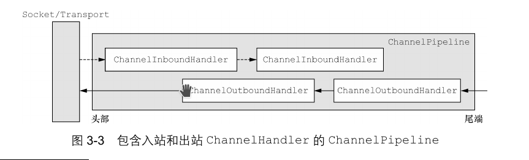
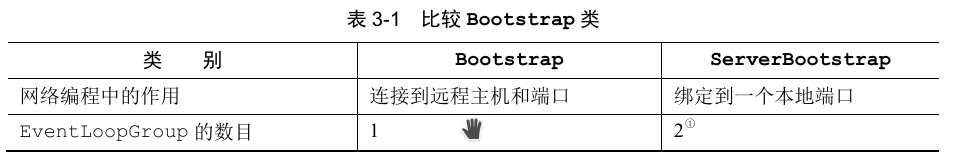

 有对应的一个小demo在knowledge的gradle项目中

# Netty的组件和设计

## Channel、EventLoop和ChannelFuture

- Channel：Socket
- EventLoop：控制流、多线程处理、并发
- ChannelFuture：异步通知

### Channel接口

基本的IO操作（bind(),connect(),read(),write()）依赖于底层网络传输所提供的原语。

### EventLoop接口

EventLoop定义了Netty的核心抽象，用于处理连接的声明周期中所发生的事件。

他们之间的关系是：

- 一个EventLoopGroup包含一个或者多个EventLoop
- 一个EventLoop在它的生命周期内和一个Thread绑定
- 所有由EventLoop处理的IO事件都将在它专有的Thread上被处理
- 一个Channel在它的生命周期内只注册于一个EventLoop
- 一个EventLoop可能会被分配给一个或多个Channel

### ChennelFuture接口

Netty中所有的的IO操作都是异步的，ChannelFuture接口中的addListener()方法注册了一个ChannelFutureListener，以便在某个操作完成时（无论是否成功）得到通知。

## ChannelHandler和ChannelPipeline

### ChannelHandler接口

从应用程序开发人员的角度来看，Netty的主要组件时ChannelHandler，它充当了所有处理入站和出站数据的应用程序逻辑的容器。

### ChannelPipeline接口

使得事件流经ChannelPipeline时ChannelHandler的工作，他们是在应用程序的初始化或者引导阶段被anzhaung的。这些对象接受事件、执行他们所实现的处理逻辑，并将数据传递给链中的下一个ChannelHandler。他们的执行顺序是由他们被添加的顺序所决定的。实际上，被我们称为ChannelPipeline的是这些ChannelHandler的编排顺序。

上图显示了入站和出战ChannelHandler可以被安装到同一个ChannelPipeline中。如果一个消息或者任何其他的入站事件被读取，那么它会从ChannelPiple的头部开始流动，并被传递给第一个ChannelInboundHandler。这个ChannelHandler不一定会实际的修改数据，具体取决于它的具体功能，在这之后，数据将会被传递给链中的下一个ChannelInboundHandler。最终数据将会到达ChannelPipeline的尾端，届时所有处理就都结束了。

数据的出战运动在概念上也是一样的。在这种情况下，数据将从ChannelOutboundHandler链的尾端开始流动，直到它到达链的头部为止。在这之后，出战数据将会到达网络传输层，这里显示Socket。通常情况下，这将触发一个写操作。

## 引导

有两种类型的引导：一种用于客户端（简单的称为Bootstrap），而另一种（ServerBootstrap）用于服务器。无论你的应用程序使用哪种协议或者处理哪种类型的数据，唯一决定它使用哪种引导类的是它是作为一个客户端还是作为一个服务器。

引导一个客户端只需要一个EventLoopGroup，但是一个ServerBootstrap则需要两个，因为服务器需要两组不同的Channel。第一组只包含一个ServerChannel，代表服务器自身的已绑定到某个本地端口的正在监听的套接字。而第二组将包含所有已创建的用来处理传入客户端连接（对于每个服务器已经接受的连接都有一个）的Channel。