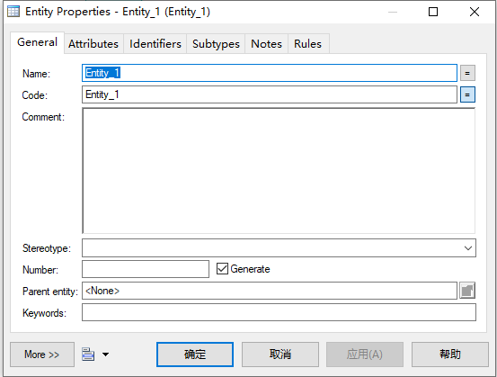
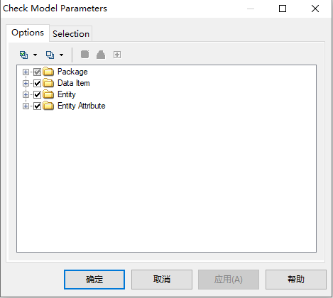
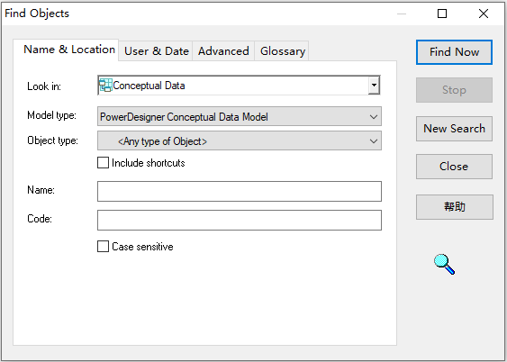
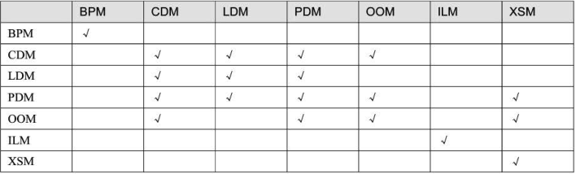
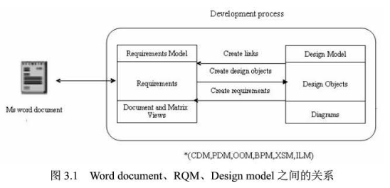

# PowerDesigner的基本操作

## PowerDesigner模型类型

当前可以建立10种模型，详细信息如下：

| 图标 | 英文名称                           | 中文名称     | 文件扩展名 |
| ---- | ---------------------------------- | ------------ | ---------- |
|      | Business Process Model, BPM        | 业务流程模型 | .bpm       |
|      | Conceptual Data Model, CDM         | 概念数据模型 | .cdm       |
|      | Enterprise Architecture Model, EAM | 企业架构模型 | .eam       |
|      | Free Model, FEM                    | 自由模型     | .fem       |
|      | Data Movement Model, DMN           | 信息流模型   | .dmn       |
|      | Logical Data Model, LDM            | 逻辑数据模型 | .ldm       |
|      | Object-Oriented Model, OOM         | 面向对象模型 | .oom       |
|      | Physical Data Model, PDM           | 物理数据模型 | .pdm       |
|      | Requirements Model, RQM            | 需求模型     | .rqm       |
|      | XML Model, XML                     | XML模型      | .xsm       |

## PowerDesigner常用操作窗口

常用的操作窗口有模型对象属性窗口、模型检查窗口、查找对象窗口

### 模型对象属性窗口

右击选择Properties菜单项

此窗口主要用于设置模型对象属性。

### 模型检查窗口

PowerDesigner中每种对象都应符合一定的规范，为了保证对象的有效性，PowerDesigner提供了模型检查功能，可以通过`Tools->Check Model`打开模型检查窗口。

### 查找对象窗口

`Edit->Find Objects`打开查找模型窗口，里面设置了各种查询条件，可以自行选择

## 模型转换

已存在的模型生成新模型，并能够保持原模型与目标模型之间的同步

# 需求模型RQM

需求分析对于整个软件开发过程以及产品质量至关重要，需求分析的好坏直接影响到软件开发的成败。RQM能够通过精确的列表和说明来描述系统需求，并且可以让使用RQM的用户能够有效的组织、设计模型对象以及进行之间的相互关联。

新建一个RQM，有三种Model Type：

- Requirements Document View(需求文档视图)：通过二维表的形式，以分层的方式表达系统需求
- Traceability Matrix View(追踪矩阵视图)：描述需求与设计对象、外部文件和其他需求之间的连接关系
- User Allocation Matrix View(用户分配矩阵视图)：表达需求与用户或用户组之间的分配关系

RQM建立之后需要添加其他视图，可以在Object Browser中右击`Requirement->New`中添加。